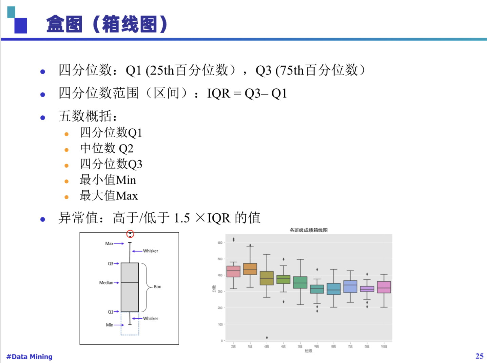
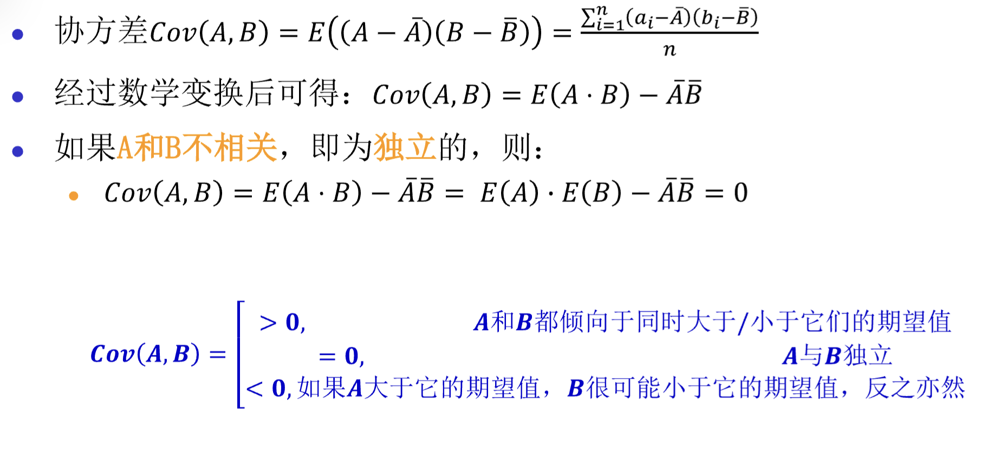
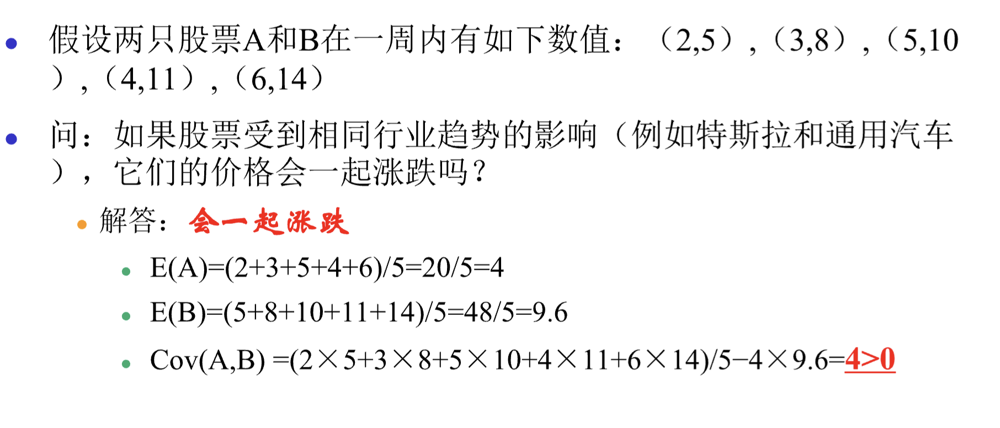
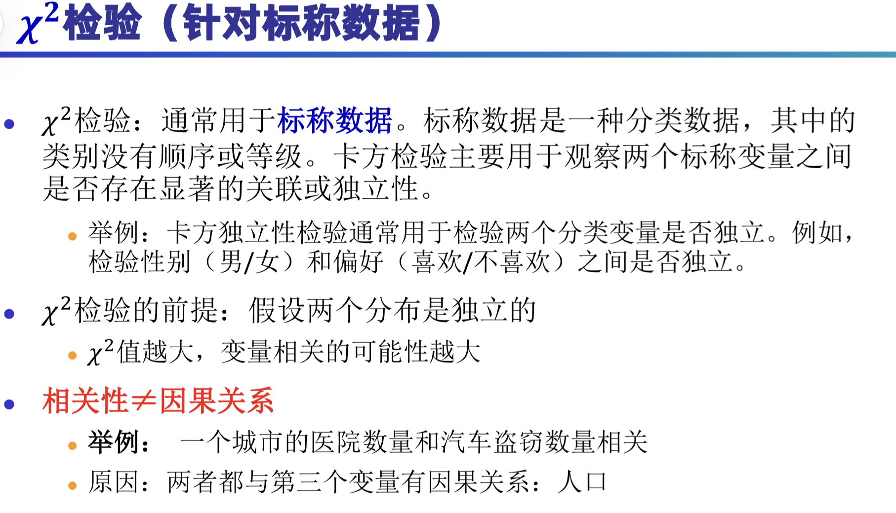
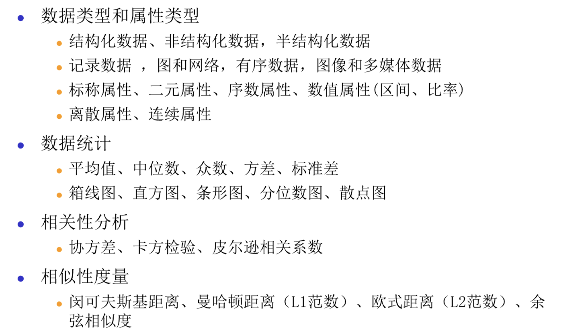

这个PPT的标题是“数据挖掘”，主要内容包括数据的类型、统计描述、相似性和相异性度量、数据预处理等方面。以下是对PPT内容的知识点总结归纳：

### 1. 数据对象与属性类型
- 数据集是由数据对象的集合构成，每个数据对象通过一组属性来描述。
- 属性可以是变量、特性、字段、特征、维度等。
- 数据对象可以是记录、点、向量、模式、事件、案例、样本、观测、实体等。

### 2. 属性的不同类型
- **分类属性（定性）**：标称属性（如员工ID、性别）、二元属性（如是否吸烟）、序数属性（如矿石硬度）。
- **数值属性（定量）**：区间标度属性（如日期、摄氏温度）、比率标度属性（如绝对温度、货币量、年龄）。

### 3. 数据集的类型
- **记录数据**：关系记录、关系表、数据矩阵、交易数据、文档数据。
- **图和网络**：交通网络、全球资讯网、分子结构、社交或信息网络。
- **有序数据**：视频数据、时间数据、顺序数据、基因序列数据。
- **空间、图像和多媒体数据**。

### 4. 数据统计的基本描述
- **集中趋势**：均值、中位数、众数。
- **分散度**：==极差、四分位数、方差、标准差、分位数极差。==
- **相关分析**：协方差、卡方检验、皮尔逊相关系数。
- **图形显示**：箱线图、直方图、条形图、分位数图、散点图。
#### 箱线图 
Q1 (25th百分位数），Q3 (75th百分位数）

#### 协方差 判断A与B是否相关

#### 卡方分布
+ 实际观测值与理论推断值之间的偏离程度

### 5. 度量数据的相似性与相异性

- **数据矩阵与相异矩阵**：数据矩阵是双模矩阵，相异矩阵是单模矩阵。
- **标称属性的邻近性度量**：简单匹配、使用大量二元属性。
- **二元属性的邻近性度量**：对称二元属性、非对称二元属性。
- **数值数据的相异性**：闵可夫斯基距离（包括曼哈顿距离和欧式距离）。
- **余弦相似性**：用于衡量文档或特征向量之间的相似度。

### 6. 数据预处理
- **数据清理**：处理缺失数据、平滑噪声数据、识别或删除异常值。
- **数据集成**：合并多个来源的数据，处理实体识别问题。
- **数据变换**：规范化、离散化、数据压缩、采样、概念层次生成。
- **数据降维**：特征选择、特征提取、主成分分析（PCA）。

### 7. 数据变换和降维的具体方法
- **规范化**：Min-Max 归一化、Z-score 归一化。
- **离散化**：分箱、直方图分析、聚类分析、决策树分析。
- **数据压缩**：无损压缩、有损压缩。
- **采样**：聚集、尺度变换、调整类别分布。
- **概念层次生成**：基于用户或专家指定的层次结构。

### 8. 特征选择和提取
- **特征选择**：选择最有信息增益的特征，减少特征数量。
- **特征提取**：在原有特征基础上创造新的特征，如PCA。

### 9. 特殊数据处理
- **不平衡数据**：处理类别分布不均的数据集，如通过采样方法改善数据分布。

这个PPT涵盖了数据挖掘中的数据预处理和特征工程的多个方面，是数据挖掘流程中非常重要的一部分。
