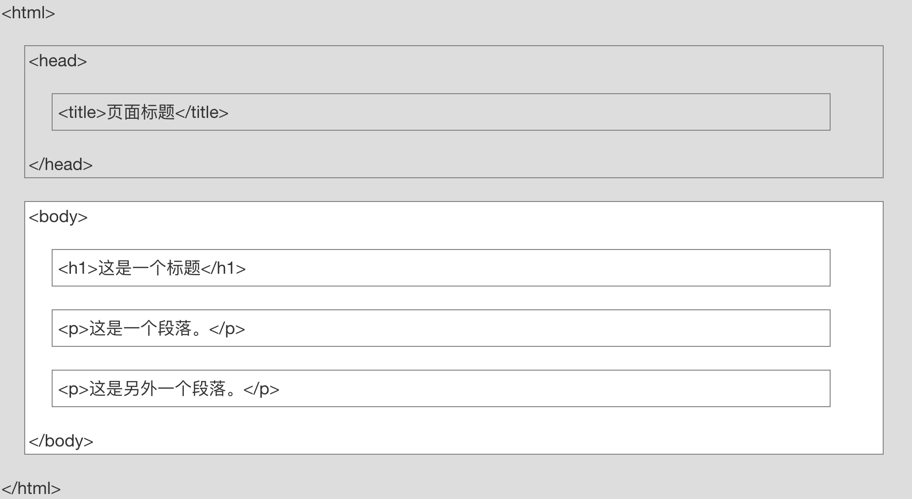
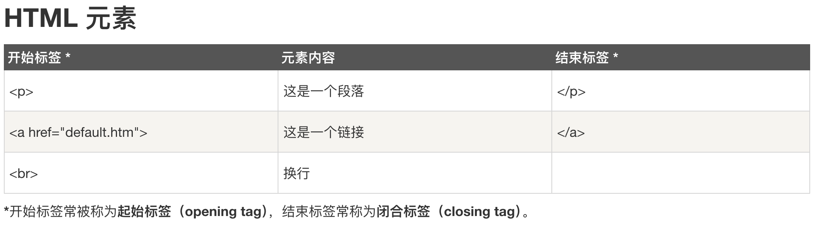

```html
<!DOCTYPE html>
<html>
    <head>
        <meta charset="utf-8">
        <title>菜鸟教程(runoob.com)</title>
    </head>

    <body>
    
        <h1>我的第一个标题</h1>
        
        <p class = "content">我的第一个段落。</p>
        <p class = "content">我的第二个段落。</p>
        <p>我的第三个段落。</p>

        <a href = "https://www.runoob.com/html/html-links.html">本文本</a> 是一个指向菜鸟教程的链接

        

        <ol>
            <p><div style="background-color:yellow;">有序列表</div></p>
            <li><b>第一项</b></li>
            <li><i>第二项</i></li>
            <li><u>第三项</u></li>
        </ol>

        <ul>
            <div style="background-color:yellow;">
                <p><span style="color:blue;">无序</span>列表</p>
                <li>第一项</li>
                <li>第二项</li>
                <li>第三项</li>
            </div>
        </ul>
        
        <table border="1">
            <thead>
                <tr>
                    <td>表头1</td>
                    <td>表头2</td>
                </tr>
            </thead>

            <tbody>
                <tr>
                    <td>第一行第一列</td>
                    <td>第一行第二列</td>
                </tr>
            </tbody>
        </table>
    </body>
</html>
```

# 元素

- `<html>`：整个 HTML 文档的根元素。
- `<head>`：包含文档的元信息，比如 `<title>` 标签。
- `<title>`：文档的标题，显示在浏览器的标题栏或标签页上。
- `<body>`：文档的主体，包含文档的主要内容。
- `<h1>`：一级标题，显示在页面的顶部。

- `<p>`：文本标签
- `<br>`:强制换行标签
- `<b>` 加粗
- `<i>` 斜体
- `<u>` 下划线

- `<div>`：定义一个块级元素，可容纳其他 HTML 元素。
- `<span>`：定义一个行内元素，可容纳其他 HTML 元素。
 className：给元素添加类名，可用于 CSS 样式设置。对html文本进行分类

