# 复习
## Part1
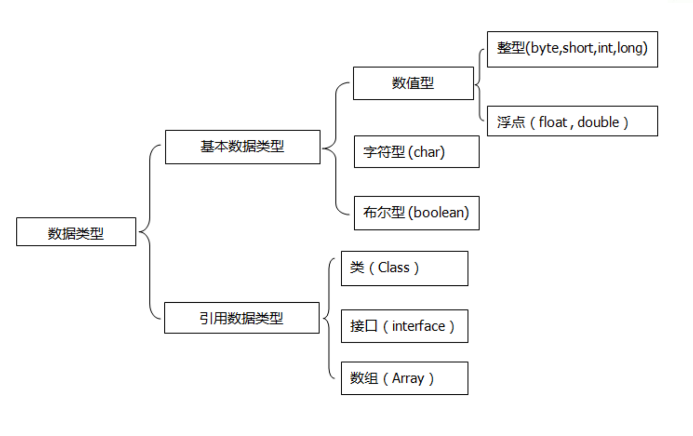
### 包装类型的基本应用, valueOf方法
概念：
valueOf方法：用于将基本类型或其字符串表示形式 --> 对应的包装类型对象。

代码示例：

```java
Integer intObj = Integer.valueOf(10); // 将int转换为Integer对象  
Double doubleObj = Double.valueOf("3.14"); // 将字符串转换为Double对象
```

#### String和doule构造器
```java
// 使用 BigDecimal.valueOf 从 double 创建 BigDecimal  
BigDecimal bdFromDouble = BigDecimal.valueOf(0.06);  
System.out.println(bdFromDouble); // 输出可能是类似 0.060000000000000005 的结果，但通常显示为 0.06  
  
// 使用 BigDecimal 的字符串构造函数从字符串创建 BigDecimal  
BigDecimal bdFromString = new BigDecimal("0.06");  
System.out.println(bdFromString); // 输出 0.06  
  
// 使用 Integer.valueOf 从 int 创建 Integer  
Integer i = Integer.valueOf(10);  
System.out.println(i); // 输出 10  
  
// 使用 Double.valueOf 从 double 创建 Double  
Double d = Double.valueOf(0.06);  
System.out.println(d); // 输出 0.06（但内部表示可能不是精确的 0.06）
```
在上面的示例中，你可以看到 BigDecimal.valueOf(double val) 和直接从字符串构造 BigDecimal 之间的潜在差异。虽然两者都试图表示 0.06，但由于 double 类型的限制，BigDecimal.valueOf(double val) 可能无法提供与字符串构造函数相同的精确性。

另外，Integer.valueOf(int i) 和 Double.valueOf(double d) 只是将基本类型转换为对应的包装类对象，它们不涉及字符串的转换或解析。


## 基本运算，常量使用，位运算，逻辑运算
+ 概念：
+ 基本运算：包括算术运算、关系运算、位运算和逻辑运算。
+ 常量：在程序运行期间其值不能被修改的量，使用final关键字声明。
+ 位运算：直接对整数的二进制位进行操作。
+ 逻辑运算的短路行为：对于&&和||运算符，如果左侧的操作数已经能够确定整个表达式的值，则不会评估右侧的操作数。

用法及代码示例：

常量使用：
```java
final int MAX_VALUE = 100;
```
位运算：
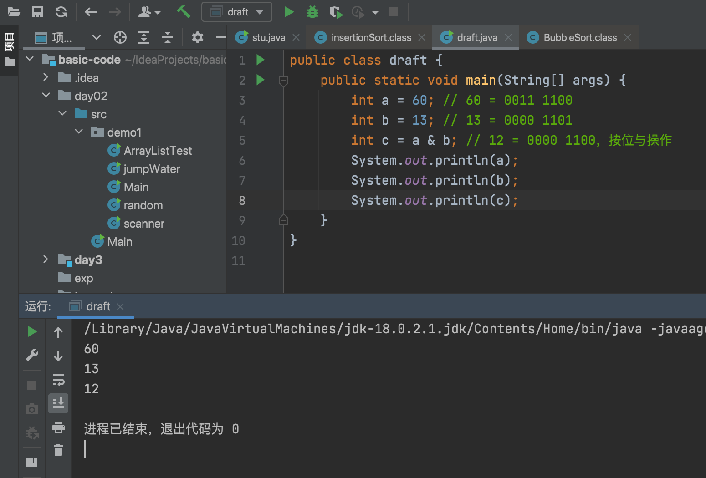

### 运算符
在Java中，运算符优先级决定了表达式中运算执行的顺序。以下是Java中一些常见运算符的优先级列表，从最高到最低：

后缀运算符：如后缀递增和递减（i++, i--）
一元运算符：如一元正负号（+x, -y）和逻辑非（!），**按位取反（~）**

---

乘法和除法：如乘法（*）、除法（/）和取模（%）
加法和减法：如加法（+）和减法（-）
位移运算符：如左移（<<）、右移（>>）和无符号右移（>>>）
关系运算符：如小于（<）、大于（>）、小于等于（<=）、大于等于（>=）、实例（instanceof）

---

相等性运算符：如等于（==）和不等于（!=）
按位与（AND）：&
按位异或（XOR）：^
按位或（OR）：|
逻辑与（AND）：&&
逻辑或（OR）：||
三元条件运算符：? :
赋值运算符：如等于（=）、加等于（+=）、减等于（-=）等
逗号运算符：,


## BigDecimal
+ 概念：

BigDecimal是Java提供的一个类，用于精确地表示和操作浮点数。特别适用于金融计算等需要高精度计算的场景。
+ 用法：

创建BigDecimal对象，并使用其提供的方法进行数学运算。
代码示例：

```java
import java.math.BigDecimal;  

BigDecimal a = new BigDecimal("10.0");  
BigDecimal b = new BigDecimal("3.0");  
BigDecimal sum = a.add(b); // 使用add方法进行加法运算，结果为13.0
```
##### 例题
```java
public static void main(String args[]) {  
    BigDecimal f1 = new BigDecimal("0.05"); // 使用字符串创建，这是推荐的方式  
    BigDecimal f2 = new BigDecimal("0.01"); // 使用字符串创建  
    BigDecimal f3 = BigDecimal.valueOf(0.06); // 使用 valueOf 方法从 double 创建，这通常是安全的  
    BigDecimal f4 = new BigDecimal(0.01); // 直接使用 double 创建，可能会导致精度问题  
    System.out.println(f2.equals(f4)); // flase
    System.out.println(f3.equals(f1.add(f2))); // true
}
```
+ 对于第一行输出 f2.equals(f4)：
由于 f2 是通过字符串 "0.01" 创建的，而 f4 是直接使用 double 值 0.01 创建的，这里可能会出现精度问题。BigDecimal 的构造器 new BigDecimal(double val) 不总是提供精确的结果，**因为 double 类型本身就不是精确的十进制数**。因此，f2 和 f4 很可能不相等。

---
+ 对于第二行输出 f3.equals(f1.add(f2))：
这里 f3 是通过 BigDecimal.valueOf(0.06) 创建的，这通常是一个安全的方法来从 double 创建一个 BigDecimal，因为**它会首先将这个 double 转换为一个精确的字符串**，然后再使用这个字符串来创建 BigDecimal。而 f1.add(f2) 是将 f1 和 f2 两个通过字符串创建的 BigDecimal 相加，结果也是一个精确的 BigDecimal。由于 BigDecimal.valueOf(0.06) 和 "0.05" 加 "0.01" 的结果在数学上相等，这里 f3 和 f1.add(f2) 应该是相等的。

## 引用类型
+ 概念：

引用类型指的是除了基本类型以外的所有类型，包括类、接口、数组等。
引用类型的变量存储的是对象的内存地址，而不是对象的实际内容。
```java
String str = new String("Hello, World!"); // str是引用类型的变量，指向一个String对象
```


## String类
+ 概念
String 类是 Java 中用于表示和操作字符串的类。字符串是常量，它们的值在创建后不能更改。String 类提供了大量的方法来操作字符串，如连接、比较、查找、替换等。


代码示例
```java
public class StringExample {  
    public static void main(String[] args) {  
        String str1 = "Hello";  
        String str2 = "World";  
          
        // 连接字符串  
        String concatenated = str1.concat(" ").concat(str2);  
        System.out.println(concatenated); // 输出：Hello World  
          
        // 查找子字符串位置  
        int index = str1.indexOf("e");  
        System.out.println(index); // 输出：1  
          
        // 替换字符串中的字符  
        String replaced = str1.replace('e', 'a');  
        System.out.println(replaced); // 输出：Hallo  
    }  
}
```
2. Math类
概念
Math 类是 Java 中的一个工具类，它包含了一系列静态方法用于执行基本的数学运算，如三角函数、对数、开方、指数等。

代码示例
==注意Math.PI==
```java
public class MathExample {  
    public static void main(String[] args) {  
        // 计算平方根  
        double sqrt = Math.sqrt(16);  
        System.out.println(sqrt); // 输出：4.0  
          
        // 计算最大值  
        int max = Math.max(10, 20);  
        System.out.println(max); // 输出：20  
          
        // 计算正弦值  
        double sinValue = Math.sin(Math.PI / 2);  
        System.out.println(sinValue); // 输出：1.0  
    }  
}
```
## Random类
概念
Random 类是 Java 中用于生成伪随机数序列的类。它可以用于生成各种类型的随机数，如整数、浮点数等。

代码示例
```java
import java.util.Random;  
  
public class RandomExample {  
    public static void main(String[] args) {  
        Random rand = new Random();  
          
        // 生成一个0到99之间的随机整数  
        int randomInt = rand.nextInt(100);  
        System.out.println(randomInt);  
          
        // 生成一个0到1之间的随机浮点数  
        double randomDouble = rand.nextDouble();  
        System.out.println(randomDouble);  
          
        // 生成一个true或false的随机布尔值  
        boolean randomBoolean = rand.nextBoolean();  
        System.out.println(randomBoolean);  
    }  
}
```

## 常用的标准输出方法
+ 概念：

==println()方法会在打印完内容后换行，而print()方法则不会。==

代码示例：

```java
public class StandardOutputExample {  
    public static void main(String[] args) {  
        System.out.println("Hello, World!");  // 使用println输出并换行  
        System.out.print("This is a ");  
        System.out.println("test.");  // 使用print输出后，再使用println输出并换行  
    }  
}
```
## 输入方法
+ 概念：

Java中可以通过Scanner类从控制台获取用户输入。虽然文件输入输出不在考察范围内，但了解如何使用Scanner从标准输入（通常是键盘）读取数据是很有用的。

代码示例：

```java
import java.util.Scanner;  
  
public class InputExample {  
    public static void main(String[] args) {  
        Scanner scanner = new Scanner(System.in);  // 创建一个Scanner对象来读取用户输入  
        System.out.println("Please enter your name:");  
        String name = scanner.nextLine();  // 读取用户输入的一行文本  
        System.out.println("Hello, " + name + "!");  
    }  
}
```

## Array数组
### 数组的定义和初始化
+ 概念：
数组是一种用于存储相同数据类型元素的线性数据结构。在Java中，数组是对象，可以存储基本数据类型或对象类型。数组一旦初始化，其大小就固定了。

代码示例：

```java
// 静态初始化  
int[] numbers = {1, 2, 3, 4, 5};  
  
// 动态初始化  
int[] otherNumbers = new int[5]; // 分配了5个整数的空间，默认值为0  
otherNumbers[0] = 10; // 设置第一个元素为10
```
二、数组元素操作
+ 概念：
数组元素操作包括访问、修改数组中的元素。在Java中，可以通过索引来访问或修改数组中的特定元素，索引从0开始。

代码示例：

```java
int[] scores = {85, 90, 78, 92, 88};  
  
// 访问数组元素  
int firstScore = scores[0]; // 访问第一个元素，值为85  
  
// 修改数组元素  
scores[2] = 80; // 将第三个元素（索引为2）修改为80
```
### Arrays中的常用工具：
==sort，equals，copyOf==
+ 概念：
Arrays类是Java标准库中的一个工具类，提供了许多静态方法来操作数组，如排序、比较和复制等。

==Arrays.copyOf(被复制的数组，新数组长度)==

代码示例：

```java
import java.util.Arrays;  
  
public class ArrayToolsExample {  
    public static void main(String[] args) {  
        Integer[] arr = {5, 2, 8, 3, 9};  
          
        // 使用Arrays.sort()排序数组  
        Arrays.sort(arr);  
        System.out.println(Arrays.toString(arr)); // 输出: [2, 3, 5, 8, 9]  
          
        Integer[] arr2 = {2, 3, 5, 8, 9};  
          
        // 使用Arrays.equals()比较两个数组是否相等  
        boolean areEqual = Arrays.equals(arr, arr2);  
        System.out.println("数组是否相等: " + areEqual); // 输出: 数组是否相等: true  
          
        // 使用Arrays.copyOf()复制数组  
        Integer[] copiedArr = Arrays.copyOf(arr, arr.length);  
        System.out.println(Arrays.toString(copiedArr)); // 输出: [2, 3, 5, 8, 9]  
          
        // 使用Arrays.copyOf()扩展数组长度  
        Integer[] extendedArr = Arrays.copyOf(arr, 10);  
        System.out.println(Arrays.toString(extendedArr)); // 输出: [2, 3, 5, 8, 9, null, null, null, null, null]  
    }  
}
```
注意：
Arrays.sort() 方法会对原数组进行排序。
Arrays.equals() 方法用于比较两个数组的内容是否完全相同。
Arrays.copyOf() 方法用于复制数组，如果新数组长度大于原数组，则多余部分会被填充为该类型的默认值（对于对象数组是null，对于基本数据类型数组是0或false等）。


# Part2 类和对象
## 成员的访问控制
+ 概念：
Java提供了四种访问控制修饰符：private、default（包内可见性，即无修饰符）、protected和public，它们决定了类成员的可访问性。

代码示例：

```java
public class AccessControl {  
    // 私有成员，仅在本类内部可访问  
    private int privateVar = 1;  
  
    // 默认访问控制，同一个包内的类可以访问  
    int defaultVar = 2;  
  
    // 受保护的成员，同一个包内的类或其他包中的子类可以访问  
    protected int protectedVar = 3;  
  
    // 公共成员，任何位置都可以访问  
    public int publicVar = 4;  
}
```
## equals重载
```java
  public boolean equals(Object otherObject)
   {
        //判断指针是否指向同一个对象
      if (this == otherObject) return true;

      //判断指针是否为null
      if (otherObject == null) return false;

      //判断是否this和otherObject是否是同一个类
      if (getClass() != otherObject.getClass()) return false;
      
      //转化成同类型
      Employee other = (Employee) otherObject;

      //比对
      return Objects.equals(name, other.name) && salary == other.salary && Objects.equals(hireDay, other.hireDay);
   }
```

### getClass & instanceof 区别
>if (getClass() != otherObject.getClass()) return false;  

 检测类的匹配。是否可以用如下语句替代？
>   if (! (otherObject instanceof Employee)) return false;  

**注意：此时如果otherObject是Employee的子类，instanceof判断为true，即两个对象不是同一种类型（而是继承关系）时，也不会排除其相等。**

+ 关于equals方法中类型检测的建议：
1.如果子类中拥有自己的相等概念，则父类中要强制采用getClass进行检测，如前面例子所示；
2.如果由父类决定相等的概念，则可用instanceof进行检测，这样不同子类对象间可以做相等比较，此时应将父类的equals定义为final。例如只用员工的ID作为比较相同的依据，可将程序按此修改。


## 类的命名
### 知识点1：
一个文件中最多只能有一个类用public修饰
+ 概念：
在Java中，每个.java源文件最多只能包含一个public类。这是因为public类需要被外部访问，而每个文件在编译时只会生成一个对应的.class文件，所以Java编译器规定每个文件中只能有一个public类，以避免命名冲突和编译的复杂性。

代码示例：

```java
// 正确的示例，文件中只有一个public类  
public class PublicClassExample {  
    // ... 类的实现 ...  
}  
  
// 可以有非public类  
class AnotherClass {  
    // ... 类的实现 ...  
}
```

```java
// 错误的示例，尝试定义两个public类  
public class FirstPublicClass {  
    // ... 类的实现 ...  
}  
  
public class SecondPublicClass { // 这将导致编译错误  
    // ... 类的实现 ...  
}
```
### 知识点2：
文件名必须与public修饰的类一致
+ 概念：
如果Java源文件中存在一个public类，那么该源文件的名字必须与public类的名字完全相同（包括大小写）。这是Java编译器的规定，以确保类名与文件名之间的清晰对应关系，便于组织和管理代码。

代码示例：

假设文件名是**PublicClassExample.java**，则文件内容应该是：

```java
// 正确的示例，文件名与public类名一致  
public class PublicClassExample {  
    // ... 类的实现 ...  
}
```
### 知识点3：
如果一个文件中没有public类，则文件名可以任意
+ 概念：
如果Java源文件中没有定义任何public类，那么该源文件的名字可以是任意的。这是因为没有public类意味着该文件中的类不需要被外部直接访问，所以文件名不会影响类的访问性。

## static关键字
==static方法不能直接访问类的实体域；不能访问类内部函数；==
===
### 1.
== static 方法内部不能调用非static方法==
==static方法不能调用类成员函数==
概念：由于`static` 方法属于类本身，而非类的某个特定实例，它没有隐式的`this`参数，因此不能直接调用非`static` 方法，因为非`static` 方法需要一个实例上下文。

代码示例：
```java
public class MyClass {
    private static int staticVar = 10; // 静态变量

    public static void staticMethod() {
        // 静态方法不能直接调用非静态方法
        // nonStaticMethod(); // 错误：无法直接调用非静态方法
    }

    public void nonStaticMethod() {
        // 非静态方法需要通过实例调用
        System.out.println("Non-static method accessed.");
    }

    public static void main(String[] args) {
        MyClass myClass = new MyClass(); // 创建实例
        // 通过实例调用非静态方法
        myClass.nonStaticMethod();
    }
}
```

### 2. 
==static 方法没有隐式的this参数==
==static方法不能调用类实体域==
概念：`static` 方法中没有隐式的`this`参数，因为`this`是指向当前对象实例的引用，而`static` 方法不属于任何实例。

代码示例：
```java
public class MyClass {
    private int instanceVar = 20; // 实例变量

    public static void staticMethod() {
        // 在静态方法中没有this关键字可用
        // this.instanceVar = 30; // 错误：静态方法中没有this
    }

    public void instanceMethod() {
        // 非静态方法中可以使用this
        this.instanceVar = 30; // 正确：设置实例变量的值
    }

    public static void main(String[] args) {
        MyClass myClass = new MyClass();
        myClass.instanceMethod(); // 调用非静态方法
    }
}
```

### 3. 
==main 方法是一个static方法==
概念：`main` 方法是Java程序的入口点，它必须被声明为`static`，因为程序启动时还没有创建任何对象实例。

代码示例：
```java
public class MyApp {
    public static void main(String[] args) { // main方法必须声明为static
        System.out.println("Hello, World!"); // 程序入口点
    }
}
```

在上述代码示例中，每个点都通过注释进行了详细解释，以帮助理解每个概念和知识点。[^2^][^3^][^4^]


## java中所有函数都是值传递
要想实现swap交换值，只能传入目标对象的指针，下面是模拟指针的两种实现方法：
==swap函数实现方法==
### 数组
```java
public class TestSwap {

	public static void main(String[] args){
		int a = 3;
		int b = 5;
		System.out.println("交换前："+"a="+a+" b="+b); 
		//以数组接收后赋值，注意赋值顺序，注意对应关系
		int[] arr = swap(a,b);
		a = arr[0];
		b = arr[1];
		System.out.println("交换后："+"a="+a+" b="+b); 
	}
	
	//交换
	private static int[] swap(int x, int y){
		//以数组形式返回
		return new int[]{y,x};
	}
}
```
### 对象

```java
public class TestSwap {
	// 定义类变量
	private int a = 3;
	private int b = 5;

	public static void main(String[] args) {
		TestSwap ts = new TestSwap();
		System.out.println("交换前："+"a="+ts.a+" b="+ts.b); 
		//对象调用
		ts.swap();
		System.out.println("交换后："+"a="+ts.a+" b="+ts.b);
	}

	//交换  只能运用在对象只有两个类变量时，交换这两个确定的变量
	private void swap() {
		int temp = this.a;
		this.a = this.b;
		this.b = temp;
	}
}
```

## 内部类
+ 内部类可以访问外部类的任何成员
+ 外部类通过内部类对象，可以访问内部类的任何成员

---
就像要先创建一个人作为外部类，才可以创建诸如手表，衣服，鞋子这些内部类，这些内部类拥有颜色，价格等等属性。
--
内部类的衣服等需要知道外部类人的体重、身高等才能确定什么才是合适的，所以内部类可以随意访问外部类的public和private成员。
--
外部类的人要先需要有内部类的衣服等对象，才可以知道这个对象的属性，所以外部类通过创建内部类对象访问内部类的属性，不可以直接访问。
--
---
```java
public class OuterClass {  
    // 外部类的私有成员  
    private int outerPrivateVar = 100;  
  
    // 外部类的公共成员  
    public int outerPublicVar = 200;  
  
    // 成员内部类  
    class InnerClass {  
        // 内部类的私有成员  
        private int innerPrivateVar = 50;  
  
        // 内部类的公共成员  
        public int innerPublicVar = 60;  
  
        // 内部类可以访问外部类的私有成员  
        public void accessOuterPrivate() {  
            System.out.println("Inner class accessing outer private var: " + outerPrivateVar);  
        }  
  
        // 内部类可以访问外部类的公共成员  
        public void accessOuterPublic() {  
            System.out.println("Inner class accessing outer public var: " + outerPublicVar);  
        }  
  
        // 内部类的setter和getter（为了简洁，这里省略了）  
        // ...  
    }  
  
    // 外部类的方法，用于创建内部类对象并访问其成员  
    public void showInnerClassAccess() {  
        InnerClass inner = new InnerClass();  
  
        // 外部类通过内部类对象访问内部类的私有成员（通常这是不可能的，因为私有成员是隐藏的）  
        // 但可以通过内部类提供的公共方法来间接访问  
        // 假设InnerClass有一个公共的getter方法叫getInnerPrivateVar()  
        // int innerPrivateValue = inner.getInnerPrivateVar(); // 假设存在这样的getter  
  
        // 外部类通过内部类对象访问内部类的公共成员  
        System.out.println("Outer class accessing inner public var: " + inner.innerPublicVar);  
  
        // 外部类调用内部类的方法来访问外部类的成员  
        inner.accessOuterPrivate();  
        inner.accessOuterPublic();  
    }  
  
    public static void main(String[] args) {  
        OuterClass outer = new OuterClass();  
        outer.showInnerClassAccess(); // 展示外部类如何通过内部类对象访问内部类成员，并展示内部类如何访问外部类成员  
    }  
}
```
### 具体示例
+ 要先创建外部类对象，然后再创建内部类对象

编程练习：
写一个顾客类Customer，其中有一个内部类ShoppingBasket，基本结构如下：
>public class Customer{
	name;
	gender;
	age;
	…;
	public class ShoppingBasket{
		commodity;
		UnitPrice;		
		Quantity;
		Price;
		…;
	}
}

```java
public class Customer {  
    // 外部类Customer的字段  
    private String name;  
    private String gender;  
    private int age;  
  
    // 构造器  
    public Customer(String name, String gender, int age) {  
        this.name = name;  
        this.gender = gender;  
        this.age = age;  
    }  
  
    // getter和setter方法（这里只列出name作为示例）  
    public String getName() {  
        return name;  
    }  
  
    public void setName(String name) {  
        this.name = name;  
    }  
  
    // ... 其他getter和setter方法  
  
    // 内部类ShoppingBasket  
    public class ShoppingBasket {  
        // 内部类ShoppingBasket的字段  
        private String commodity;  
        private double unitPrice;  
        private int quantity;  
        private double price; // 可以通过unitPrice * quantity计算得出  
  
        // 构造器（可以包含一个计算价格的逻辑）  
        public ShoppingBasket(String commodity, double unitPrice, int quantity) {  
            this.commodity = commodity;  
            this.unitPrice = unitPrice;  
            this.quantity = quantity;  
            this.price = unitPrice * quantity; // 计算总价  
        }  
  
        // getter和setter方法（这里只列出commodity和price作为示例）  
        public String getCommodity() {  
            return commodity;  
        }  
  
        public void setCommodity(String commodity) {  
            this.commodity = commodity;  
        }  
  
        public double getPrice() {  
            return price;  
        }  
  
        // 注意：通常我们不会直接设置price，因为它是由unitPrice和quantity计算得出的  
        // 如果需要更新价格，我们应该更新unitPrice或quantity，然后重新计算price  
  
        // 其他getter和setter方法（如果需要的话）  
  
        // ... 可能还有其他与购物篮相关的方法，如添加商品、删除商品等  
    }  
  
    // 假设Customer类有一个方法来创建和管理ShoppingBasket  
    public ShoppingBasket createShoppingBasket(String commodity, double unitPrice, int quantity) {  
        return new ShoppingBasket(commodity, unitPrice, quantity);  
    }  
  
    // 主方法（可选，用于测试）  
    public static void main(String[] args) {  
        Customer customer = new Customer("John Doe", "Male", 30);  
        ShoppingBasket basket = customer.createShoppingBasket("Apple", 0.99, 5);  
        System.out.println("Customer: " + customer.getName());  
        System.out.println("Basket contains: " + basket.getCommodity() + " with price: $" + basket.getPrice());  
    }  
}
```


---


# 引用（等于C++指针）
>ArrayList<Integer> ia1 = new ArrayList<Integer>();   // 完整形式
//等号左边的意思是创建一个Integer类型的ArrayList的指针ia1
//等号右边的意思是内存画出ArrayList<Integer>(),令ia1指向这个地方

# Scanner
```java
//**创建接收变量**
Scanner scan = new Scanner(System.in);
//**创建数据类型**
DataType x = scan.next();
```

+ <>里面只能是引用类型，Integer,String...
+ ()里面写数，确定数组的初始容量，如
    >ArrayList<Employee> staff = new ArrayList<>(100);


### scan.next中，接收的字符只要遇到空格就停止录入
+ 类似的,nextLine()遇到换行符停止录入
+ nextInt, nextDouble...

### 包的函数调用
+ 静态方法用**类名**调用
+ 对象方法用**对象名**调用
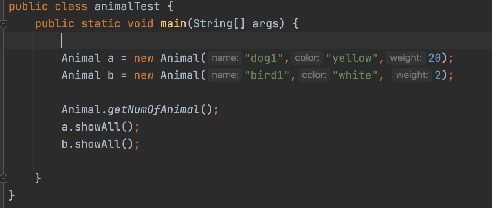

### equal函数
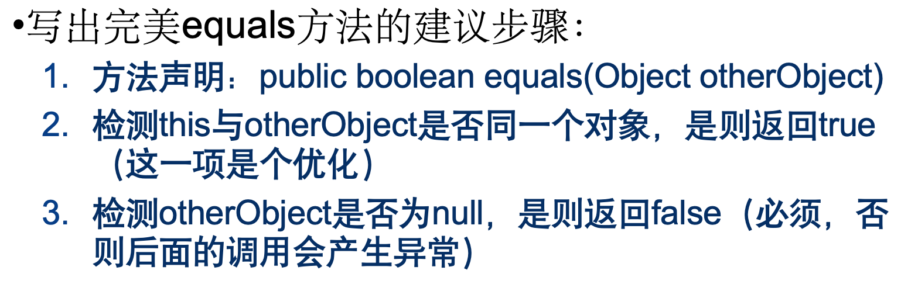
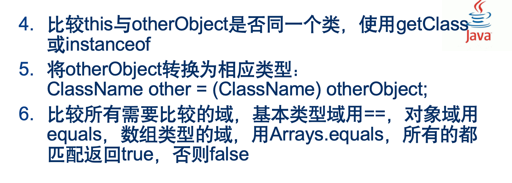
```java
public boolean equals(Object otherObject) {  
    // 快速测试对象是否相同  
    if (this == otherObject) return true;  
    // 检查传入对象是否为null或类型不匹配  
    if (otherObject == null || !(otherObject instanceof Employee)) return false;  
    // 强制转换为Employee类型  
    Employee other = (Employee) otherObject;  
    // 比较关键字段，假设name和hireDay可能为null  
    return Objects.equals(name, other.name) &&  
           salary == other.salary &&  
           Objects.equals(hireDay, other.hireDay);  
}
```
# hashcode
+ 当我们尝试将一个对象添加到 HashSet 或作为键放入 HashMap 时，集合内部首先会调用该对象的 hashCode 方法。
**如果两个对象的 hashCode 值不同，那么这两个对象肯定不相等，集合就不会进一步比较它们的 equals 方法。**
这样，通过 hashCode，我们可以在很多情况下避免调用更耗时的 equals 方法，从而提高性能
---

    + 原因：
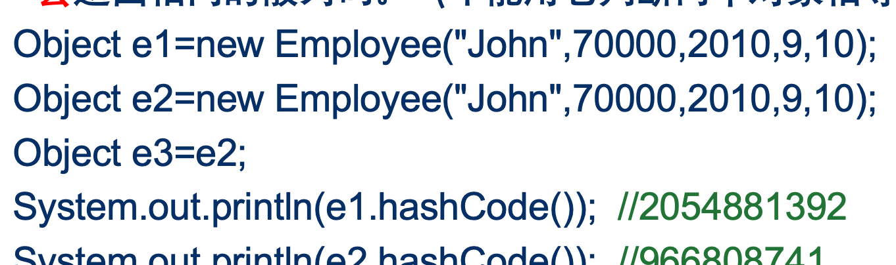
---
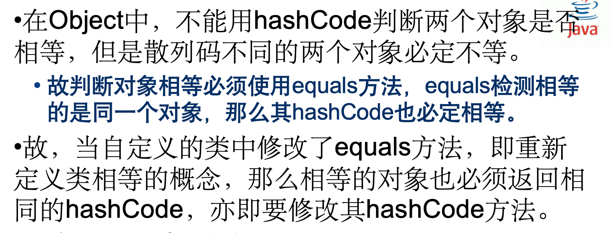

+ 代码：
```java
java.unil.Objects.hash:
public static int hash(Object... values) {
        return Arrays.hashCode(values);
 }
java.unil.Arrays.hashCode:
public static int hashCode(Object a[]) {
        if (a == null)
            return 0;
        int result = 1;
        for (Object element : a)
            result = 31 * result + (element == null ? 0 :    			element.hashCode());
        return result;
}
```
+ Manager中同样需要重新定义：
 >public int hashCode()
   {
      return  Objects.hash(super.hashCode(), bonus);
   } 
   //这里需要先调用父类中的hashCode，再把子类中要比较的域散列组合。

# super
+ 子类的构造区继承父类的构造器可以之间用super，必须在子类构造器第一行出现
>**//父类中：**
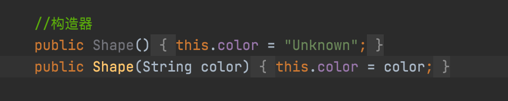
**//子类中**
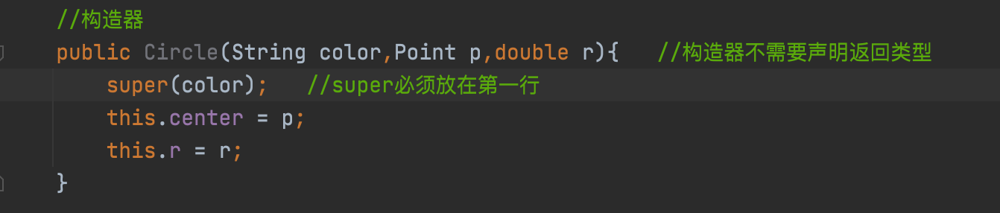


# Part3 继承
```java
// 基类 Animal，用于继承  
class Animal {  
    public void eat() {  
        System.out.println("The animal eats.");  
    }  
}  

//接口 Flyable，用于实现
interface Flyable {  
    void fly();  
}  
  
//子类 Bird 继承自 Animal 并实现 Flyable 接口
class Bird extends Animal implements Flyable {  
    // 继承自 Animal 的方法  
    @Override  
    public void eat() {  
        super.eat(); // super表示调用父类方法
        System.out.println("The bird eats seeds.");  
    }  
  
    //实现 Flyable 接口的方法
    @Override  
    public void fly() {  
        System.out.println("The bird is flying.");  
    }  
}  
  
// 测试类  
public class InheritanceAndInterfaceExample {  
    public static void main(String[] args) {  
        // 创建 Bird 对象  
        Bird bird = new Bird();  
  
        // 调用继承自 Animal 的方法  
        bird.eat(); // 输出 "The animal eats." 和 "The bird eats seeds."  
  
        // 调用实现自 Flyable 接口的方法  
        bird.fly(); // 输出 "The bird is flying."  
    }  
}
```


## 继承
### 两同两小一大
**子类覆盖父类方法时（两同两小一大）**
+ 方法名相同，参数列表相同
+ 返回值类型小于或等于父类的返回值类型，如果抛出异常，异常的类型要小于或等于父类抛出的异常
+ 方法的访问权限大于或等于父类中方法的访问权限


#### 1. 
**返回值类型小于或等于父类的返**回值类型
概念：子类覆盖的方法的返回值类型应该是父类中被覆盖方法的返回值类型，或者是其子类型（协变返回类型）。

代码示例：
```java
class Parent {
    public Parent method() {
        return new Parent();
    }
}

class Child extends Parent {
    // 正确覆盖：返回Child类型，Child是Parent的子类型
    @Override
    public Child method() {
        return new Child();
    }
}

// 使用
Child c = new Child();
Parent p = c.method(); // 向上转型，p实际上是Child类型
```

#### 2. 
**如果抛出异常，异常的类型要小于或等于父类抛出的异常**
概念：子类覆盖的方法可以抛出异常，但这些异常必须是父类中被覆盖方法抛出的异常的子类型，或者是其相同的异常类型。

代码示例：
```java
class Parent {
    public void method() throws ParentException {
        throw new ParentException();
    }
}

class Child extends Parent {
    // 正确覆盖：抛出ChildException，它是ParentException的子类型
    @Override
    public void method() throws ChildException {
        throw new ChildException();
    }
}

class ParentException extends Exception {}
class ChildException extends ParentException {}
```

#### 3. 
**方法的访问权限大于或等于父类中方法的访问权限**
概念：子类覆盖的方法不能有比父类中被覆盖的方法更严格的访问权限。
```java
// 使用父类引用指向子类对象
        Animal myAnimal = new Dog();
```

==意味着使用父类引用指向子类对象，这个对象一定可以访问子类的重载方法==

代码示例：
```java
class Parent {
    public void method() {
        System.out.println("Parent method");
    }
}

class Child extends Parent {
    // 正确覆盖：访问权限至少与父类方法相同
    @Override
    public void method() {
        System.out.println("Child method");
    }
}

// 错误覆盖：降低了访问权限，编译错误
// @Override
// protected void method() {
//     System.out.println("Child method");
// }
```


### 抽象类abstract
抽象类里面可以有具体的方法实现，但必须含有抽象方法。就是只有函数方法声明，没有方法体。

例子：

```java
public abstract class Shape {
    //实体域（不用加abstract)
    //...

    //构造器（不用加abstract)
    //...

    //具体方法实现（不用加abstract)
    public void setColor(){
        this.color = color;
    }
    public String getColor(){
        return this.color;
    }

    public String getColor(String color){
        return this.color;
    }

    //抽象方法
    public abstract void move(Point p);

    public abstract double calculateArea();

    public abstract double calculatePerimeter();

```

### final

1.final变量：
使用final声明的变量是常量，只能被赋值一次。
常量名通常全部大写。
>// 声明一个final变量并初始化  
    public static final int MAX_VALUE = 10; // MAX_VALUE是一个常量，其值不能被修改  

2.final方法：
使用final声明的方法不能被子类重写（Override）。
这通常用于确保方法的行为在继承体系中保持一致。
```java
class FinalMethodExample {  
    // 声明一个final方法  
    public final void finalMethod() {  
        System.out.println("This is a final method and cannot be overridden.");  
    }  
}  
  
class SubFinalMethodExample extends FinalMethodExample {  
    // 下面的代码将导致编译错误，因为finalMethod是final的，不能被子类重写  
    /*  
    @Override  
    public void finalMethod() {  
        System.out.println("Trying to override a final method."); // 错误：无法重写final方法  
    }  
    */  
}
```
3.final类：
使用final声明的类不能被继承。
这通常用于确保类的完整性和安全性，防止被不恰当地扩展。
```java
// 声明一个final类  
public final class FinalClassExample {  
    public void someMethod() {  
        System.out.println("This is a method in a final class.");  
    }  
}  
  
// 下面的代码将导致编译错误，因为FinalClassExample是final的，不能被继承  
/*  
class SubFinalClassExample extends FinalClassExample { // 错误：无法继承final类  
    // ...  
}  
*/
```


---
+ ##### 在Java中，compare和isEqual这两个方法并不直接对应于Java标准库中的方法。然而，我们可以根据常见的使用场景和上下文来解释这两个概念在Java中的区别。


### 强制类型转换
+ *引用，等于 C++里面的指针*
+ **子类的引用赋值给超类是可以的；**
+ **超类引用赋值给子类是不可以的，先用instanceof判断子类是否是否继承自这个超类，然后需要进行强制类型转换。**

子类的引用赋值给超类变量
在Java中，子类对象可以被视为超类对象。这意味着，你可以将一个子类的引用赋值给一个超类类型的变量。这是多态性的一个体现，也是面向对象编程中的一个核心概念。

例子：

假设有一个超类Animal和一个子类Dog：

```java
class Animal {  
    void makeSound() {  
        System.out.println("Some sound");  
    }  
}  
  
class Dog extends Animal {  
    @Override  
    void makeSound() {  
        System.out.println("Bark");  
    }  
}

```

1.你可以将一个Dog对象的引用赋值给一个Animal类型的变量，而不需要任何类型转换：

```java
Dog myDog = new Dog();  
Animal myAnimal = myDog;  // 子类的引用赋值给超类变量，这是允许的  
myAnimal.makeSound();  // 输出 "Bark"
```

在这个例子中，myDog是一个Dog类型的引用，指向一个Dog对象。我们可以将这个引用直接赋值给一个Animal类型的变量myAnimal，而不需要进行任何类型转换。**这是因为Dog是Animal的子类，所以Dog对象可以被当作Animal对象来使用。这就是所谓的“把一个子类的引用赋值给超类变量”。**

2.超类的引用赋值给子类的变量
反过来，**如果你有一个超类对象的引用，并想将其赋值给一个子类类型的变量，那么通常这是不允许的**，除非你进行显式的类型转换（也称为强制类型转换）。

继续上面的Animal和Dog类，假设你有一个Animal对象的引用：

```java
Animal someAnimal = new Animal();
//现在，如果你想将这个Animal引用赋值给一个Dog类型的变量，你会遇到问题：

Dog myDog = someAnimal;  // 编译错误！不能将Animal类型赋值给Dog类型
```
为了解决这个问题，你需要进行强制类型转换：

但是，请注意，如果someAnimal实际上并不是指向一个Dog对象，那么这种强制类型转换将在运行时抛出一个ClassCastException。因此，在进行强制类型转换之前，最好使用instanceof操作符来检查对象是否真的是你期望的类型：

```java

if (someAnimal instanceof Dog) {  
    Dog myDog = (Dog) someAnimal;  // 安全的强制类型转换  
} else {  
    System.out.println("someAnimal is not a Dog");  
}
```

## 动态绑定（多态）
+ 概念
1.这通常发生在父类引用指向子类对象，并调用被子类重写的方法时。
2.动态绑定：在运行时根据对象的实际类型来确定要调用的方法。

```java
// 主类，用于演示动态绑定  
public class DynamicBindingDemo {  
    public static void main(String[] args) {  
        // 创建 Animal 类型的引用  
        Animal animal;  
  
        // 使用 Dog 对象初始化 Animal 引用（动态绑定开始）  
        animal = new Dog(); // 此时 animal 引用指向 Dog 对象  
        animal.makeSound(); // 输出 "The dog barks"，调用的是 Dog 类中的方法  
  
        // 使用 Cat 对象初始化 Animal 引用（动态绑定继续）  
        animal = new Cat(); // 此时 animal 引用指向 Cat 对象  
        animal.makeSound(); // 输出 "The cat meows"，调用的是 Cat 类中的方法  
    }  
}
```
# Part5
## 接口_interface
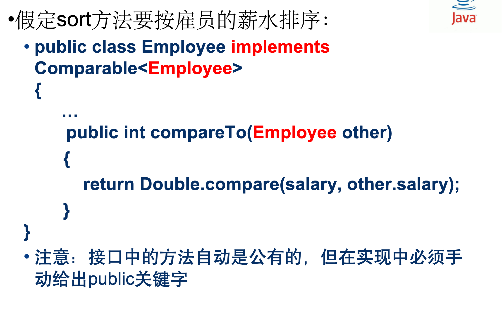

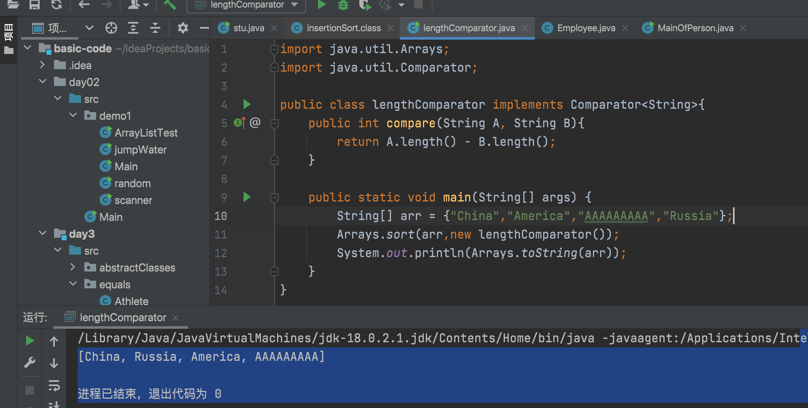

### *作用*

比如有一个门的抽象类，因为所有的门都有open和close的属性，所以抽象类中这两个作为抽象函数存在，实现类必须重载这两个函数。

此外，像报警这样的功能，有些门需要实现，有些门不需要实现，所以报警作为一个接口存在。


+ 让类实现一个接口，需要做：
==1.将类声明为实现给定的接口==
==2.类中对接口中的**所有方法**进行定义==

**代码示例：**


```java
public abstract class Door
{
    //实体域和其他函数
    ...
    //open和close
	public abstract void open()throws InterruptedException;
    public abstract void close();
}

//接口
public interface Alarm
  {
	void alarm() throws InterruptedException;
  }
//----------------------------------------------------------------
//类实现
public class AlarmDoor extends Door implements Alarm
{
	//...
	@Override
	public void open() throws InterruptedException
	{
		System.out.println("The door is opening.");
		alarm();
	}

    @Override
	public void close()
	{
		System.out.println("The door is closed.");
	}

	@Override
	public void alarm() throws InterruptedException 
	{
		for (int i = 0;i<20;i++) {
			  Toolkit.getDefaultToolkit().beep();
			  Thread.sleep(600);
			}
	}
}

```

### 特性
+ 抽象性：
接口中的方法默认是public abstract的，即**接口中的方法都是公开的且没有具体实现。**
**一个类如果实现了某个接口，那么它必须实现该接口中的所有方法。**
+ 封装性：
接口不是类，**不能实例化**，但可以声明接口变量。
接口可以隐藏具体实现细节，只暴露必要的方法供其他类使用。
+ 多态性：
**一个类可以实现多个接口**，从而拥有多种类型。
通过接口，可以实现不相关类之间的通用处理服务。
+ 继承性：
**一个接口可以继承另一个接口**，从而继承其方法定义。
这种方式允许接口之间的层次结构和功能扩展。
+ 访问控制：
接口中的方法默认是公开的（public），因此它们可以被任何类访问。
**接口中的成员变量（如果有的话）默认是public static final的，即常量。**

### 两者区别
**继承**：当一个类（子类）继承另一个类（父类）时，子类会自动获得父类中的非私有方法。子类可以重写父类中的方法，也可以添加新的方法。这意味着子类可以定义与父类相同签名的方法，并提供自己的实现。

**接口**： 接口中只定义方法签名，不包含方法的实现。接口中的方法默认是公开的（public）和抽象的（abstract）。实现接口的类必须提供接口中所有方法的具体实现。

+ #### 多重继承与多重实现：

继承：Java不支持多重继承，即一个类不能同时继承多个父类。这主要是为了避免复杂的继承关系和潜在的冲突。

接口：Java支持一个类实现多个接口。这使得类可以组合多个接口的功能，从而实现更灵活的设计。


## 区别compare和Equals
### compare方法：
1.compare方法通常用于比较两个对象的大小或顺序。在Java中，Comparable接口定义了一个compareTo方法，用于比较实现该接口的对象的自然顺序。例如，String和Integer类都实现了Comparable接口，因此它们有compareTo方法。
2.compareTo方法返回一个整数，表示调用该方法的对象与传入的对象之间的比较结果。如果当前对象小于、等于或大于传入的对象，则返回负数、零或正数。
3.compareTo方法常用于排序算法中，如Collections.sort方法，以及数据结构的实现，如TreeSet和TreeMap。

### Equals方法：
+ \==在java中，除了基本数据类型（int,double...）是比较值，其他任何对象类型使用==都是比较的两个对象的地址是否相同
```java
//以下是equals源码,使用==比较对象，就是比较地址
public boolean equals(Object anObject) {
    //同一个对象地址，直接返回true
    if (this == anObject) {
        return true;
    }
    return false;
```
+ 在String,Integer中，equals方法都已经被重新。思路是，先用\==比较地址是否相同；若不相同，再比较其具体值是否相等。

+ ==我现在理解为什么老师要说自定义类要重写equals方法了==
参考：
https://blog.csdn.net/weixin_44203158/article/details/109961146

默认情况下，Object类的equals方法比较的是两个对象的引用是否相等，即它们是否是内存中的同一个对象。然而，许多类（如String，Integer的包装类，自定义类等）都会重写equals方法，以提供更有意义的比较逻辑。
当重写equals方法时，通常还需要重写hashCode方法，以确保两个相等的对象具有相同的哈希码，这对于将对象用作哈希表（如HashMap和HashSet）的键时尤为重要。


##### 总结：

compare（或compareTo）通常用于排序和比较对象的顺序。
equals用于检查两个对象的内容是否相等。
这两个方法有不同的目的和返回值类型：

compareTo返回一个整数，表示对象之间的顺序关系。
equals返回一个布尔值，表示对象是否相等。
在使用时，应根据具体需求选择使用哪个方法。如果你需要比较对象的顺序或进行排序，那么应该使用compareTo；如果你需要检查两个对象是否表示相同的内容或状态，那么应该使用equals。


---
## Compare自定义比较器
+ 方法一
```java
// 自定义一个名为 PersonAgeComparator 的类，该类实现了 Comparator 接口，并且泛型指定为 Person 类型。  
// 这意味着该比较器将用于比较 Person 类型的对象。  
class PersonAgeComparator implements Comparator<Person> {  
  
    // 重写 Comparator 接口中的 compare 方法。  
    // 该方法用于比较两个 Person 对象，并根据比较结果返回一个整数值。  
    @Override  
    public int compare(Person p1, Person p2) {  
  
        // 使用 Integer 类的静态方法 compare 来比较两个整数的大小。  
        // 这里，它比较 p1 和 p2 这两个 Person 对象的 age 属性。  
        // 如果 p1.getAge() 小于 p2.getAge()，则返回负整数；  
        // 如果 p1.getAge() 等于 p2.getAge()，则返回 0；  
        // 如果 p1.getAge() 大于 p2.getAge()，则返回正整数。  
        return Integer.compare(p1.getAge(), p2.getAge());  
    }  
}
```
+ 方法二
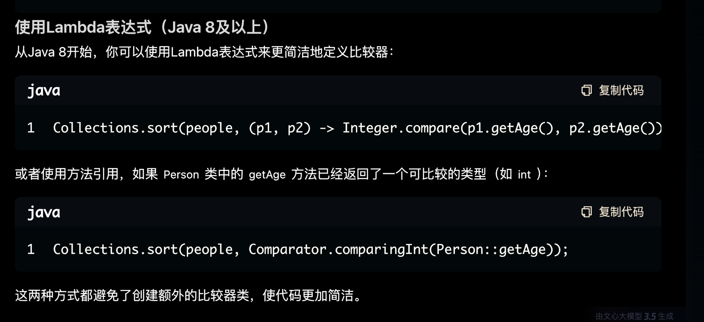


## 堆排序
>import java.util.Arrays;
/
public class heapSort {
    //若为二叉树排序，节点的遍历顺序为按行
    public static void main(String[] args) {
        int[] arr = {1,3,5,7,9,2,4,6,8,10};
        heapSort(arr);
        System.out.println(Arrays.toString(arr));
    }
    public static  void heapSort(int[] arr){
        //先变成大顶堆
        buildMaxHeap(arr);
/
        //每次都把大顶堆的根节点（就是未排序的树中最大树放到未排序好数列末位，然后未排序数列长度-1）
        for(int i = arr.length-1; i > 0; i--){
            swap(arr,0,i);
            maxHeapify(arr,0,i);
        }
    }
/
    public static void buildMaxHeap(int[] arr) {
        //从最后一个非叶子节点开始，一次向前递减
        for(int i = arr.length / 2 - 1; i >= 0; i--){
            maxHeapify(arr,i,arr.length);
        }
    }
    public static void maxHeapify(int[] arr, int i, int heapSize) {
        int l = 2 * i + 1;
        int r = 2 * i + 2;
        int largest = i;
/
        // 确保左子节点在堆的范围内
        if (l < heapSize && arr[l] > arr[largest]) {
            largest = l;
        }
/
        // 确保右子节点在堆的范围内
        if (r < heapSize && arr[r] > arr[largest]) {
            largest = r;
        }
/
        // 如果最大的不是父节点，则交换它们
        if (largest != i) {
            swap(arr, i, largest);
            // 递归调用maxHeapify，以确保子树也是大顶堆
            maxHeapify(arr, largest, heapSize);
        }
    }
    public static void swap(int[] arr,int a,int b){
        int temp = arr[a];
        arr[a] = arr[b];
        arr[b] = temp;
    }
}

1. 构造大顶堆（升序排序）
+ 找到最大的节点，并交换的整棵树的根节点
+ 从最后一个非叶子节点开始（通常是从数组长度除以2再减1的位置开始）
### 堆排序（函数）（数组名，根节点，总节点数）
    + 标记左右叶子结点2i+1和2i+2
    + 在根左右找出最大的数交换到根节点
        
2.构造
+ 在堆已构建完毕后，就可以开始进行堆排序了，堆排序的核心思想是反复地将堆顶元素与数组的末尾元素交换。
+ 具体地，首先将堆顶元素与数组的最后一个元素交换，然后将数组长度减1。接着，重新调整剩余的元素，使其满足堆的性质。
    + 重复上述交换和调整的步骤，直到整个数组变得有序。每次交换和调整，无序区的长度减少1，有序区的长度增加1。


## try-catch

基本语法结构如下：
```java
try {
    // 尝试执行的代码块，可能会抛出异常
} catch (ExceptionType1 e) {
    // 如果try块中抛出了ExceptionType1类型的异常，将执行这里的代码
} catch (ExceptionType2 e) {
    // 如果try块中抛出了ExceptionType2类型的异常，将执行这里的代码
    // 可以有多个catch块来处理不同类型的异常
} finally {
    // 无论是否发生异常，finally块中的代码都会执行
    // 通常用于执行清理工作，如关闭文件流
}
```
**各部分解释：**
try 块：包含可能会抛出异常的代码。如果有异常抛出，那么 try 块中的执行将被中断，控制权将交给 catch 块。

catch 块：==用于捕获并处理 try 块中抛出的异常==。可以有多个 catch 块来捕获不同类型的异常，每个 catch 块对应一种异常类型。

ExceptionType：是Java中 Throwable 类的子类，表示可能被抛出的异常类型。

e：是异常对象的引用，它包含了异常发生时的上下文信息，如异常消息、堆栈跟踪等。

finally 块（可选）：无论 try 块中的代码是否成功执行，==无论是否捕获到异常，finally 块中的代码都会被执行==。这通常用于执行清理操作，如关闭文件流或释放资源。

## clone()克隆

+ throws CloneNotSupportedException 有以下意义：

异常声明：它明确告诉方法的调用者，clone() 方法在执行过程中可能会抛出 CloneNotSupportedException 异常。

接口契约：Object 类的 clone() 方法声明了 throws CloneNotSupportedException，这意味着所有重写该方法的子类都必须遵守这一契约，要么处理这个异常，要么在自己的方法中声明抛出该异常。

强制实现：由于 clone() 方法在 Object 类中是 protected 并且声明了异常，任何重写该方法的子类都必须处理这个异常，要么通过 try-catch 块捕获并处理它，要么在自己的方法签名中使用 throws 关键字声明继续向上抛出。

```java
// 定义一个可克隆的类，通过实现Cloneable接口
class MyCloneableClass implements Cloneable {
    private int value; // 私有成员变量，存储类的值

    // 构造函数，用于创建对象时初始化value
    public MyCloneableClass(int value) {
        this.value = value;
    }

    // 公共方法，用于获取value的值
    public int getValue() {
        return value;
    }

    // 公共方法，用于设置value的值
    public void setValue(int value) {
        this.value = value;
    }

    // 重写clone方法，使得MyCloneableClass对象可以被克隆
    // @Override 注解表示这个方法重写了父类的方法
    @Override
    protected Object clone() throws CloneNotSupportedException {
        // 调用Object类的clone()方法来克隆当前对象
        // super关键字引用父类（这里是Object类）的clone()方法
        return super.clone();
    }
}

// 演示克隆用法的主类
public class CloneDemo {
    public static void main(String[] args) {
        try {
            // 创建一个MyCloneableClass对象，其value初始化为42
            MyCloneableClass original = new MyCloneableClass(42);
            
            // 克隆原始对象，通过调用clone()方法
            // 强制类型转换，因为clone()方法返回的是Object类型
            MyCloneableClass cloned = (MyCloneableClass) original.clone();
            
            // 打印原始对象的值
            System.out.println("Original value: " + original.getValue());
            // 打印克隆对象的值，应该与原始对象相同
            System.out.println("Cloned value: " + cloned.getValue());
            
            // 修改克隆对象的value的值，设置为24
            cloned.setValue(24);
            
            // 打印修改后克隆对象的值
            // 这应该不会影响原始对象的值
            System.out.println("Cloned value after change: " + cloned.getValue());
            
            // 打印原始对象的值，确认其未被克隆对象的修改所影响
            System.out.println("Original value after change: " + original.getValue());
            
        } catch (CloneNotSupportedException e) {
            // 捕获并处理CloneNotSupportedException异常
            // 这通常发生在尝试克隆一个没有实现Cloneable接口的对象时
            System.err.println("Clone operation not supported: " + e.getMessage());
            // 打印异常的堆栈跟踪，用于调试
            e.printStackTrace();
        }
    }
}
```

### 实验
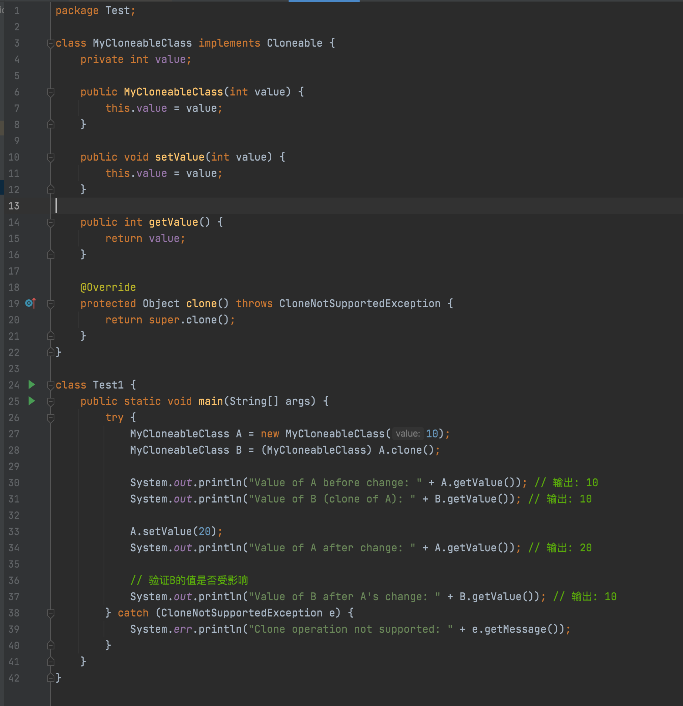

## 对比
+ 参考https://zhuanlan.zhihu.com/p/101583223
### Comparable
如果一个类实现了 **Comparable 接口（只需要干一件事，重写 compareTo() 方法）**，就可以按照自己制定的规则将由它创建的对象进行比较。下面给出一个例子。

```java

Comparable 接口的定义非常简单，源码如下所示。

public interface 
//Comparable接口是一个泛型设计，需用<>给出接口中参数的类型。
Comparable<T> {
    int compareTo(T t);
}
```

```java
public class Cmower implements Comparable<Cmower> {
    private int age;
    private String name;

    public Cmower(int age, String name) {
        this.age = age;
        this.name = name;
    }
//----------------------------------------------------------------
    @Override
    public int compareTo(Cmower o) {
        return this.getAge() - o.getAge();
    }
//  ----------------------------------------------------------------
    public static void main(String[] args) {
        Cmower wanger = new Cmower(19,"沉默王二");
        Cmower wangsan = new Cmower(16,"沉默王三");

        if (wanger.compareTo(wangsan) < 0) {
            System.out.println(wanger.getName() + "比较年轻有为");
        } else {
            System.out.println(wangsan.getName() + "比较年轻有为");
        }
    }
}
```
### Comparator
==在包含多个对象的Array里面，创建一个Comparatorhandler，然后使用Arrays.sort()方法对数组进行排序。==
**原本对象类不动，重新写一个Comparator类专门比较，可以有多种自己的比较方式。
类中函数是Compare**


Comparator 是一个函数式接口（自Java 8起），它定义了一个名为 compare 的抽象方法，该方法用于比较两个对象。

Comparator 接口的典型定义如下：

```java
@FunctionalInterface  
public interface Comparator<T> {  
    int compare(T o1, T o2);  
  
    // 其他默认方法和静态方法...  
}
```
---
>public class Student extends Person{
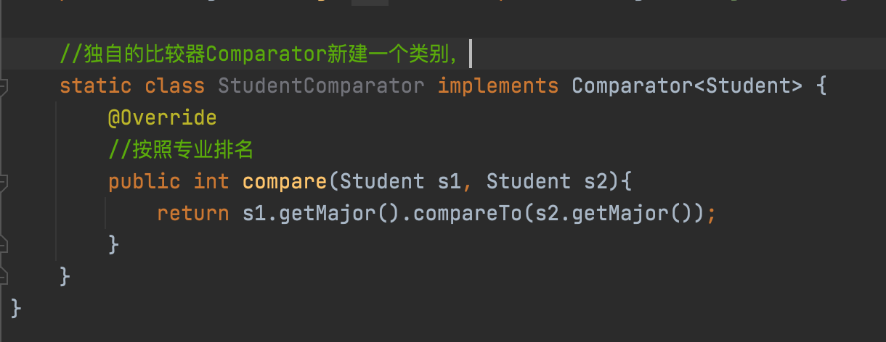


主函数里调用：
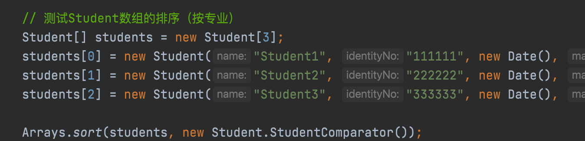

---

1）原封不动的 Cmower 类。
```java
public class Cmower  {
    private int age;
    private String name;

    public Cmower(int age, String name) {
        this.age = age;
        this.name = name;
    }
}
```

Cmower 类有两个字段：age 和 name，意味着该类可以按照 age 或者 name 进行排序。

2）再来看 Comparator 接口的实现类。

```java
public class CmowerComparator implements Comparator<Cmower> {
    @Override
    public int compare(Cmower o1, Cmower o2) {
        return o1.getAge() - o2.getAge();
    }
}
```


### 两者对比区别
+ 一个类实现了 Comparable 接口，意味着该类的对象可以直接进行比较（排序），但比较（排序）的方式只有一种，很单一。
+ 一个类如果想要保持原样，又需要进行不同方式的比较（排序），就可以定制比较器（实现 Comparator 接口）。

总而言之，如果对象的排序需要基于自然顺序，请选择 Comparable，如果需要按照对象的不同属性进行排序，请选择 Comparator。

## lambda表达式
+ 匿名函数lambda等价图:
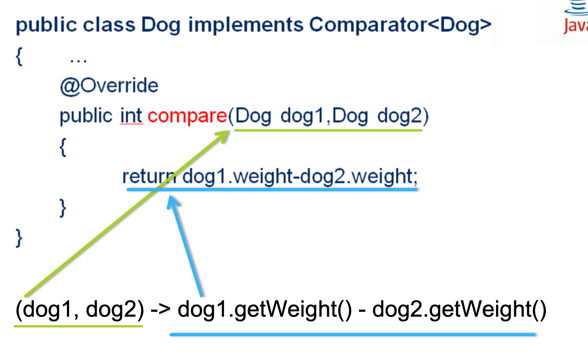

+ 匿名Lambda函数与有名Lambda函数的区别：
匿名Lambda函数：没有名称，直接在声明时使用。它们是真正的“匿名”函数，通常用于简短的操作，并且只使用一次。

+ 有名Lambda函数：实际上并不是Lambda表达式的一种独立形式，而是将Lambda表达式赋值给一个变量，从而可以重复使用。在Java中，所有的Lambda表达式都是匿名的，但我们可以给它们赋予变量名，以便在代码中多次引用。

示例：
```java
// 有名Lambda表达式，实际上是将Lambda赋值给变量
Function<Integer, Integer> square = x -> x * x;

// 使用这个"有名"的Lambda表达式
int squared = square.apply(4); // 结果为 16
System.out.println(squared); // 输出: 16
```
我们给这个Lambda表达式赋予了一个变量名 square，但它本身仍然是匿名的，因为Lambda表达式没有自己的名称。

==Lambda表达式只有一个参数时，()可以省略：==
==如果只有一个语句，可以省略{}和return：==

==下面的例子，等式右边的才是严格lambda表达式：==

### 无参Lambda表达式：
无参Lambda表达式通常用于实现 Runnable 接口。

```java
Runnable runnable = () -> {
    System.out.println("Hello, Lambda!");
};
runnable.run(); // 输出: Hello, Lambda!
```

### 有一个参数的Lambda表达式：
单参数Lambda表达式常用于 Consumer 接口的实现。

```java
Consumer<String> consumer = str -> System.out.println(str);
consumer.accept("Hello with one parameter"); // 输出: Hello with one parameter
```

### 有多个参数的Lambda表达式：
多参数Lambda表达式可以用于 BiFunction 或者自定义的函数式接口。

```java
BiFunction<Integer, Integer, Integer> add = (a, b) -> a + b;
int result = add.apply(5, 10); // 结果为 15
System.out.println(result); // 输出: 15
```


### 实验
#### 1. 自定义排序
```java
import java.util.Arrays;

class Test2 {
    public static void main(String[] args) {
        String[] str = {"aaaaaaaaa","China","Russia","America"};
        Arrays.sort(str,(str1,str2) -> str1.length() - str2.length());

        System.out.println(Arrays.toString(str));
        //输出结果：[China, Russia, America, aaaaaaaaa]
    }
}
```
这里sort的第二个参数需要接收某个类对象----该类实现了Comparator接口----由这个对象调用compare方法，执行lambda表达式的代码块。

---

#### 2.
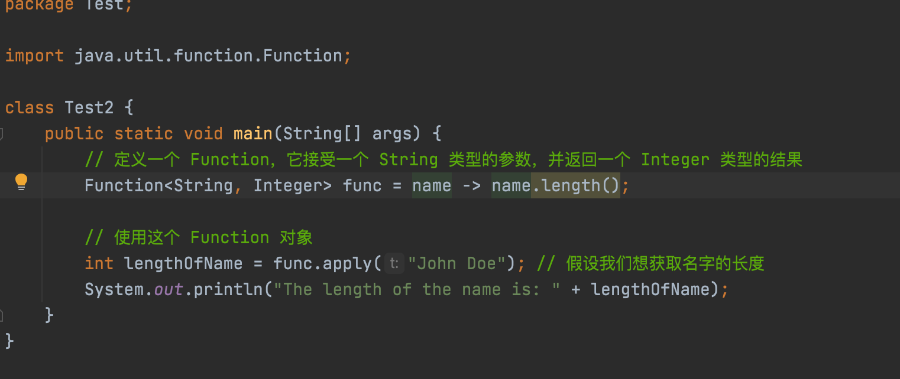

## 函数式接口
**接口Comparator中的compare接口就是一个例子**
+ 当一个接口只有一个抽象方法时，意味着这个接口定义了一个需要实现的特定行为或功能，而实现这个接口的类必须提供这个方法的具体实现。这种模式有时被称为“函数式接口”或“单一抽象方法接口”（SAM接口）。


以下是一个简单的例子来说明这个概念：

```java
// 定义一个接口，它只有一个抽象方法  
public interface Action {  
    void perform();  
}  
  
// 实现接口的类  
public class DanceAction implements Action {  
    @Override  
    public void perform() {  
        System.out.println("开始跳舞！");  
    }  
}  
  
// 另一个实现接口的类  
public class SingAction implements Action {  
    @Override  
    public void perform() {  
        System.out.println("开始唱歌！");  
    }  
}  
  
// 使用接口的示例  
public class Main {  
    public static void main(String[] args) {  
        Action dance = new DanceAction();  
        Action sing = new SingAction();  
          
        dance.perform(); // 输出：开始跳舞！  
        sing.perform();  // 输出：开始唱歌！  
    }  
}
```
在这个例子中，Action 接口只有一个抽象方法 perform()。DanceAction 和 SingAction 是实现了 Action 接口的两个类，它们分别提供了 perform() 方法的具体实现。在 Main 类中，我们创建了 DanceAction 和 SingAction 的实例，并调用了它们的 perform() 方法。


# 装箱/拆箱
在Java中，装箱（boxing）和拆箱（unboxing）是自动类型转换的过程，它们允许在基本数据类型（如int、double等）和它们对应的包装类（如Integer、Double等）之间进行转换。

***装箱（Boxing）***
装箱是将基本数据类型值转换为对应包装类对象的过程。这个过程是自动的，不需要显式调用任何方法。

***拆箱（Unboxing）***
拆箱是将包装类对象转换为对应基本数据类型值的过程。同样，这个过程也是自动的。


```java
 // 装箱示例  
        // 1. 直接将基本数据类型值赋给包装类变量  
        int primitiveInt = 10;  
        Integer boxedInt = primitiveInt; // 自动装箱  
        // 注释：这里Java自动将int类型的primitiveInt转换为Integer类型的boxedInt  
  
        // 2. 使用Integer的静态方法valueOf进行装箱  
        Integer boxedInt2 = Integer.valueOf(primitiveInt); // 显式装箱，但通常使用自动装箱  
        // 注释：valueOf方法返回表示指定int值的Integer实例  
  
// 拆箱示例  
        // 1. 直接将包装类变量赋值给基本数据类型变量  
        int unboxedInt = boxedInt; // 自动拆箱  
        // 注释：这里Java自动将Integer类型的boxedInt转换为int类型的unboxedInt  
  
        // 2. 使用包装类对象的xxxValue方法（如intValue、doubleValue等）进行拆箱  
        int unboxedInt2 = boxedInt.intValue(); // 显式拆箱，但通常使用自动拆箱  
        // 注释：intValue方法返回此Integer实例表示的int值  
```

# 变化参数的函数/函数
当方法参数中有数组时，可以将其写成…形式，并把它作为最后一个参数。
+ 表示传入的参数可以是1个、2个...n个或者传入一个n个元素的Integer数组

```java 
public static void changeIntegerArray(Integer[] n,int x)
```
可以改为:
```java
public static void changeIntegerArray(int x, Integer... n)
  {	for(int i=0;i<n.length;++i)
		n[i]*=x;
  }

```
## 方法的引用传递问题

```java
public static void changeIntegerArray(int x,Integer...n)
	{
		for(int i=0;i<n.length;++i)
			n[i]*=x;	
	}

public class ObjectArgs
{	public static void main(String[] args)
	{
		Integer ia1=10;
		Integer ia2=20;
		changeIntegerArray(100,ia1,ia2);
		System.out.println(ia1+"\n"+ia2);  //10   20


		Integer[] integerArr = {10,20,30,40,50};
		changeIntegerArray(100,integerArr);
		for(Integer i : integerArr)
			System.out.println(i);
	}  // 1000  2000  3000  4000  5000
}
```
+ 值得注意，ia1 和 ia2 是 Integer 类型的对象。当你调用 changeIntegerArray 方法并传递 ia1 和 ia2 时，你实际上是传递了这两个对象的引用（或者说是指针的副本）。但是，由于 Integer 是不可变的，你不能直接修改 Integer 对象本身的值。在 changeIntegerArray 方法中，你尝试执行 n[i] *= x;，这实际上是将 n[i]（一个 Integer 对象的引用）解引用为 int 值，与 x 相乘，然后尝试将这个结果再次装箱为一个新的 Integer 对象。但是，这个新创建的 Integer 对象并没有被赋值回原始变量 ia1 或 ia2，因为 n 是方法内部的局部变量(形参)，它只是对原始变量引用的副本。

+ 对于changeIntegerArray(100,integerArr);他传入的就是这个数组的指针（引用）；然后在n[i]*=x;重新赋值给了原数组。

---
+ **简而言之，n 是方法内部的一个“便签”，它记录了原始变量的地址，但它本身并不是那个地址。因此，对n的修改（比如重新赋值或修改其引用的对象的内部状态，如果对象是可变的话）不会影响到原始变量本身，除非那个修改是通过n直接作用在原始变量所引用的对象上（就像修改数组元素那样）**

# var关键字
+ 概念：
var 是Java中的一个关键字，用于声明匿名局部变量，即没有具体类型的局部变量。这种变量的类型由编译器根据赋值表达式的类型自动推断。

+ 用法：
var 只能用作局部变量，不能用于成员变量或方法参数。
var 声明的变量必须在使用之前初始化。
var 变量的类型是由赋值表达式的类型决定的。
代码示例：
```java
使用 var 之后：
List<String> names = new ArrayList<>();
names.add("Alice");
var name = names.get(0); // 声明时不需要指定String类型，由编译器推断
```

在这个例子中，var name 声明了一个局部变量 name，其类型由 names.get(0) 的返回类型推断为 String。

更复杂的例子：
```java
var map = new HashMap<>();
map.put("one", 1);
map.put("two", 2);


var value = map.get("one"); // 推断为Integer
```
在这个例子中，var map 声明了一个 HashMap 类型的局部变量，var value 根据 map.get("one") 的返回类型推断为 Integer。


# Part5 集合
## 附录

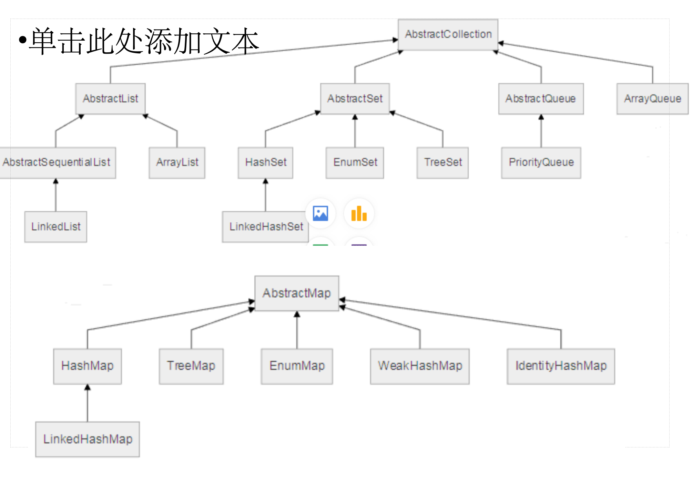

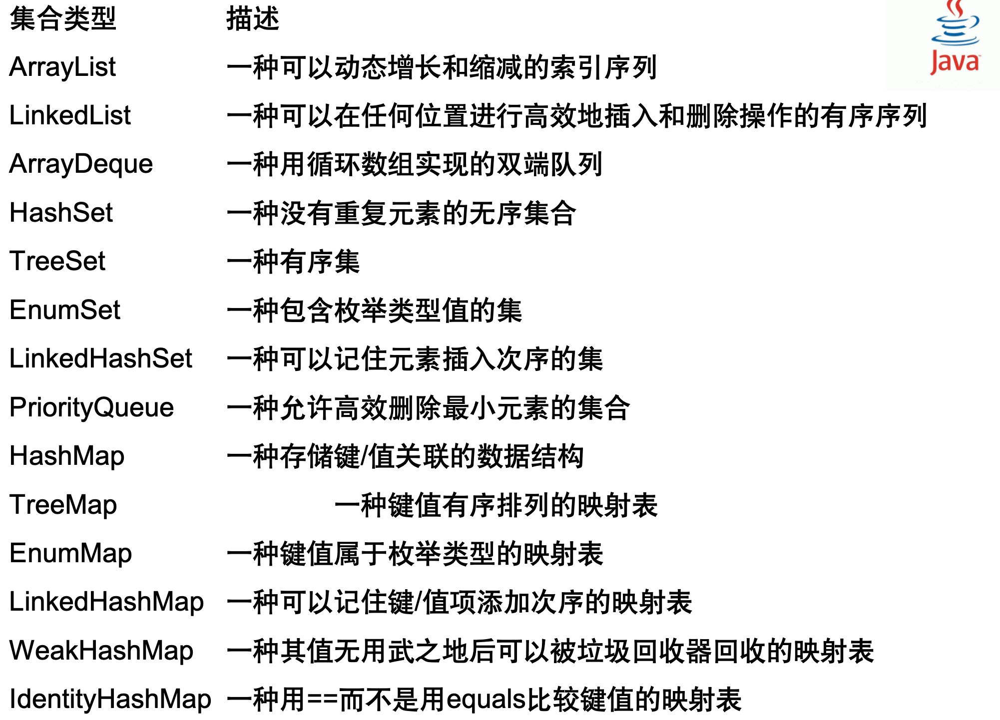

## List（列表）
List 是一个有序的集合，允许元素重复。List 接口的主要实现类有 ArrayList、LinkedList 等。

示例代码：
```java
import java.util.ArrayList;  
import java.util.List;  
  
public class ListExample {  
    public static void main(String[] args) {  
        // 创建一个ArrayList实例  
        List<String> list = new ArrayList<>();  
          
        // 添加元素  
        list.add("apple");     // 在列表末尾添加一个元素  
        list.add(1, "banana"); // 在指定索引位置插入一个元素  
  
        // 获取元素  
        String fruit = list.get(0); // 获取索引为0的元素  
  
        // 遍历列表  
        for (String f : list) {  
            System.out.println(f);  
        }  
  
        // 移除元素  
        list.remove("apple"); // 移除第一个匹配的元素  
  
        // 输出列表大小  
        System.out.println("List size: " + list.size());  
    }  
}
```

## ArrayList

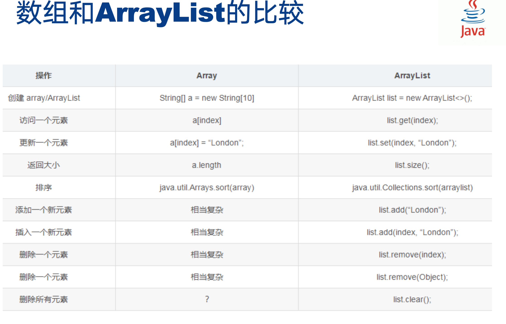

### 定义
```java
ArrayList<Integer> ia1 = new ArrayList<Integer>();   // 完整形式
ArrayList<Integer> ia2 = new ArrayList<>(); //通用形式
//（）内不填写容量大小，默认为10
```

### 常用方法
```java
import java.util.ArrayList; // 导入ArrayList类  
  
public class ArrayListExample {  
    public static void main(String[] args) {  
        // 1. 创建一个空的ArrayList  
        ArrayList<String> list = new ArrayList<>(); // 创建一个存储String类型对象的ArrayList  
  
        // 2. 添加元素  
        list.add("Apple"); // 在列表末尾添加元素"Apple"  
        list.add("Banana"); // 在列表末尾添加元素"Banana"  
        list.add(0, "Orange"); // 在索引0的位置插入元素"Orange"  
  
        // 3. 访问元素  
        System.out.println(list.get(1)); // 访问并打印索引1的元素，即"Banana"  
  
        // 4. 修改元素  
        list.set(1, "Mango"); // 将索引1的元素修改为"Mango"  
  
        // 5. 删除元素  
        list.remove(0); // 删除索引0的元素，即"Orange"  
  
        // 6. 遍历元素  
        for (int i = 0; i < list.size(); i++) { // 使用for循环遍历  
            System.out.println(list.get(i));  
        }  
  
        // 使用for-each循环遍历  
        for (String fruit : list) {  
            System.out.println(fruit);  
        }  
  
        // 注意：这里展示使用Iterator遍历的代码，但它是另一种常见的遍历方式  
         // 使用迭代器遍历  
        Iterator<String> iterator = list.iterator();  
        while (iterator.hasNext()) {  
            String fruit = iterator.next();  
            System.out.println(fruit);  
        }  
    }  
}
```
### Array.sort自定义(对象)
```java
Integer[] arr = {5,4,7,9,2,12,54,21,1};
        //降序
        Arrays.sort(arr, (a, b) -> {
            //返回值>0交换
            return b-a;
        });
```

or:
```java
//不能使用基本数据类型
        Integer[] arr = {5,4,7,9,2,12,54,21,1};
        //降序
        Arrays.sort(arr, new Comparator<Integer>() {
        		//重写compare方法，最好加注解，不加也没事
            public int compare(Integer a, Integer b) {
              	//返回值>0交换
                return b-a;
            }
        });
```

## Enum枚举
### 定义：
```java
public enum Weekday {  
    MONDAY, TUESDAY, WEDNESDAY, THURSDAY, FRIDAY, SATURDAY, SUNDAY;  
}
```
+ ### 在另一个类中，我们可以使用这个枚举类型：

```java
public class EnumExample {  
    public static void main(String[] args) {  
        // 访问枚举常量  
        Weekday day = Weekday.MONDAY;  
        System.out.println("Today is: " + day);       
        // 遍历枚举常量  
        for (Weekday weekday : Weekday.values()) {  
            System.out.println(weekday);  
        }     
        // 使用switch语句  
        switch (day) {  
            case MONDAY:  
                System.out.println("Mondays are hard.");  
                break;  
            case FRIDAY:  
                System.out.println("Fridays are better!");  
                break;  
            default:  
                System.out.println("It's just another day.");  
        }  
}
```


## Set（集合）
Set 是一个不包含重复元素的集合。Set 接口的主要实现类有 HashSet、TreeSet 等。

示例代码：
```java
import java.util.HashSet;  
import java.util.Set;  
  
public class SetExample {  
    public static void main(String[] args) {  
        // 创建一个HashSet实例  
        Set<String> set = new HashSet<>();  
          
        // 添加元素  
        set.add("apple");  
        set.add("banana");  
        set.add("apple"); // 重复添加，但Set中不会有重复元素  
  
        // 遍历集合  
        for (String fruit : set) {  
            System.out.println(fruit);  
        }  
  
        // 输出集合大小  
        System.out.println("Set size: " + set.size());  
    }  
}
```

## Queue（队列）
Queue 是一个特殊的线性表，它只允许在表的前端（front）进行删除操作，而在表的后端（rear）进行插入操作。Queue 接口的主要实现类有 LinkedList、PriorityQueue 等。

示例代码：
```java
import java.util.LinkedList;  
import java.util.Queue;  
  
public class QueueExample {  
    public static void main(String[] args) {  
        // 创建一个LinkedList实例作为Queue使用  
        Queue<String> queue = new LinkedList<>();  
          
        // 添加元素（入队）  
        queue.offer("apple");  
        queue.offer("banana");  
  
        // 移除并获取头元素（出队）  
        String head = queue.poll();  
  
        // 获取头元素但不移除  
        String peek = queue.peek();  
  
        // 遍历队列  
        while (!queue.isEmpty()) {  
            System.out.println(queue.poll());  
        }  
  
        // 输出队列大小（此时队列为空）  
        System.out.println("Queue size: " + queue.size());  
    }  
}
```

## Map（映射）
Map 是一种把键(key)对象和值(value)对象映射的集合，它的每一个元素都包含一对键对象和值对象。Map 接口的主要实现类有 HashMap、TreeMap 等。

示例代码：
```java
import java.util.HashMap;  
import java.util.Map;  
  
public class MapExample {  
    public static void main(String[] args) {  
        // 创建一个HashMap实例  
        Map<String, Integer> map = new HashMap<>();  
        //等价语句Map<String, Integer> map = new HashMap<String, Integer>();
          
        // 添加元素  
        map.put("apple", 1);  
        map.put("banana", 2);  
  
        // 获取元素  
        Integer count = map.get("apple");  
  
        // 遍历Map  
        for (Map.Entry<String, Integer> entry : map.entrySet()) {  
            System.out.println("Key: " + entry.getKey() + ", Value: " + entry.getValue());  
        }  
  
        // 移除元素  
        map.remove("banana");  
  
        // 检查是否包含某个键  
        boolean containsKey = map.containsKey("apple");  
  
        // 输出Map大小  
        System.out.println("Map size: " + map.size());  
    }  
}
```
## 函数
总结:
**asList 用于将数组或一系列元素转换为 List，但返回的 List 是固定大小的。
addAll 用于将一个集合的所有元素添加到另一个集合中。**
### 1. asList
asList 是 Arrays 类的一个静态方法，用于将数组或一系列元素转换为固定大小的 List。注意，这个 List 是由 Arrays.ArrayList（一个内部类，不同于 java.util.ArrayList）实现的，并且其大小是固定的，不支持添加或删除元素（会抛出 UnsupportedOperationException）。

用法：
将数组转换为 List。
传递多个参数（这些参数将被视为数组的元素）。
示例代码：
```java
import java.util.Arrays;  
import java.util.List;  
  
public class AsListExample {  
    public static void main(String[] args) {  
        // 示例1：将数组转换为List  
        Integer[] array = {1, 2, 3, 4, 5};  
        List<Integer> listFromArray = Arrays.asList(array); // 注意这里返回的List大小是固定的  
        System.out.println("List from array: " + listFromArray);  
  
        // 示例2：传递多个参数创建List  
        List<String> listFromElements = Arrays.asList("a", "b", "c");  
        System.out.println("List from elements: " + listFromElements);  
  
        // 注意：asList不支持修改操作，如下面的代码会抛出UnsupportedOperationException  
        // listFromArray.add(6); // 这行代码会抛出UnsupportedOperationException  
    }  
}
```

### 2. addAll
addAll 是 Collection 接口的一个方法，由许多集合类（如 ArrayList, LinkedList, Set 等）实现。它用于将一个集合的所有元素添加到另一个集合中。

用法：
将一个集合的所有元素添加到另一个集合中。
示例代码：
```java
import java.util.ArrayList;  
import java.util.Arrays;  
import java.util.List;  
  
public class AddAllExample {  
    public static void main(String[] args) {  
        // 创建两个List  
        List<Integer> list1 = new ArrayList<>(Arrays.asList(1, 2, 3));  
        List<Integer> list2 = new ArrayList<>(Arrays.asList(4, 5, 6));  
  
        // 使用addAll将list2的所有元素添加到list1中  
        
    list1.addAll(list2);  
  
        // 输出list1，现在它包含list1和list2的所有元素  
        System.out.println("List after addAll: " + list1); // 输出: List after addAll: [1, 2, 3, 4, 5, 6]  
    }  
}
```
关系：


# Object
**在Java中，Object是所有类的超类**，意味着每个类都直接或间接地继承自Object类。Object类提供了一些基本的方法，这些方法可以被所有Java对象所使用。以下是Object类的主要作用和用法，以及相应的代码示例：

1. 提供通用的方法
Object类定义了一些通用的方法，如toString(), equals(Object obj), hashCode(), finalize(), getClass(), notify(), notifyAll(), wait(), wait(long timeout), wait(long timeout, int nanos)等。这些方法为所有Java对象提供了基础功能。

2. 根类的作用
由于所有的类都继承自Object，因此它充当了Java类层次结构的根。这使得我们可以创建通用的数据结构和算法，因为它们可以处理任何Object类型的实例。

3. toString() 方法
toString()方法返回对象的字符串表示形式。通常，这个方法被重写以提供有关对象状态的更有用的信息。

```java
public class Person {  
    private String name;  
    private int age;  
  
    public Person(String name, int age) {  
        this.name = name;  
        this.age = age;  
    }  
  
    @Override  
    public String toString() {  
        // 重写toString方法以返回更有用的字符串表示形式  
        return "Person{" + "name='" + name + '\'' + ", age=" + age + '}';  
    }  
  
    public static void main(String[] args) {  
        Person person = new Person("Alice", 30);  
        System.out.println(person.toString()); // 输出: Person{name='Alice', age=30}  
    }  
}
```
4. equals(Object obj) 方法
equals(Object obj)方法用于比较两个对象是否相等。默认情况下，它比较的是对象的引用，但通常被重写以比较对象的内容。

```java
public class Person {  
    private String name;  
    private int age;  
  
    // 构造函数、其他方法等...  
  
    @Override  
    public boolean equals(Object o) {  
        if (this == o) return true;  
        if (o == null || getClass() != o.getClass()) return false;  
        Person person = (Person) o;  
        return age == person.age && Objects.equals(name, person.name);  
    }  
  
    public static void main(String[] args) {  
        Person alice1 = new Person("Alice", 30);  
        Person alice2 = new Person("Alice", 30);  
        System.out.println(alice1.equals(alice2)); // 输出: true，因为两个Person对象的内容相同  
    }  
}
```
5. hashCode() 方法
hashCode()方法返回对象的哈希码值，通常与equals()方法一起重写，以确保满足哈希表的约束条件。

```java
    @Override
    public int hashCode() {
        //用Objects.hash()
        int result = Objects.hash(difficulty, min, max, finalScore);
        //降低哈希冲突
            //素数*result + 类调用hash函数
        result = 31 * result + Arrays.hashCode(scores);
        return result;
    }
```

# Part6 泛型程序

Test2 和 T 的关系可以用一个形象的比喻来形容：Test2 就像一个容器或盒子，而 T 是这个容器中可以存放的任意类型的物品。

想象一下，Test2 是一个“万能储物箱”，它不关心你要存什么，只要是东西（即任意类型 T），它都能帮你存起来。这里的 T 就代表了你可以放入储物箱中的任何东西，无论是书、玩具、食物还是其他任何物品。

在这个比喻中，private T t; 表示储物箱内部有一个私密的存储空间，用来存放你放进去的物品。getT() 方法就像是打开储物箱并取出物品的动作，而 setT(T t) 方法则像是把东西放进储物箱的动作。

所以，Test2 和 T 的关系就像是一个灵活的储物箱和它可以存储的各种物品之间的关系。这个储物箱（Test2）被设计成可以适应任何类型的物品（T），使得它非常通用和灵活。

```java
package Test;

//建立一个范型，对象名叫Test2
    //<T>表示Box类是一个泛型类，它可以处理任意类型的对象。
class Test2<T>{
    //
    private T t;

    //
    public T getT() {
        return t;
    }

    public void setT(T t) {
        this.t = t;
    }

    //范型方法
    //相比其他方法，范型方法在返回值前面要加一个<U>: 这是一个泛型类型参数的声明。它表示该方法将引入一个新的类型变量U，这个类型在方法被调用时确定。
    public <U> void showType(U u){
        System.out.println("这个对象的类型是：" + u.getClass().getName());
    }

    public static void main(String[] args) {
        //这里Integer取代了T
        Test2<Integer> integerBox = new Test2<Integer>();
        integerBox.setT(10); // 设置整数值
        System.out.println("Integer Value in box: " + integerBox.getT()); // 输出结果：Integer Value in box: 10

        // 实例化一个String类型的Box
        Test2<String> stringBox = new Test2<>();
        stringBox.setT("Hello Generics"); // 设置字符串值
        System.out.println("String in box: " + stringBox.getT()); // 输出结果：String in box: Hello Generics

        // 使用泛型类中的泛型方法
        integerBox.showType(stringBox); //输出结果：这个对象的类型是：Test.Test2（包.类）
    }
}
```

### 接口实现
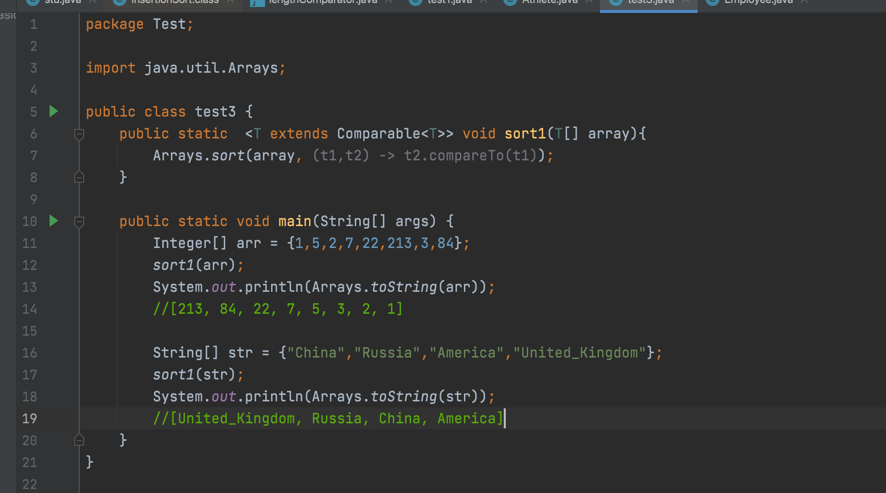

# 流式编程
```java
class Test1 {
    public static void main(String[] args) {
        // 创建流
        List<String> fruits = Arrays.asList("Apple", "Banana", "Cherry", "Date", "Elderberry");

        // 中间操作：过滤和映射
        Stream<String> filteredStream = fruits.stream() //创建流
                .filter(fruit -> fruit.startsWith("C")) // 过滤,lambda表达式
                .map(String::toLowerCase);

        // 终端操作：收集结果
        List<String> result = filteredStream.collect(Collectors.toList());

        // 输出结果
        result.forEach(System.out::println);
    }
}
```
# 试卷
基于您提供的试卷结构和要求，以下是另一份Java知识点考察试卷的示例，包括详细答案。

---

### 第一部分：程序输出题

**题目 1：**
```java
public static void main(String[] args) {
    int result = 3 + 4 * 10 / 2;
    System.out.println("Result = " + result);
}
```
**输出：** `Result = 23`

解释：根据运算符优先级，先进行乘法 `4 * 10`，然后进行除法 `40 / 2`，最后进行加法 `3 + 20`。

**题目 2：**
```java
public static void main(String[] args) {
    int count = 0;
    for (int i = 1; i <= 5; i++) {
        for (int j = 1; j <= i; j++) {
            System.out.print(j);
        }
        System.out.println();
    }
}


```
**输出：**
```
1
12
123
1234
12345
```

**题目 3：**
```java
public static void main(String[] args) throws Exception {
    FileInputStream fis = new FileInputStream("file.txt");
    int data = fis.read();
    while (data != -1) {
        System.out.print((char) data);
        data = fis.read();
    }
    fis.close();
}
```
**输出：** 文件 "file.txt" 的内容

**题目 4：**
```java
public static void main(String[] args) {
    int[][] matrix = {
        {1, 2, 3},
        {4, 5, 6},
        {7, 8, 9}
    };
    for (int i = 0; i < matrix.length; i++) {
        for (int j = 0; j < matrix[i].length; j++) {
            if (i == j) {
                System.out.print(matrix[i][j] + " ");
            }
        }
    }
    System.out.println();
}
```
**输出：** `1 5 9`

**题目 5：**
```java
public static void main(String[] args) {
    int a = 10;
    int b = 20;
    System.out.println("Before swap: a = " + a + ", b = " + b);
    swap(a, b);
    System.out.println("After swap: a = " + a + ", b = " + b);
}
public static void swap(int a, int b) {
    int temp = a;
    a = b;
    b = temp;
}
```
**输出：** `Before swap: a = 10, b = 20`  
`After swap: a = 10, b = 20`  
（实际上，a 和 b 的值没有交换，因为方法参数的传递是按值传递的）

### 第二部分：编程题

**题目 6：**
编写一个Java程序，实现一个简单的栈（Stack）类，使用数组来存储栈中的元素，并提供以下功能：
- 入栈（push）操作
- 出栈（pop）操作
- 查看栈顶元素（peek）操作
- 检查栈是否为空（isEmpty）操作

**答案：**
```java
public class SimpleStack {
    private int[] stack;
    private int top;
    private static final int SIZE = 10; // 栈的大小

    public SimpleStack() {
        stack = new int[SIZE];
        top = -1;
    }

    public void push(int value) {
        if (top == SIZE - 1) {
            System.out.println("Stack overflow");
            return;
        }
        stack[++top] = value;
    }

    public int pop() {
        if (isEmpty()) {
            System.out.println("Stack underflow");
            return -1;
        }
        return stack[top--];
    }

    public int peek() {
        if (!isEmpty()) {
            return stack[top];
        }
        System.out.println("Stack is empty");
        return -1;
    }

    public boolean isEmpty() {
        return top == -1;
    }

    public static void main(String[] args) {
        SimpleStack stack = new SimpleStack();
        stack.push(1);
        stack.push(2);
        System.out.println("Top element is: " + stack.peek());
        System.out.println("Popped element is: " + stack.pop());
    }
}
```

**题目 7：**
设计一个泛型类 `GenericBox<T>`，它包含一个类型为 `T` 的私有变量，并提供以下方法：
- 构造函数，用于初始化变量
- `getType()` 方法，返回变量的类型
- `setValue(T value)` 方法，设置变量的值
- `getValue()` 方法，获取变量的值

**答案：**
```java
public class GenericBox<T> {
    private T value;

    public GenericBox(T value) {
        this.value = value;
    }

    public Class<T> getType() {
        return value.getClass();
    }

    public void setValue(T value) {
        this.value = value;
    }

    public T getValue() {
        return value;
    }

    public static void main(String[] args) {
        GenericBox<String> box = new GenericBox<>("Hello, World!");
        System.out.println("The box contains: " + box.getValue());
        System.out.println("The type of the value is: " + box.getType().getName());
    }
}
```

**题目 8：**
实现一个Java程序，模拟银行账户的存取款操作。创建一个名为 `BankAccount` 的类，包含以下属性和方法：
- 私有属性 `balance`，表示账户余额
- 构造函数，初始化余额为0
- `deposit(double amount)` 方法，存钱到账户
- `withdraw(double amount)` 方法，从账户取钱
- `getBalance()` 方法，获取当前余额

**答案：**
```java
public class BankAccount {
    private double balance;

    public BankAccount() {
        this.balance = 0;
    }

    public void deposit(double amount) {
        if (amount > 0) {
            balance += amount;
            System.out.println("Deposited: " + amount);
        } else {
            System.out.println("Deposit amount must be positive");
        }
    }

    public void withdraw(double amount) {
        if (amount > 0 && amount <= balance) {
            balance -= amount;
            System.out.println("Withdrew: " + amount);
        } else {
            System.out.println("Invalid withdrawal amount");
        }
    }

    public double getBalance() {
        return balance;
    }

    public static void main(String[] args) {
        BankAccount account = new BankAccount();
        account.deposit(1000);
        account.withdraw(500);
        System.out.println("Current balance: " + account.getBalance());
    }
}
```

**题目 9：**
编写一个Java程序，实现一个简单的计算器，可以执行加、减、乘、除四种基本运算。

**答案：**
```java
import java.util.Scanner;

public class SimpleCalculator {
    public static void main(String[] args) {
        Scanner scanner = new Scanner(System.in);
        System.out.print("Enter the first number: ");
        double num1 = scanner.nextDouble();
        System.out.print("Enter the second number: ");
        double num2 = scanner.nextDouble();
        
        System.out.print("Choose the operation (+, -, *, /): ");
        char operation = scanner.next().charAt(0);
        
        double result;
        switch (operation) {
            case '+':
                result = num1 + num2;
                break;
            case '-':
                result = num1 - num2;
                break;
            case '*':
                result = num1 * num2;
                break;
            case '/':
                if (num2 != 0) {
                    result = num1 / num2;
                } else {
                    System.out.println("Error: Division by zero");
                    return;
                }
                break;
            default:
                System.out.println("Invalid operation");
                return;
        }
        
        System.out.println("Result: " + result);
        scanner.close();
    }
}
```

**题目 10：**
实现一个Java程序，模拟图书馆管理系统。创建以下类：
- `Book` 类，包含书名和作者属性
- `Library` 类，包含书籍集合和借出书籍的方法

**答案：**
```java
import java.util.ArrayList;
import java.util.List;

class Book {
    private String title;
    private String author;

    public Book(String title, String author) {
        this.title = title;
        this.author = author;
    }

    @Override
    public String toString() {
        return "Book{" +
               "title='" + title + '\'' +
               ", author='" + author + '\'' +
               '}';
    }
}

class Library {
    private List<Book> books;

    public Library() {
        this.books = new ArrayList<>();
    }

    public void addBook(Book book) {
        books.add(book);
    }

    public boolean borrowBook(String title) {
        for (Book book : books) {
            if (book.title.equals(title)) {
                books.remove(book);
               
```
# qwd 

               基于您提供的样例题目，以下是10道类似的Java题目及答案：

### 题目1：
```java
public class Test1 {
    public static void main(String[] args) {
        int result = 10 + 20 * 2 - 5;
        System.out.println("Result = " + result);
    }
}
```
**答案：** `Result = 35`

### 题目2：
```java
public class Test2 {
    public static void main(String[] args) {
        int count = 0;
        for (int i = 1; i <= 100; i++) {
            if (i % 3 == 0 && i % 5 == 0) {
                count++;
            }
        }
        System.out.println("Count = " + count);
    }
}
```
**答案：** `Count = 33` (6, 12, 18, ..., 90, 96, 99)

### 题目3：
```java
public class Test3 {
    public static void main(String[] args) {
        double[] scores = {85.5, 90.0, 78.2, 92.8, 84.5};
        Arrays.sort(scores);
        System.out.println("Highest score = " + scores[scores.length - 1]);
    }
}
```
**答案：** `Highest score = 92.8`

### 题目4：
```java
public class Test4 {
    public static void main(String[] args) {
        String greeting = "Hello, World!";
        System.out.println(greeting.replace("World", "Java"));
    }
}
```
**答案：** `Hello, Java!`

### 题目5：
```java
public class Test5 {
    public static void main(String[] args) {
        int[][] matrix = {
            {1, 2, 3},
            {4, 5, 6},
            {7, 8, 9}
        };
        for (int i = 0; i < matrix.length; i++) {
            for (int j = 0; j < matrix[i].length; j++) {
                if (i == j) {
                    System.out.print(matrix[i][j] * 2 + " ");
                }
            }
        }
        System.out.println();
    }
}
```
**答案：** `2 10 18`

### 题目6：
```java
public class Test6 {
    public static void main(String[] args) {
        int a = 10, b = 20;
        System.out.println("Before swap: a = " + a + ", b = " + b);
        swap(a, b);
        System.out.println("After swap: a = " + a + ", b = " + b);
    }
    public static void swap(int x, int y) {
        int temp = x;
        x = y;
        y = temp;
    }
}
```
**答案：** 无变化，`Before swap: a = 10, b = 20`  
`After swap: a = 10, b = 20` (因为swap方法中的x和y是值传递)

### 题目7：
```java
public class Test7 {
    public static void main(String[] args) {
        int num = 256;
        System.out.println("Is power of 2? " + isPowerOfTwo(num));
    }
    public static boolean isPowerOfTwo(int num) {
        return (num != 0) && ((num & (num - 1)) == 0);
    }
}
```
**答案：** `Is power of 2? true`

### 题目8：
```java
public class Test8 {
    public static void main(String[] args) {
        String[] fruits = {"Apple", "Banana", "Cherry"};
        System.out.println("First fruit: " + fruits[0]);
        System.out.println("Last fruit: " + fruits[fruits.length - 1]);
    }
}
```
**答案：** `First fruit: Apple`  
`Last fruit: Cherry`

### 题目9：
```java
public class Test9 {
    public static void main(String[] args) {
        try {
            throw new Exception("Something went wrong!");
        } catch (Exception e) {
            System.out.println("Exception caught: " + e.getMessage());
        }
    }
}
```
**答案：** `Exception caught: Something went wrong!`

### 题目10：
```java
public class Test10 {
    public static void main(String[] args) {
        int sum = 0;
        for (int i = 1; i <= 100; i++) {
            sum += i;
        }
        System.out.println("Sum = " + sum);
    }
}
```
**答案：** `Sum = 5050`

这些题目覆盖了基本的Java概念，包括算术运算、循环、数组、字符串操作、异常处理、位操作等。每个题目都设计成简短且易于理解，适合用作编程练习或测试。

# 试卷3
根据您提供的样题和要求，以下是一份新的Java知识点考察试卷，包括程序输出题和编程题，并附有答案。

---

### 第一部分：程序输出题

**题目 1：**
```java
public class Test1 {
    public static void main(String[] args) {
        int result = 7 / 3;
        System.out.println("Result = " + result);
    }
}
```
**输出：** `Result = 2`

**题目 2：**
```java
public class Test2 {
    public static void main(String[] args) {
        int[] array = {10, 20, 30, 40, 50};
        for (int i = 0; i < array.length; i += 2) {
            System.out.print(array[i] + " ");
        }
    }
}
```
**输出：** `10 30 50`

**题目 3：**
```java
public class Test3 {
    public static void main(String[] args) {
        double pi = 3.14159;
        int radius = 10;
        System.out.println("Area of circle: " + pi * radius * radius);
    }
}
```
**输出：** `Area of circle: 314.159`

**题目 4：**
```java
public class Test4 {
    public static void main(String[] args) {
        String greeting = "Hello, World!";
        System.out.println(greeting.substring(7));
    }
}
```
**输出：** `World!`

**题目 5：**
```java
public class Test5 {
    public static void main(String[] args) {
        int num = 5;
        switch (num) {
            case 1:
                System.out.println("One");
                break;
            case 2:
                System.out.println("Two");
                break;
            case 5:
                System.out.println("Five");
                break;
            default:
                System.out.println("Number is not between 1 and 5");
        }
    }
}
```
**输出：** `Five`

### 第二部分：编程题

**题目 6：**
编写一个Java程序，实现一个简单的计算器，可以执行加、减、乘、除四种基本运算。

**答案：**
```java
import java.util.Scanner;

public class SimpleCalculator {
    public static void main(String[] args) {
        Scanner scanner = new Scanner(System.in);
        System.out.print("Enter the first number: ");
        double num1 = scanner.nextDouble();
        System.out.print("Enter the second number: ");
        double num2 = scanner.nextDouble();
        
        System.out.print("Enter the operation (+, -, *, /): ");
        char operation = scanner.next().charAt(0);
        
        double result;
        switch (operation) {
            case '+':
                result = num1 + num2;
                break;
            case '-':
                result = num1 - num2;
                break;
            case '*':
                result = num1 * num2;
                break;
            case '/':
                if (num2 != 0) {
                    result = num1 / num2;
                } else {
                    System.out.println("Error: Division by zero");
                    return;
                }
                break;
            default:
                System.out.println("Invalid operation");
                return;
        }
        
        System.out.println("Result: " + result);
        scanner.close();
    }
}
```

**题目 7：**
设计一个泛型方法`findMax(T[] array)`，传入一个实现了`Comparable`接口的类的数组，找出并返回数组中的最大元素。

**答案：**
```java
public static <T extends Comparable<T>> T findMax(T[] array) {
    if (array == null || array.length == 0) {
        throw new IllegalArgumentException("Array must not be null or empty");
    }
    T max = array[0];
    for (T item : array) {
        if (item.compareTo(max) > 0) {
            max = item;
        }
    }
    return max;
}

public static void main(String[] args) {
    Integer[] numbers = {3, 5, 1, 2, 4};
    Integer maxNumber = findMax(numbers);
    System.out.println("The maximum number is: " + maxNumber);
}
```

**题目 8：**
创建一个名为`Student`的类，其中包含学生的姓名和分数。实现一个方法来计算并返回学生的平均分数。

**答案：**
```java
public class Student {
    private String name;
    private int[] scores;

    public Student(String name, int[] scores) {
        this.name = name;
        this.scores = scores;
    }

    public double calculateAverage() {
        double sum = 0;
        for (int score : scores) {
            sum += score;
        }
        return sum / scores.length;
    }

    public static void main(String[] args) {
        Student student = new Student("Alice", new int[]{85, 92, 79, 90});
        System.out.println("Average score: " + student.calculateAverage());
    }
}
```

**题目 9：**
实现一个名为`Stack`的泛型类，提供`push`、`pop`、`peek`和`isEmpty`方法。

**答案：**
```java
public class Stack<T> {
    private T[] elements;
    private int size = 0;
    private static final int INITIAL_CAPACITY = 10;

    public Stack() {
        elements = (T[]) new Object[INITIAL_CAPACITY];
    }

    public void push(T element) {
        ensureCapacity();
        elements[size++] = element;
    }

    public T pop() {
        if (isEmpty()) {
            throw new EmptyStackException();
        }
        T result = elements[--size];
        elements[size] = null; // 防止对象被引用，造成内存泄漏
        return result;
    }

    public T peek() {
        if (isEmpty()) {
            throw new EmptyStackException();
        }
        return elements[size - 1];
    }

    public boolean isEmpty() {
        return size == 0;
    }

    private void ensureCapacity() {
        if (size == elements.length) {
            T[] newElements = (T[]) new Object[elements.length * 2];
            System.arraycopy(elements, 0, newElements, 0, elements.length);
            elements = newElements;
        }
    }

    public static void main(String[] args) {
        Stack<Integer> stack = new Stack<>();
        stack.push(1);
        stack.push(2);
        System.out.println(stack.peek()); // 输出: 2
        System.out.println(stack.pop());  // 输出: 2
    }
}
```

**题目 10：**
实现一个名为`BankAccount`的类，模拟银行账户的基本操作，包括存款(`deposit`)和取款(`withdraw`)。

**答案：**
```java
public class BankAccount {
    private double balance;

    public BankAccount() {
        this.balance = 0;
    }

    public void deposit(double amount) {
        if (amount > 0) {
            balance += amount;
            System.out.println("Deposited: " + amount);
        } else {
            System.out.println("Deposit amount must be positive");
        }
    }

    public void withdraw(double amount) {
        if (amount > 0 && amount <= balance) {
            balance -= amount;
            System.out.println("Withdrew: " + amount);
        } else {
            System.out.println("Invalid withdrawal amount");
        }
    }

    public double getBalance() {
        return balance;
    }

    public static void main(String[] args) {
        BankAccount account = new BankAccount();
        account.deposit(1000);
        account.withdraw(500);
        System.out.println("Current balance: " + account.getBalance());
    }
}
```

---

请注意，以上试卷仅作为示例，您可以根据实际教学内容和学生水平进行调整。确保涵盖Java语言的主要概念，如面向对象编程、集合框架、异常处理、泛型、Lambda表达式等。同时，提供足够的示例和练习，帮助学生巩固和应用所学知识。

# 结课作业
根据您提供的Oracle数据库表名，我们可以设计一个研究方向，即“城镇房地产行业对居民生活水平的影响”。这个研究方向将探讨房地产行业的发展如何影响城镇居民的收入、消费模式、投资行为等方面。

### 研究问题：

1. 城镇人均可支配收入在过去五年中有何变化趋势？
2. 恩格尔系数的变化是否表明城镇居民的生活水平有所提升？
3. 房地产从业人数的增长与城镇人口增长之间的关系是什么？
4. 房地产行业平均工资与其他行业相比如何？
5. 房地产行业从业人员的可支配收入是否高于城镇平均水平？
6. 房地产企业的数量在过去十年中有何变化？
7. 房地产行业投资总额与城镇GDP增长的关系是什么？
8. 房地产行业用工成本的增长对城镇居民消费能力有何影响？
9. 房地产行业对城镇居民财产性收入的贡献有多大？
10. 房地产行业的发展是否促进了城镇居民的总体财产增长？

### 查询设计：

#### 简单查询：

1. 查询过去五年中城镇人均可支配收入的平均值。
   ```sql
   SELECT AVG(可支配收入) AS avg_income
   FROM 城镇人均可支配收入
   WHERE YEAR >= EXTRACT(YEAR FROM SYSDATE) - 5;
   ```

2. 查询房地产行业从业人数最多的年份。
   ```sql
   SELECT YEAR, MAX(从业人数) AS max_employed
   FROM 房地产从业人数
   GROUP BY YEAR;
   ```

#### 分组查询：

1. 按年份分组，查询每年的房地产投资总额，并过滤出投资总额超过平均值的年份。
   ```sql
   SELECT YEAR, SUM(投资总额) AS total_investment
   FROM 房地产投资
   GROUP BY YEAR
   HAVING SUM(投资总额) > (SELECT AVG(投资总额) FROM 房地产投资);
   ```

2. 分组查询每个房地产企业的树木数量，并过滤出数量少于行业平均值的企业。
   ```sql
   SELECT 企业名称, SUM(树木数量) AS total_trees
   FROM 房地产企业树木
   GROUP BY 企业名称
   HAVING SUM(树木数量) < (SELECT AVG(树木数量) FROM 房地产企业树木);
   ```

#### 相关子查询：

1. 查询恩格尔系数低于全国平均水平的城镇列表。
   ```sql
   SELECT 城镇名称
   FROM 恩格尔系数
   WHERE 恩格尔系数 < (SELECT AVG(恩格尔系数) FROM 恩格尔系数);
   ```

2. 查询房地产行业从业人员的平均可支配收入高于城镇平均水平的年份。
   ```sql
   SELECT YEAR
   FROM 房地产居..工资xls
   WHERE (SELECT AVG(可支配收入) FROM 房地产人.支配财产xls) > (SELECT AVG(可支配收入) FROM 城镇人均可支配工资);
   ```

#### 连接查询：

1. 使用内连接查询房地产行业从业人员的姓名和他们的年收入。
   ```sql
   SELECT a.姓名, b.年收入
   FROM 房地产从业人数 a
   INNER JOIN 房地产居..工资xls b ON a.员工ID = b.员工ID;
   ```

2. 使用左外连接查询所有城镇的名称和它们的人均可支配收入，包括那些没有记录的城镇。
   ```sql
   SELECT a.城镇名称, b.可支配收入
   FROM 城镇列表 a
   LEFT JOIN 城镇人均可支配工资 b ON a.城镇ID = b.城镇ID;
   ```

#### 转置查询：

1. 转置房地产企业树木数量的数据，以企业名称作为列，树木数量作为行。
   ```sql
   SELECT 企业名称, TO_NUMBER(企业名称) AS 树木数量
   FROM 房地产企业树木
   PIVOT (SUM(树木数量) FOR 企业名称 IN (SELECT DISTINCT 企业名称 FROM 房地产企业树木));
   ```

2. 转置房地产投资数据，以年份作为列，投资类型作为行。
   ```sql
   SELECT 投资类型, TO_NUMBER(YEAR) AS 投资金额
   FROM 房地产投资
   PIVOT (SUM(投资金额) FOR YEAR IN (SELECT DISTINCT YEAR FROM 房地产投资));
   ```

### PL-SQL程序：

```plsql
-- 程序1：输出统计数据解读文字
DECLARE
    avg_income NUMBER;
    avg_investment NUMBER;
BEGIN
    SELECT AVG(可支配收入), AVG(投资总额)
    INTO avg_income, avg_investment
    FROM 城镇人均可支配收入
    JOIN 房地产投资 ON EXTRACT(YEAR FROM 投资日期) = EXTRACT(YEAR FROM 统计日期);

    DBMS_OUTPUT.PUT_LINE('在过去的一年中，城镇人均可支配收入平均值为：' || avg_income);
    DBMS_OUTPUT.PUT_LINE('房地产行业的平均投资总额为：' || avg_investment);
    -- 可以根据需要添加更多的统计数据和解读
END;
```

```plsql
-- 程序2：体现国家或地区的发展成就
DECLARE
    developed_cities COUNT;
BEGIN
    SELECT COUNT(*)
    INTO developed_cities
    FROM 城镇人均可支配工资
    WHERE 可支配收入 > (SELECT AVG(可支配收入) FROM 城镇人均可支配工资);

    DBMS_OUTPUT.PUT_LINE('在本地区，有 ' || developed_cities || ' 个城市的人均收入高于全国平均水平，显示出显著的发展成就。');
    -- 可以根据需要添加更多的发展指标和成就描述
END;
```

请注意，以上SQL和PL-SQL示例可能需要根据您实际的数据库结构和字段进行调整。此外，由于字段名可能包含不完整的部分（如房地产居..工资xls），您可能需要根据实际的表和字段名来修正它们。