# plot二维做图
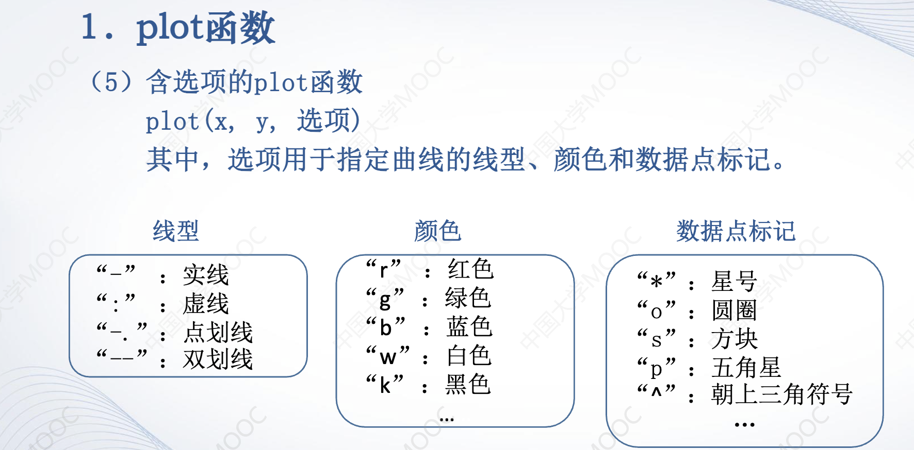

+ ### axis坐标图范围显示
> axis([x_min,x_man,y_min,y_max]);

+ ### 边线
>grid on   //网格线

>box on //图边界线

+ ### 多个函数同时显示在一张图中
>hold on

# 统计图
+ ### bar条形图
>y = [1 2 3 4 5; 1 2 1 3 4; 3 1 1 2 1];
subplot(2,1,1)
bar(y)

>%x的一个数对应y的一行向量
x = [2020,2021,2022];
subplot(2,1,2)
bar(x,y)

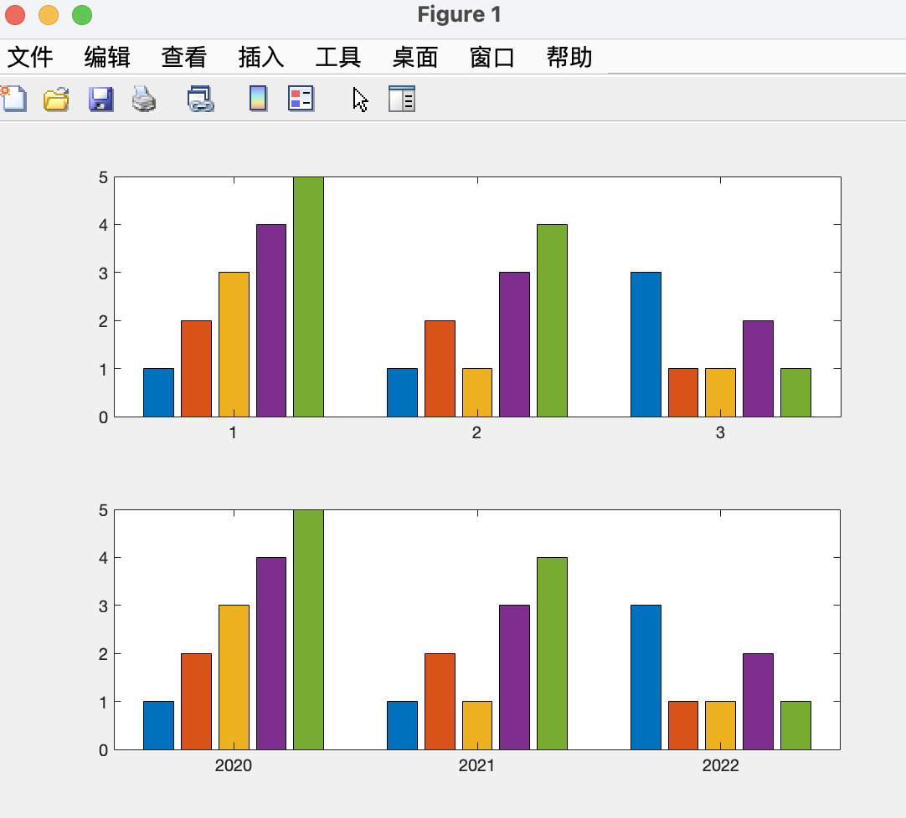

+ ### hist直方图
  >  hist(y,x); //y是数据,x是竖条个数，省略时默认10

  > y =randn(500,1);
subplot(2,1,1)
hist(y)
subplot(2,1,2)
hist(y,100)

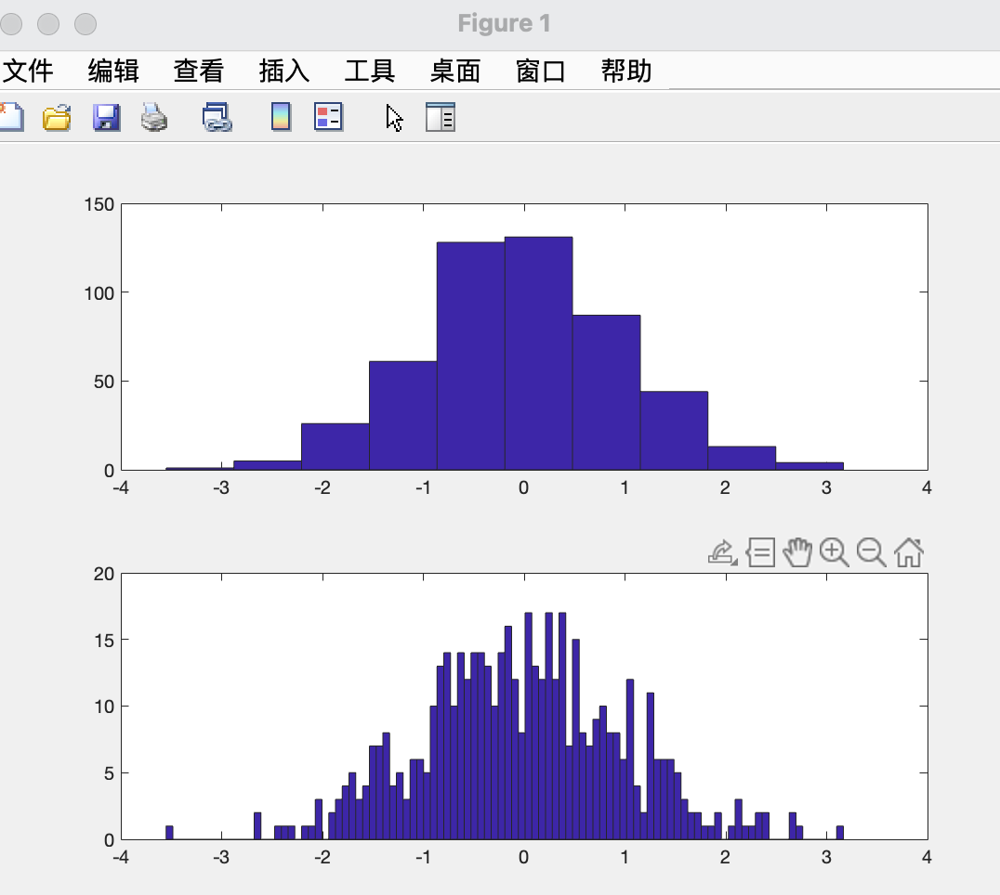

+ ### rose花图

## plot3Three-demension depiction
+ x,y,z三个不论是向量还是矩阵的列的数目都要一样，列列对应

# 函数
+ **max(X)**
  + X为向量
  >y = max(X);
  >[y,k] = max(X);  //y是矩阵X中最大值,k是最大值下标

  + X为矩阵
  > y = max(X);
  [y,k] = max(X); //y和k都是行向量

  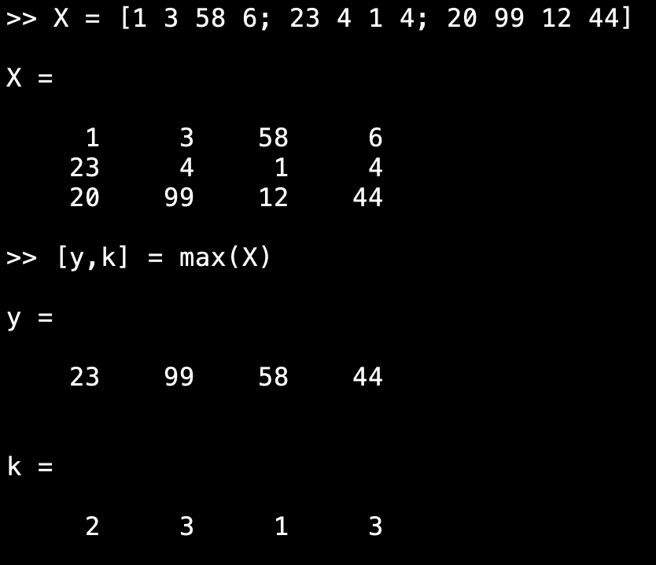

+ **mean()** 平均值
+ **median()** 中值
+ **sort()** 排序
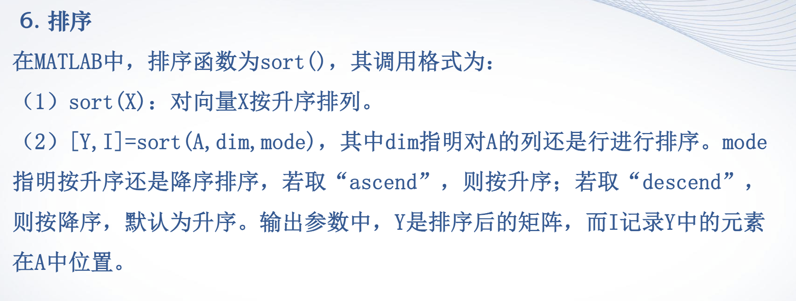

# 数据差值
+ ### 就是把数据点拟合成连续的曲线
  + 四种拟合方法：
  1.**linear**:点间直线连接数据点
  2.**nearest**:横线竖线直线连接
  3.**pchip**
  4.**spline**
  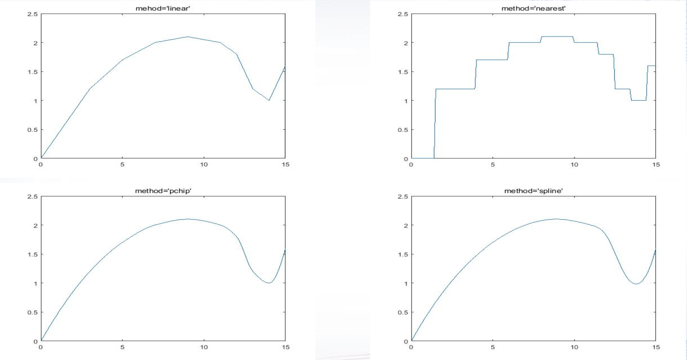
---
  + ## 步骤：
  **1.样本点录入**
  **2.自变量的细化**
  **3.引用interp1/interp2函数拟合因变量**
  **4.制图**
---
+ ### 二维拟合interp1
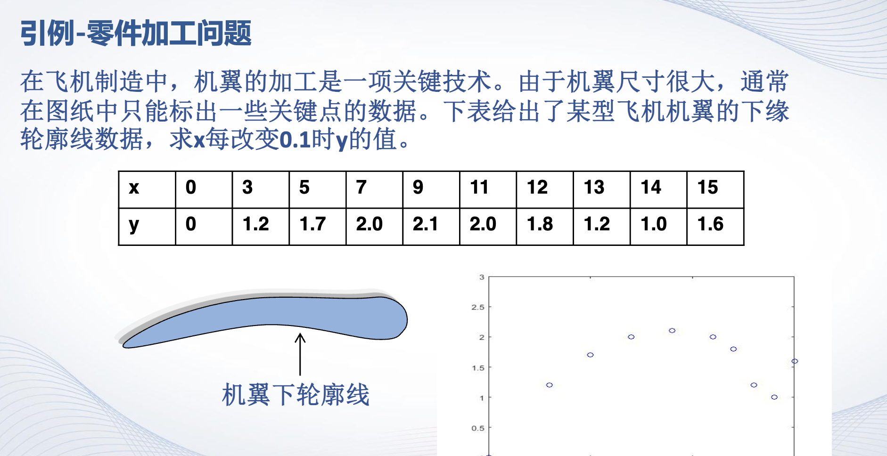
>>> x = [0,3,5,7,9,11,12,13,14,15];
>> y = [0,1.2,1.7,2.0,2.1,2.0,1.8,1.2,1.0,1.6];
x1 = 0 : 0.1 : 15;
y1 = interp1(x,y,x1,'spline');
>> plot(x1,y1)

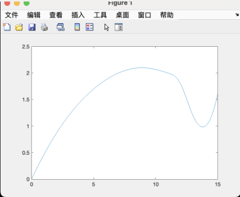

---
+ ### 三维拟合interp2
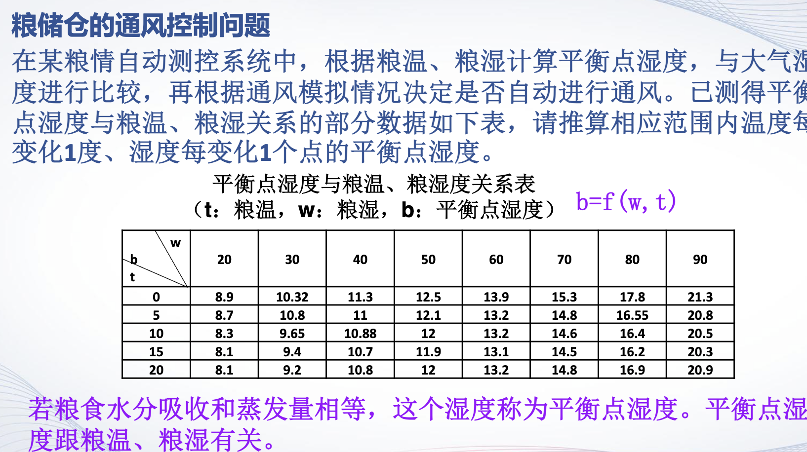
>x = 20 : 10 : 90;
y = (0 : 5 : 20)';  %**注意列向量的表达**
z = [8.9,10.32,11.3,12.5,13.9,15.3,17.8,21.3;8.7,10.8,11,12.1,13.2,14.8,16.55,20.8;8.3,9.65,10.88,12,13.2,14.6,16.4,20.5;8.1,9.4,10.7,11.9,13.1,14.5,16.2,20.3;8.1,9.2,10.8,12,13.2,14.8,16.9,20.9];
x1 = 20 : 90;
y1 = (0 : 20)';
z1 = interp2(x,y,z,x1,y1,'spline');
surf(x1,y1,z1);

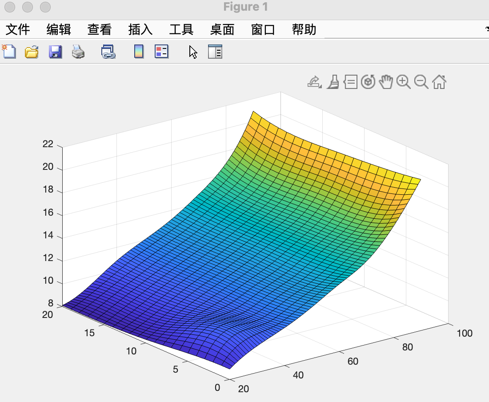

# 数据差值和拟合函数：
+ ##### 首先，数据插值和曲线拟合在实现方法上有明显的不同。数据插值要求逼近函数经过样本点，即插值函数必须通过已知的数据点。而曲线拟合并不要求逼近函数必须经过样本点，它的主要目标是使总体误差最小。
+ ##### 其次，从结果形式上看，数据插值往往采用分段逼近的方式，没有统一的逼近函数。而曲线拟合则是用一个函数进行整体逼近，具有确定的函数表达式。

# polyfit(X,Y,m)拟合生成函数
>p = polyfit(X,Y,m);

+ X是样本点横坐标
+ Y纵坐标
+ m是要拟合的函数的因变量(x)最高次数
+ p是行向量，记录生成的拟合函数各项系数，共有n+1个数
>p = [3 2 1]; // **拟合函数为y = 3x^2 + 2x^1 + 1**
---
# polyval(p,x)
+ ## 计算p拟合函数在x处的值
---
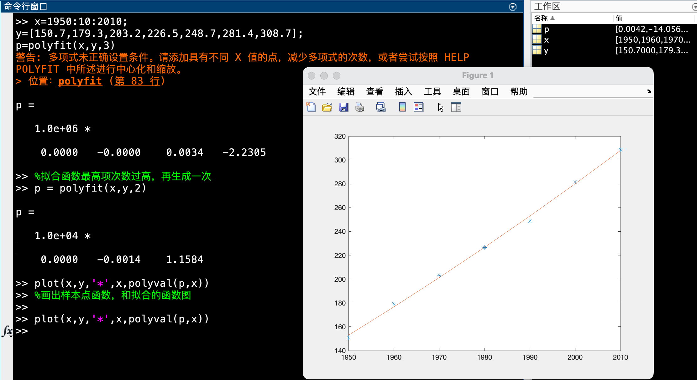