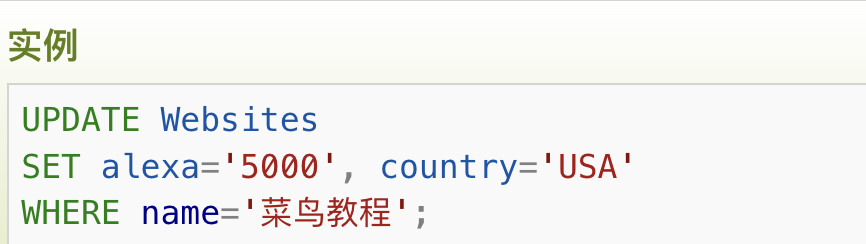

# 创建数据库
>**CREATE TABLE** Persons
+ 属性例如 varchar、integer、decimal、date
>(
PersonID int,
LastName varchar(255),
FirstName varchar(255),
Address varchar(255),
City varchar(255)
);


# SELECT

> SELECT * FROM （表名）

>SELECT * FROM （表名）WHERE (条件)

>SELECT * FROM （表名）WHERE (条件1) AND/OR (条件2)
---

### 显示前n项
>SELECT (属性)
FROM (表名)
**LIMIT** n;
---
### 模式搜素
>SELECT * FROM (表名)
WHERE (属性) **LIKE(包含) / NOT LIKE(不包含)** ('pattern')

+ pattern:
    + 'G%' G开头
    + '%G' G结尾
    + '%Gg%' 包含Gg
    

    + '_oogle'  
    

---
### IN 多值筛选
>SELECT 属性1, 属性2, ...
FROM （表名）
WHERE (属性) **IN** (value1, value2, ...);
---

### BETWEEN 区间搜索
+ 常量
>SELECT 属性1, 属性2, ...
FROM （表名）
WHERE (属性) **BETWEEN** a **AND** b;
+ 日期
>WHERE date **BETWEEN** '2016-05-10' **AND** '2016-05-14';
---
+ SELECT **DISTINCT**   //单独项


# 升序/降序 ASC/DESC
>**OEDER BY ASC/DESC**ax


# INSERT插入
+ 插入一行记录
> **INSERT INTO** (表名) （列1,列2,……）
**VALUES** （值1,值2,……）


# UPDATE 修改
> **UPDATE** (表名)
**SET** (属性 = '修改值')
**WHERE** (主键 = 要修改那一行的值)



# DELETE 删除
>**DELETE** (表名)
WHERE (……)


# AS 取别名
+ ### 列(select处取别名)
>SELECT (属性) **AS** (别名)
FROM (表名)
---
+ ### 表(from处取别名)
以用两个表的属性生成一张新表为例子
> SELECT a.属性1, a.属性2, b.属性1，...
FROM (表名1) **AS** a, (表名2) **AS** b
WHERE ...
---
# 合并两张表(外链接)
>A inner join B 取交集。    //内连接
A left join B 取 A 全部，B 没有对应的值为 null。
A right join B 取 B 全部 A 没有对应的值为 null。
A full outer join B 取并集，彼此没有对应的值为 null。
对应条件在 on 后面填写。

+ ### INNER JOIN  (= JOIN)

---
+ ### LEFT JOIN (左表记录全部返回来生成表)
>SELECT Websites.name, access_log.count, access_log.date


>FROM Websites
**LEFT JOIN** access_log
ON Websites.id=access_log.site_id
ORDER BY access_log.count DESC;


---
+ ### FULL OUTER JOIN

# GROUP BY  分组
+ 按照site_id分组(这个属性值相等的放在一组)，每组的count求和，在新表中作为nums属性展示。HAVING表示按条件展示，不能用WHERE和ON
>SELECT site_id, SUM(access_log.count) AS nums
FROM 表名 
**GROUP BY** site_id
**HAVING** SUM(access_log.count) > 200;
---
# ALTER/DROP 添加/删除列


# CONSTRAINT 约束条件
---
### NOT NULL 不能为空
+ 在创建表时添加约束：
>CREATE TABLE Persons (
    ID int **NOT NULL**,
    LastName varchar(255) NOT NULL,
    FirstName varchar(255) NOT NULL,
    Age int
);

+ 创建表后添加约束条件：
>**ALTER TABLE** Persons
**MODIFY** Age int **NOT NULL**;

---
### UNIQUE 不能重复
+ 创建表时：
    + 单一属性赋值：
    >CREATE TABLE Persons
    (
    P_Id int NOT NULL **UNIQUE**,
    ...
    )

    + 多个属性赋值
    >CREATE TABLE Persons
    (
    P_Id int NOT NULL,
    LastName varchar(255) NOT NULL,
    FirstName varchar(255),
    Address varchar(255),
    City varchar(255),
    **//给这个UNIQUE的限制关系取名uc_PersonID,目标是括号里面的全部属性
    CONSTRAINT uc_PersonID UNIQUE (P_Id,LastName)**
    )

+ 创建表之后：
    + 单一属性添加：
    >**ALTER TABLE** Persons
    **ADD UNIQUE** (P_Id)   //添加
    

    + 多个属性：
    > **ALTER TABLE Persons**
    **ADD CONSTRAINT uc_PersonID UNIQUE (P_Id,LastName)**

+ 删除:
> ALTER TABLE Persons
**DROP CONSTRAINT uc_PersonID**

### PRIMARY KEY (非空、唯一)
+ 代表属性不能为空，且值必须唯一
### (语法同上)
---
### FOREIGN KEY

P_id在Persons表中是PREMARY KEY键，在Orders中是外键。
+ FOREIGN KEY定义在子表中，子表中的外键（值可以重复），映射到父表到超键上（必须唯一且非空）。
在子表中定义:

>CREATE TABLE Orders
(
O_Id int NOT NULL PRIMARY KEY,
OrderNo int NOT NULL,
P_Id int **FOREIGN KEY REFERENCES** Persons(P_Id)
//**子表属性 FOREIGN KEY REFERENCES 子表名（子表属性）**
)

---
# CHECK数值约束
+ 要求 P_id的值大于0:
>CREATE TABLE Persons
(
P_Id int NOT NULL,
LastName varchar(255) NOT NULL,
FirstName varchar(255),
Address varchar(255),
City varchar(255),
**CHECK (P_Id>0)**
)
---------------
---------
----------
+ **脏读（Dirty Read）通常描述的是：一个事务读取了另一个尚未提交的事务的修改。**

+ **幻读（Phantom Read）是数据库事务中的一个概念，主要发生在可重复读隔离级别或读提交之下。当一个事务读取了与某些搜索条件相匹配的若干行后，另一个并发事务插入或删除了一些行，并提交了这些修改。然后，当第一个事务再次查询相同的范围时，它可能会发现多了一些原本不存在的记录或者少了一些原本存在的记录，就好像发生了幻觉一样，因此得名幻读。**

# **隔离级别**
SET TRANSACTION 确实用于设置事务的隔离级别。InnoDB 存储引擎为事务提供了四种隔离级别，它们分别是：

+ **READ UNCOMMITTED**（未提交读）：也称为脏读。在此隔离级别下，一个事务可以读取到另一个事务尚未提交的数据。这可能导致数据的不一致性和其他问题。
---
+ **READ COMMITTED**（读已提交）：在这种隔离级别下，一个事务只能读取到另一个事务已经提交的数据。这可以避免脏读的问题，但可能导致不可重复读和幻读。
---
+ **REPEATABLE READ**（可重复读）：这是MySQL的默认隔离级别（在InnoDB存储引擎中）。在此级别下，同一个事务内的多次读取会看到相同的数据行，即使其他事务在此期间修改了这些数据并提交了修改。这有助于确保数据的可预测性和一致性，但也可能导致幻读。即在一个事务中，第一次查询某条记录时没有发现，但在试图更新或再次查询时，该记录却神奇地出现了。

---
+ **SERIALIZABLE**（可序列化）：这是最高的事务隔离级别。在此级别下，事务是串行执行的，从而避免了脏读、不可重复读和幻读的问题。但这也可能导致性能下降，因为事务需要等待其他事务完成才能执行。
---


> mysql> use RUNOOB;
Database changed
mysql> CREATE TABLE runoob_transaction_test( id int(5)) engine=innodb;  # 创建数据表
Query OK, 0 rows affected (0.04 sec) 
mysql> select * from runoob_transaction_test;
Empty set (0.01 sec)
mysql> begin;  # **开始事务**
Query OK, 0 rows affected (0.00 sec)
mysql> insert into runoob_transaction_test value(5);
Query OK, 1 rows affected (0.01 sec)
mysql> insert into runoob_transaction_test value(6);
Query OK, 1 rows affected (0.00 sec)
mysql> commit; # **提交事务**
Query OK, 0 rows affected (0.01 sec)
mysql>  select * from runoob_transaction_test;
+------+
| id   |
+------+
| 5    |
| 6    |
+------+
2 rows in set (0.01 sec)
mysql> begin;    # **开始事务**
Query OK, 0 rows affected (0.00 sec)
mysql>  insert into runoob_transaction_test values(7);
Query OK, 1 rows affected (0.00 sec)
mysql> rollback;   # **回滚**
Query OK, 0 rows affected (0.00 sec)
mysql>   select * from runoob_transaction_test;   # 因为回滚所以数据没有插入
+------+
| id   |
+------+
| 5    |
| 6    |
+------+
2 rows in set (0.01 sec)
mysql>

### 简单说，隔离级别是限制读取数据，锁是限制修改数据
  + **隔离级别决定了事务在并发执行时对其他事务的可见性和影响程度。Oracle支持多种事务隔离级别，包括READ UNCOMMITTED（读未提交）、READ COMMITTED（读已提交）、REPEATABLE READ（可重复读）和SERIALIZABLE（串行）。这些隔离级别在防止脏读、不可重复读和幻读等问题上提供了不同程度的保护。**
   + **锁是Oracle用于管理共享资源并发访问的机制，以确保多用户环境下数据库的一致性和完整性。当多个事务试图同时访问或修改同一数据时，锁可以防止它们之间的冲突和不一致。Oracle中的锁可以是共享锁或排他锁，并且数据库会根据需要自动添加和释放锁。**

# **锁**
+ 这些锁用于确保事务的并发执行时数据的一致性和完整性。其中一些常见的锁包括：

+ **共享锁（Shared Locks）**：也称为读锁，允许多个事务同时读取同一资源。
+ **排他锁（Exclusive Locks）**：也称为写锁，防止其他事务读取或修改已锁定的资源。
+ **记录锁（Record Locks）**：锁定单个行记录。
+ **间隙锁（Gap Locks）**：锁定一个范围，但不包括记录本身。
+ **临键锁（Next-key Locks）**：是记录锁和间隙锁的结合，锁定一个范围，并包括记录本身。
---
+ 1.首先，确保您的MySQL数据库使用的是InnoDB存储引擎，并创建一个简单的表来演示锁的用法：
>CREATE TABLE example_table (  
    id INT PRIMARY KEY,  
    name VARCHAR(255)  
) ENGINE=InnoDB;  
INSERT INTO example_table (id, name) VALUES (1, 'Alice');  
INSERT INTO example_table (id, name) VALUES (2, 'Bob');  
INSERT INTO example_table (id, name) VALUES (3, 'Charlie');
+ 2.共享锁示例：
>START TRANSACTION;  
**SELECT * FROM example_table WHERE id = 2 FOR UPDATE;
-- 此时其他事务可以读取，但不能修改或删除id=2的行，直到当前事务结束**
UPDATE example_table SET name = 'Robert' WHERE id = 2;  
COMMIT;
+ 3.排他锁示例：
>START TRANSACTION;  
**SELECT * FROM example_table WHERE id = 2 FOR UPDATE;  
-- 此时其他事务不能读取、修改或删除id=2的行，直到当前事务结束。**  
UPDATE example_table SET name = 'Robert' WHERE id = 2;  
COMMIT;

# 视图

>sqlite> **CREATE VIEW COMPANY_VIEW AS**
SELECT ID, NAME, AGE
FROM  COMPANY;

+ 后续查询这个视图的时候：


+ 删除视图：
>DROP VIEW 视图名字


```sql
SELECT * 
FROM student
WHERE grade > （SELECT AVG(grade) FROM student 
GROUP BY s_classname
HAVING s_classname = '国贸 081‘）
AND s_classname = '国贸 081‘
ORDER BY DESC;
```

```sql
SELECT *
FROM student
WHERE elective = '面向对象程序设计'
AND final_exam >= 70;
```

```sql
SELECT 论文题目，期刊名
FROM paper
WHERE 期刊级别 = '国内A';
```

使用子查询查找在employees表中薪水高于平均薪水的员工姓名，SQL语句是_______。
```sql
SELECT e.name
FROM employees e
WHERE e.salary > (SELECT AVG(salary) FROM employees)
```

数据库规范化主要是为了解决什么问题？
A. 数据冗余和数据异常
B. 数据安全和并发控制
C. 数据插入和删除的速度
**D. 数据查询的复杂性**

下列哪个不属于数据库规范化的优点？
A. 减少数据冗余
B. 提高数据一致性
C. 简化数据库设计
**D. 加快数据查询速度**

规范化过程中，可能会引入更多的**表连接操作**，这可能会影响到查询性能


CREATE OR REPLACE EUNCTION £1 （n in emp.deptnosTYPE） RETURN NUMBER S
IS
v_ count NUMBER;
BEGIN
SELECT COUNT (* ) INTO _count FROM emp WHERE deptno=n;
每女都苷的
RETURN v_count;
END;
1ES11
/
（2）
DECLARE
a NUMBER;
BEGIN
a: = f1 (10) ;
DBMS_OUTPUT. PUT
'_LINE（'该部门员工人数为：'Ila）；
END;
/