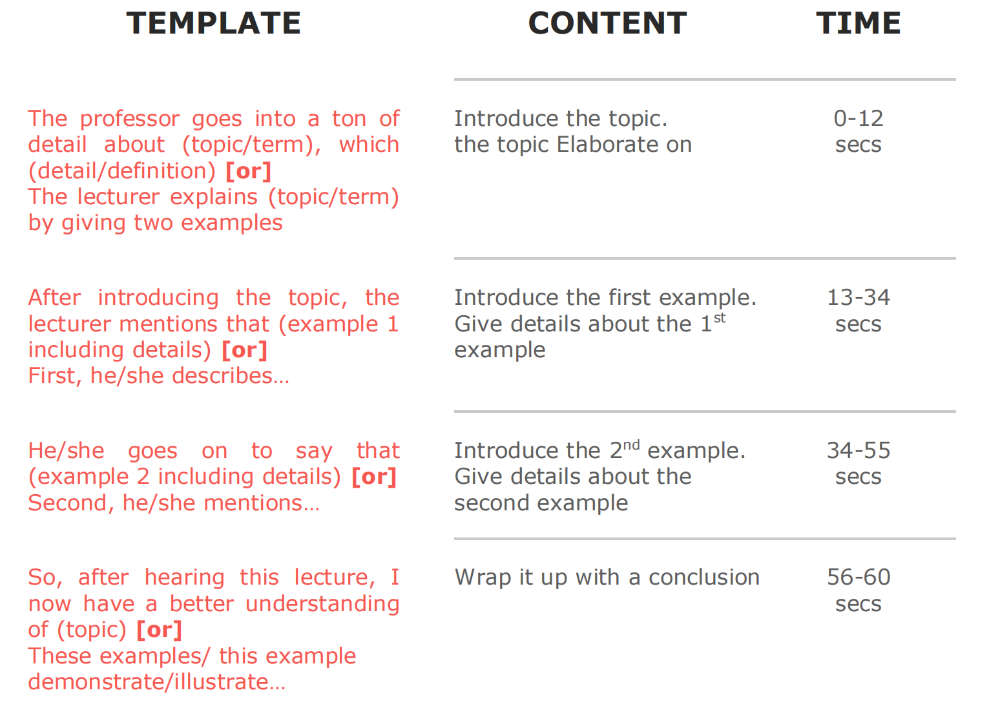
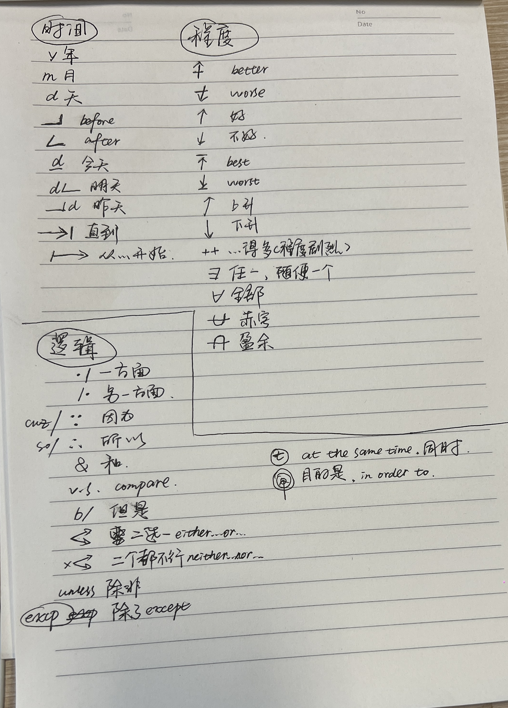

test test

# Q1
## 备考思路：不需要写稿纸。回答结构：同意/不同意——论点1（大）——论点2（小）。根据描绘==事实/理由-原因-后续后果==三个步骤展开一个论点。

+ ==个人/社会==
    + ==个人的物质/精神(幸福感，面对困难更加自信)==
    
+ ==收费/不收费==

+ ==经济/文化/政治/道德==

**Personally speaking, I definitely think that**
all high school students should wear school uniforms 
**because** people will judge each other on their character rather than their clothing.

**I remember when I was** in elementary school, we had the freedom to choose out clothing. 
I always wore sweatpants because they were really comfortable, while almost everyone else in school wore jeans. 
Other kids in the class made fun of my attire daily.

**On top of that**, uniforms bring people closer together.

**For example,** I live in Japan now, and high school students are required to wear school uniforms. 
It is easy for them to spot their friends on the train and look out for each other on the street in case of danger. 
This would not be possible if they wore plain clothes and blended in with the rest of the population.

## 1 
Some college students choose to take courses in a variety of subject areas in order to get a broad education. Others choose to focus on a single subject area in order to have a deeper understanding of that area. Which approach to course selection do you think is better for students and why?

->
--
broad
    society -> flexible peoplr
    personal -> choices

## 2
Some students prefer to work on class assignments by themselves. Others believe it is better to work in a group. Which do you prefer? Explain why.

->
--
self
free ->what/when to do
self-learning ability

## 3
Many universities now offer academic courses over the Internet. However, some people still prefer learning in traditional classrooms. Which do you think is better? Explain why.

->
--
traditional
convenient->both teacher and stu
if...

---

# Q2
+ 做题要义：
    1.审题：先导语出来时，可以先记录(letter/policy);
    2.用一个短语概括阅读主题(the reading passage is about schedule changes for stoping evening learning)
    3.审两个理由，==一次性把文章看完再记！== 一般在passage后半段，前半段都是寒暄

---
+ **The reading passage is a anouncement/policy about** campus policy. 

**In particular, it mentions that** the school should hire more professional librarians to assist the busy library.

+ **The man in the conversation agrees this idea.**

==says that完整 + if假设==
(Say/if)
**To start, he says that** the library only gets backed up for an hour or so right after classes, and the rest of the time it is empty. **He argues that** if students could wait until later, they could get help easily without causing the librarians to fall behind.

==refutes assertion(短文) + 反驳(In fact, believes that)==
(R/InF,be)
**Secondly, he explains that he disagrees with the assertion that** student workers in the library don't know what they're doing. **In fact, he believes that** some of them know more than the librarians. **He shares an instance where** a student worker helped him find and print something online when the librarian was unable to do that.

+ **As you can see, the man in the listening disagrees clearly with this perspective.**

---

# Q3
## 思路：开头直接记主题词，直接飞速略读直接找到定义，慢读理解概念，飞速读完后续文章再记录定义（记录词语即可，答题时连点成面）

**sth is a concept that ...**
**The reading passage goes into detail about** mimicry, **which is** when oneanimal will try to copy some aspect of another animal to survive. 

**1.He gives us 2 examples to explain that.**
**2.The prefosseor provides us with his personal experience.**
*3. The professor gives us a example about this that*

**At first**,the lecturer talks about the king snake. Now, this snake isn’t poisonous,but it knows how to change its skin to red, so it looks like a coral snake,which is poisonous. 

**The professor also mentions** the drongo bird, whichhas learned to mimic the sound of other birds. 
So, after these otherbirds have killed some prey, the drongo bird will start copying theiralarm sound, signaling that predators are nearby. The birds soon flyaway, and the drongo bird enjoys a free meal. 

==最后一定要讲明how主题在例子中 works==

# Q4

==最后一定要讲明how主题在例子中 works==

积极的态度词：

positive：肯定的、积极的。
favorable：赞成的、良好的。
enthusiasm：热心、积极性。
supportive：支持的、支援的。
approval：赞成、承认。
compromising：妥协的、折衷的。
confident：自信的、确信的。
interested：感兴趣的、有成见的。
impressive：给人深刻印象的、感人的。
消极的态度词：

negative：否定的、消极的。
indifferent：漠不关心的。
depressed：消沉的。
pessimistic：悲观的。
unconcerned：不关心的。
contemptuous：轻蔑的、侮辱的。
hostile：敌对的、敌方的。
biased：片面的。
中立的态度词：

objective：客观的。
neutral：中立的。
impartial：公平的、不偏不倚的。
disinterested：无私的。
unprejudiced：没有偏见的。
detached：不含个人偏见的。
factual：事实的、实际的。
主观的态度词：

subjective：主观的、个人的。
tolerance：宽容、容忍、忍受。
pessimism：悲观、悲观主义。
gloomy：黑暗的、阴沉的。
optimistic：乐观的。
sensitive：有感觉的、敏感的。
scared：恐惧的。
reserved：保留的、包租的。
radical：激进的。
moderate：中等的、适度的。
mild：温和的、温柔的。
ironic：说反话的、讽刺的。
amazed：吃惊的、惊奇的。
concerned：关心的、有关的。
apprehensive：担忧、担心。
其他的态度词：

mixed：喜忧参半的。
biased：有偏见的。
indignant：愤怒的、愤慨的。
puzzling：使迷惑的、使莫明其妙的。
question：质疑。
doubtful：可疑的、不确的、疑心的。
suspicious：可疑的、怀疑的。
puzzled：困惑的、烦恼的。

# Writing
## 10mins
### 
+ 思路1（高分）:跟speaking task1一样的思路，描绘事实——原因——后续后果，第二点相处一个论点即可，想不出来不要紧，写到时候一般都会有思路了。

+ 思路2（保分）: 这种较为容易，不同之处在第二个论点是反驳反方，找出对方的不足之处(while Paul argued that free public transpotation makes it accessible to everyone, he overlooks the fact that...)

+ ==I strongly believed that...Kelly made an excellent point that(总结他的观点)==
+ ==Additionally, I would like to emphasize that...(自己的新观点)==
    + 观点 + 原因 + 后续后果
    + 观点 + 原因解释（具像化场景）
    + 观点 + 假设 **If...we could..rather than...**
    + 观点 + 对比 **By contrast...**
+ ==...arugued that......, he overlooks the fact that...==
+ ==In conclusion, I definately think that...==

poverty alleviation 扶贫
Disaster Prevention 灾害防治
innovation and entrepreneurship 创新创业
healthcare and nutrition 健康养生

carbon neutralization 碳中和
cyberscurity 网络安全
Greater Bay Area 大湾区
Anti-corruption campaign 反腐败运动

rural rivitalizaion strategy 乡村振兴战略
social security 社会保障
faculty/facility

## 20mins
+ 40s左右记录首段基本信息（可以写出写作首段的程度）， 细读每段开始读第一段（剩2:10左右），第二段（剩1:30左右），第三段（剩0:45左右）

**The reading passage proposes three agruements about** incentive programs that reward employees for chieving certain health-related goals, **while the prefosser in the listening material completely refutes the passage.**

**Firstly, the article states that** incentive program help emplyees to healthy lifestyle because it offers them extra motivation such as rewards. **Nonetheless, the prefessor assert that** incentive program only has less motivation. The research mentioned by writter is immediate result, while in long term studies, the participants were likely to go back to their habits, such as smoking or regaining lost weight.

**Secondly, the passage suggests that** it is fair to those employees who are will to adopt healthier lifestyle. **But the lecturer presents counterarguements. The lecturer questions whether** it is fair for these individuals to pay higher health insurance fees or receive fewer vacation days. For instance, some individuals do not have time to maintain a healthy life bucause they are busy with family stuffs, or they may get fat due to their genetic reason.

**Thirdly, the passage explains how** incentive progame is beneficial for company in a long preriod of time, which will be a loss if the employees are sick. **On the contrast, the professor oppose that** this stradegy take long time to manifest its benefits such as for years, but it is less possible that employees will stay in a company.

“指出”
claim,state, mention, point out, argue, discuss, illustrate,demonstrate ,examine, hold, raise the issue that，investigate

反对
challenge , oppose, refute ,deny,disagree with,conflict with, differ from, cast doubt on， retort

支持 
strongly holds /think ,support, uphold 
