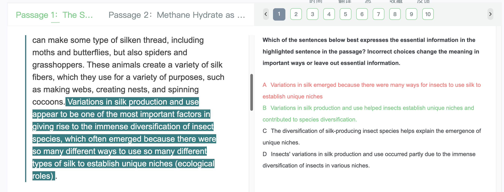

# 1
## 1
The highly productive level at which living material is generated is due largely to the rapid current. This prevents the development of a layer of nutrient- and carbon dioxide-depleted water that would otherwise build up around the plants, as they absorb nutrients and use carbon dioxide for photosynthesis. Such a layer would reduce photosynthesis."分析句子结构并翻译句子

## 2
首先，分析句子的结构：
这是一个复合句，主句是：This prevents the development of a layer of nutrient- and carbon dioxide-depleted water。
主干是：This（主语）+ prevents（谓语）+ the development（宾语），使用了一般现在时，表示“这阻止了…的发展”；
of a layer of nutrient- and carbon dioxide-depleted water是介词短语作定语，修饰the development，表示“一层营养和二氧化碳耗尽的水的发展”；
that would otherwise build up around the plants是定语从句，修饰限定先行词water，使用了虚拟语气，表示“否则会在植物周围积聚”；
as they absorb nutrients and use carbon dioxide for photosynthesis是原因状语从句，解释why a layer would build up around the plants，表示“因为它们吸收养分并利用二氧化碳进行光合作用”；
Such a layer would reduce photosynthesis是主句的结果状语从句，表示“这样的一层水会减少光合作用”。
再来逐句翻译：
The highly productive level at which living material is generated is due largely to the rapid current.
这句可以翻译为：生物物质的高生产率在很大程度上是由于快速的水流。
This prevents the development of a layer of nutrient- and carbon dioxide-depleted water that would otherwise build up around the plants, as they absorb nutrients and use carbon dioxide for photosynthesis.
这句可以翻译为：这阻止了营养和二氧化碳耗尽的水层在植物周围的发展，否则这些水层会在植物吸收养分并利用二氧化碳进行光合作用时积聚起来。
Such a layer would reduce photosynthesis.
这句可以翻译为：这样的一层水会减少光合作用。
最后，将这三句组合起来：
生物物质的高生产率在很大程度上是由于快速的水流。这阻止了营养和二氧化碳耗尽的水层在植物周围的发展，否则这些水层会在植物吸收养分并利用二氧化碳进行光合作用时积聚起来，而这样的一层水会减少光合作用。

# 2
Their function seems to have been to supply arms and equipment for soldiers to buy using the produce of their farms. The goods brought in from the countryside could then be further sold into the regional market system.
+ produce n.农产品；（尤指某人工作或努力的）成果，结果

# 3
I think element is probably best exemplified in the way he portrayed his Subjects as stretched out

我认为最能举例说明这一点的是他把他的主题描绘成伸展的样子

# 4
we can't sell enough advertisements to break even.

我们不能卖出足够的广告来达到收支平衡

# 5音乐
## 1
but the 19th century is important because it's all the rise of an ongoing and growing fascination with the virtuoso. 

## 2
large concert halls filled with the general public became the prime performance venue. Musicians no longer depended on the patronage of just a few wealthy aristocrats

## 3
 he was famous enough that reports of his playing appeared as far away as Germany.
 apeared是reports的过去式

## 4
 He even had a violin physically altered to make it easier to get the effects he was after.

 ————the word “after” means “seeking” or “trying to achieve.”

## 5
Paganini sort of set the stage and the standard for an ongoing cult of virtuosity.
他在某种程度上为持续不断的精湛技艺崇拜设定了舞台和标准

## 6
But as critics have long pointed out, from an artistic standpoint, they're nothing special.

## 7第二篇

here’s a recent study that sheds some light on what you’ve experienced.

## 8
And the study examined **(/ɪɡˈzæmɪnd/)** whether or not four different composers took this into account when they wrote their operas.

+ their 美/ðer; ðər/

这项研究调查了四位不同的作曲家在创作歌剧时是否考虑到了这一点。

## 9
while other composers wrote repetitive passages to rehash the plot.

+ repetitive /rɪˈpetətɪv/

## 10
Some vowel sounds depend largely on how open your jaw is.

## 11
soprano女高音 /səˈprænoʊ/
vowel pich matching元音高音匹配

## 12第三篇 meledy and rhythm
That's certainly a long standing assumption. And it does seem intuitive

这当然是一个长期存在的假设。这看起来很直观

## 13
Tumbling strains are one of the oldest melody patterns

+ tumble v.
跌倒，滚落；倒塌，坍塌

+ strain
n.
损伤，扭伤；==旋律，曲调；==
v.
拉伤，扭伤；

而其他作曲家则写了重复的段落来重复情节。
# 6概括句子意思

**Variations in silk production and use appear to be one of the most important factors in giving rise to the immense diversification of insect species, which often emerged because there were so many different ways to use so many different types of silk to establish unique niches (ecological roles).**

Which of the sentences below best expresses the essential information in the highlighted sentence in the passage? Incorrect choices change the meaning in important ways or leave out essential information.

A.Variations in silk emerged because there were many ways for insects to use silk to establish unique niches
B.Variations in silk production and use helped insects establish unique niches and contributed to species diversification.
C.The diversification of silk-producing insect species helps explain the emergence of unique niches.
D.Insects' variations in silk production and use occurred partly due to the immense diversification of insects in various niches.
用中文给我解释选择哪一个答案

原句强调了**“蚕丝的生产和使用的多样性”**在昆虫物种的多样化中起到了关键作用，因为这些多样性帮助昆虫通过不同方式使用丝来建立独特的生态位。

各选项的意思如下：

	•	A选项： 表示因为有许多方式使用丝来建立独特的生态位，所以丝的多样性出现了。这改变了原句的因果关系，因此是不正确的。
	•	B选项： 表达了丝的生产和使用的多样性帮助昆虫建立独特的生态位，并且促进了物种的多样化。这是与原句意思最接近的，所以是正确答案。

which often emerged because there were so many different ways to use so many different types of silk to establish unique niches
==可以理解为(diversification of insect species often emerged because 建立的 unique niches)==
多种多样的丝的使用方式帮助昆虫适应不同的生态环境，进而促进了物种的多样化。

# 7to
One expert notes that after the Revolutionary War, Revere dominated silver teapot production, taking advantage of a return to popularity of a beverage that earlier symbolized a resistance to English taxes and the consumption of which had thus diminished immediately prior to and during the war.

这句话中的"to"用得是正确的。在这个语境中，"to"用作介词，表示一种象征意义上的关联或指向。句子的意思是，这种饮料（很可能是茶）之前因为象征对英国税收的抵抗而流行，但在战争前后因为抵制而消费量减少。战争结束后，随着这种饮料重新流行起来，Revere利用了这一点，主导了银茶壶的生产。

*举一反三：*
+ The artist gained fame for his paintings, taking advantage of a resurgence in popularity of landscapes that once symbolized a connection to nature and the desire to escape the urban chaos.
（这位艺术家因其风景画而成名，利用了风景画重新流行起来的优势，这些风景画曾象征着与自然的联系以及逃离城市混乱的愿望。）

+ The musician's new album topped the charts, capitalizing on a return to the simplicity of folk music that had been overshadowed by the complexity of modern compositions.
（这位音乐家的新专辑登上了排行榜榜首，利用了民间音乐重新流行起来的优势，这种音乐曾因现代音乐作品的复杂性而黯然失色。）

# 8艺术
## 1
Even during the economic depression of the 1930s. It was as if people liked that, his paintings showed life honestly.

## passage2 埃及陶瓷
###  1
it is mixed with several other ingredients, sodium, calcium, among others, and water.

### 2
actually working with the materials that the original artists had available, gives researchers such a different level of insight into the constraints those artists encountered,

真正使用原始美工所拥有的材料，能够让研究人员更深入地了解这些美工所遇到的限制

### 3
She switched up the ingredients she used and their amounts. She also played with how finally she ==ground== the ingredients.

+ ground 
v.研磨（grind 的过去式和过去分词形式）
adj.切碎的，磨碎的

她改变了她使用的原料和用量。她还玩了最后如何磨碎配料的游戏

## passage3 19世纪复合颜料
### 1
whether they fully grasped how something as seemingly simple as the type of paint changed things.

他们是否完全理解像颜料这种看似简单的东西是如何改变事物的。

+ “the type of”起到了强调作用，突出了油漆种类在改变事物过程中的重要性。

## passage3 20世纪的一位新欣艺术家
### 1
this was truly something that stood out as original, even among all the other new ideas of the era.

+ original adj.
新创作的，未发表的；独创的，新颖的；有独到见解的，有独创性的

### 2
(He also innovated in many other ways, **like his piece(像他的作品)**, one ton prop.)

### 3
snake was designed with a specific location in mind. In this case, a museum in Spain. The form and positioning of snake was meant to compliment the museum's unconventional architecture.

《蛇》是根据特定的地点设计的。在这个例子中，是西班牙的一个博物馆。蛇的形式和定位是为了赞美博物馆的非传统建筑。

+ in mind 出于特定考虑的

# 9
## 1
The opposite turned out to be true, unfortunately.
不幸的是，事实恰恰相反。

## 2
thickets of stunted trees
一丛丛发育不良的树

# 10
The large number of rich Persian merchants is suggested by the fact that the proverbial phrase "a poor Persian"was used by some Chinese to indicate an inherent contradiction. 

大量富有的波斯商人是由以下事实所暗示的：谚语“一个贫穷的波斯人”被一些中国人用来表示内在的矛盾。

+ 意思是为了突出矛盾把穷和波斯人（富）说成一个有意思的谚语

# 10
## 1
Let's back up a retail clothing store for young people

## 2
Maybe you were a little premature in drawing up your plans before you thought through these other aspects.

## 3
Keep in mind that the consistency of chain store their familiarity is a big part of their appeal

# 11
## 1
so it wasn't surprising for a baseball poem to be met with shouts of approval and applause

## 2
the more well known the poem became, the more Thayer wanted to disown it.

disown vt. 否认；脱离关系

# 12
## 1
actually see crops being grown indoors under artificial light in these tall stacks

## 2
I heard that the building had previously housed a steel supply company.

+ housed adj. 封装的

## 3
building sat rusting for years until the agricultural company repurposed it.

# 13
## 1
What exactly do you mean by crafted to create an impression?

## 2
hammer out a political compromise or some business transaction.
敲定一个政治妥协或一些商业交易。

## 3
you're saying they had a dual purpose?

## 4
one of the rooms typically found in a palace

+ typically adv.
典型地，有代表性地；一般，通常；一向如此地，不出所料地

## 5
It was exquisitely crafted