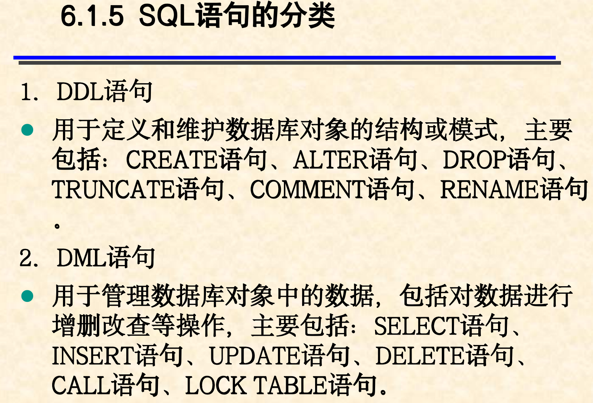
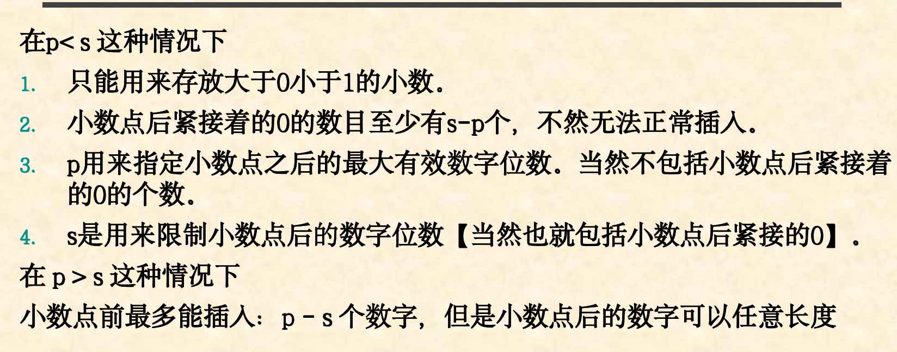
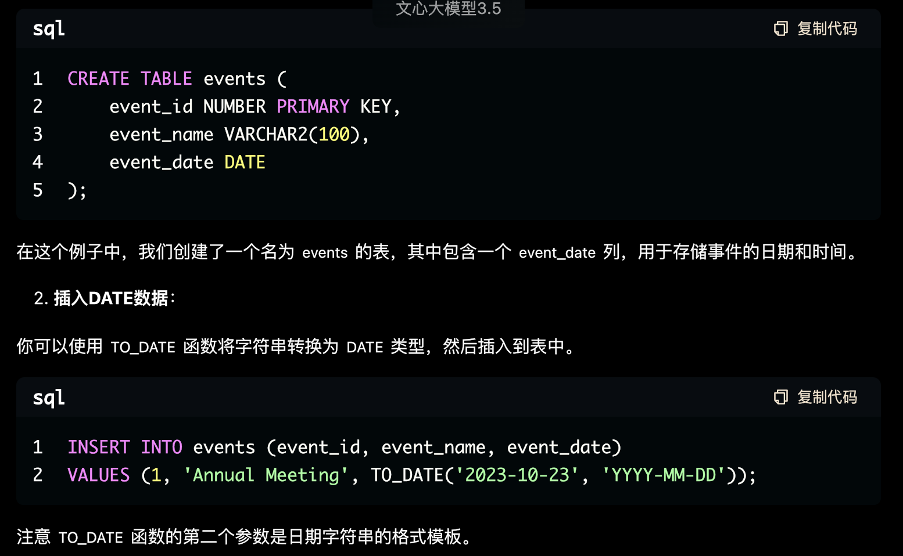
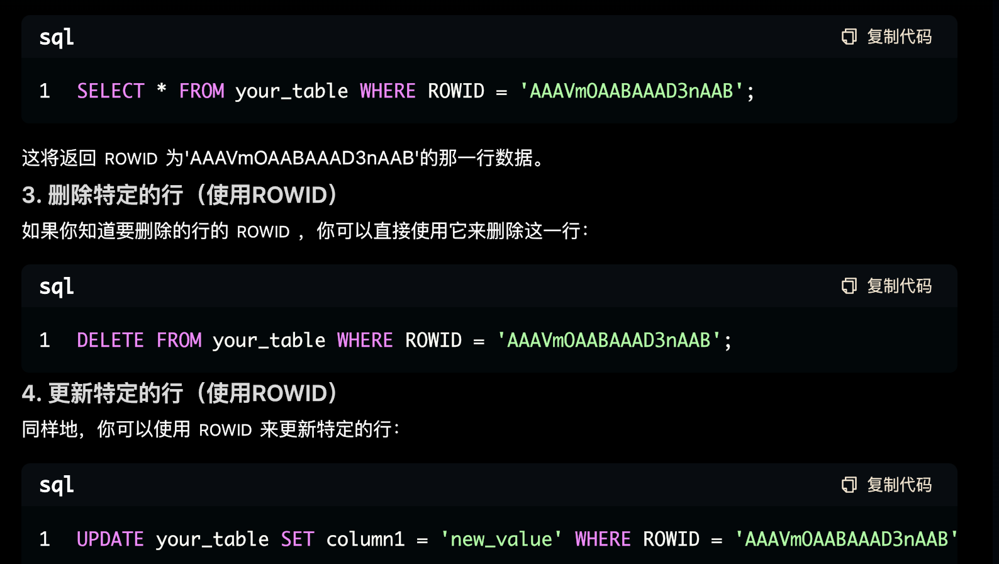
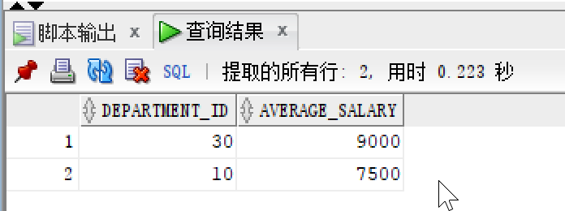
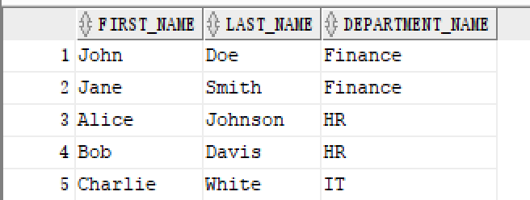
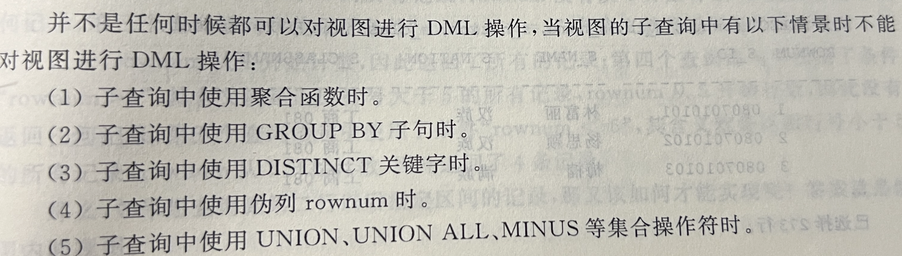
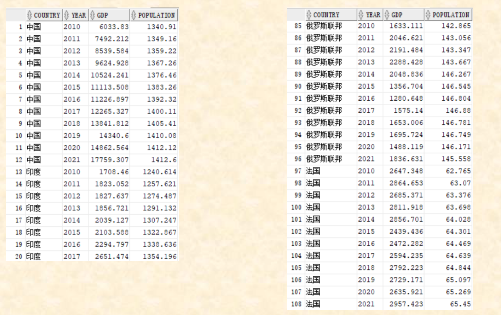
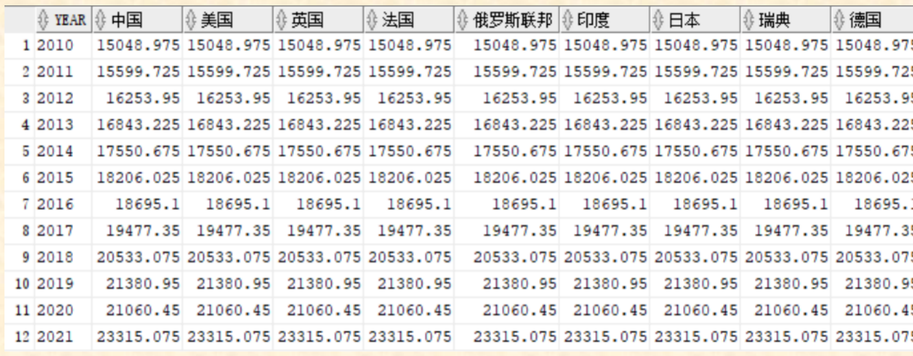

# DBS
DBS：Database System（数据库系统）的缩写。它是指带有数据库并利用数据库技术进行数据管理的计算机系统，是由数据库、数据库管理系统（DBMS）、数据库管理员（DBA）、数据库应用系统（DBAS）、最终用户等组成的系统。
# DDL/DML
+ **空值即一个不确定的值**
+ 空值与任何值比较结果都是False
+ 可以用IS NULL/IS NOT NULL来判断是否为空值
+ 空值和其他字符连接还是其他字符穿
+ 空值和任何运算符结果都是空值
---

+ 字符型
>ProductName VARCHAR2(100)
+ 数值型
    + NUMBER(p,s)
    p 有效位数(最大38)
    s>0，保留小数点右边几位数
    s<0,保留小数点左边几位数
    s=0,整数
    
        >CREATE TABLE example_table (  
        id NUMBER PRIMARY KEY,  
        salary NUMBER(10, 2)  -- 最多10位数字，其中2位是小数  
        );

        在这个例子中，salary 列是一个 NUMBER 类型，它可以存储最多10位数字，其中最多2位是小数。

        

        NUMBER(5,10)小数点后至少有5个0，有效位数5位，保留到小数点后10位，
---

+ 
    + INTERVAL
    实质上是NUMBER(38,0)
---
+ DATE日期

TO_DATE('2023-10-23', 'YYYY-MM-DD')将字符串'2023-10-23'转换为DATE数据类型。
---
+ ROWID物理地址
    + 可以更快的的访问


---
+ 在Oracle数据库中，大对象（Large Object, LOB）类型用于存储大量的数据，这些数据可能超过普通数据类型的最大长度限制。Oracle提供了几种LOB类型，包括**CLOB（字符大对象）、BLOB（二进制大对象）、NCLOB**（国家字符集大对象，用于存储Unicode数据）和**BFILE**（二进制文件大对象，用于在数据库外部存储文件的引用）。

# 参照完整性(引用完整性)
+ **外键在子表（参照表）中，而在父表（被参照表）中是主键**

---
# 完整性约束

1. **非空（NOT NULL）约束**

```sql
CREATE TABLE students (  
    student_id NUMBER PRIMARY KEY,  
    student_name VARCHAR2(100) NOT NULL,  
    age NUMBER  
);
```
2. **唯一（UNIQUE）约束**
```sql
CREATE TABLE courses (  
    course_id NUMBER UNIQUE,  
    course_name VARCHAR2(100)  
);
```
3. **主键（PRIMARY KEY）约束**
主键约束确保某列或列组合中的值是唯一的，并且不能包含NULL值。主键用于唯一标识表中的每一行。

示例：在创建一个订单表时，将订单ID（order_id）列设置为主键。

```sql
CREATE TABLE orders (  
    order_id NUMBER PRIMARY KEY,  
    customer_id NUMBER,  
    order_date DATE  
);
```
4. **外键（FOREIGN KEY）约束**
外键约束用于维护两个表之间的引用完整性。它确保一个表中的数据与另一个表中的数据匹配。

示例：假设我们有一个学生表和一个选课表。选课表中的学生ID（student_id）列是一个外键，它引用学生表中的student_id列。

```sql
-- 创建学生表  
CREATE TABLE students (  
    student_id NUMBER PRIMARY KEY,  
    student_name VARCHAR2(100) NOT NULL  
);  
  
-- 创建选课表，并将student_id设置为外键  
CREATE TABLE course_enrollments (  
    enrollment_id NUMBER PRIMARY KEY,  
    student_id NUMBER REFERENCES students(student_id),  
    course_id NUMBER,  
    grade VARCHAR2(10)  
);
```
5. **检查（CHECK）约束**
检查约束用于限制列中的值范围或确保列中的数据满足特定的条件。

示例：在选课表中，我们可能希望确保学生的成绩（grade）在0到100之间。

```sql
ALTER TABLE course_enrollments ADD CONSTRAINT chk_grade CHECK (grade BETWEEN 0 AND 100);
```

# 用旧表创建新表
+ 所有列数据及其选中
> CREATE TABLE new_table
AS SELECT * FROM old_table


+ 所有列选中(不导入数据)
> CREATE TABLE new_table
AS SELECT * FROM old_table WHERE 0=1

# ALTER
+ 添加列
> ALTER TABLE employees ADD address VERCHAR2(100)

+ 添加约束
> ALTER TABLE employees ADD CONSTRAINT unique_email UNIQUE(email)
--为employees表的email列添加唯一性约束：

+ 修改约束
只能通过先删除后添加的方式实现
>ALTER TABLE employees DROP CONSTRAINT unique_email
ALTER TABLE employees ADD CONSTRAINT unique_email UNIQUE(email)

+ 重命名表或列
>ALTER TABLE employees RENAME TO staff
或者：
RENAME employees TO staff

>ALTER TABLE staff RENAME COLUME address TO location

+ Oracle的约束有四种状态：
**ENABLE、DISABLE、VALIDATE和NOVALIDATE**。默认情况下，约束是ENABLE和VALIDATE的。

    + DISABLE完全禁用了约束，不再对数据进行任何检查，并可能删除与约束相关的索引（如唯一性索引）。
    + NOVALIDATE保持约束启用状态，但不会对已存在的数据进行验证，与约束相关的索引（如果有的话）仍然存在。

    + **VALIDATE：检查现有数据是否符合约束条件，不影响约束的启用状态。**
    + **ENABLE：激活约束，使其对未来的数据操作生效。**
    *意思就是VALIDATE用于检查之前的数据是否合法，如果有不合法的数据，则会显示错误信息；ENABLE用来启用后规范之后的数据，之前的数据不管*

# INSERT INTO 表名(列1、列2……) VALUES(值1、值2……)
在Oracle的SQL中，INSERT语句用于向数据库表中插入新的记录。以下是INSERT语句的几种常见用法和示例：

1. 插入完整的行
```sql
-- 使用列名明确指定值  
INSERT INTO employees (id, name, age, salary)  
VALUES (1, 'John Doe', 30, 5000);  
  ```

2. 插入部分行
假设employees表中的id列是自增的，我们只需要为name, age, 和 salary这三列提供值。

```sql
INSERT INTO employees (name, age, salary)  
VALUES ('Bob Johnson', 35, 6000);
```
3. 插入多行

```sql
INSERT ALL  
  INTO employees (id, name, age, salary) VALUES (3, 'Alice Brown', 29, 5200)  
  INTO employees (id, name, age, salary) VALUES (4, 'David Lee', 32, 5800)  
SELECT * FROM dual;
```
注意：dual是一个伪表，用于在没有实际表的情况下选择数据。在这个例子中，它只是作为INSERT ALL语句的一个占位符。

4. 从其他表插入数据
你可以使用**INSERT INTO ... SELECT**语句从一个表中选择数据并插入到另一个表中。

    假设我们有一个名为temp_employees的临时表，其中包含一些要添加到employees表中的数据。

```sql
INSERT INTO employees (id, name, age, salary)  
SELECT temp_id, temp_name, temp_age, temp_salary FROM temp_employees;
```
# UPDATE 表名 SET(修改字句) WHERE 条件
1. 更新值
假设有一个名为employees的表，它有一个salary列，你想将ID为1的员工的薪水增加1000。

```sql
UPDATE employees  
SET name = 'John Doe Jr.', salary = salary + 1000  
WHERE id = 1;
```

2. 使用子查询更新值
假设你有一个名为bonuses的表，它记录了每个员工的奖金，你想将这些奖金加到employees表中的salary列上。

```sql
UPDATE employees e  
SET salary = salary + (SELECT bonus FROM bonuses b WHERE b.employee_id = e.id)  
WHERE EXISTS (SELECT 1 FROM bonuses b WHERE b.employee_id = e.id);
```
3. 使用CASE语句进行条件更新
你可以使用CASE语句来根据多个条件更新不同的列或设置不同的值。

```sql
UPDATE employees
SET salary  = CASE
    WHEN salary < 3000 THEN salary * 1.1
    WHEN salary BETWEEN 3000 AND 5000 THEN salary * 1.05
    ELSE salary * 1.03
END
WHERE age > 25;
```

# DELETE FROM 表名 WHERE 条件

# TRUNCATE TABLE 表名
清空表里所有数据，不删除表

# EXISTS
--类似布尔类型
+ 概念：
EXISTS用于判断子查询是否返回了任何结果。如果子查询返回了至少一行数据，EXISTS条件就为真（TRUE），否则为假（FALSE）。

+ 示例：
假设我们有两个表：employees（员工表）和orders（订单表）。我们想要查询所有在orders表中至少有一个订单的员工信息。可以使用EXISTS关键字来实现这一查询：

```sql
SELECT employee_id, first_name, last_name   
FROM employees   
WHERE EXISTS (   
    SELECT *   
    FROM orders   
    WHERE orders.employee_id = employees.employee_id   
);
```

# SELECT 属性 FROM 表名 (WHERE 条件)
---
SELECT后面是要显示的列名
---

## 去除重复列
>SELECT **DISTINCT** id FROM employees;

## 对结果排序
>SELECT first_name,last_name FROM employees
**ORDER BY last_name ASC,first_name DESC;**
-- 从employees表中选择first_name和last_name，并按last_name升序和first_name降序排序

## 分组聚合和过滤
1.
>SELECT department_id, **COUNT(*) AS employee_count
--后半句的意思是在按照department_id分好组内使用COUNT函数计算每个部门共有多少人，每个部门生成一个employee_count的列**
FROM employees   
GROUP BY department_id;
2.
>SELECT department_id,**AVG(salary) AS average_salary**
--后半句的意思是，在按照部门id相同的条件分好的组内计算每一组的平均工资
FROM employees
**GROUP BY department_id    --按照部门相同分组
HAVING average_salary > 6000;**  --只显示平均工资大于6000的部门

结果：


## 多表连接查询
*选取first_name,last_name,和另外一张表的department_name三个要显示的列构成子表，从一个表加入另外一张表(FROM后面的表和JOIN后面的表调换顺序，显示结果没有区别),行连接条件是部门id相同*
```sql
SELECT e.first_name,e.last_name,d.departments_name
FROM employees e
JOIN departments d
ON e.departments_id = d.departments_id;
或者：(结果一样)
FROM departments d  
JOIN employees e ON e.department_id = d.department_id;  
```



## 子查询(SELECT嵌套)
    *选择高于平均工资的员工*
```sql
SELECT first_name,last_name
FROM employees
WHERE salary > (SELECT AVG(salary) FROM employees);
```

### 子查询前n名
**FETCH FIRST n ROWS ONLY**

```sql
SELECT first_name, last_name   
FROM employees   
ORDER BY salary DESC   
FETCH FIRST 10 ROWS ONLY;  
-- 选择薪水最高的前10名员工的名字（Oracle 12c及以上版本支持FETCH子句）**
```

**ROWNUM伪列**
```sql
SELECT first_name, last_name  
FROM (  
    SELECT first_name, last_name  
    FROM employees  
    ORDER BY salary DESC  
    --返回值是一张表，所以可以放在FROM后面
)  
WHERE ROWNUM <= 10;
```


---
## 所有语句的执行顺序
1.FROM  //所有数据全部选出
2.WHERE//保留符合条件的行数据
3.GROUP BY//分组
4.HAVING//挑选符合条件的分组
5.SELECT//选择显示的列
6.DISTINCT//去重
7.ORDER BY//升序或降序

tips:where在分组前筛选，having在分组之后
---

# 连接

## 内连接inner join
>-- 选择要查询的列：员工姓名和部门名称  
SELECT e.emp_name, d.dept_name   
FROM employees e    -- 从employees表中选择，并为该表指定别名e  
**INNER JOIN** departments d -- 使用INNER JOIN连接departments表，并为该表指定别名d  
ON e.dept_id = d.dept_id; -- 指定连接条件，即两个表中的dept_id必须匹配

## 外链接（左、右）left join
    A left join B --取 A 全部加入B，B 没有对应的值为 null。

## 自连接（同一个表取两个别名）
一个表，一行记录有一个人的工号ID，姓名，和上司ID。现想找出每个员工的上司
>SELECT   
    e1.emp_name AS employee_name,  -- 选择员工姓名  
    e2.emp_name AS manager_name    -- 选择经理姓名  
**FROM   
    employees e1, employees e2**     -- 从employees表中选择两次，分别别名为e1和e2  
WHERE   
    e1.manager_id = e2.emp_id;     -- 连接条件是员工的经理ID等于经理的员工ID

+ ### 交叉连接（CROSS JOIN）和笛卡尔积（Cartesian Product）
**交叉连接会返回两个表中每一行与另一表中每一行的组合**，即笛卡尔积。这通常会产生一个非常大的结果集，因为它返回了所有可能的组合。
```sql
SELECT   
    c.color_name,               -- 选择颜色名称  
    s.size_name                -- 选择尺寸名称  
FROM   
    colors c                   -- 从colors表中选择，别名为c  
CROSS JOIN
    sizes s;                   -- 与sizes表进行交叉连接，别名为s
```

    这个查询会返回colors表中的每种颜色与sizes表中的每个尺寸的组合。
    如果colors表有3种颜色，sizes表有4种尺寸，那么结果集将包含12行（3 x 4 = 12）。
    每行代码的注释已经直接写在代码旁边，以便理解。

## 整合运算
——就是两张表的不同的合并成一张表方式
+ 格式：
>**SELECT 属性 FROM 表1
整合方式(UNION, UNION ALL, MINUS, INTERSECT)
SELECT 属性 FROM 表2**


+ UNION 去重合并
+ UNION ALL 保留重复记录合并
+ MINUS 求差集
+ INTERSECT 求交集

    假设我们有两个表employees_ny（纽约的员工）和employees_sf（旧金山的员工），两个表结构相同，都有emp_id、emp_name和salary字段。


# 数据库系统概述
## 数据库系统特点
+ 数据结构化，统一管理
+ 数据冗余度小
+ 数据独立性高
+ 数据共享性高
+ 数据控制功能

### 1.物理数据独立性
**物理数据独立性是指用户的应用程序与数据在物理存储设备上的存放方式及物理存取方法相互独立**。即，当数据的物理存储结构（如存储位置、存储方式、存取方法等）发生变化时，应用程序不需要修改。
——内模式/模式

### 2.数据逻辑独立性
**数据逻辑独立性是指用户的应用程序与数据库的逻辑结构是相互独立的。即，当数据的逻辑结构**（如表的结构、关系等）发生变化时，不需要修改应用程序。
——模式/外模式

**物理数据独立性的例子**
假设有一个数据库系统，其中存储了用户信息。最初，这些数据可能存储在硬盘的某个位置。后来，由于技术升级或存储需求的变化，数据库管理员决定将这些数据迁移到更快的SSD上，或者改变数据的存储格式。

物理数据独立性确保这种物理存储位置的变化或存储格式的变化不会影响到使用这些数据的应用程序。应用程序仍然可以通过相同的接口和数据结构来访问这些数据，而无需知道数据在物理上是如何存储的。

**逻辑数据独立性的例子**
假设我们有一个“学生”表，其中包含“学号”、“姓名”和“成绩”等字段。如果数据库设计者决定更改这个表的结构，比如添加一个新的字段“班级”，或者更改“成绩”字段的数据类型，那么这些更改不应该影响到已经编写好的应用程序。

逻辑数据独立性确保表结构的更改不会影响到应用程序的逻辑。应用程序仍然可以通过相同的查询语句来获取学生的信息，而无需关心表结构的内部细节是否发生了变化。


# 关系数据库设计概论
## 数据模型
+ 层次模型：树形结构，如XML文档。
+ 网状模型：图状结构，节点间的联系可以多对多。
+ 关系模型：二维表格，每一行表示一个记录，每一列表示一个属性。

## 关系的完整性约束
+ **主体完整性**（设置主键实现）
    ——每一行数据都是唯一的，并且每个表都有一个主键来唯一标识每一行数据
>如果主键插入了重复的值，会报错

+ **参照完整性**(外键)
    ——保证表间关系一一对应，外键必须采用父表（被引用表）的主键
```sql
——enrollment表中id列是外键，参照的是student中的id列

CREATE TABLE student(
    id NUMBER PRIMARY KEY,
    name VARCHAR(10)
);

CREATE TABLE enrollment(
    e_name VARCHAR(10),
    id NUMBER,
    FOREIGN KEY (id) REFERENCES student(id)
);

——这里必须先插入第1行才能插入第2行，否则enrollment表中id在student没有参照
INSERT INTO student(id,name) VALUES (1,'HE');
INSERT INTO enrollment(id,e_name) VALUES (1,'HE');

——同样的，DROP表的时候，先销毁有外键的表enrollent，才能销毁student表
```

+ **用户定义的完整性**(CHECK)
>插入的数据满足某些条件才能插入数据库

```sql
-- 创建students表，并添加一个CHECK约束来确保年龄大于18岁  
CREATE TABLE students (  
    student_id INT PRIMARY KEY,  
    name VARCHAR(50),  
    age INT CHECK (age > 18)  -- 设置CHECK约束，确保年龄大于18岁  
);
  
-- 插入一条符合要求的数据（正常）  
INSERT INTO students (student_id, name, age) VALUES (1, 'Alice', 20);  
  
-- 尝试插入一条不符合要求的数据（会失败，因为违反了用户定义的完整性）  
-- INSERT INTO students (student_id, name, age) VALUES (2, 'Bob', 17); -- 这行会报错，因为年龄小于18岁

```

# 范式
## 1NF 属性的原子性
## 2NF 去掉对主键的部分函数依赖
## 3NF 去掉传递函数依赖
## BCNF 一张表只有一个候选键

# PL/SQL
## 赋值

+ :=
    使用 := 进行变量赋值。
    使用 = 进行等值比较。


+   SELECT INTO
    ```plsql
    --将t_name赋值给v_name，一般是游标cursor
    SELECT t_name INTO v_name
    FROM teacher
    WHERE t_id = '001';
    ```

## 命名块
+ 存储方式：命名块需要提前存储到数据库中，它们具有持久的存在，并且可以在多次会话中重复使用。**常见的命名块包括存储过程、函数、包和触发器等。**
+ 可见性和生命周期：由于命名块存储在数据库中，因此它们可以在不同的会话中多次调用，具有较长的生命周期。

代码示例（存储过程）：

```plsql
DECLEAR
    --声明变量，类型和右边
CREATE OR REPLACE PROCEDURE example_procedure AS   
BEGIN  
    DBMS_OUTPUT.PUT_LINE('This is a named block (stored procedure).');  
    [EXCEPTION]
        --例外情况（例如如果没有找到数据，执行什么操作）
END example_procedure;  
/
```
调用方式：

```plsql
BEGIN  
    example_procedure;  
END;  
/
```
## 匿名块
存储方式：匿名块不需要提前存储，它们是在需要时直接在SQL中编写的，执行完毕后即被丢弃，不会保存在数据库中。
可见性和生命周期：匿名块仅在执行时有效，执行完毕后其内部声明的变量和过程将被销毁。

代码示例：

```plsql
复制代码
BEGIN  
    DBMS_OUTPUT.PUT_LINE('This is an anonymous block.');  
END;  
/
```

## 结构体变量
示例代码解释：
假设我们需要创建一个表示员工信息的自定义类型。员工信息包括姓名、工号和部门。以下是如何在PL/SQL中定义和使用这个自定义类型的示例：

```plsql
-- 创建一个对象类型来表示员工信息  
CREATE OR REPLACE TYPE EmployeeType AS OBJECT (  
    name VARCHAR2(100),  
    emp_id NUMBER,  
    department VARCHAR2(100)  
);  
/  
  
-- 创建一个表类型来表示员工列表  
CREATE OR REPLACE TYPE EmployeeListType AS TABLE OF EmployeeType;  
/  
  
DECLARE  
    -- 声明一个EmployeeType类型的变量  
    v_employee EmployeeType;  
    -- 声明一个EmployeeListType类型的变量  
    v_employees EmployeeListType := EmployeeListType();  
BEGIN  
    -- 初始化EmployeeType变量  
    v_employee := EmployeeType('John Doe', 1234, 'IT Department');  
    -- 将员工添加到列表中  
    v_employees.EXTEND;  
    v_employees(1) := v_employee;  
      
    -- 输出员工信息  
    DBMS_OUTPUT.PUT_LINE('Employee Name: ' || v_employees(1).name);  
    DBMS_OUTPUT.PUT_LINE('Employee ID: ' || v_employees(1).emp_id);  
    DBMS_OUTPUT.PUT_LINE('Department: ' || v_employees(1).department);  
END;
```
在上面的示例中，我们首先创建了一个名为EmployeeType的对象类型，用于表示单个员工的信息。然后，我们创建了一个名为EmployeeListType的表类型，用于表示员工列表。在声明部分，我们声明了一个EmployeeType类型的变量v_employee和一个EmployeeListType类型的变量v_employees。在可执行部分，我们初始化了v_employee变量，并将其添加到v_employees列表中。最后，我们输出了列表中的员工信息。

## 控制结构

**1. 分支结构**

```plsql
IF THEN
...
ELSIF THEN
...
ELSE
...
END IF
```
```plsql
DECLARE  
    x NUMBER := 10;  
BEGIN  
    IF x > 20 THEN -- 如果x大于20  
        DBMS_OUTPUT.PUT_LINE('x is greater than 20');  
    ELSIF x = 20 THEN -- 如果x等于20  
        DBMS_OUTPUT.PUT_LINE('x is equal to 20');  
    ELSE -- 其他情况  
        DBMS_OUTPUT.PUT_LINE('x is less than 20'); -- x小于20  
    END IF;  
END;  
/
```
**2. 循环结构**

+ FOR循环示例：
>**FOR i IN 起点..终点 LOOP 
END LOOP**

```plsql
DECLARE  
    i NUMBER;  
BEGIN  
    FOR i IN 1..5 LOOP -- 从1循环到5  
        DBMS_OUTPUT.PUT_LINE('Iteration number: ' || i); -- 输出当前迭代次数  
    END LOOP;  
END;  
/
```
+ WHILE循环示例：
>**WHILE 执行条件 LOOP
END LOOP**

```plsql

DECLARE  
    i NUMBER := 1; -- 初始化i为1  
BEGIN  
    WHILE i <= 5 LOOP -- 当i小于等于5时循环  
        DBMS_OUTPUT.PUT_LINE('Iteration number: ' || i); -- 输出当前迭代次数  
        i := i + 1; -- i自增1  
    END LOOP;  
END;  
/
```
3. 跳转结构

+ 使用EXIT跳转的示例：
>**LOOP
    EXIT WHEN (条件)
    END LOOP**

```plsql
DECLARE  
    i NUMBER := 1; -- 初始化i为1  
BEGIN  
    LOOP -- 无限循环  
        EXIT WHEN i > 5; -- 当i大于5时退出循环  
        DBMS_OUTPUT.PUT_LINE('Iteration number: ' || i); -- 输出当前迭代次数  
        i := i + 1; -- i自增1  
    END LOOP;  
END;  
/
```
注意：PL/SQL中没有直接的CONTINUE语句，但你可以使用条件语句来模拟CONTINUE的效果。

+ GOTO
以下是一个简单的 GOTO 示例，用于演示其作用：

```plsql
DECLARE  
    v_counter NUMBER := 0;  
BEGIN  
    <<start_loop>> -- 定义一个标签，名为start_loop  
    v_counter := v_counter + 1;  
    DBMS_OUTPUT.PUT_LINE('Counter: ' || v_counter);  
      
    IF v_counter < 5 THEN  
        GOTO start_loop; -- 使用GOTO跳转到标签start_loop的位置  
    END IF;  
      
    DBMS_OUTPUT.PUT_LINE('Loop finished.');  
EXCEPTION  
    WHEN OTHERS THEN  
        DBMS_OUTPUT.PUT_LINE('An error occurred: ' || SQLERRM);  
END;  
/
```
在这个例子中，我们定义了一个名为 start_loop 的标签，并使用 GOTO 语句在条件满足时跳转回这个标签。这将创建一个简单的循环，该循环会执行五次，每次迭代都会增加计数器 v_counter 的值，并输出当前计数。当 v_counter 达到或超过 5 时，循环将不再跳转，程序将继续执行后面的语句。


## 游标
```plspl
DECLEAR 
    CURSOR 游标名字 IS SELECT 列1，列2... FROM 表
        --同属性变量定义，用于接受游标读取的值
    临时变量名1 表.列1%TYPE
    ...
BEGIN
    OPEN CURSOR;

    LOOP
    FETCH  游标名字 INTO 临时变量名1,临时变量名2...;
    --操作，如输出
    DBMS_OUTPUT.PUT_LINE('Name: ' || v_first_name || ', Salary: ' || v_salary);  
    EXIT WHEN 游标名字%NOTFOUND;
    END LOOP

    CLOSE CURSOR;
END
```
在Oracle的PL/SQL中，游标（Cursor）是用于从数据库中检索数据的一种数据库查询工具。游标可以逐行地处理查询结果，使得我们能够对查询结果的每一行执行复杂的操作。游标在处理大量数据时特别有用，因为它们允许你控制数据处理的流程和速度。

以下是一个使用游标的PL/SQL示例，该示例从某个表（假设为employees表）中检索员工的姓名和薪水，并逐行打印出来：

```plsql
-- 声明部分开始  
DECLARE  
    -- 定义一个名为emp_cursor的游标，用于从employees表中选择first_name和salary字段  
    CURSOR emp_cursor IS  
        SELECT first_name, salary FROM employees;   
    -- 定义变量v_first_name来存储员工的名字，其数据类型与employees表中的first_name字段相同  
    v_first_name employees.first_name%TYPE;  
    -- 定义变量v_salary来存储员工的薪水，其数据类型与employees表中的salary字段相同  
    v_salary employees.salary%TYPE;  
-- 可执行部分开始  
BEGIN  
    -- 打开之前声明的游标emp_cursor，准备从中读取数据  
    OPEN emp_cursor;  
      
    -- 开始一个无限循环，用于逐行读取游标中的数据  
    LOOP  
        -- 使用FETCH语句从游标中获取一行数据，并将其存储在v_first_name和v_salary变量中  
        FETCH emp_cursor INTO v_first_name, v_salary;  
          
        -- 如果FETCH操作未能找到数据（即游标中的数据已被全部读取），则退出循环  
        EXIT WHEN emp_cursor%NOTFOUND;  
          
        -- 使用DBMS_OUTPUT.PUT_LINE过程打印出从游标中获取的员工名字和薪水  
        DBMS_OUTPUT.PUT_LINE('Name: ' || v_first_name || ', Salary: ' || v_salary);  
    END LOOP; -- 循环结束  
      
    -- 关闭游标，释放系统资源  
    CLOSE emp_cursor;  
END; -- PL/SQL块结束  
/ -- 提交PL/SQL块给数据库执行
```

# 存储过程/存储函数
## 形参形式 IN/OUT/IN OUT
>**IN,OUT对象是这个存储函数，向存储函数内传入参数，还是从存储函数返回数值给调用者
IN在右，OUT在左**

在Oracle的PL/SQL中，形参有三种类型：IN, OUT, 和 IN OUT。这些类型定义了参数在存储过程或函数中的使用方式。

+ IN：这是默认的参数模式。它允许你将值传递给存储过程或函数，但在存储过程或函数内部不能修改这个值。
+ OUT：这种类型的参数允许存储过程或函数将值传回给调用者。在调用存储过程或函数之前，不需要为OUT参数赋值。
+ IN OUT：这种类型的参数既可以接收传入的值（像IN参数一样），也可以在存储过程或函数内部被修改，并将修改后的值传回给调用者（像OUT参数一样）。

下面是一个使用这三种参数类型的存储过程示例：

```plsql
CREATE OR REPLACE PROCEDURE demonstrate_parameters(  
    p_in IN NUMBER,              -- IN 参数  
    p_out OUT NUMBER,           -- OUT 参数  
    p_in_out IN OUT NUMBER      -- IN OUT 参数  
) AS  
BEGIN  
    -- 使用 IN 参数进行计算  
    p_out := p_in * 10;         -- OUT 参数被赋值  
      
    -- 修改 IN OUT 参数的值  
    p_in_out := p_in_out * 100; -- IN OUT 参数被修改  
END demonstrate_parameters;  
/
```
代码注释：

>CREATE OR REPLACE PROCEDURE demonstrate_parameters(...): 创建一个名为demonstrate_parameters的存储过程。
p_in IN NUMBER: 定义一个IN类型的参数p_in，用于接收传入的数值。
p_out OUT NUMBER: 定义一个OUT类型的参数p_out，用于返回计算结果。
p_in_out IN OUT NUMBER: 定义一个IN OUT类型的参数p_in_out，既可以接收传入的值，也可以返回修改后的值。
BEGIN ... END: 存储过程的主体部分。
p_out := p_in * 10;: 使用IN参数p_in进行计算，并将结果赋值给OUT参数p_out。
p_in_out := p_in_out * 100;: 修改IN OUT参数p_in_out的值。

你可以使用以下PL/SQL块来**调用这个存储过程**：

```plsql
DECLARE  
    v_in NUMBER := 5;            -- 初始化 IN 参数  
    v_out NUMBER;                -- 声明 OUT 参数变量  
    v_in_out NUMBER := 2;        -- 初始化 IN OUT 参数  
BEGIN  
    demonstrate_parameters(v_in, v_out, v_in_out); -- 调用存储过程  
    DBMS_OUTPUT.PUT_LINE('OUT parameter: ' || v_out);    -- 输出 OUT 参数的值  
    DBMS_OUTPUT.PUT_LINE('IN OUT parameter: ' || v_in_out); -- 输出修改后的 IN OUT 参数的值  
END;  
/
```
在这个调用示例中：

>v_in 是传递给存储过程的IN参数。
v_out 用于接收存储过程返回的OUT参数值。
v_in_out 是IN OUT参数，它既有一个初始值，也会被存储过程修改。

## 过程（Procedure）
作用：

过程是一段为了完成特定功能的PL/SQL代码块。
它不接受返回值，但可以修改传入的参数值（如果是IN OUT或OUT参数）。
通常用于执行一系列操作，如数据验证、数据操作等。
示例：

假设我们有一个表employees，我们想创建一个过程来更新某个员工的工资。

```plsql
CREATE OR REPLACE PROCEDURE update_salary(p_emp_id IN NUMBER, p_new_salary IN NUMBER) IS  
BEGIN  
    UPDATE employees SET salary = p_new_salary WHERE emp_id = p_emp_id;  
    COMMIT;  
EXCEPTION  
    WHEN OTHERS THEN  
        ROLLBACK;  
        RAISE;  
END update_salary;  
/
```
调用方式：

```plsql
BEGIN  
    update_salary(1001, 5000);  
END;  
/
```
## 函数（Function）
作用：

函数与过程类似，但它返回一个值。
通常用于计算或数据转换等任务。
示例：

假设我们想创建一个函数来计算员工的总工资。

```plsql
CREATE OR REPLACE FUNCTION calculate_total_salary(p_dept_id IN NUMBER) RETURN NUMBER IS  
    v_total_salary NUMBER;  
BEGIN  
    SELECT SUM(salary) INTO v_total_salary FROM employees WHERE dept_id = p_dept_id;  
    RETURN v_total_salary;  
EXCEPTION  
    WHEN NO_DATA_FOUND THEN  
        RETURN 0;  
END calculate_total_salary;  
/
```
调用方式：

```plsql
DECLARE  
    v_total NUMBER;  
BEGIN  
    v_total := calculate_total_salary(10);  
    DBMS_OUTPUT.PUT_LINE('Total Salary for Department 10: ' || v_total);  
END;  
/
```

# 包
## 系统包
最常用:
>DBMS_OUTPUT.PUT_LINE(' ');

## 用户自定义包
格式：
```plsql
--创建包头
CREATE OR REPLACE PACKAGE 包名 AS
    --变量定义
    pi CONSTRAINT NUMBER := 3.1415926;

        --创建结构体
    TYPE 结构体名 IS/AS RECORD(
        ...
    );

    --存储过程/存储函数声明
    PROCUDURE 过程（形参1，...）;
    FUNCTION 函数（形参1，...）;
END 包名;

--创建包体
CREATE OR REPLACE PACKAGE BODY 包名 AS
    PROCEDURE 存储过程名（形参1，...）AS 
    BEGIN
        ...
    END 存储过程名;

    FUNCTION 存储函数名（形参1，...）AS 
    BEGIN
        ...
    END 存储函数名;
END 包名;
```

+ 注意：调用存储函数的时候要先DECLEAR声明变量接受返回值，存储过程不需要

**包的创建**
```plsql
-- 创建包头  
CREATE OR REPLACE PACKAGE emp_package AS  
    -- 常量声明  
    CONSTANT pi_number CONSTANT NUMBER := 3.14159;  
      
    -- 类型声明（例如，一个记录员工信息的类型）  
    TYPE emp_record IS RECORD (  
        emp_id NUMBER,  
        emp_name VARCHAR2(100),  
        salary NUMBER  
    );  
      
    -- 公共子程序声明（只有规范，没有实现）  
    PROCEDURE update_employee_salary(emp_id NUMBER, new_salary NUMBER);  
    FUNCTION get_employee_salary(emp_id NUMBER) RETURN NUMBER;  
END emp_package;  
/  

-- 创建包体  
CREATE OR REPLACE PACKAGE BODY emp_package AS  
    -- 公共子程序实现  
    PROCEDURE update_employee_salary(emp_id NUMBER, new_salary NUMBER) IS  
    BEGIN  
        UPDATE employees SET salary = new_salary WHERE employee_id = emp_id;  
        COMMIT;  
    EXCEPTION  
        WHEN OTHERS THEN  
            ROLLBACK;  
            RAISE;  
    END update_employee_salary;  
      
    FUNCTION get_employee_salary(emp_id NUMBER) RETURN NUMBER IS  
        emp_salary NUMBER;  
    BEGIN  
        SELECT salary INTO emp_salary FROM employees WHERE employee_id = emp_id;  
        RETURN emp_salary;  
    EXCEPTION  
        WHEN NO_DATA_FOUND THEN  
            RETURN NULL;  
    END get_employee_salary;  
      
    -- 可以包含私有子程序、变量等，但在这个例子中我们省略了这部分内容。  
END emp_package;  
/
```
### 包的调用
调用包中的子程序或访问包中的变量、常量等，可以通过以下方式进行：

```plsql
BEGIN  
    -- 调用包中的过程  
    emp_package.update_employee_salary(1001, 5000);  
      
    -- 调用包中的函数并获取返回值  
    DECLARE  
        salary NUMBER;  
    BEGIN  
        salary := emp_package.get_employee_salary(1001);  
        DBMS_OUTPUT.PUT_LINE('Salary of employee 1001: ' || salary);  
    END;  
END;  
/
```

### 包的删除
删除包规范，包主体必须也删除；
删除包主体，包规范不需要删除。

# 触发器

**在Oracle的PL/SQL中，触发器主要分为三类：DML触发器、INSTEAD OF触发器和系统（或DDL）触发器。以下是每种触发器的简要介绍和示例代码，包含注释以解释每行代码的作用。**
## DML触发器
DML触发器在数据操纵语言（DML）操作（如INSERT、UPDATE、DELETE）发生时执行。这类触发器可以用于数据验证、数据完整性维护或执行自动化任务。

示例：创建一个DML触发器，在向employees表插入新员工时，检查员工的薪水是否在规定范围内。

```plsql
-- 创建一个DML触发器，在向employees表插入数据之前触发  
CREATE OR REPLACE TRIGGER trg_dml_check_salary  
BEFORE INSERT ON employees -- 在插入操作之前触发  
FOR EACH ROW -- 对每一行数据都会触发  
BEGIN  
    -- 检查新插入的薪水是否在有效范围内  
    IF :NEW.salary < 0 OR :NEW.salary > 50000 THEN  
        RAISE_APPLICATION_ERROR(-20001, 'Salary must be between 0 and 50000.');  
    END IF;  
END;  
/
```

## INSTEAD OF触发器
+ **必须是行级触发器(FOR EACH ROW)**
INSTEAD OF触发器通常用于**不能在其上直接执行DML操作的视图**。当在视图上执行DML操作时，这类触发器会代替默认的DML操作执行。

示例：创建一个INSTEAD OF触发器，用于在视图employee_view上执行插入操作。

```plsql
-- 创建一个INSTEAD OF触发器，用于处理对employee_view视图的插入操作  
CREATE OR REPLACE TRIGGER trg_instead_of_insert_view  
INSTEAD OF INSERT ON employee_view -- 在视图上执行插入操作时触发  
FOR EACH ROW -- 对每一行数据都会触发  
BEGIN  
    -- 实际将数据插入到基础表employees中  
    INSERT INTO employees (employee_id, first_name, last_name, salary)  
    VALUES (:NEW.employee_id, :NEW.first_name, :NEW.last_name, :NEW.salary);  
END;  
/
```

## 系统触发器（DDL触发器）
系统触发器或DDL触发器在数据库模式对象（如表、视图等）的创建、修改或删除时触发，或者在某些特定数据库事件（如登录、注销）发生时触发。这类触发器常用于审计、日志记录或安全控制。

示例：创建一个系统触发器，记录对数据库表的创建、修改和删除操作。

```plsql
-- 创建一个系统触发器，用于记录对数据库表的DDL操作  
CREATE OR REPLACE TRIGGER trg_ddl_audit  
AFTER CREATE OR ALTER OR DROP ON SCHEMA -- 在表的创建、修改或删除后触发  
BEGIN  
    -- 将DDL操作信息插入到审计表中  
    INSERT INTO ddl_audit_log (operation, object_name, timestamp)  
    VALUES (  
        CASE  
            WHEN ORA_DICT_OBJ_TYPE = 'TABLE' AND ORA_DICT_OPERATION = 'CREATE' THEN 'CREATE TABLE'  
            WHEN ORA_DICT_OBJ_TYPE = 'TABLE' AND ORA_DICT_OPERATION = 'ALTER' THEN 'ALTER TABLE'  
            WHEN ORA_DICT_OBJ_TYPE = 'TABLE' AND ORA_DICT_OPERATION = 'DROP' THEN 'DROP TABLE'  
        END,  
        ORA_DICT_OBJ_NAME, -- 触发DDL操作的对象名称  
        SYSDATE -- 当前时间戳  
    );  
END;  
/
```

## 行触发器标识符 :old/:new
**:new**代表执行更新操作之后的新数据行。在INSERT操作中，只有:new是有效的，因为它代表新插入的数据。
**:old**代表执行更新操作之前的旧数据行。在DELETE操作中，只有:old是有效的，因为它代表将要被删除的数据。在UPDATE操作中，:new和:old都是有效的，分别代表更新后的值和更新前的值。

示例代码：
假设我们有一个名为employees的表，其中包含员工的ID、姓名和薪水。以下是一个使用:new和:old的行级触发器的示例：

```plsql
CREATE OR REPLACE TRIGGER trg_employee_update  
AFTER UPDATE ON employees  
FOR EACH ROW  
BEGIN  
    IF :new.salary <> :old.salary THEN  
        INSERT INTO salary_changes (employee_id, old_salary, new_salary, change_date)  
        VALUES (:old.id, :old.salary, :new.salary, SYSDATE);  
    END IF;  
END;  
/
```
在这个示例中：

>触发器trg_employee_update在employees表上的UPDATE操作之后触发。
它是一个行级触发器，因为使用了FOR EACH ROW子句。
在触发器的主体中，我们使用:new和:old来比较更新前后的薪水。
如果薪水发生了变化，我们就将旧薪水、新薪水和更改日期插入到salary_changes表中。
这样，每当employees表中的薪水字段被更新时，我们都可以在salary_changes表中追踪到这些更改。


此外，:new和:old只适用于行级触发器，并且只在触发器执行期间有效。它们不能被赋值或用于其他上下文。在触发器执行完毕后，这些值将不再可用。

```plsql
--12章习题11
CREATE OR REPLACE PROCEDURE P1(N IN emp.deptno%TYPE) AS
CURSOR c IS SELECT ename,sal FROM emp WHERE deptno=n;
BEGIN
    FOR m IN c LOOP
    DBMS_OUTPUT.PUT_LINE(m.ename||' '||m.sal);
    END LOOP;
END
/

--调用:
BEGIN
    p1('10');
END;
```

```plsql
--12章习题12
CREATE OR REPLACE FUNCTION f1(n IN emp.deptno%TYPE) 
RETURN NUMBER AS v_count NUMBER;
BEGIN
    SELECT COUNT(*) INTO v_count 
    FROM emp 
    WHERE deptno=n;
RETURN v_count;
END;
/

--调用：
DECLEAR
    a NUMBER;
BEGIN
    a := f1(n);
    DBMS_OUTPUT.PUT_LINE('该部门人数为'||a);
END;
```

```sql
CREATE OR REPLACE TRIGGER cascade_update
AFTER UPDATE ON deptno
FOR EACH ROW    --写在事物开始前后
BEGIN
    UPDATE emp 
    SET emp.deptno = :new.deptno;
    WHERE emp.deptno = :old.deptno;
END
/
```
# 事务
## 4个特性
1.
原子性：通过SAVEPOINT和ROLLBACK，确保所有操作要么都执行，要么都不执行。
一致性：
隔离性：多个这样的事务可以并发执行，而不会互相干扰。
持久性：一旦COMMIT执行，转账的结果就是永久性的。

## 控制语句
2. 事务控制语句
**COMMIT**：提交当前事务，使所有已做的更改永久化。
**ROLLBACK**：撤销当前事务中所做的所有更改，回到事务开始之前的状态。
**SAVEPOINT**：在事务中设置一个保存点，之后可以回滚到这个点，而不是完全回滚事务。
>ROLLBACK TO SAVEPOINT a;
3. 示例代码
假设我们有一个名为employees的表，并且我们想要更新某个员工的薪水。以下是一个展示事务处理机制和多版本读一致性的示例代码：

plsql
```-- 开启一个新事务  
BEGIN  
    -- 更新员工的薪水  
    UPDATE employees SET salary = salary * 1.10 WHERE employee_id = 100;  
      
    -- 在此处可以插入其他DML操作...  
      
    -- 提交事务，使更改永久化  
    COMMIT;  
EXCEPTION  
    WHEN OTHERS THEN  
        -- 发生异常时回滚事务  
        ROLLBACK;  
        RAISE; -- 重新抛出异常  
END;  
/
```


## 脏读/幻读/不可重复读

1. 脏读（Dirty Read）
概念：脏读是指一个事务读取了另一个未提交事务的修改。
作用：脏读可能导致数据的不一致性，因为读取的数据可能是暂时性的、未经确认的修改。
示例：

```plsql
-- 事务A（未提交）  
UPDATE accounts SET balance = balance + 100 WHERE account_id = 1;  

-- 事务B（脏读）  
SELECT balance FROM accounts WHERE account_id = 1;
如果事务B在事务A提交前执行查询，它可能会看到一个临时的、未经确认的余额增加。
```

2. 不可重复读（Non-repeatable Read）
概念：在一个事务内，多次读取同一数据，由于另一个并发事务的修改，导致前后读取的结果不一致。
作用：不可重复读破坏了事务的一致性，因为同一事务中的相同查询可能返回不同的结果。
示例：
```plsql
-- 事务A  
BEGIN  
    SELECT balance INTO my_balance FROM accounts WHERE account_id = 1;  
    -- 假设此时事务B执行了更新操作  
    SELECT balance INTO my_balance_again FROM accounts WHERE account_id = 1;  
    -- 此时my_balance和my_balance_again可能不一致  
END;  

-- 事务B（并发执行）  
UPDATE accounts SET balance = balance - 50 WHERE account_id = 1;  
COMMIT;
```
在这个例子中，事务A在第一次和第二次读取之间，事务B修改了数据，导致事务A两次读取的结果不一致。

3. 幻读（Phantom Read）
概念： **通俗理解就是记录行变多变少**，另一个并发事务插入或删除了一些记录，导致前一个事务在再次读取该范围的记录时，看到了“幻影”行。
作用：幻读影响了数据的完整性和一致性视图，因为读取的结果集**在事务执行期间**发生了变化。
示例：
```plsql
-- 事务A  
BEGIN  
    SELECT COUNT(*) INTO num_rows FROM accounts WHERE balance > 100;  
    -- 假设此时事务B插入了一条新记录  
    SELECT COUNT(*) INTO num_rows_again FROM accounts WHERE balance > 100;  
    -- 此时num_rows和num_rows_again可能不一致  
END;  
  
-- 事务B（并发执行）  
INSERT INTO accounts (account_id, balance) VALUES (10, 200);  
COMMIT;
```
在这个例子中，事务A在第一次和第二次计数之间，事务B插入了一条新记录，导致事务A两次计数的结果不一致。

+ ### 脏读和不可重复读区别
**通俗理解就是，脏读是读到了没有提交的修改语句修改的数据，不可重复读是读到了没有提交的事务中的修改，此时这个事务还没有完成。**

数据状态：脏读涉及到读取未提交的数据更改，即读取的数据可能并不是最终状态，因为它还可能被修改事务回滚。而不可重复读涉及到在一个事务内多次读取同一数据项时，由于其他事务的修改导致数据的不一致性。

数据变化的时间点：脏读发生在读取操作时，读取到了其他事务尚未提交的修改。而不可重复读是在同一事务内，由于其他事务的并发修改，导致在不同时间点读取到的数据不同。

事务的提交状态：脏读涉及到的是未提交的数据更改，而不可重复读涉及的是已提交的数据更改。

## 事务隔离级别
1. 读未提交（Read Uncommitted）
【**脏读，不可重复读，幻读】**
概念：最低的隔离级别，允许一个事务读取另一个尚未提交的事务的修改。
作用：这种级别可能导致脏读、不可重复读和幻读问题。
示例：一般不推荐使用此级别，因为它可能导致数据不一致。

2. 读已提交（Read Committed）
**【避免脏读】**
概念：只允许读取已提交的数据。
作用：这是大多数数据库系统的默认隔离级别，它防止了脏读，但可能出现不可重复读和幻读。
>SET TRANSACTION ISOLATION LEVEL READ COMMITTED;


3. 可重复读（Repeatable Read）
**【避免脏读，不可重复读】**
概念：确保在同一个事务中的多次读取将看到同样的数据行。
作用：此级别可以防止脏读和不可重复读，但可能仍然会出现幻读。

**4. 串行化（Serializable）**
概念：最严格的隔离级别，它通过对所有读取的行加锁来强制事务串行执行，从而消除了脏读、不可重复读和幻读的可能性。
作用：提供最高级别的数据一致性和完整性，但可能降低了并发性能。
示例：
```plsql
-- 事务A（串行化）  
BEGIN  
    SELECT balance FROM accounts WHERE account_id = 1 FOR UPDATE;  
    -- 此时其他事务无法修改或读取该行，直到事务A提交或回滚  
    UPDATE accounts SET balance = balance - 50 WHERE account_id = 1;  
    COMMIT;  
END;
```
在事务A执行期间，任何尝试读取或修改account_id = 1的事务都将被阻塞，直到事务A提交。
>SET TRANSACTION ISOLATION LEVEL SERIALIZABLE;

5.只读
>SET TRANSACTION READ ONLY;

## 锁
**Oracle中的锁主要可以分为两大类：共享锁（Shared Locks，简称S锁）和排他锁（Exclusive Locks，简称X锁）。**
+ 排他锁X : 独自拥有
+ 共享锁S ： 所有人一起观看，不能触碰

# 视图
```sql
CREATE OR REPLACE VIEW student_view(NAME,SCORE...)  --视图列名重置，如果写了括号，视图列名会按照这个显示
AS
SELECT *  FROM student;
(WHERE...)
```
## DML操作
示例：

假设有一个名为employee_view的视图，它是基于employees表的。

```sql
-- 插入数据（如果视图支持插入操作）  
INSERT INTO employee_view (employee_id, first_name, last_name) VALUES (1001, 'John', 'Doe');  
  
-- 更新数据（如果视图支持更新操作）  
UPDATE employee_view SET first_name = 'Jane' WHERE employee_id = 1001;  
  
-- 删除数据（如果视图支持删除操作）  
DELETE FROM employee_view WHERE employee_id = 1001;
```

### WITH CHECK OPTION
创建示例表和视图
假设有一个名为employees的表，我们想创建一个只包含薪资大于3000的员工的视图，并确保通过这个视图插入或更新的员工薪资也必须大于3000。

```sql
-- 创建带有WITH CHECK OPTION的视图  
CREATE VIEW high_salary_employees AS  
SELECT * FROM employees WHERE salary > 3000  
WITH CHECK OPTION;

--如果尝试插入一条不符合薪资条件的记录，操作将会失败。
INSERT INTO high_salary_employees VALUES (4, 'David', 2800);

```


## 内连视图前n行操作
内连视图（也称为子查询）可以在SELECT语句中使用，以限制返回的行数。这通常与ROWNUM伪列结合使用。

示例：

假设我们想要从employees表中获取薪水最高的前5名员工。

**一定要在子查询先降序排列，再用伪列rownum**
```sql
SELECT * FROM (  
  SELECT employee_id, first_name, last_name, salary  
  FROM employees  
  ORDER BY salary DESC  
) WHERE ROWNUM <= 5;
```

## 序列

### 1. 序列（Sequence）
概念：
序列是Oracle提供的一个用于生成唯一数值的对象。它可以用来为表中的主键列生成唯一的值，或者为其他需要唯一值的场合提供数值。

用法：
创建序列时，可以指定序列的初始值、增量、最大值、最小值、是否循环等属性。一旦创建了序列，就可以通过NEXTVAL和CURRVAL来获取序列的下一个值和当前值。

示例：
创建一个名为my_sequence的序列，初始值为1，增量为1：

```sql
CREATE SEQUENCE my_sequence START WITH 1 INCREMENT BY 1;
```
### 2. NEXTVAL
概念：
NEXTVAL是序列的一个伪列，用于获取序列的下一个值。每次调用NEXTVAL，序列的值都会按照设定的增量增加，并返回新的值。

用法：
在INSERT语句或其他需要生成新值的场合中，可以使用序列名.NEXTVAL来获取序列的下一个值。

示例：
假设有一个名为employees的表，其中有一个名为emp_id的主键列。插入新记录时，可以使用my_sequence.NEXTVAL为emp_id列生成新的值：

```sql
INSERT INTO employees (emp_id, name) VALUES (my_sequence.NEXTVAL, 'John Doe');
```
### 3. CURRVAL
概念：
CURRVAL也是序列的一个伪列，用于获取序列的当前值。需要注意的是，在首次使用NEXTVAL之前，不能直接使用CURRVAL，否则会报错。

用法：
在需要使用序列当前值的场合中，可以使用序列名.CURRVAL来获取。

示例：
在已经使用NEXTVAL获取了序列的下一个值之后，可以使用CURRVAL来获取该值：

```sql
SELECT my_sequence.CURRVAL FROM DUAL;
```
这个查询将返回最近一次通过NEXTVAL获取的序列值。

# decode
--快速匹配根据键值返回所需的另外的列值

>decode会返回符合条件的多个值，供max选择
DECODE 函数为每一行返回一个值（GDP或NULL），然后 MAX 函数在分组级别上操作这些值，找到并返回每个组的最大值。
```sql
-- 这是一个SELECT查询，用于从Economics表中检索数据  
SELECT   
  
    -- 选择年份列  
    Year,  
  
    -- 使用DECODE函数根据Country列的值来返回GDP。如果Country为'中国'，则返回对应的GDP值，否则返回NULL  
    -- MAX函数用于找到每个年份下'中国'的GDP的最大值（因为DECODE返回NULL对于非'中国'的行，所以MAX会忽略它们）  
    MAX(DECODE(Country,'中国',GDP)) AS 中国,   
  
    -- 同上，但这次是为'美国'  
    MAX(DECODE(Country,'美国',GDP)) AS 美国,   
  
    ...
   
FROM Economics e  
  
GROUP BY Year  
  
ORDER BY Year;
```

# pivot 行列转化 
转换前：



转换后:



**格式:**
```sql
SELECT *
FROM (
    SELECT 参与转换的所有列名
    FORM 表名
)
PIVOT (
    MAX(构成主数据区数据来源的列)   --聚合函数，一般是MAX
    FOR 构成新表列数据的来源 IN(
        '列名1' AS ...
        '列名2' AS ...
        ...
    )
)
ORDER BY ...
(WHERE 1 = 1);
```

```sql
SELECT *  
FROM (  
    SELECT Country, Year, GDP  
    FROM Economics  
)  
PIVOT (  
    MAX(GDP)  
    FOR Country IN ('中国' AS China, '美国' AS USA, '英国' AS UK, '法国' AS France,  
                    '俄罗斯联邦' AS Russia, '印度' AS India, '日本' AS Japan,  
                    '瑞典' AS Sweden, '德国' AS Germany)  
)  
ORDER BY Year;
```

现在，我们逐行解释这个语句：

+ 外部SELECT:
这是主查询的开始，用于选择从PIVOT操作中返回的所有列。
+ FROM ( ... ):
这是一个子查询的开始，它定义了我们想要进行PIVOT操作的原始数据集。在这个例子中，它从Economics表中选择Country、Year和GDP三列。
+ SELECT Country, Year, GDP FROM Economics:
这是子查询的具体内容，它从Economics表中选择三列：国家（Country）、年份（Year）和国内生产总值（GDP）。
+ PIVOT ( ... ):
这是PIVOT操作的关键部分。它告诉Oracle SQL我们希望根据某个列（在这个例子中是Country）的值来创建新的列，并对另一个列（在这个例子中是GDP）的值进行聚合。
+ MAX(GDP):
这是我们要对GDP列执行的聚合函数。在这个例子中，我们使用MAX函数来找到每个年份和每个国家对应的最大GDP值（尽管在这个特定场景下，如果每个（年份，国家）组合只有一条记录，那么MAX实际上就等同于选择那个唯一的GDP值）。
+ FOR Country IN ( ... ):
这部分定义了我们要根据哪个列的值（在这个例子中是Country）来创建新的列，并指定了这些新列的名字。这里我们列出了所有想要转换为列的国家名称，并为每个名称提供了一个别名（如'中国' AS China）。
+ ORDER BY Year:
最后，我们对结果进行排序，根据年份（Year）进行升序排列。
