---

# 总结
这四个PPT主要围绕数据分析与可视化展开，其中涉及可视化的知识点可总结为以下几个方面：
1. **可视化的作用与地位**
    - 可视化是数据科学的核心要素之一，是数据信息的展示方法和人机交互的接口。
    - 有助于深入探究数据中的属性和关系，直观展示数据中隐藏的规律，为科技研发、政策制定、商业决策、社会服务提供科学依据。
    - 能在数据的生命周期中的所有阶段发挥作用，贯穿于整个数据处理和分析的流程。
2. **数据可视化的相关基础概念**
    - **数据类型与数据集**：包括结构化数据（如能用二维表结构表达的数据，如csv、tsv等）、半结构化数据（如维度高于二维但机器可读的数据，如json、netcdf、html、shapefile等）、非结构化数据（如没有固定组织原则、未经过滤的信息，如网页日志、自然语言、地图、声音信号等）。常见的数据集表达形式有数据记录集（又包含数据矩阵、矢量化文档、事务处理数据等）、图数据集（如由节点和边组成的半结构化数据结构，可表示航班线路、互联网连接、学术合作关系等）、有序数据集（如具有时间、空间、逻辑等方向顺序的数据，如河床高度变化、温度异常值、地质年代表、基因测序等数据）。
    - **数据属性**：分为离散属性（取值来自有限或可数集合，如性别、颜色、学位等）和连续属性（取值范围对应实数域，如温度、高度、湿度等，但需注意邮政编码、年级、雅思分数等数值属性不属于连续属性）。
3. **数据处理与可视化的关系**
    - **数据清洗**：提高数据质量，增加数据可用性，==包括修正数据格式、处理缺失值（如删除数据对象、忽略缺失值、插值法计算缺失值等）、处理重复值（如删除重复项或根据条件保留）、处理噪声和离群值（如人工手动检查、标准差法、分箱法等），以确保数据的准确性、有效性、一致性、完整性和时效性。==
    - **数据预处理（数据精简）**：大数据时代数据的高维度性、稀疏性和多尺度性可能导致可视化杂乱无章，因此需要进行数据精简。方法包括合并法（将属性或对象合并，可简化数据、改变尺度、减少 、节省成本、保护隐私等）、抽样法（分为概率抽样和非概率抽样，==概率抽样如单纯随机抽样、系统抽样、分层抽样、整群抽样等，非概率抽样如偶遇抽样、定额抽样、判断抽样、滚雪球抽样等==，不同抽样方法有各自的特点和适用场景）、自举抽样（适用于小样本数据集，结合蒙特卡洛模拟）、离散化、归一化（将数据映射到指定范围，消除量纲影响）、降维（如主成分分析、t - 分布邻域嵌入、UMAP等，可减少处理时间、消除无关特征等）。
4. **数据组织与可视化的关联**
    - **数据表单**：是最简单的数据组织管理形式，由字段（属性）和记录（数据点）组成，设计应遵循一定原则（如由标题行和数据构成、列标题不重复、无空白行和列、不跨越多行或多列单元格、优先一维存储等）。分为一维表（适合存储数据，每条数据只有一个对应数值，可容纳更多数据）和二维表（适合展示数据，每个数据有两个对应数值，能直观显示数据特点），各有优缺点。
    - **半结构化文件**：如XML、JSON、NetCDF、GeoJSON、TopoJSON、Shapefile、LipD等，用于方便通用型数据存储和交换或满足特殊领域知识表达和处理需求，在科研、地理信息等领域有广泛应用。
    - **数据库**：是数据组织的高级形式，本质是存储在计算设备内有组织、共享、统一管理的数据集合，能保存数据结构，便于增删查改，保证数据的多种特性。包括==分层型数据库==（适用于内部结构清楚、简单、静态数据，如树状结构存储，访问速度快但不灵活）、==关系型数据库==（当前最常用，基于数据关系模型，由二维表组成，表间通过主键和关系连接，灵活但结构复杂）、==面向对象数据库==（借用面向对象编程理念，多用于Web开发，与面向对象语言融合度好），通过数据库管理系统（DBMS）管理，关系型数据库使用标准化查询语言（SQL）操作。
5. **数据分析中的可视化方法（描述性数据分析）**
    - **平均分析法**：计算平均值（包括数值平均值如算术平均数、几何平均数，可加权；位置平均数如中位数、众数），观察对象所处位置和发展水平。
    - **对比分析法**：将相关指标数据比较，分析变化了解事物特征和规律，对比形式包括绝对数、相对数（如同比、环比、定基比等）、平均数、百分比、频率等，对比标准可涉及时间周期、空间指标、计划标准、经验值或理论值等。
    - **交叉分析法**：分析两个变量之间的相互关系，常用于市场调研，可简化复杂数据关系。
    - **分组分析法**：将总体数据按特征分组，属性指标分组逻辑简单，数量指标可根据数据特点选择单项式分组或组距式分组，以分析数据分布特征和内部联系。
    - **结构分析法**：又称比重分析法，计算总体内各部分占总体的比重，强调占比，操作简单，用于了解总体中某一部分的重要程度。
6. **可视化在探索性数据分析中的体现**
    - **探索性数据分析步骤**
        - **检查数据**：查看是否有缺失值、异常值、重复值，考虑样本均衡性、是否需要抽样、变量是否转换、是否增加新特征等。
        - **可视化**
            - **连续变量**：可通过描述性统计量（平均值、中位数、众数、极值、四分位数、标准差）、频数分布表、直方图、箱线图、小提琴图展示。
            - **无序型离散变量**：用各个变量出现的频数和占比，通过频数分布表、柱形图、条形图、茎叶图、饼图呈现。
            - **有序型离散变量**：同样展示各个变量出现的频数和占比，可使用频数分布表、堆积柱形图、堆积条形图。
        - **考察变量之间的关系**
            - **连续变量和连续变量**：两个变量用散点图，多个变量用散点图矩阵、相关系数矩阵、热图、气泡图，量化指标有Pearson’s r、Spearman’s rho。
            - **离散变量和离散变量**：两个变量用交叉分组表、复合柱形图、堆积柱形图、饼图，多个变量用图（节点间边及权重显示关系强弱），量化指标为卡方检验。
            - **离散变量和连续变量**：可采用直方图、箱线图、小提琴图，量化指标有独立样本t检验中的t统计量和相应p值（两个变量）、ANOVA中的η²（三个变量及以上）。
    - **常见分析方法**：包括回归分析、相关分析、多维尺度分析等，通过这些方法从数据中发现新特征和规律。

---

# 关键词及知识点总结
1. **可视化定义与要素**
    - **可视化定义**：从计算机科学的角度定义可视化：利用人眼的感知能力对数据
进行交互的可视表达以增强认知的技术称为可视化。它将不可
见或难以直接显示的数据转化为可感知的图形、符号、颜色、
纹理等，以增强数据识别效率并传递有效信息。
    - **要素**：必须是图像（包括动图、动画、交互性图像等广义形式）且具有明确目的，用于帮助完成某项任务，如分析数据、记录信息、传播知识等。
2. **可视化作用**
    - **信息记录**：图像化方式能使数据和信息更长久留存，如伽利略手绘月亮周期示意图、达芬奇绘制人类头盖骨示意图、DNA的X光衍射图片等都是重要的数据记录形式。
    - **辅助分析和推理**：能提升信息认知效率，引导用户分析推理出有效信息，降低数据理解复杂度，突破统计分析方法局限性，如奇数和的可视化、勾股定理的图形化证明、John Snow的伦敦霍乱地图等。
    - **信息的传播和协同**：可视化信息传播速度更快，能让人们更好地响应，人类借助可视化可凭直觉解决计算机无法解决的问题，如“挑战者”号航天飞机爆炸事故相关可视化展示、玩家通过交互式可视化游戏预测蛋白质结构等。
3. **可视化简史**
    - **早期发展**：从古代地图如绳结地图、巴比伦地图等开始，经历了漫长的发展历程，在不同文化和地区都有其独特的表现形式。
    - **古典时期到中世纪**：出现了各种类型地图及科学制图等，如泰勒斯的简易投影地图、托勒密的地图、中世纪欧洲的T - O型地图、伊斯兰世界的多种地图等，不断丰富和发展了可视化的形式和内容。
    - **文艺复兴及之后**：可视化形式更加多样化，发明了多种图表类型，如折线图、柱状图、饼图、流图、时间线图等，应用范围不断扩大，涉及领域越来越多，如气象、贸易、人口统计等，同时心理学开始介入可视化研究，现代可视化技术不断涌现，如交互可视化、可视化分析、树图可视化、表格透镜技术等，以应对不同的数据需求和应用场景。
4. **视觉感知**
    - **视觉感知与认知**：用户通过视觉感知器官获取可视信息，经编码形成认知，影响信息获取、处理及对外界反应。视觉感知包括低阶视觉（与物体物理性质相关）和高阶视觉（识别物理性质及现象背后原因逻辑），还有前注意视觉（快速辨认突出要素）。
    - **感知与认知概念**：感知是客观事物在人脑中的直接反映（通过五种感知器官），认知是对感知信号的加工处理过程（包括接收、检测等一系列信息加工环节）。
    - ==格式塔理论==
        - **理论内容**：包括贴近原则（空间距离近的元素倾向归为一组）、相似原则（根据感知要素相似性分组）、连续原则（沿物体边界将独立要素视为连续）、闭合原则（能感知不完整物体整体）、共势原则（运动或排列方式相似的物体被认为相关）、好图原则（按简单有序方式识别物体）、对称原则（倾向识别对称形状）、经验原则（感知与经验或其他元素暗示有关）、突出原则（区分主要次要关系）等，这些原则影响人们对视觉元素的分组和整体认知。
        - **相关实验与现象**：==变化盲视（对大变化无法观察到）、选择注意（可视化变化可减少认知负荷）、遗忘过程（短时记忆信息保留短暂，如艾宾浩斯遗忘曲线）、认知偏差（如锚定效应）等现象与视觉感知相关。==
5. **颜色与色觉**
    - **颜色产生原理**：颜色由可见光与周围环境相互作用后，经人眼及一系列生理和神经作用转化为人脑可处理的电脉冲信号形成，可见光在电磁波谱中占小部分，经色散可呈现彩色图案。
    - **视网膜光感细胞**：杆状细胞负责低照明下物体大小和形状感知，对光敏感但几乎无法感知颜色，视觉为灰度视觉；锥状细胞负责明视觉和颜色感知，分为感知不同波长光的L细胞（长波长可见光）、M细胞（中波长可见光）、S细胞（短波长可见光）。
    - **颜色感知理论**：三色视觉理论认为人眼三种锥状细胞合成光信号形成颜色感知；补色过程理论通过对立比较方式感知颜色，视觉有黑白、红绿、黄蓝三个色彩通道。
    - **色彩空间**：包括RGB（用于屏幕显示，24bit模式有1680万种颜色）、CMYK（用于彩色印刷，约103万种颜色）、HSL和HSV（色彩三要素空间变种，色相、饱和度、亮度/明度模式）、YUV（多用于视频系统领域）、彩通标准色（1000多种基础颜色）等，不同色彩空间有不同特点和应用场景。
    - **颜色视觉障碍**：包括非正常三色视觉（色弱，如红色弱、绿色弱、蓝色弱）、二色视觉（色盲，如红绿色盲、蓝色盲）、单色视觉（少见），可视化作品需考虑色盲保护，避免使用易造成混淆的颜色搭配。
6. **视觉编码与可视化原则**
    - **AMP原则**：==设计可视化作品需考虑受众（知识背景、理解能力等）、媒介（电子屏幕、投影仪、印刷品等及彩色黑白）、目的（预期功能、使用场景）三个方面。==
    - **视觉编码**：将数据按视觉编码原则映射为图像，用户通过视觉通道感知理解可视化。==视觉编码包括标记（图形元素，用于数据定性分类及对象联系）和视觉通道（控制标记视觉特征，表达数据分类或定量信息），视觉通道数量与数据维度有关，且与标记空间维度相互独立。==
      - 三、例子
视觉编码例子
假设要可视化一个班级学生的考试成绩分布情况。首先，我们决定采用柱状图来展示（这就是一种视觉编码策略）。在柱状图中，每个柱子代表一个成绩区间（如 0 - 20 分，20 - 40 分等），柱子的高度表示该成绩区间内的学生人数（这是对数据的一种映射）。这里从成绩数据到柱状图的整个设计过程就是视觉编码。
视觉通道例子
在上述班级学生考试成绩的柱状图中：
高度（视觉通道）：用来表示学生人数的定量信息。例如，0 - 20 分这个成绩区间有 5 名学生，那么对应的柱子高度就比较矮；60 - 80 分这个成绩区间有 20 名学生，对应的柱子就比较高。这里高度就是一个视觉通道，通过它可以直观地看到不同成绩区间的学生数量差异。
颜色（视觉通道）：如果我们想进一步区分男生和女生的成绩分布，我们可以用不同的颜色来表示。比如蓝色代表男生，红色代表女生。在每个成绩区间的柱子中，根据男生和女生的人数比例用不同颜色填充（例如，某成绩区间男生占 30%，女生占 70%，则柱子 70% 用红色填充，30% 用蓝色填充）。这里颜色就是另一个视觉通道，用于表示性别这一分类信息。
    - 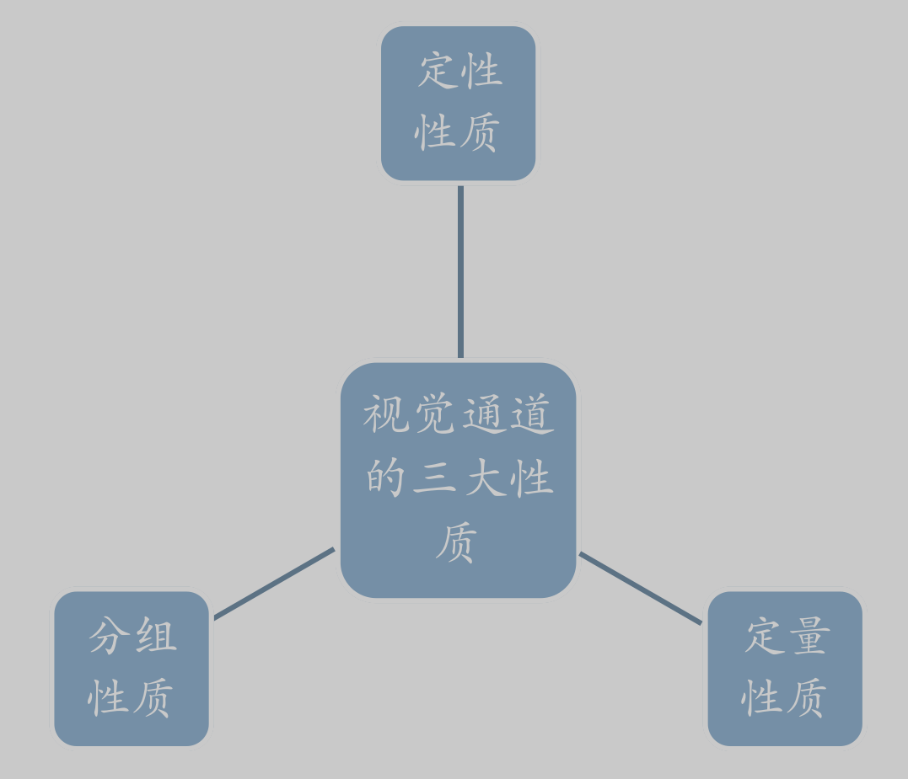
    - ==视觉通道特性==
        - **类型与性质**：分为定性通道（编码分类数据，如形状、图标等）、定量通道（编码有序/数值数据，如长度、面积等）、分组通道（表现数据内在关联性，如接近性、颜色相似性等），具有不同表现力和有效性。
        - **表现力与有效性**：表现力指视觉通道编码数据信息的完整程度，有效性指根据数据属性重要性选择合适视觉通道编码以提高可视化效果，用表现力高的通道编码重要属性有助于提高可视化可读性。
        - **精确性**：视觉感知与原始数据吻合程度，史蒂文斯幂次法则表明人类感知系统对不同通道精确性不同，指数与感觉器官和感知模式相关，n值影响对刺激信号的感知压缩或放大。
        - **可辨认性**：视觉通道取值范围影响用户区分不同取值状态的能力。
        - **可分离性**：不同视觉通道相互影响情况，通道类型决定可分离性，某些条件下干扰会放大。
        - **视觉突出性**：如“前注意视觉”可快速吸引注意力，不同视觉通道在视觉突出性上有差异。
    - **常用视觉通道特点**
        - **平面位置**：可编码定性、定序或定量属性及分组属性，对任何数据都有效，设计可视化时通常先确定其编码的数据属性，包括坐标轴位置选择等。
        - **颜色**：*复杂常用，亮度和饱和度适合编码有序数据（亮度层次不宜多于5个，小尺寸图像中饱和度层次不宜超过三层，大块区域用低饱和度，小块区域用高饱和度高亮度），==色调适合编码定性和分组属性==（小尺寸图案难分辨，不连续区域难比较，大图案区域可区分6 - 12种色调），需注意与其他通道相互影响，可通过配色方案（如Colorbrewer2.0、Adobe Color、Kuler配色系统等）选择合适颜色。*
        - **尺寸大小**：适合定量/定序属性，包括一维长度（垂直和水平）、二维面积、三维体积，高维包含低维，避免同时使用不同维度尺寸，一维表现力较好，二维一般，三维较弱。
        - **斜度和角度**：适用于定量/有序属性，斜度可通过象限区分编码分类属性及发散性。
        - **形状**：通过前注意视觉识别，适宜分类属性，易与其他通道相互影响。
        - **纹理**：多种视觉变量组合（形状、颜色、方向），用于填充多边形，辅助增强二维图像视觉效果，可作为颜色替代品（灰度印刷、减少颜色类别、色盲保护时）。
        - **视觉多通道**：可通过空间分割、时间分割、部分遮挡、空心、半透明遮挡、多视觉通道整合、连续场、元素位移、周期性动画、先验知识、视觉语言等方式实现，用于处理复杂数据和信息表达。

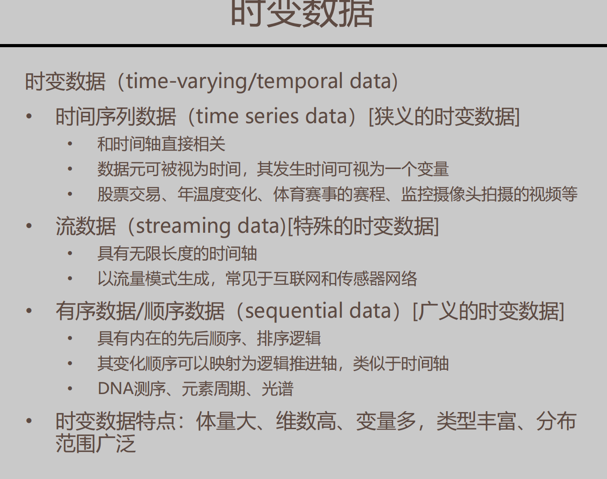

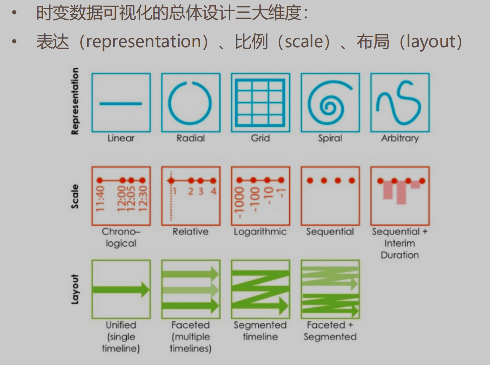

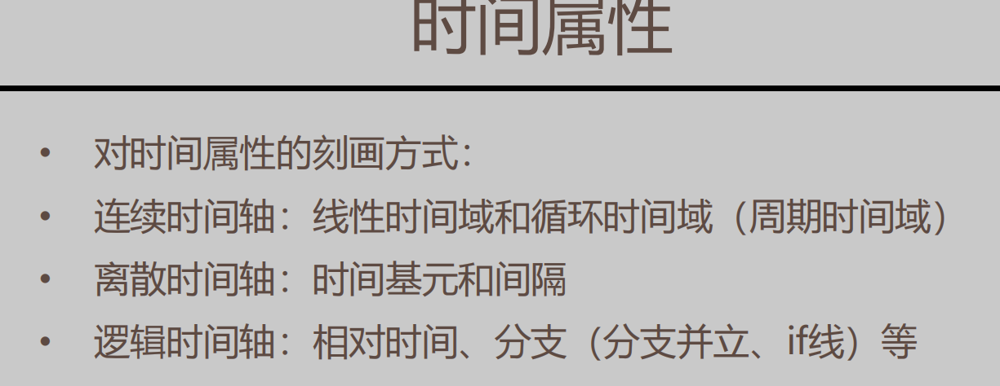

---
### 关键词及知识点总结
1. **信息图表概述**
    - **定义与类型**：信息图表（Infographics）使用视觉效果和配套文本突出关键信息，包括==统计图表、关联图表、地理图表/地图==等类型。例如，沙伊纳绘制的太阳黑子图、南丁格尔的玫瑰图等都是经典的信息图表。
    - **发展与作用**：随着时间推移，配有信息图表的文献和互联网上的信息图表数量大幅增加。信息图表能在小空间呈现众多数字，展示数据趋势和细节，使大数据集保持一致，帮助观众理解数据、引导思考，在医疗、交通等多领域发挥重要作用，如带有信息图表的处方可提高病人对病情的理解，北京地铁的Schematic Map能提高读者对方位和路线的理解程度。
2. **各类图表特点及适用场景**
    - **类别比较型图表**
        - **柱形图和条形图**：柱形图适用于比较各项数值大小，X轴常为类别型或有序型变量，Y轴为数值型变量；条形图是柱形图变体，Y轴为类别型变量，更强调项目大小，适用于项目名称长、数量多的情况。例如，用柱形图展示不同品质钻石的数量对比，用条形图展示苏格兰进出口数据。它们易于阅读、可个性化定制，但难以展示连续数据，不适用于小样本量数据。
        - **雷达图**：以二维图表形式显示多元数据，每个变量有一个坐标轴呈放射状排布，原点到辐条长度与数据变量相对大小成正比，可显示三个以上变量。
        - **热力图**：表格型热力图用于查看多变量差异及相关性，有2个分类变量和1个数值变量；平滑热力图显示3个数值变量，多用于反映地理空间热点，数据集常用栅格数据格式。例如，用表格型热力图展示学科领域间的相关性，用平滑热力图展示公园或城市区域的热点。
        - **词云图**：文字大小反映概念或类型重要程度，可展示文本数据中各元素的重要性，如《三国演义》中人物出场次数词云图、“巴黎的心理地图”词云图等。
    - **数据分布型图表**
        - **直方图和核密度曲线图**：直方图用于展示数据分布规律，X轴为数据测量区间（分组），Y轴为各组对应的数据元频数，能解答数据集中情况、异常值等问题，基本参数有组数、组距和频数；核密度曲线图与直方图相关，将直方图转化为平滑曲线，更好体现数据分布整体形状，不受分组数量影响，其变种峰峦图可应用于多数据系列的核密度可视化。
        - **抖动散点图、蜂巢图和点阵图**：用散点图方式展示数据分布规律，X轴为分类变量，Y轴为数值变量。抖动散点图每个数据元Y坐标为数值变量，X坐标在对应类别标签中心线两侧随机生成，但容易有重合点；蜂巢图数据元X坐标沿类别标签中心线向两侧对称展开并偏向斜上方，数据点较多时排布易“跨区”；点阵图数据元X坐标沿类别标签中心线向两侧均匀对称展开，不偏向斜上方，也易“跨区”。
        - **箱线图和相关变种**：箱线图先统计处理数据再绘制，显示一组数据的最大值、最小值、中位数、上下四分位数，反映数据分布情况，包括中心位置和散布范围，可识别离群值、观察数据分布特征，还可与抖动散点图结合或使用瓶状图、小提琴图展示数据分布形状，适用于连续型数据。
    - **整体局部型图表**
        - **饼图和圆环图**：饼图通过弧度大小对比整体中各分类占比，适用于快速了解数据占比分配，但不适用于分类过多、多变量连续型数据占比展示，且多个饼图间难以比较数值；圆环图本质是挖空的饼图，对比的是圆弧长度，空间利用率更高。
        - **华夫饼图**：展示总数据的分组情况，适用于快速展示数据集中不同类别的分布和比例，常用于展示国会席位、投票状况、产品销量等内容。
    - **时间序列型图表**
        - **时变数据概念**：包括时间序列数据（与时间轴直接相关，如股票交易、年温度变化等）、流数据（具有无限长度时间轴，常见于互联网和传感器网络）、有序数据/顺序数据（具有内在先后顺序

---

### 关键词及知识点总结
1. **空间分析相关概念**
    - **地理信息系统（GIS）**：用于收集、存储、处理、分析、可视化和输出地理信息的计算机系统，其相关概念包括地理信息科学（研究地理信息的科学知识，成果能为其他学科做贡献）和地理信息服务（通过网络提供地理信息相关服务）。
    - **空间数据**：分为**矢量数据**（由点、线、多边形等图形要素组成，点由经纬度坐标定义，线由有序点坐标定义，多边形描述区域地理要素，要素间存在拓扑关系，常见格式有Esri Shapefile等）和**栅格数据**（将地理空间分割为网格单元并赋予属性值，用于表示连续表面数据、专题数据和图片等，其分辨率影响数据详细程度，不同分辨率在要素精度、显示处理速度和文件大小等方面有差异）。
2. ==空间分析方法==
    - **叠加分析**：整合地理数据图层几何及位置信息生成新图层，方法包括交集、擦除、并集、合并、融合等。
    - **几何计算**：计算多边形面积、线段长度、要素间距离，精度与数据空间分辨率有关，存在海岸线悖论（测量单位不同海岸线长度不同）。
    - **缓冲区分析**：识别距离地理对象一定距离内的其他对象，缓冲区是以一定距离环绕地理对象的区域。
    - **网络分析**：在空间网络中找最优路径或最佳位置，多基于矢量数据（线）。
    - **表面分析**
        - **空间插值**：根据已知采样点数值预测未采样区域数值并创建连续表面模型，方法有三角测量法（不规则三角网，假设数据线性变化，创建三角网格符合德劳奈法则，相邻点间线性分配数值）、反距离权重法（已知点位对周围影响大，符合地理学第一定律，数据点集中均匀分布时使用，插值结果等值线图易出现“牛眼”形状）、克里金法（考虑已知数据点协方差，误差相对小但数学复杂）、趋势法（用简单表面拟合数据点，使均方根最小，适用于探索性数据分析）、最小曲率法（要求表面过已知点且总曲率最小）。
        - **其他方面**：研究和解决与连续表面相关问题，包括自然地理和人文社会特征表面，如地形、气压、人口密度等。
    - **地统计学（空间统计）**：借助统计学方法理解和量化空间模式，常用工具包括空间自相关（描述地理空间内相邻位置特征值或属性值关联性，地理特征分布模式有分散式、随机式、聚团式，邻域定义有点状数据的自然距离和多边形的空间邻接矩阵，相关参数有Moran’s I和Geary’s C）、热点分析（Getis - Ord G检验发现全局趋势，Getis - Ord Gi*检验发现局部热点或冷点）、地理加权回归（模型参数随空间位置改变，能更好描述和预测空间趋势，考虑邻域权重，得到局部残差）。
3. **地图设计要素**
    - **用途**：包括地形图（展现地形地貌）、普通地图（反映行政区划等地理知识）、专题地图（展现某领域专业知识，如人口、经济、地质等地图）。
    - **布局**：重要信息放视觉突出位置，不刻意填满空白区域，保持平衡，包含主地图、图例、比例尺、指北针、标题等元素，且各元素位置安排有原则。
    - **投影**：将三维地球表面展开到二维平面的方法，有等角投影（保形状）、等（面）积投影（保面积）、折中投影（平衡面积和形状扭曲）、等距投影（特定方向距离不变）等类型，常见投影方式有麦卡托投影、兰伯特等角圆锥投影等，中国地图常用等积斜切方位投影和兰伯特等角圆锥投影。
    - **底图**：可分为地形类（如高程等）、遥感图像（用地类型等）、矢量图（行政区边界等），底图为其他图层提供背景和地理参考。
    - **标注和配色**：在不同比例尺地图上精确有效表示重要地理信息，方法有轮廓简化、融合、筛选、错位等，矢量数据简化算法包括隔点法（每隔n个点选一个保留，简单但可能漏重要点）、垂距法（按长度阈值筛选端点）、分裂法（如道格拉斯 - 皮尤克算法，根据阈值从宏观决定端点保留）。
4. **时空数据可视化**
    - **时间戳**：用特定图形和符号表示带有日期时间信息的事件变化。
    - **基线技术**：用箭头等图形展示随时间变化的空间数据。
    - **图片序列（快照）**：通过不同时间的图片展示地理对象的变化。
    - **时空立方体（STC）**：三维空间表示地理坐标和事件，水平轴为地理坐标，垂直轴为事件。
    - **3D渲染和交互式可视化**：设计时需考虑用户对坐标轴含义理解、操作结果解释、获取信息多少及是否需引导交互等问题，可手动过滤数据、调整显示层级、自定义事件界面、进行时空切割和3D扭曲等操作，方便用户查看和处理时空数据。
---

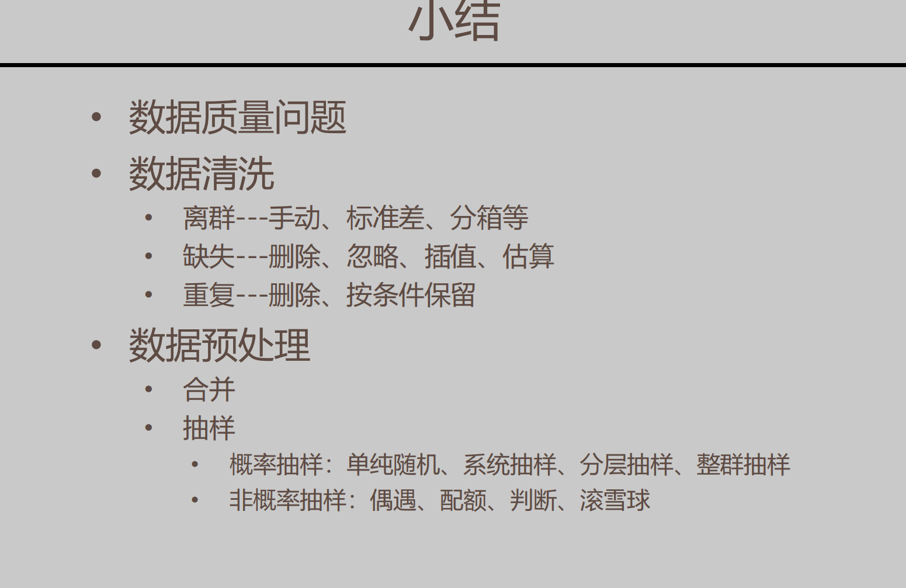

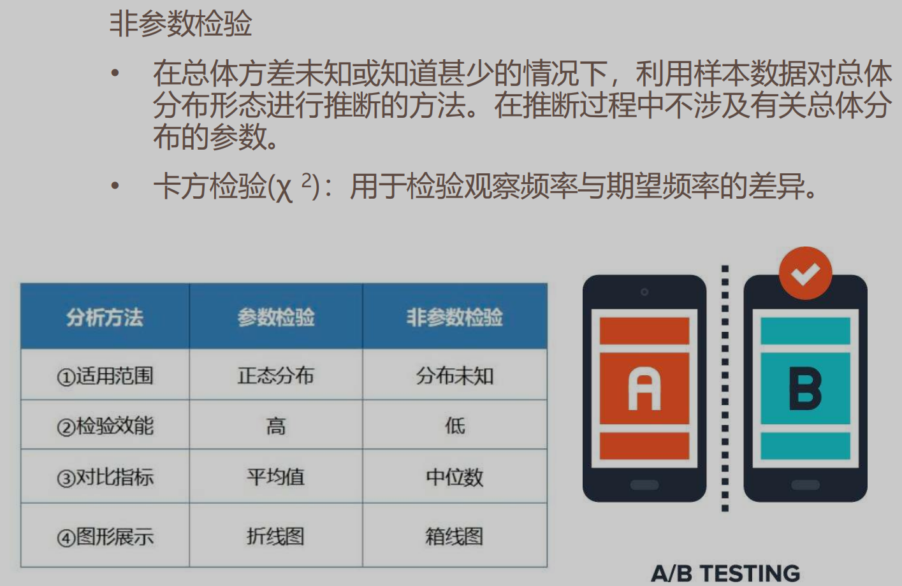

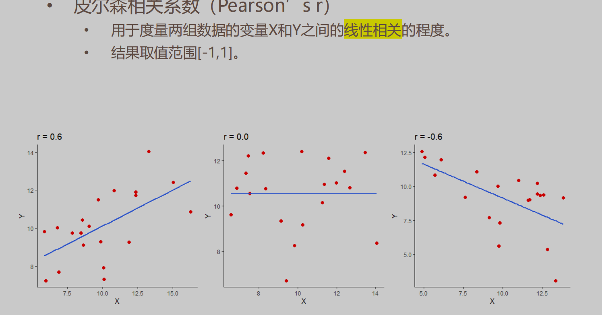

在决定使用皮尔逊相关系数（Pearson’s r）还是斯皮尔曼等级相关系数（Spearman’s rho）时，可参考以下判断标准：

### 一、数据类型
1. **连续型数据且近似正态分布**
   - 如果数据是连续型的（如身高、体重、温度、时间等可以精确测量且在一定范围内连续变化的数据），并且通过数据可视化（如绘制直方图、概率分布图等）或统计检验（如正态性检验）发现数据近似服从正态分布，那么优先考虑使用皮尔逊相关系数。例如，在分析学生的考试成绩（假设成绩是连续测量的分数）与学习时间（连续的时间数据）之间的关系时，如果成绩数据大致呈正态分布，使用皮尔逊相关系数可以准确衡量它们之间的线性关系。
2. **非连续型数据或未知分布数据**
   - 当数据是有序的非连续型数据（如等级、排名、评价等级等），或者数据的分布情况未知且难以确定是否符合正态分布时，斯皮尔曼等级相关系数更为合适。比如，在市场调研中，消费者对产品的满意度评价（分为非常满意、满意、一般、不满意、非常不满意等等级）与他们再次购买该产品的意愿（分为很可能购买、可能购买、不确定、不太可能购买、绝不购买等等级）之间的关系，这些数据不是连续的数值，使用斯皮尔曼等级相关系数可以基于数据的顺序关系来分析相关性。

### 二、数据关系预期
1. **线性关系预期**
   - 如果根据理论、经验或先验知识，有充分理由认为两个变量之间存在线性关系，那么使用皮尔逊相关系数。例如，在物理学中，根据欧姆定律\(I = U/R\)（在电阻\(R\)恒定的情况下），电流\(I\)和电压\(U\)之间应该是严格的线性关系，此时适合用皮尔逊相关系数来验证实验数据是否符合这一理论关系。
2. **单调关系预期（不一定是线性）**
   - 当只关心两个变量的变化趋势是否一致，而不明确其具体的函数关系形式（可能是线性、非线性但单调的关系，如指数增长、对数增长等）时，选择斯皮尔曼等级相关系数。例如，在分析一个城市的经济发展水平（用GDP衡量）与城市人口规模的关系时，虽然可能存在某种相关关系，但不一定是简单的线性关系，使用斯皮尔曼等级相关系数可以判断随着经济发展水平的提高，人口规模是否有相应的单调变化趋势（增加或减少）。

### 三、数据特点
1. **无离群值或离群值影响可忽略**
   - 如果数据中不存在明显的离群值，或者离群值对分析结果的影响可以忽略不计，并且数据符合正态分布假设，那么皮尔逊相关系数能够提供较为准确的线性关系度量。例如，在分析一个班级学生的正常考试成绩（没有因作弊等异常情况导致的极端分数）与平时作业完成情况之间的关系时，皮尔逊相关系数可以有效地衡量两者之间的线性相关性。
2. **存在离群值或数据分布不均匀**
   - 当数据中存在离群值，或者数据分布不均匀（如存在长尾分布、偏态分布等情况），这些因素可能会对皮尔逊相关系数产生较大干扰，导致结果不准确。此时，斯皮尔曼等级相关系数基于数据的排名，对离群值和数据分布的敏感性较低，更能稳健地反映变量之间的关系。例如，在分析公司员工的薪资水平（可能存在少数高管薪资极高，形成离群值）与工作绩效评价（可能因评价标准的主观性导致分布不均匀）之间的关系时，斯皮尔曼等级相关系数可以更好地处理这些数据问题，提供更可靠的相关性分析。

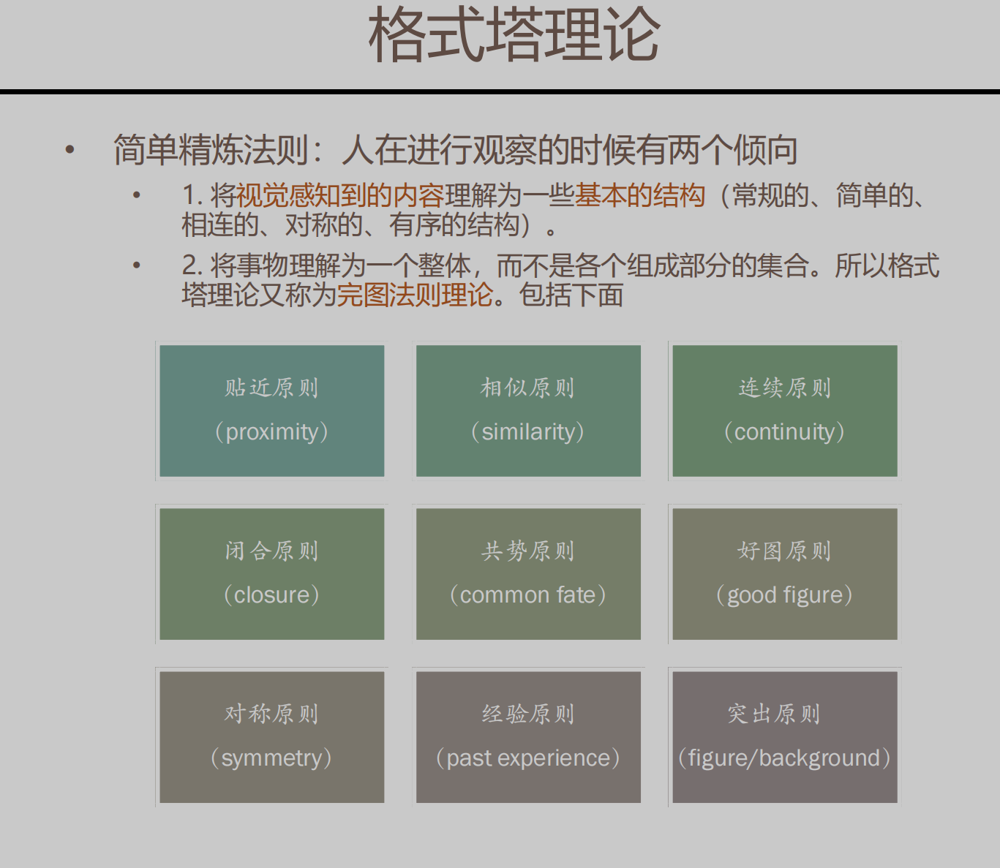

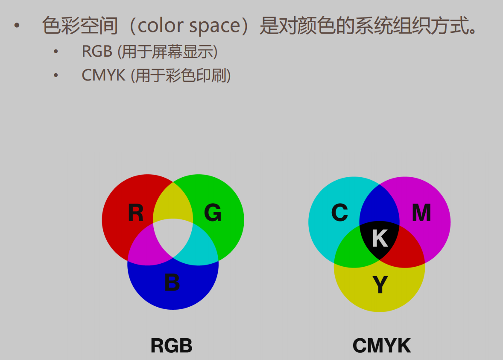

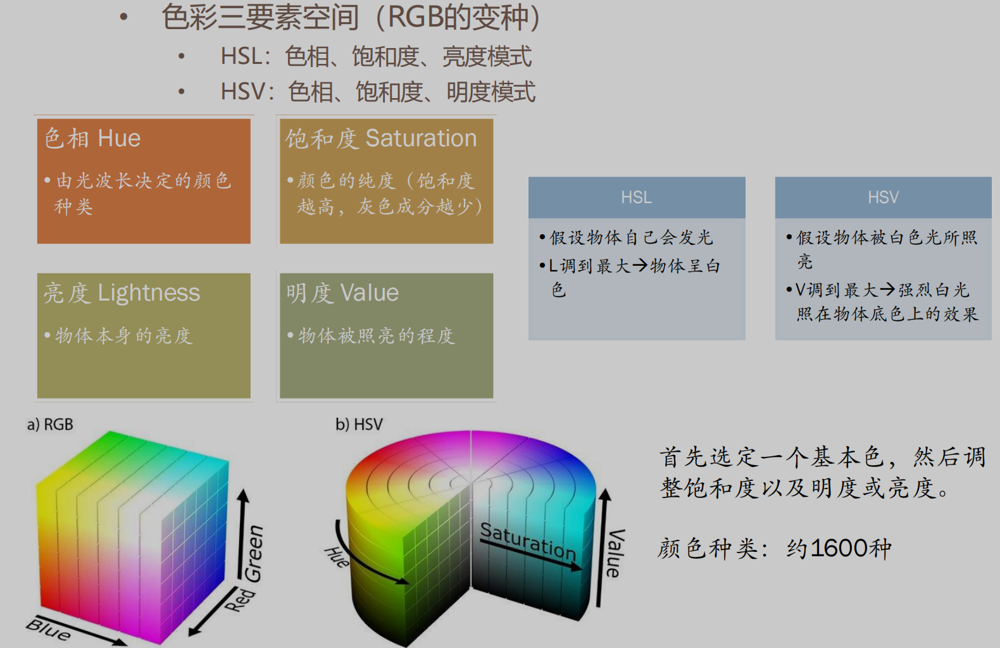

# 关键册
6. 颜色和视觉，色弱。视觉假象，精确性
   !图中的内容主要讲述了数据的视觉编码由标记和视觉通道两方面组成，以及可视化与视觉通道数量和数据维度的关系。以下是结合实际例子的解释：

### 一、标记和视觉通道
1. **标记**
   - **定义**：标记是图形元素，用于数据属性的定性分类以及对象之间的联系。
   - **示例**：在一个展示不同城市空气质量的柱状图中，每个城市就是一个标记。柱状图中的柱子（图形元素）代表了不同城市（对象），这就是通过图形元素对数据对象进行了区分，属于标记的应用。
2. **视觉通道**
   - **定义**：视觉通道控制标记的视觉特征，用于表示数据属性的分类或定量信息。
   - **示例**：还是以城市空气质量柱状图为例，柱子的高度就是视觉通道。柱子越高，表示该城市的空气质量指数越高（定量信息），这里通过柱子的高度这一视觉特征来传达空气质量的数据信息。

### 二、可视化与视觉通道数量和数据维度的关系
1. **关系阐述**
   - 可视化可以采用一个或多个视觉通道，视觉通道的数量和数据的维度有关。
2. **示例**
   - **单一视觉通道**：在一个简单的折线图中，只通过折线的走势来表示某产品在一段时间内的销量变化。这里只使用了一个视觉通道（折线的走势）来展示数据，数据维度相对较低，主要关注销量随时间的变化这一维度。
   - **多个视觉通道**：在一个散点图中，展示不同学生的身高和体重关系。每个散点代表一个学生（标记），同时使用了两个视觉通道：散点的横坐标表示体重，纵坐标表示身高。这里通过两个视觉通道来展示二维数据（身高和体重）。
   - **更高维度数据的可视化**：对于更复杂的数据，如一个三维数据（例如产品销量、利润、成本），可能会使用三维柱状图或气泡图。在三维柱状图中，使用柱子的长、宽、高三个视觉通道来表示这三个维度的数据；在气泡图中，可能通过气泡的位置（横坐标和纵坐标）、大小来表示三维数据，这里就使用了多个视觉通道来处理更高维度的数据。

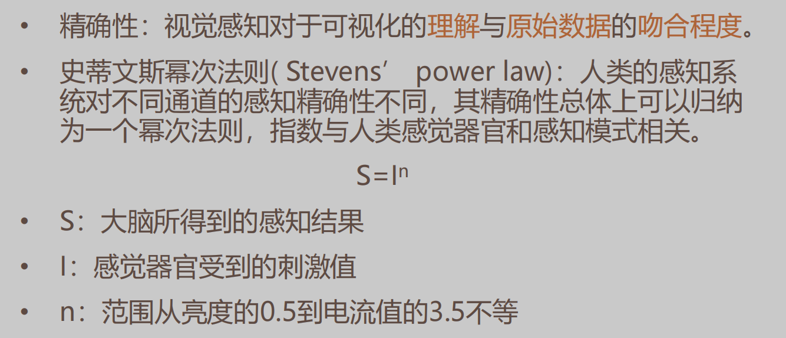