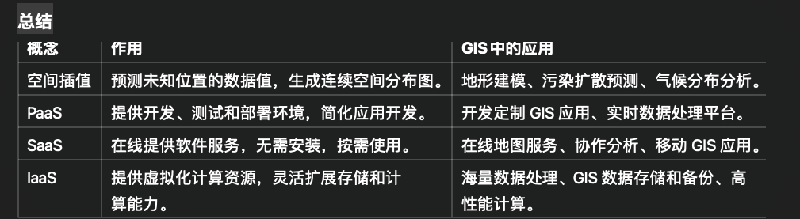

# 1
	•	B/S 模式：简化了用户操作，适合分布式系统和在线服务。
	•	TIN 模型：高效表示地形，适用于地理和环境科学。
	•	拓扑关系：关注空间对象之间的关系，支持导航和空间分析。
	•	空间数据：描述现实世界的基础数据，广泛用于地图、城市规划等。
	•	四叉树结构：高效存储和管理空间数据，适用于地图和游戏等需要动态加载的场景。

    •	矢量数据 和 栅格数据 是 GIS 中两种主要的数据组织方式，分别适用于不同类型的地理现象。
	•	空间数据质量控制 和 空间元数据 确保了 GIS 数据的可靠性、可用性和规范性。
	•	这些概念在 GIS 系统的建设、分析和应用中相辅相成，共同支持空间信息的高效管理和应用。

	•	如果你要描述“哪里有建筑，哪里有河流”，用矢量数据更合适。
	•	如果你要描述“这一片区域的温度变化”，用栅格数据更合适。

概念	                    作用	                                 GIS中的应用
空间插值	预测未知位置的数据值，生成连续空间分布图。	          地形建模、污染扩散预测、气候分布分析。
PaaS	  提供开发、测试和部署环境，简化应用开发。	            开发定制 GIS 应用、实时数据处理平台。
SaaS	  在线提供软件服务，无需安装，按需使用。	            在线地图服务、协作分析、移动 GIS 应用。
IaaS	  提供虚拟化计算资源，灵活扩展存储和计算能力。	         海量数据处理、GIS 数据存储和备份、高性能计算。

# 2
## 1
1. B/S Model (Browser/Server 模式)

通俗解释：
B/S 模式就是我们日常上网的“浏览器访问服务器”的工作模式。用户只需要打开浏览器（比如 Chrome、Edge），输入网址，就能访问服务器提供的内容或功能。

作用：
	•	简化用户端：用户不需要安装复杂的软件，只需要一个浏览器就可以使用。
	•	方便管理和维护：所有功能都集中在服务器上，更新和维护只需在服务器端操作，用户端自动生效。
	•	支持多种接入方式：无论是在办公室通过局域网，还是在家通过互联网，都可以访问同样的系统。

例子：
	•	在线购物：像淘宝、京东，你只需要浏览器访问网站，就能购物、付款。
	•	在线办公：比如腾讯会议、钉钉网页版，通过浏览器就可以开会或处理工作。

2. TIN (Triangulated Irregular Network，不规则三角网)

通俗解释：
TIN 是一种用三角形来模拟地形的方法。想象一下，你用一些小三角形拼接出一个山坡，每个三角形的顶点表示地形的重要点（比如山顶、谷底）。通过这些三角形，可以比较精确地描述地面的起伏。

作用：
	•	节省存储空间：只记录重要的地形特征点，避免记录平坦区域的多余数据。
	•	精确模拟地形：能很好地表示复杂地形，比如山脉和河谷。

例子：
	•	地形分析：比如规划修建高速公路，需要知道山坡的坡度和高度差。
	•	水文模拟：通过 TIN 计算水流的路径和积水点。

3. Topological Relation (拓扑关系)

通俗解释：
拓扑关系就是研究地图上“东西之间的关系”，比如两个湖泊是否相邻、一条河是否穿过一个村庄。它关注的是关系，而不是具体的距离或形状。

作用：
	•	空间分析：比如规划电力线路时，需要知道哪些村庄会受到影响。
	•	数据一致性：保证地图上每条河流都和它的源头和出口相连，不会断开。

例子：
	•	导航应用：比如高德地图，计算从 A 点到 B 点的最短路径时，需要知道道路之间的连接关系。
	•	土地管理：判断两个地块是否相邻，用于规划和分配土地。

4. Spatial Data (空间数据)

通俗解释：
空间数据是用来描述现实世界中“东西在哪儿、是什么样子”的数据。它包含了位置（比如经纬度）、形状（比如点、线、面）和其他特征（比如高度、面积）。

作用：
	•	表示现实世界：通过数字化手段，把地球上的山川河流、建筑物等表示成可以分析和计算的数据。
	•	支持空间分析：比如找出某个城市内的所有公园，计算它们的总面积。

例子：
	•	地图应用：Google Maps 的每条道路、每个建筑都基于空间数据绘制。
	•	气象分析：通过空间数据展示某个地区的降雨分布图。

5. Quad-Tree Data Structure (四叉树数据结构)

通俗解释：
四叉树是一种用来存储和压缩空间数据的方法。它把地图分成大小不同的方格（像拼图一样），每个方格表示地图上一部分内容。如果某个方格的内容很简单（比如只有空地），它就不再继续细分；如果内容复杂（比如有建筑物），就把它分成更小的方格。

作用：
	•	高效存储数据：避免存储大量重复的空白区域。
	•	快速查找数据：比如找到某个点属于哪个区域时，四叉树能快速定位。

例子：
	•	地图服务：百度地图的缩放功能，随着你放大地图，四叉树会逐步显示更多细节。
	•	游戏开发：在大型游戏地图中，用四叉树快速判断玩家在哪个区域，加载相应的资源。

总结：

这五个概念都和数据的组织、管理或分析相关，应用范围广泛。
	•	B/S 模式：简化了用户操作，适合分布式系统和在线服务。
	•	TIN 模型：高效表示地形，适用于地理和环境科学。
	•	拓扑关系：关注空间对象之间的关系，支持导航和空间分析。
	•	空间数据：描述现实世界的基础数据，广泛用于地图、城市规划等。
	•	四叉树结构：高效存储和管理空间数据，适用于地图和游戏等需要动态加载的场景。

8. 动态缓冲区在 GIS 中的应用

动态缓冲区在 GIS 中主要用于分析空间对象与周围环境之间的动态关系，特别是在以下场景中：
	•	环境污染分析：根据污染源的强度，动态调整缓冲范围。例如，污染源排放量越高，缓冲范围越大，用于评估污染影响区域。
	•	交通噪声分析：根据不同道路的交通流量动态调整缓冲范围，用于识别噪声影响区域。
	•	生态保护：动态调整缓冲区以保护敏感区域（如湿地或濒危物种栖息地），例如根据栖息地的敏感性动态生成保护区范围。

9. 空间数据压缩在 GIS 中的应用

空间数据压缩在 GIS 中主要用于优化存储和提高处理效率，具体包括：
	•	大规模地理数据存储：通过压缩技术减少遥感影像、数字高程模型（DEM）、矢量地图等数据的存储空间，降低存储成本。
	•	在线地图服务：例如，Google Maps 和百度地图通过压缩数据实现快速加载，提升用户体验。
	•	实时数据传输：在移动设备或低带宽环境中，通过压缩技术快速传输 GIS 数据，如导航系统中的地图数据。

10. 八叉树数据结构在 GIS 中的应用

八叉树数据结构在 GIS 中被广泛用于管理和分析三维空间数据，典型应用包括：
	•	三维地形建模：利用八叉树存储和管理地形高程数据，减少存储空间并加速渲染。
	•	城市三维建模：用于存储建筑物、桥梁等三维结构，支持快速查询和渲染。
	•	空间碰撞检测：在模拟和分析中，用于检测三维空间中物体之间的碰撞，例如无人机路径规划。
	•	地下空间分析：例如地下管线、矿井等复杂三维空间结构的管理和查询。

这些技术在 GIS 中的应用，极大地提高了数据存储、分析和展示的效率，使得 GIS 系统能够处理更加复杂和庞大的地理数据。

通俗解释与GIS应用

15. 空间插值

含义：
空间插值是一种预测方法，通过已知位置的观测数据（如高程、温度、降雨量等）推算未知位置的数值。它基于“空间相近的点更可能有相似值”的假设。

作用：
用于填补缺失数据、创建连续的空间分布图，如地形图或气候分布图。

延伸例子：
	•	如果我们有某地区几个测站的降雨量数据，可以通过空间插值生成整个地区的降雨分布图。
	•	创建地形高程图时，插值可以用来补足测量点之间的高程值。

GIS中的应用：
	•	地形建模：根据采样点生成数字高程模型（DEM）。
	•	环境分析：预测污染物扩散范围或气候变化影响。
	•	农业应用：评估土壤属性分布（如湿度、养分含量）。

16. PaaS（Platform as a Service，平台即服务）

含义：
PaaS 提供一个在线平台，开发者可以在其上构建、测试和部署应用程序，而无需管理底层硬件或操作系统。

作用：
简化应用开发过程，降低开发成本，特别适合需要快速上线的项目。

延伸例子：
	•	Google App Engine：开发者可以直接在平台上部署和运行应用程序。
	•	企业利用 PaaS 构建内部 GIS 应用，如灾害监测系统。

GIS中的应用：
	•	空间数据分析平台：提供工具和环境，用于分析和可视化地理数据。
	•	定制地图服务：开发企业专属的在线地图或导航系统。
	•	实时数据处理：在云端处理物联网设备上传的地理数据，如车辆轨迹。

17. SaaS（Software as a Service，软件即服务）

含义：
SaaS 是一种通过互联网直接提供软件服务的模式，用户无需安装，只需订阅服务即可使用。

作用：
用户无需购买和维护软件，按需使用，降低使用门槛。

延伸例子：
	•	ArcGIS Online：用户可以直接通过浏览器访问 GIS 功能，无需安装桌面软件。
	•	Google Earth：一个基于 SaaS 的地理数据浏览工具。

GIS中的应用：
	•	在线地图服务：用户通过 SaaS 平台创建、编辑和分享地图。
	•	数据共享与协作：多人在线协作分析地理数据。
	•	移动GIS：通过 SaaS 平台在移动设备上使用 GIS 应用。

18. IaaS（Infrastructure as a Service，基础设施即服务）

含义：
IaaS 提供虚拟化的计算资源（如服务器、存储和网络），用户可以按需租用，而无需购买和维护物理设备。

作用：
灵活扩展计算资源，适应不同规模的应用需求。

延伸例子：
	•	Amazon Web Services (AWS)：用户可以租用服务器运行 GIS 分析。
	•	企业利用 IaaS 部署 GIS 数据存储系统，按需扩展存储容量。

GIS中的应用：
	•	高性能计算：处理海量地理数据，如遥感影像或全球气候模型。
	•	大规模存储：存储和管理遥感影像、DEM、矢量数据等。
	•	灾备系统：在云端备份重要的 GIS 数据，防止数据丢失。

# 简答题
以下是基于GIS角度的回答，力求简洁明了，同时涵盖关键点，帮助您在考试中获得满分：

1. 三种3D建模方法及技术流程

(1) 遥感建模 (RS)
	•	方法: 利用遥感影像和DEM（数字高程模型）数据进行三维地形建模。
	•	技术流程:
	1.	收集遥感影像和DEM数据；
	2.	数据预处理（投影校正、裁剪等）；
	3.	使用GIS软件（如ArcGIS或ENVI）生成三维地形模型；
	4.	可视化处理和精度验证。

(2) 软件建模 (3D Max)
	•	方法: 借助专业建模软件（如3D Max、SketchUp）进行人工建模。
	•	技术流程:
	1.	导入基础地理数据（如矢量地图或点云数据）；
	2.	使用建模工具创建三维模型；
	3.	添加纹理、材质等细节；
	4.	输出并与GIS数据集成。

(3) 手工建模
	•	方法: 通过实地测量或参考图纸进行人工绘制建模。
	•	技术流程:
	1.	实地勘测获取地形数据；
	2.	使用绘图工具（如AutoCAD）手动绘制模型；
	3.	导入GIS软件进行校正和整合。

2. 三种空间分析方法

(1) 网络分析
	•	定义: 研究网络结构中各要素的空间关系和功能属性。
	•	应用: 城市交通规划、物流配送等。
	•	示例: 交通流量分析。
       

    在网络分析中，“网络”指的是由节点（点）和边（线）组成的结构，类似于我们生活中的路网、管网、电网等。
        •	节点（Node）: 表示网络中的关键点，比如路口、公交站、管道交汇点等。
        •	边（Edge）: 表示连接节点的线段，比如道路、公交线路、管道等。
        •	属性（Attribute）: 每条边或节点都有附加属性，比如路的长度、宽度、通行时间、流量等。

(2) 最短路径分析
	•	定义: 在网络中寻找两点间距离最短的路径。
	•	应用: 导航、应急救援等。
	•	示例: 使用Dijkstra算法计算最短路径。

(3) 最佳路径分析
	•	定义: 考虑多种因素（如时间、成本、环境影响）选择最优路径。
	•	应用: 旅游路线规划、物流运输等。
	•	示例: 利用加权网络图选择最佳路径。

3. 国家常用的投影分别使用哪些比例尺
	•	中国: 常用高斯-克吕格投影，比例尺多为 1:50000、1:250000。

4. GIS数据误差来源

(1) 数据采集误差
	•	来源: 遥感影像分辨率不足、传感器精度有限等。
	•	解决方法: 提高数据采集设备精度，进行多次采样验证。

(2) 数据处理误差
	•	来源: 坐标转换、投影变换中的算法偏差。
	•	解决方法: 使用高精度算法，严格控制计算过程。

(3) 数据输入误差
	•	来源: 人工录入错误或扫描误差。
	•	解决方法: 建立数据校验机制，减少人工干预。

(4) 模型简化误差
	•	来源: 为提高效率对模型进行简化。
	•	解决方法: 在精度和效率之间寻找平衡点。

5. 影响地图投影的要素

(1) 地理位置
	•	赤道附近区域适合使用等距圆柱投影，如墨卡托投影；极地区域适合极地投影。

(2) 地图用途
	•	导航: 需保持角度正确，适合等角投影（如墨卡托投影）。    航海地图（赤道区域）投影选择: 使用墨卡托投影，因为它能保持角度正确，便于航海导航。  特点: 赤道附近的形状和距离几乎无变形，但越靠近两极，面积变形越大。
	•	面积统计: 需保持面积真实，适合等面积投影（如阿尔伯斯投影）。
	•	全球展示: 需兼顾形状和面积，适合折中投影（如罗宾逊投影）。

(3) 投影变形
	•	投影会导致形状、面积、距离、方向的变形，需根据应用场景选择适当投影。

6. GIS 的组成和功能

(1) 组成
	1.	硬件: 计算机、服务器、传感器等设备。
	2.	软件: GIS平台（如ArcGIS、QGIS）。
	3.	数据: 矢量数据、栅格数据、遥感影像等。
	4.	人员: 数据分析师、系统开发人员等。
	5.	方法: 数据采集、处理、分析和可视化技术。

(2) 功能分析
	•	智慧系统应用:
	1.	智慧交通: 路网监测、交通流量分析。
	2.	路灯管理系统: 路灯分布可视化、智能控制。
	3.	城市规划: 建筑物布局、绿地分布优化。

7. 举例说明数字高程模型（DEM）的具体应用

(1) 三维景观模拟
	•	应用: 利用DEM生成真实地形三维模型，用于城市规划、生态保护等。
	•	示例: 在GIS中结合卫星影像生成某山区的三维景观，用于旅游开发规划。

(2) 洪水模拟与预测
	•	应用: 利用DEM模拟水流路径和积水区域。
	•	示例: 模拟某流域在暴雨情况下的洪水淹没范围。

(3) 地质灾害评估
	•	应用: 通过DEM分析滑坡、泥石流等地质灾害的高风险区域。
	•	示例: 在某山区标注滑坡风险等级，为居民安置提供参考。

8. GIS 软件工程总体设计内容

(1) 系统需求分析
	•	明确用户需求：数据类型、功能要求、性能指标。
	•	示例：智慧交通系统需要支持实时路况查询和路径规划。

(2) 系统架构设计
	•	模块划分: 数据采集模块、数据分析模块、可视化模块等。
	•	技术架构: 前端（如WebGIS）、后端（如数据库服务器）。

(3) 数据库设计
	•	数据结构设计：空间数据库、属性数据库。
	•	示例：设计一个包含路网、建筑物、绿地等图层的GIS数据库。

(4) 功能设计
	•	核心功能: 空间分析、路径规划、数据可视化等。
	•	扩展功能: 移动端支持、数据共享等。

(5) 系统测试与维护
	•	测试功能完整性和数据精度，定期更新系统和数据。

9. 网络分析说明智慧交通的应用

(1) 智慧交通中的网络分析应用
	1.	最短路径分析
	•	应用: 为驾驶员或行人提供最短行驶路径。
	•	示例: 使用Dijkstra算法计算从A地到B地的最短路径。
	2.	服务范围分析
	•	应用: 确定交通设施（如公交站点、停车场）的服务范围。
	•	示例: 分析某公交站点覆盖的社区范围，优化公交线路布局。
	3.	交通流量分析
	•	应用: 监测和分析道路拥堵情况。
	•	示例: 基于实时交通数据预测某路段的拥堵时间段。

(2) 综合案例
	•	智慧交通系统利用GIS网络分析，结合实时数据和历史数据，提供精准的路径规划、交通流量预测和突发事件应急响应方案。

