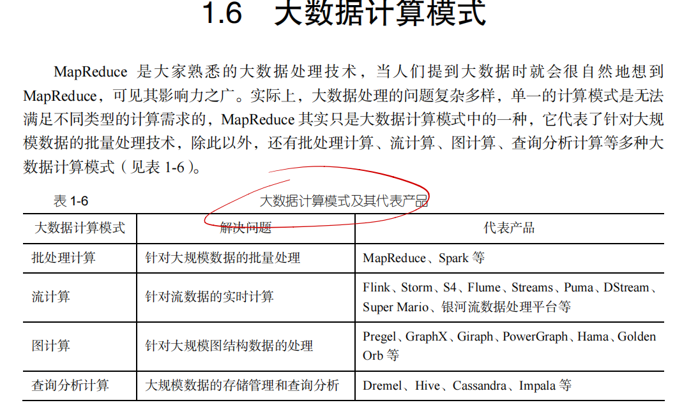
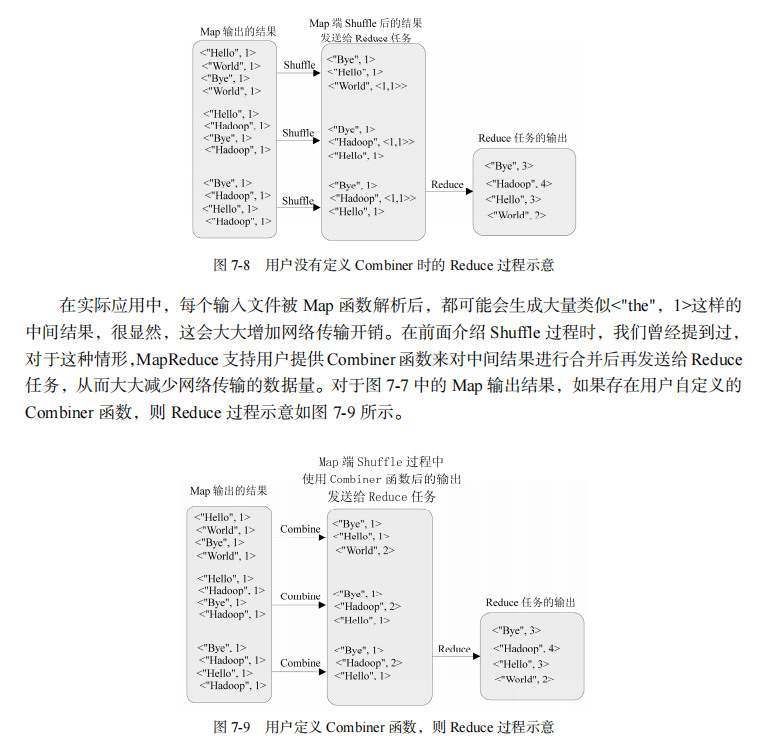

# 1

    

以下是对这些问题的简要回答：

1. **试述信息技术发展史上的3次信息化浪潮及其具体内容。**
   - 第一次信息化浪潮：以个人计算机（PC）为代表，使计算机进入个人家庭和办公领域，实现了个人数据处理和办公自动化。
   - 第二次信息化浪潮：以互联网为代表，实现了全球范围内的信息互联互通，人们可以通过网络进行信息交流、电子商务等活动。
   - 第三次信息化浪潮：以大数据、云计算、物联网等新兴技术为代表，实现了海量数据的处理和分析，推动了智能化应用的发展。

2. **试述数据产生方式经历的几个阶段。**
   - 第一阶段：手工记录阶段，数据由人工记录和整理，效率低且容易出错。
   - 第二阶段：计算机辅助阶段，利用计算机进行数据录入和简单处理，提高了数据处理效率。
   - 第三阶段：自动化产生阶段，随着传感器、物联网等技术的发展，数据可以自动采集和生成，数据量迅速增长。

3. **试述大数据的4个基本特征。**
   - 大量（Volume）：数据量巨大，通常达到PB级甚至EB级。
   - 多样（Variety）：数据类型多样，包括结构化、半结构化和非结构化数据。
   - 高速（Velocity）：数据产生和处理速度快，要求实时处理。
   - 价值（Value）：数据中蕴含着有价值的信息，但需要通过挖掘和分析才能获取。

4. **试述大数据时代的“数据爆炸”特性。**
   - 在大数据时代，由于物联网、移动互联网、社交媒体等的快速发展，数据量呈指数级增长，数据产生的速度越来越快，数据来源越来越多样化，导致了“数据爆炸”现象。

5. **科学研究经历了哪4个阶段？**
   - 第一阶段：实验科学阶段，通过实验观察和记录数据。
   - 第二阶段：理论科学阶段，通过理论推导和模型构建来解释现象。
   - 第三阶段：计算科学阶段，利用计算机模拟和计算来研究复杂系统。
   - 第四阶段：数据密集型科学阶段，利用大数据分析来发现新知识和规律。

6. **试述大数据对思维方式的重要影响。**
   - 大数据改变了人们的思维方式，从抽样思维转变为全样本思维，从因果关系思维转变为相关性思维，从精确思维转变为容错思维。

7. **大数据决策与传统的基于数据仓库的决策有什么区别？**
   - 传统数据仓库决策主要基于结构化数据，数据量相对较小，决策过程相对较慢，主要关注历史数据的分析。而大数据决策能够处理海量的、多样化的数据，包括实时数据，能够快速做出决策，并且能够挖掘出隐藏在数据中的潜在价值。

8. **举例说明大数据的具体应用。**
   - 电商领域：通过分析用户的浏览、购买行为数据，进行精准营销和个性化推荐。
   - 金融领域：利用大数据进行风险评估、欺诈检测和信贷决策。
   - 医疗领域：通过分析患者的电子病历、基因数据等，辅助医生进行诊断和治疗。

9. **举例说明大数据的关键技术。**
   - 数据采集技术：如传感器技术，用于采集物联网数据。
   - 数据存储技术：如Hadoop分布式文件系统（HDFS），用于存储海量数据。
   - 数据分析技术：如机器学习算法，用于挖掘数据中的价值。

10. **大数据产业包含哪些层面？**
    - 数据采集层：负责数据的采集和获取。
    - 数据存储层：负责数据的存储和管理。
    - 数据处理层：负责对数据进行清洗、转换和分析。
    - 数据应用层：负责将数据分析结果应用于实际业务，如营销、决策等。

11. **给出以下术语的定义：云计算、物联网。**
    - 云计算：一种通过网络提供计算资源（包括服务器、存储、数据库、网络、软件等）的模式，用户可以按需获取和使用这些资源，而无需自己构建和维护硬件和软件设施。
    - 物联网：通过互联网将各种物理设备（如传感器、智能家电、车辆等）连接起来，实现设备之间的互联互通和数据交换，从而实现智能化管理和控制。

12. **详细阐述大数据、云计算和物联网三者之间的区别与联系。**
    - 区别：
      - 大数据侧重于数据的处理和分析，目的是从海量数据中挖掘价值。
      - 云计算侧重于提供计算资源和服务，用户可以通过网络获取计算能力。
      - 物联网侧重于设备的连接和数据采集，通过连接物理设备获取数据。
    - 联系：
      - 物联网为大数据提供了海量的数据来源，通过物联网设备采集的数据是大数据的重要组成部分。
      - 云计算为大数据和物联网提供了计算和存储资源，大数据和物联网的运行都需要云计算的支持。
      - 大数据分析的结果可以反馈给物联网设备，实现设备的智能化控制和优化。

# 2 Hadoop
Hadoop 的核心是 Hadoop 分布式文件系统（Hadoop Distributed File System，HDFS）和 MapReduce。

以下是针对你提出的问题的详细解答：  

---

### **1. Hadoop 与谷歌 MapReduce、GFS 等技术的关系**  
Hadoop 的设计灵感来源于谷歌的三大核心论文：  
- **MapReduce**：Hadoop 的核心处理框架模仿了谷歌的 MapReduce 编程模型，支持大规模数据的分布式并行处理。  
- **GFS (Google File System)**：Hadoop 分布式文件系统（HDFS）基于谷歌 GFS 的设计思想，用于分布式存储大规模数据，提供高容错性和可靠性。  
- **Bigtable**：谷歌的 Bigtable 数据存储模型启发了 Hadoop 的 HBase，它是一种分布式列存储数据库。  

**总结**：Hadoop 是开源实现，基于谷歌这些技术的设计思想开发，解决了大规模数据存储和处理问题。

---

### **2. Hadoop 的特性**  
Hadoop 具有以下主要特性：  
1. **分布式存储与处理**  
   - 数据通过 HDFS 分布式存储在多个节点上。  
   - MapReduce 实现了分布式计算任务的高效调度和执行。  

2. **高容错性**  
   - 数据会存储多份副本（默认 3 份），即使某些节点发生故障，数据依然可用。  

3. **高扩展性**  
   - Hadoop 支持通过添加更多节点来扩展存储容量和计算能力。  

4. **经济性**  
   - Hadoop 使用普通的商用硬件，成本低廉。  

5. **与多种数据类型兼容**  
   - 支持结构化、半结构化和非结构化数据（如文本、图像、视频等）。  

6. **开源性**  
   - Hadoop 是 Apache 基金会的开源项目，拥有活跃的社区支持。

---

### **3. Hadoop 在各个领域的应用情况**  
Hadoop 被广泛应用于多个领域，以下是一些典型应用场景：  

1. **互联网行业**  
   - 搜索引擎：用于网页爬取、索引和排名计算（如 Yahoo 和百度）。  
   - 广告推荐：分析用户行为数据，进行精准广告投放。  

2. **金融行业**  
   - 风险控制：通过大数据分析进行信用评分和欺诈检测。  
   - 客户分析：挖掘客户行为模式，提供个性化服务。  

3. **医疗行业**  
   - 电子病历存储和分析。  
   - 基因组数据处理和疾病预测。  

4. **零售行业**  
   - 销售预测：分析历史销售数据，优化库存管理。  
   - 客户细分：通过数据分析了解客户偏好。  

5. **电信行业**  
   - 网络流量监控和优化。  
   - 用户行为分析和套餐推荐。  

6. **科研领域**  
   - 天文学：处理大规模天文观测数据。  
   - 环境科学：分析气候变化数据。

---

### **4. Hadoop 生态系统及各部分功能**  
Hadoop 生态系统由多个组件组成，每个部分都有特定功能：  

1. **HDFS (Hadoop Distributed File System)**  
   - 分布式存储系统，负责存储大规模数据，支持高容错和高吞吐量。  

2. **MapReduce**  
   - 分布式计算框架，用于大规模数据的并行处理。  

3. **YARN (Yet Another Resource Negotiator)**  
   - 资源管理系统，负责分配和调度集群中的计算资源。  

4. **Hive**  
   - 数据仓库工具，支持使用类 SQL 的语言（HiveQL）对大数据进行查询和分析。  

5. **Pig**  
   - 数据流处理平台，提供一种高级脚本语言（Pig Latin）用于编写 MapReduce 作业。  

6. **HBase**  
   - 分布式列存储数据库，适用于实时读写和大规模数据存储。  

7. **Spark**  
   - 分布式计算引擎，支持内存计算，适用于批处理、流处理和机器学习。  

8. **Sqoop**  
   - 数据传输工具，用于在 Hadoop 和关系型数据库之间导入和导出数据。  

9. **Flume**  
   - 数据采集工具，用于实时收集和传输日志数据到 HDFS。  

10. **Oozie**  
    - 工作流调度器，用于管理和调度 Hadoop 作业。  

11. **ZooKeeper**  
    - 分布式协调服务，提供配置管理和同步支持。  

12. **Mahout**  
    - 机器学习库，支持推荐系统、分类和聚类等算法。  

13. **Kafka**  
    - 分布式消息队列系统，用于实时数据流处理。  

**总结**：Hadoop 生态系统涵盖了数据存储、计算、分析、调度、机器学习等多个方面，提供了完整的大数据解决方案。  

---

希望这些解答能帮到你！如果需要更深入的讲解，欢迎继续提问 😊

# 3
     
这张图片主要是在介绍HDFS（分布式文件系统）中的名称节点（NameNode）和数据节点（DataNode）。

简单来说，HDFS是一种用于存储和管理大量数据的系统。在这个系统中，有两个重要的部分：名称节点和数据节点。

1. **名称节点（NameNode）**
   - 它就像是一个大管家，负责管理整个文件系统的命名空间。
   - 它保存了两个重要的文件：FsImage和EditLog。
     - **FsImage**：它记录了文件系统中所有文件和文件夹的元数据（可以理解为文件和文件夹的基本信息）。这个文件通常很大，因为它要记录很多信息。
     - **EditLog**：它记录了对文件系统的所有操作，比如创建文件、删除文件、重命名文件等。这个文件通常比FsImage小。
   - 名称节点在启动时，会先把FsImage加载到内存里，然后执行EditLog里记录的操作，让内存中的数据保持最新。完成这些操作后，它会创建一个新的FsImage文件和一个空的EditLog文件。这样做是为了避免每次操作都直接修改庞大的FsImage文件，那样会让系统变得很慢。

2. **数据节点（DataNode）**
   - 它负责存储实际的数据块。
   - 数据节点会把数据分成很多块，然后存储这些块。
   - 名称节点知道每个数据块在哪个数据节点上，但它不会一直记住这些信息，而是在每次启动时重新扫描所有数据节点来获取这些信息。

总的来说，名称节点负责管理文件系统的结构和操作记录，而数据节点负责存储实际的数据。它们一起协作，让HDFS能够高效地存储和管理大量数据。

      

**3.8 本章小结**
分布式文件系统是大数据时代解决大规模数据存储问题的有效解决方案，HDFS 开源实现了
GFS，可以利用由廉价硬件设备构成的计算机集群实现海量数据的分布式存储。
HDFS 具有兼容廉价的硬件设备、流数据读写、大数据集、简单的文件模型、强大的跨平台
兼容性等特点。但是也要注意到，HDFS 也有自身的局限性，比如不适合低延迟数据访问、无法
高效存储大量小文件和不支持多用户写入及任意修改文件等。
块是 HDFS 的核心概念，一个大的文件会被ઞ分成很多个块。HDFS 采用抽象的块概念，具
有支持大规模文件存储、简化系统设计、适合数据备份等优点。
HDFS 采用了主从（Master/Slave）结构模型，一个 HDFS 集群包括一个名称节点和若࣯个数
据节点。名称节点负᠉管理分布式文件系统的命名空间；数据节点是分布式文件系统 HDFS 的工
作节点，负᠉数据的存储和读取。
第 3 章 分࣊式஠͇系统 )%'4 
 65 
HDFS 采用了ж余数据存储，增强了数据可靠性，加快了数据传输速度。HDFS 还采用了相
应的数据存放、数据读取和数据复制策略，来提升系统整体读写响应性能。HDFS 把硬件出错看
成一种常态，设计了错误ু复机制。

1. **试述分布式文件系统设计的需求。**
   - **高可用性**：分布式文件系统需要能够在部分节点故障的情况下继续提供服务，确保数据的持续可用性。
   - **高性能**：能够快速地处理大量的并发读写请求，以满足用户对数据访问速度的需求。
   - **高扩展性**：可以方便地增加节点来扩展存储容量和处理能力，以适应数据量的增长。
   - **数据一致性**：保证在多个节点上的数据副本之间的一致性，防止数据不一致导致的问题。
   - **容错性**：能够自动检测和恢复节点故障，确保数据的完整性和可用性。
   - **简单的管理界面**：便于管理员对系统进行配置、监控和维护。

2. **分布式文件系统是如何实现较高水平扩展的？**
   - **数据分片（Sharding）**：将数据分成多个小块（片），分散存储在不同的节点上。这样可以充分利用多个节点的存储和处理能力。
   - **添加节点**：可以通过添加新的存储节点和计算节点来扩展系统的容量和性能。新节点加入后，系统能够自动地将数据重新分布到新节点上。
   - **负载均衡**：通过算法将读写请求均匀地分配到各个节点上，避免某些节点过载，从而提高整个系统的性能和扩展性。

3. **试述HDFS中的块和普通文件系统中的块的区别。**
   - **块大小**：
     - **普通文件系统**：块大小通常较小，如4KB或8KB，这是为了减少内部碎片和提高磁盘空间利用率。
     - **HDFS**：块大小较大，一般为64MB或128MB。这是因为HDFS主要用于存储大文件，大的块大小可以减少元数据的管理开销，提高数据传输效率。
   - **目的**：
     - **普通文件系统**：块的设计主要是为了便于磁盘的存储和管理，提高磁盘读写效率。
     - **HDFS**：块除了存储数据外，还便于在分布式环境中进行数据的复制、分布和处理。
   - **数据复制**：
     - **普通文件系统**：通常不进行数据复制（除非是在RAID等特殊存储架构中）。
     - **HDFS**：数据块会在不同节点上进行复制，以提高数据的容错性和可用性。

4. ==试述HDFS中的名称节点和数据节点的具体功能。==
   - **名称节点（NameNode）**：
     - **元数据管理**：负责管理文件系统的命名空间，包括目录结构、文件属性等元数据信息。
     - **数据块位置跟踪**：记录每个数据块在数据节点上的位置，但不存储实际数据。
     - **文件系统操作管理**：处理客户端对文件系统的操作请求，如打开、关闭、重命名文件等。
   - **数据节点（DataNode）**：
     - **数据存储**：实际存储数据块，并负责数据块的读写操作。
     - **数据块复制**：根据名称节点的指令，对数据块进行复制，以保证数据的冗余和容错。
     - **数据块报告**：定期向名称节点报告所存储的数据块信息，以便名称节点掌握数据的存储情况。

5. **在分布式文件系统中，中心节点的设计至关重要，请阐述HDFS是如何减轻中心节点的负担的。**
   - **数据块报告**：数据节点定期向名称节点发送数据块报告，而不是每次数据变化都立即报告，减少了名称节点的频繁处理。
   - **缓存机制**：名称节点会对一些常用的元数据信息进行缓存，避免重复查询和处理，提高处理效率。
   - **简化操作**：HDFS在设计上尽量简化了文件系统操作，减少了名称节点需要处理的操作类型和复杂性。
   - **辅助名称节点（Secondary NameNode）**：辅助名称节点可以定期合并EditLog和FsImage文件，减少名称节点重启时的负担，虽然它不能完全替代名称节点的功能。

6. **HDFS只设置唯一一个名称节点，在简化系统设计的同时也带来了一些明显的局限性，请阐述局限性具体表现在哪些方面。**
   - **单点故障**：名称节点是整个系统的核心，如果名称节点发生故障，整个HDFS将无法正常工作，直到名称节点恢复。
   - **性能瓶颈**：所有对文件系统的操作都要经过名称节点处理，当数据量和操作请求数量非常大时，名称节点可能成为系统的性能瓶颈。
   - **扩展性受限**：单个名称节点的处理能力有限，在大规模集群扩展时，可能无法满足日益增长的数据管理和操作处理需求。

7. **试述HDFS的冗余数据保存策略。**
   - **默认复制因子**：HDFS默认对每个数据块进行3次复制，将3个副本存储在不同的节点上。
   - **机架感知**：HDFS在放置副本时会考虑机架的位置，通常一个副本放在本地机架的一个节点上，另一个副本放在同一机架的另一个节点上，第三个副本放在不同机架的节点上。这样可以在提高数据可靠性的同时，减少跨机架的数据传输，提高读写效率。
   - **动态调整**：管理员可以根据实际情况调整数据块的复制因子，例如在存储资源紧张时减少复制因子，在需要更高可靠性时增加复制因子。

8. **数据复制主要在数据写入和数据恢复的时候发生，HDFS数据复制使用流水线复制的策略，请阐述该策略的细节。**
   - **数据写入时**：
     - 当客户端向HDFS写入数据时，首先会与名称节点联系，确定数据块的存储位置（数据节点）。
     - 客户端将数据块分成多个数据包，依次发送给第一个数据节点。
     - 第一个数据节点接收到数据包后，会立即将其转发给第二个数据节点，同时自己也存储一份副本。第二个数据节点再将数据包转发给第三个数据节点。这个过程就像一个流水线，数据包依次在数据节点之间传递，直到所有副本都存储完成。
   - **数据恢复时**：
     - 当某个数据节点上的数据块损坏或丢失时，名称节点会检测到这种情况，并选择一个合适的数据节点进行数据复制。
     - 源数据节点会将数据块通过类似流水线的方式复制到新的数据节点上，以恢复数据的冗余。

9. **试述HDFS是如何探测错误发生以及如何进行恢复的。**
   - **错误探测**：
     - **数据节点心跳机制**：数据节点会定期向名称节点发送心跳消息，报告自己的状态。如果名称节点在一定时间内没有收到某个数据节点的心跳消息，就认为该数据节点可能出现故障。
     - **数据块完整性检查**：数据节点会对存储的数据块进行周期性的校验和计算，当发现数据块损坏时，会向名称节点报告。
   - **恢复机制**：
     - **数据块复制**：当名称节点检测到某个数据块的副本数量不足（如某个数据节点故障导致副本丢失）时，会选择合适的数据节点进行数据块复制，以恢复到默认的复制因子。
     - **故障节点替换**：如果数据节点故障无法恢复，系统会在其他节点上重新分配该节点上存储的数据块，确保数据的可用性。

10. **请阐述HDFS在不发生故障的情况下读文件的过程。**
   - **客户端请求**：客户端向名称节点发送读文件请求，请求中包含文件名。
   - **元数据获取**：名称节点根据文件名查找文件的元数据，包括文件由哪些数据块组成以及这些数据块存储在哪些数据节点上，然后将数据块位置信息返回给客户端。
   - **数据读取**：客户端根据名称节点返回的信息，直接与相应的数据节点建立连接，依次读取数据块，最后将数据块组合成完整的文件内容。

11. **请阐述HDFS在不发生故障的情况下写文件的过程。**
   - **客户端请求**：客户端向名称节点发送写文件请求，请求中包含文件名和文件大小等信息。
   - **元数据创建**：名称节点检查文件是否已存在，若不存在，则在命名空间中创建文件的元数据，并根据文件大小确定数据块的数量和存储位置（数据节点），然后将数据块分配信息返回给客户端。
   - **数据写入**：客户端将文件数据分成数据块，依次发送给第一个数据节点，第一个数据节点采用流水线复制策略将数据块转发给其他数据节点进行存储，直到所有数据块都成功写入。
   - **文件关闭**：客户端完成数据写入后，向名称节点发送文件关闭请求，名称节点更新文件的元数据信息，表示文件写入完成。

# 4
   

4.7 本章小结 
本章详细介绍了 HBase 数据库的知识。HBase 数据库是 BigTable 的开源实现，和 BigTable
一样，支持大规模海量数据，分布式并发数据处理效率极高，易于扩展且支持动态伸缩，适用于
廉价硬件设备。
HBase 可以支持 Native Java API、HBase Shell、Thrift Gateway、REST Gateway、Pig、Hive
等多种访问接口，可以根据具体应用场合选择相应的访问方式。
HBase 实际上就是一个稀疏、多维、持久化存储的映射表，它采用行键、列键和时间戳进行
索引，每个值都是未经解释的字符串。本章介绍了 HBase 数据在概念视图和物理视图中的差别。
HBase 采用分区存储，一个大的表会被拆分为许多个 Region，这些 Region 会被分发到不同的
Region 服务器上实现分布式存储。
HBase 的系统架构包括客户端、ZooKeeper 服务器、Master 主服务器、Region 服务器。客户
端包含访问 HBase 的接口；ZooKeeper 服务器负责提供稳定、可靠的协同服务；Master 主服务器
主要负责表和 Region 的管理工作；Region 服务器负责维护分配给自己的 Region，并响应用户的
读写请求

1. **试述在Hadoop体系架构中HBase与其他组成部分的相互关系。**
   - **HDFS**：HBase将数据存储在HDFS上，依赖HDFS的分布式存储能力来保证数据的可靠性和高可用性。HBase的Region服务器将数据存储在HDFS的数据块中。
   - **MapReduce**：HBase可以与MapReduce集成，用于数据的批量处理和分析。MapReduce作业可以直接读取HBase中的数据进行处理，例如数据挖掘、数据分析等操作。
   - **ZooKeeper**：HBase使用ZooKeeper来进行集群的管理和协调，包括维护集群的状态信息、实现Master节点的高可用性、存储Region服务器的地址信息等。

2. **请阐述HBase和BigTable的底层技术的对应关系。**
   - HBase在很大程度上借鉴了Google的BigTable设计理念。
   - **数据模型**：
     - 两者都采用了基于键值对的数据模型。数据按行键进行索引，列族是数据存储的逻辑分组。
   - **存储结构**：
     - 都使用了类似于LSM - Tree（Log - Structured Merge - Tree）的数据结构来存储数据，以实现高效的写入操作。
   - **架构设计**：
     - 都有类似于Master - Region Server（HBase）或Master - Tablet Server（BigTable）的架构，其中Master负责管理和调度，Region/Tablet Server负责实际的数据存储和处理。

3. **请阐述HBase和传统关系数据库的区别。**
   - **数据模型**：
     - **传统关系数据库**：基于表、行、列的关系模型，数据结构固定，有严格的模式定义。
     - **HBase**：采用键值对的数据模型，数据存储在列族中，表结构是稀疏的，没有严格的模式限制，同一列族中的列可以动态增加。
   - **扩展性**：
     - **传统关系数据库**：在处理大规模数据和高并发读写时，扩展性较差，通常需要复杂的分库分表操作。
     - **HBase**：设计用于处理海量数据，具有良好的线性扩展性，可以通过增加节点来扩展存储和处理能力。
   - **数据一致性**：
     - **传统关系数据库**：通常提供强一致性保证，适合对数据准确性要求高的事务处理场景。
     - **HBase**：提供最终一致性，更适合对写入性能和数据量有较高要求的场景，如大数据存储和分析。
   - **事务处理**：
     - **传统关系数据库**：支持复杂的事务操作，如ACID事务。
     - **HBase**：只支持简单的单行事务，不支持跨多行的复杂事务。

4. **HBase支持哪些类型的访问接口？**
   - **原生Java API**：HBase本身是用Java编写的，提供了原生的Java API供Java应用程序直接访问和操作HBase中的数据。
   - **REST API**：通过RESTful风格的接口，允许非Java语言编写的客户端通过HTTP协议来访问HBase，方便在不同语言环境下进行集成。
   - **Thrift API**：Thrift是一种跨语言的服务开发框架，HBase提供了Thrift API，支持多种编程语言（如C++、Python等）来访问HBase。
   - **HBase Shell**：这是一个命令行工具，类似于数据库的SQL命令行，用户可以通过输入命令来操作HBase，如创建表、插入数据、查询数据等。

5. **请以实例说明HBase数据模型。**
   - 假设我们要存储一个在线书店的图书信息。
   - **行键（Row Key）**：选择图书的ISBN号作为行键，例如“978 - 0 - 590 - 35340 - 3”（《哈利·波特与魔法石》）。
   - **列族（Column Family）**：
     - **book_info**：
       - **title**：“Harry Potter and the Philosopher's Stone”
       - **author**：“J.K. Rowling”
       - **publication_year**：“1997”
     - **sales**：
       - **monthly_sales:2023 - 01**：“1000”（2023年1月的销量）
       - **total_sales**：“500000”（总销量）
   - 每个单元格的数据都可以有一个时间戳，表示数据的版本。例如，当更新monthly_sales时，新的数据会带上更新的时间戳。

6. **分别解释HBase中行键、列键和时间戳的概念。**
   - **行键（Row Key）**：
     - 是HBase表中数据行的唯一标识，类似于关系数据库中的主键。数据在HBase中是按照行键的字典序进行存储的。行键的设计非常重要，它会影响数据的存储分布和查询效率。例如，在存储用户信息时，可以将用户ID作为行键。
   - **列键（Column Key）**：
     - 由列族和列限定符组成。列族是一个逻辑分组，列限定符是在列族下具体的数据项。例如，在“book_info:title”中，“book_info”是列族，“title”是列限定符。
   - **时间戳（Timestamp）**：
     - 用于标识数据的版本。每次对单元格的数据进行更新时，HBase会自动添加一个时间戳。用户也可以指定时间戳。例如，在记录用户操作记录时，不同时间的操作可以通过时间戳来区分。

7. **请列举实例来阐述HBase的概念视图和物理视图的区别。**
   - **概念视图**：
     - 从用户角度来看，HBase表看起来像一个稀疏的、多维的映射表。例如，一个存储网页信息的HBase表，行键是反向的URL，有列族contents和anchor。
     - 表结构如下（简单示例）：
       | 行键（反向URL） | 列族contents | 列族anchor |
       | --- | --- | --- |
       | com.baidu.www | contents:html = “<html>...</html>” | anchor:xmu.edu.cn = “BAIDU” |
     - 用户看到的是基于行键、列族和列限定符的逻辑数据结构。
   - **物理视图**：
     - 从存储角度来看，HBase的数据存储在HDFS上，由Region服务器管理。数据被划分成多个Region，每个Region包含一段连续的行键范围的数据。
     - 例如，上述的网页信息数据可能被划分到不同的Region中存储在HDFS的数据块中，并且有相关的索引和存储结构来支持快速的数据访问。

8. **试述HBase各功能组件及其作用。**
   - **Master节点**：
     - **集群管理**：负责管理HBase集群的整体状态，包括监控Region服务器的状态、处理Region服务器的上线和下线等操作。
     - **表和Region管理**：负责创建、删除和修改表，以及对表进行Region的划分和分配。
     - **负载均衡**：根据Region服务器的负载情况，对Region进行重新分配，以实现集群的负载均衡。
   - **Region服务器（Region Server）**：
     - **数据存储和管理**：负责存储和管理分配给自己的Region中的数据，包括数据的读写操作、数据的持久化存储等。
     - **与客户端交互**：直接与客户端进行交互，处理客户端的数据请求，如读取、写入、扫描数据等操作。
     - **与HDFS交互**：将数据存储在HDFS上，并从HDFS读取数据进行处理。
   - **ZooKeeper**：
     - **集群协调**：负责维护HBase集群的协调信息，如存储Master节点的地址信息、监控Region服务器的状态等。
     - **故障恢复**：在Master节点出现故障时，协助进行Master节点的选举和故障恢复操作。

9. **请阐述HBase的数据分区机制。**
   - HBase的数据分区机制主要是通过将表划分为多个Region来实现的。
   - **Region划分**：
     - 当创建一个HBase表时，初始情况下只有一个Region。随着数据的不断插入，当数据量达到一定阈值时，这个Region会被分裂成两个Region。
     - 每个Region对应一段连续的行键范围，例如，一个表的行键范围是从0到10000，可能被划分成两个Region，一个Region负责0 - 5000的行键范围，另一个负责5001 - 10000的行键范围。
   - **Region分配**：
     - Master节点负责将Region分配到不同的Region服务器上。在分配时，Master会考虑Region服务器的负载情况，尽量使每个Region服务器的负载均衡。

10. **HBase中的分区是如何定位的？**
   - HBase使用了一种三层结构来定位分区（Region）：
   - **第一层：- ROOT - 表**：
     - - ROOT - 表是一个特殊的表，它记录了.META.表的Region信息。- ROOT - 表只有一个Region。
   - **第二层：.META.表**：
     -.META.表记录了用户表的Region信息。当客户端需要访问数据时，首先会查询 - ROOT - 表找到对应的.META.表的Region，然后再从.META.表中找到用户表的Region信息。
   - **第三层：用户表的Region**：
     - 这是实际存储用户数据的分区。客户端根据从.META.表获取的信息，直接访问对应的Region服务器来获取数据。

11. **试述HBase的三层结构中各层次的名称和作用。**
   - **第一层：- ROOT - 表**：
     - **名称**：- ROOT - 表
     - **作用**：存储.META.表的Region信息，帮助定位.META.表的Region。它只有一个Region，在整个HBase集群中起到了最高层的索引作用。
   - **第二层：.META.表**：
     - **名称**：.META.表
     - **作用**：存储用户表的Region信息。客户端通过查询 - ROOT - 表找到.META.表的Region后，再从.META.表中获取用户表的Region信息，起到了中间层的索引作用。
   - **第三层：用户表的Region**：
     - **名称**：用户表的Region
     - **作用**：实际存储用户数据的分区。客户端根据从.META.表获取的信息，直接访问对应的Region服务器来获取数据，是数据存储和访问的最终单元。

12. **请阐述在HBase三层结构下，客户端是如何访问到数据的。**
   - 当客户端需要访问HBase中的数据时：
   - 首先，客户端会查询 - ROOT - 表，找到负责存储所需数据的.META.表的Region所在的Region服务器。
   - 然后，客户端从 - ROOT - 表指定的Region服务器中获取.META.表的Region信息。
   - 接着，客户端根据.META.表的Region信息，找到存储所需数据的用户表的Region所在的Region服务器。
   - 最后，客户端直接与用户表的Region所在的Region服务器进行交互，执行数据的读取或写入操作。

13. **试述HBase系统基本架构及其每个组成部分的作用。**
   - **HBase系统基本架构**：
     - **客户端（Client）**：
       - **作用**：是用户与HBase集群交互的接口，负责向HBase集群发送数据请求，如读取、写入、扫描数据等操作。客户端通过与Master节点和Region服务器进行交互来实现数据操作。
     - **Master节点**：
       - **作用**：负责管理HBase集群的整体状态，包括监控Region服务器的状态、处理Region服务器的上线和下线等操作；负责创建、删除和修改表，以及对表进行Region的划分和分配；进行集群的负载均衡。
     - **Region服务器（Region Server）**：
       - **作用**：负责存储和管理分配给自己的Region中的数据，包括数据的读写操作、数据的持久化存储等；直接与客户端进行交互，处理客户端的数据请求；将数据存储在HDFS上，并从HDFS读取数据进行处理。
     - **HDFS（Hadoop Distributed File System）**：
       - **作用**：为HBase提供底层的分布式存储支持。HBase的Region服务器将数据存储在HDFS的数据块中，依靠HDFS的高可靠性和高可用性来保障数据的存储安全。
     - **ZooKeeper**：
       - **作用**：负责维护HBase集群的协调信息，如存储Master节点的地址信息、监控Region服务器的状态等；在Master节点出现故障时，协助进行Master节点的选举和故障恢复操作。

14. **请阐述Region服务器向HDFS中读写数据的基本原理。**
   - **写入数据**：
     - 当Region服务器收到客户端的写入请求时，它首先将数据写入到内存中的MemStore。MemStore是一个内存缓冲区，用于临时存储数据。
     - 当MemStore中的数据达到一定阈值时，Region服务器会将MemStore中的数据刷写到HDFS上的HFile中。这个过程称为MemStore的刷写（flush）。
     - 在刷写过程中，数据会按照一定的顺序（如行键的字典序）进行排序和存储，以方便后续的数据查询。
   - **读取数据**：
     - 当客户端请求读取数据时，Region服务器首先会在内存中的MemStore中查找数据。如果数据在MemStore中存在，则直接返回给客户端。
     - 如果数据不在MemStore中，Region服务器会从HDFS上的HFile中查找数据。它会根据数据的索引信息和布隆过滤器（Bloom Filter）等机制来快速定位数据所在的HFile，并从HFile中读取数据返回给客户端。

15. **试述HStore的工作原理。**
   - HStore是HBase中用于存储数据的基本单元，位于Region服务器中。
   - **数据存储**：
     - 一个Region由多个HStore组成，每个HStore对应一个列族的数据。例如，一个存储用户信息的Region可能有两个HStore，分别对应“user_info”和“user_activity”列族。
     - HStore的数据存储在内存中的MemStore和HDFS上的HFile中。
   - **写入操作**：
     - 当有数据写入时，数据首先进入MemStore。MemStore会按照一定的顺序（如行键的字典序）存储数据。
     - 当MemStore中的数据量达到一定阈值时，会触发刷写操作，将MemStore中的数据刷写到HFile中。
   - **读取操作**：
     - 读取数据时，首先在MemStore中查找，如果找不到，则从HFile中查找。HFile中存储的数据是经过排序和压缩的，以提高读取效率。

16. **试述HLog的工作原理。**
   - HLog（Write - Ahead Log）是HBase中的预写日志。
   - **写入过程**：
     - 当Region服务器收到客户端的写入请求时，在将数据写入MemStore之前，会先将操作记录写入HLog。HLog记录了数据的变更操作，确保数据的持久性。
     - 这样做的目的是，即使在数据还没有来得及从MemStore刷写到HFile时发生了故障（如Region服务器宕机），也可以通过HLog来恢复数据。
   - **故障恢复**：
     - 当Region服务器重启时，它会首先检查HLog。对于HLog中记录的未完成的操作（即数据已经写入HLog但还没有刷写到HFile的数据），Region服务器会重新执行这些操作，将数据从HLog恢复到MemStore，然后再根据MemStore的情况决定是否刷写到HFile。

17. **在HBase中，每个Region服务器维护一个HLog，而不是每个Region都单独维护一个HLog。请说明这种做法的优点和缺点。**
   - **优点**：
     - **简化管理**：只需要管理每个Region服务器的一个HLog，而不是大量的单个Region的HLog，降低了日志管理的复杂度。
     - **提高写入性能**：减少了日志写入的开销。如果每个Region都有独立的HLog，在写入数据时，需要多次打开和写入不同的日志文件，而统一的HLog可以减少这种开销，提高写入性能。
   - **缺点**：
     - **恢复复杂性**：在进行故障恢复时，如果一个Region服务器上有多个Region需要恢复，需要从同一个HLog中解析出不同Region的数据进行恢复，这增加了恢复操作的复杂性。
     - **日志大小问题**：由于多个Region共享一个HLog，如果某个Region的数据写入量很大，可能会导致HLog文件快速增长，影响系统性能和恢复时间。

18. **当一台Region服务器意外终止时，Master如何发现这种意外终止情况？为了恢复这台发生意外的Region服务器上的Region，Master会做出哪些处理（包括如何使用HLog进行恢复）？**
   - **发现意外终止**：
     - Region服务器会定期向Master发送心跳消息，报告自己的状态。如果Master在一定时间内没有收到某台Region服务器的心跳消息，就会判断该Region服务器意外终止。
   - **恢复处理**：
     - **重新分配Region**：Master会将该意外终止的Region服务器上的Region重新分配到其他可用的Region服务器上。
     - **数据恢复**：
       - 新分配的Region服务器会读取原Region服务器留下的HLog。它会从HLog中解析出属于自己所负责的Region的数据操作记录。
       - 根据这些操作记录，新的Region

# 5
   

1. **如何准确理解NoSQL的含义？**
   - NoSQL（Not Only SQL）是一种不同于传统关系型数据库的数据存储管理方式。它并不遵循传统的关系型数据库的模式（如使用SQL语言进行操作、具有固定的表结构等）。NoSQL数据库通常具有更灵活的数据模型，能够更好地处理大规模数据、高并发读写操作等，适用于现代互联网应用、大数据处理等场景。

2. **试述关系数据库在哪些方面无法满足Web 2.0应用的需求。**
   - **数据量和扩展性**：Web 2.0应用产生海量数据，关系数据库在处理大规模数据时，扩展性较差，需要复杂的分库分表操作，且难以线性扩展。
   - **高并发读写**：在高并发读写场景下，关系数据库的性能会显著下降，因为它的锁机制和事务处理机制在处理大量并发操作时开销较大。
   - **数据模型灵活性**：Web 2.0应用的数据结构多样且变化频繁，关系数据库需要预先定义严格的表结构，难以适应这种灵活多变的数据结构。

3. **为什么说关系数据库的一些关键特性在Web 2.0时代成为“鸡肋”？**
   - **事务处理**：在Web 2.0应用中，如社交网络的点赞、评论等操作，并不需要严格的ACID事务（原子性、一致性、隔离性、持久性）。关系数据库强大的事务处理能力在这种场景下反而增加了系统的复杂性和性能开销。
   - **数据一致性**：关系数据库强调强一致性，但在大规模分布式的Web 2.0应用中，实现强一致性会导致性能瓶颈。例如，在跨地域的社交网络应用中，确保全球所有用户的数据实时强一致会使系统响应速度极慢。

4. **请比较NoSQL数据库和关系数据库的优缺点。**
   - **关系数据库**
     - **优点**：
       - 数据结构严谨，具有严格的模式定义，保证数据的准确性和一致性。
       - 支持复杂的事务操作（ACID特性），适合对数据准确性要求高的业务，如金融交易。
       - 有成熟的SQL语言进行数据操作和查询，易于学习和使用。
     - **缺点**：
       - 扩展性差，难以处理海量数据和高并发读写。
       - 数据模型不够灵活，修改表结构成本高。
   - **NoSQL数据库**
     - **优点**：
       - 具有良好的扩展性，能轻松处理大规模数据和高并发读写操作。
       - 数据模型灵活，可适应多样的数据结构，无需预先定义严格的表结构。
     - **缺点**：
       - 大多不支持复杂的事务操作，数据一致性较弱。
       - 缺乏统一的查询语言，操作和管理相对复杂。

5. **试述NoSQL数据库的四大类型。**
   - **键值数据库**：以键值对形式存储数据，如Redis。
   - **列族数据库**：数据按列族存储，典型的有HBase。
   - **文档数据库**：以文档（如JSON、XML格式）形式存储数据，例如MongoDB。
   - **图数据库**：用于存储和处理图结构数据，如Neo4j，适合处理社交网络、知识图谱等关系密集型数据。

6. **试述键值数据库、列族数据库、文档数据库和图数据库的适用场合和优缺点。**
   - **键值数据库**
     - **适用场合**：适用于缓存、会话管理等场景，如存储用户的登录会话信息。
     - **优点**：读写速度快，简单易用，扩展性好。
     - **缺点**：只能通过键进行查询，不支持复杂查询；数据无结构，不利于数据的理解和管理。
   - **列族数据库**
     - **适用场合**：适合存储大规模结构化数据，如日志存储、数据仓库等。
     - **优点**：适合存储海量数据，扩展性强，可高效地进行列操作。
     - **缺点**：不支持复杂的事务操作；数据模型相对复杂，学习成本较高。
   - **文档数据库**
     - **适用场合**：适合内容管理系统、电商平台等场景，用于存储产品信息、用户评论等。
     - **优点**：数据模型灵活，可直接存储和处理复杂的文档结构；支持较灵活的查询。
     - **缺点**：缺乏对事务的强支持；在数据一致性方面较弱。
   - **图数据库**
     - **适用场合**：用于处理社交网络、推荐系统、知识图谱等关系复杂的数据。
     - **优点**：能高效地处理图结构数据，对关系查询和分析非常有效。
     - **缺点**：不适合处理简单的数据存储和查询；在存储大规模非图结构数据时效率较低。

7. **试述CAP理论的具体含义。**
   - CAP理论指出，在一个分布式系统中，一致性（Consistency）、可用性（Availability）和分区容错性（Partition tolerance）这三个特性最多只能同时满足两个。
   - **一致性**：所有节点在同一时刻看到的数据是相同的。
   - **可用性**：系统在任何时候都能提供服务，不会出现拒绝服务的情况。
   - **分区容错性**：系统在出现网络分区（部分节点之间无法通信）的情况下仍能正常工作。

8. **请举例说明不同产品在设计时是如何运用CAP理论的。**
   - **MongoDB（默认配置）**：注重可用性和分区容错性，牺牲了一定的一致性。在网络分区时，它允许不同节点的数据暂时不一致，后续再进行数据同步。
   - **HBase**：在一定程度上牺牲了可用性来保证一致性和分区容错性。当出现网络分区等问题时，它会优先确保数据的一致性，可能会暂停部分操作，直到问题解决。

9. **试述数据库的ACID四性的含义。**
   - **原子性（Atomicity）**：事务中的所有操作要么全部执行，要么全部不执行，就像一个不可分割的原子。
   - **一致性（Consistency）**：事务执行前后，数据库的完整性没有被破坏，即数据从一个合法状态转换到另一个合法状态。
   - **隔离性（Isolation）**：多个事务并发执行时，一个事务的执行不能被其他事务干扰，每个事务感觉不到其他事务在并发执行。
   - **持久性（Durability）**：一旦事务提交，它对数据库中数据的改变就是永久性的，即使系统出现故障也不会丢失。

10. **试述BASE的具体含义。**
   - BASE是Basically Available（基本可用）、Soft state（软状态）和Eventually consistent（最终一致性）的缩写。它是对ACID的一种替代方案，适用于大规模分布式系统。
   - **基本可用**：系统在出现故障或高负载时，允许部分功能或性能的损失，但核心功能仍能正常使用。
   - **软状态**：系统中的数据存在中间状态，且这种状态可能会持续一段时间，数据的不同副本可能不一致。
   - **最终一致性**：系统经过一段时间后，数据最终会达到一致状态，但不保证实时一致性。

11. **请解释软状态、无状态、硬状态的具体含义。**
   - **软状态**：指系统中的数据存在一种不确定的中间状态，数据可能会随着时间的推移和系统的运行而发生变化，且在某段时间内数据的不同副本可能不一致。
   - **无状态**：系统中的每个服务单元在处理请求时不需要依赖其他单元的状态信息，每个请求都可以独立处理，不依赖之前的操作结果。
   - **硬状态**：与软状态相反，系统中的数据有确定的、一致的状态，数据的不同副本之间保持严格的一致性，不存在中间的不确定状态。

12. **什么是最终一致性？**
   - 最终一致性是指在分布式系统中，虽然数据在更新后可能不会立即在所有节点上保持一致，但经过一段时间后，所有节点的数据最终会达到一致状态。例如，在一个全球分布式的内容分发系统中，当一个新的内容在某个数据中心更新后，其他数据中心可能不会立刻看到更新，但在一定时间后，所有数据中心都会显示更新后的内容。

13. **试述不一致性窗口的含义。**
   - 不一致性窗口是指从数据更新开始，到系统中所有节点的数据达到最终一致性状态所经历的时间间隔。在这个窗口内，系统中的数据可能存在不一致性，不同节点看到的数据可能不同。例如，在一个分布式缓存系统中，当缓存数据更新后，主数据库和各个缓存节点之间可能存在一个时间段，在这个时间段内，某些缓存节点的数据还未更新，这个时间段就是不一致性窗口。

14. **最终一致性根据更新数据后各进程访问到数据的时间和方式的不同，又可以分为哪些不同类型的一致性？**
   - **因果一致性**：如果进程A通知进程B数据已更新，那么进程B的后续访问将获取最新的数据，而与进程A无因果关系的进程C可能会在不一致性窗口内获取到旧数据。
   - **读己之写一致性**：用户自己对数据进行更新后，自己能够立即读取到更新后的数据。
   - **会话一致性**：在一个会话内，系统保证读己之写一致性和单调读一致性（在一个会话内，多次读取数据，数据不会出现从新到旧的变化）。
   - **单调读一致性**：如果一个进程从系统中读取到了数据A，那么在后续的读取操作中，不会再读取到比A旧的数据。

15. **什么是NewSQL数据库？**
   - NewSQL数据库是一类新型的数据库系统，它结合了传统关系数据库的事务处理能力（ACID特性）和NoSQL数据库的扩展性和高性能。旨在解决传统关系数据库在处理大规模数据和高并发读写时的性能问题，同时保持对事务处理的强支持。

16. **试述NewSQL数据库与传统的关系数据库以及NoSQL数据库的区别。**
   - **与传统关系数据库的区别**：
     - NewSQL数据库具有更好的扩展性，能够处理海量数据和高并发读写操作，而传统关系数据库在这方面表现较差。
     - NewSQL数据库在保持事务处理能力（ACID特性）的同时，性能有了很大提升，传统关系数据库在处理大规模数据时性能会下降。
   - **与NoSQL数据库的区别**：
     - NewSQL数据库支持复杂的事务操作（ACID特性），而大多数NoSQL数据库不支持或仅支持简单的事务操作。
     - NewSQL数据库在数据一致性方面更强，而NoSQL数据库通常采用最终一致性等较弱的一致性模型。

# 7
MapReduce 执行的全过程包括以下几个主要᫼段：从分布式文件系统读入数据、执行 Map
任务输出中间结果、通过 Shuffle ᫼段把中间结果分区排序整理后发送给 Reduce 任务、执行 Reduce
任务得到最终结果并写入分布式文件系统。在这几个᫼段中，Shuffle ᫼段非常关键，必须深刻理
解这个᫼段的详细执行过程。

  

这是一系列关于MapReduce相关知识的习题，以下是详细解答：

1. **试述MapReduce和Hadoop的关系。**
   - **答案**：Hadoop是一个大数据处理框架，它包含了分布式存储（HDFS）和分布式计算（MapReduce等）组件。MapReduce是Hadoop的核心计算组件之一，它利用Hadoop提供的分布式环境来实现对大规模数据的并行处理。

2. **MapReduce是处理大数据的有力工具，但不是每个任务都可以使用MapReduce来进行处理的。试述适合用MapReduce来处理的任务或者数据集需满足怎样的要求。**
   - **答案**：
     - **数据可并行处理性**：任务对应的数据集能够被分割成多个独立的部分，这些部分可以并行地进行处理。
     - **数据量较大**：适合处理海量的数据，因为它的优势在于能通过分布式计算分摊处理压力。
     - **计算逻辑相对简单且统一**：适用于有着相对统一的计算逻辑的任务，如数据的过滤、聚合、统计等操作。

3. **MapReduce计算模型的核心是Map函数和Reduce函数，试述这两个函数各自的输入、输出以及处理过程。**
   - **答案**：
     - **Map函数**：
       - **输入**：以键值对形式的输入数据，通常从输入文件中读取的数据块。
       - **输出**：输出一系列的中间键值对。
       - **处理过程**：对输入的数据块按照既定的逻辑进行处理，将其转换为中间结果的键值对形式。
     - **Reduce函数**：
       - **输入**：接收来自Map阶段输出的、经过Shuffle过程处理后的具有相同键的一组中间键值对。
       - **输出**：输出最终的结果键值对。
       - **处理过程**：对具有相同键的一组中间键值对进行聚合、汇总等操作。

4. **试述MapReduce的工作流程（需包括提交任务、Map、Shuffle、Reduce的过程）。**
   - **答案**：
     - **提交任务**：用户将MapReduce程序提交给Hadoop集群，Hadoop的JobTracker（在Hadoop 1.0中）负责接收任务，将任务分解为多个Map任务和Reduce任务，并进行任务调度。
     - **Map阶段**：各个Map任务从HDFS读取输入数据块，按照Map函数的逻辑进行处理，生成中间键值对，将这些中间键值对临时存储在本地磁盘中。
     - **Shuffle阶段**：将各个Map任务产生的中间键值对进行分区、排序、合并等操作，然后把数据传输到对应的Reduce任务所在的节点上。
     - **Reduce阶段**：Reduce任务接收到来自Shuffle阶段的数据后，对具有相同键的一组中间键值对按照Reduce函数的逻辑进行聚合、汇总等操作，最终将结果输出到HDFS指定的输出路径中。

5. **Shuffle过程是MapReduce工作流程的核心，也被称为奇迹发生的地方，试分析Shuffle过程的作用。**
   - **答案**：
     - **数据分区与分组**：按照一定规则将Map阶段输出的中间键值对进行分区，使得不同的Reduce任务可以获取到自己负责处理的那部分数据。
     - **排序与归并**：对中间键值对进行排序，使数据更有序，同时归并可以减少数据量。
     - **数据传输协调**：负责将Map端的数据合理地传输到Reduce端，协调不同节点间的数据流动。

6. **分别描述Map端和Reduce端的Shuffle过程（需包括读写、排序、归并、“领取”的过程）。**
   - **答案**：
     - **Map端Shuffle过程**：
       - **写**：Map任务将处理后生成的中间键值对先写入到内存缓冲区中，当缓冲区达到一定阈值时，会将缓冲区的数据溢写到本地磁盘形成临时文件，并进行分区操作。
       - **排序**：在溢写到磁盘的过程中，会对每个分区内的数据按照键进行排序。
       - **归并**：如果有多个溢写文件，会对这些文件进行归并操作。
     - **Reduce端Shuffle过程**：
       - **领取**：Reduce任务会通过网络从各个Map任务所在节点“领取”属于自己处理的数据。
       - **归并**：将从不同Map任务领取来的数据进行归并。

7. **MapReduce中有这样一个原则：移动计算比移动数据更经济。试述什么是本地计算，并分析为何要采用本地计算。**
   - **答案**：
     - **本地计算**：让计算任务尽量在数据所在的节点上进行，避免将数据从存储节点传输到其他节点进行计算。
     - **原因**：在大数据环境下，数据量庞大，将数据移动到计算节点会消耗大量网络带宽资源，而本地计算能充分利用各个存储数据的节点的计算资源，减少数据传输开销。

8. **试说明一个MapReduce程序在运行期间所启动的Map任务数量和Reduce任务数量各是由什么因素决定的。**
   - **答案**：
     - **Map任务数量**：主要由输入数据的大小以及HDFS中数据块的大小来决定。通常情况下，一个数据块会对应一个Map任务。
     - **Reduce任务数量**：一般由用户根据业务需求和集群资源情况等自行设置。

9. **是否所有的MapReduce程序都需要经过Map和Reduce这两个过程？如果不是，请举例说明。**
   - **答案**：不是所有的MapReduce程序都需要经过Map和Reduce两个过程。例如，在某些只需要对数据进行简单过滤或转换的任务中，可以只使用Map过程，将过滤或转换后的数据直接输出，无需Reduce过程。

10. **试分析为何采用Combiner可以减少数据传输量。是否所有的MapReduce程序都可以采用Combiner？为什么？**
   - **答案**：
     - **原因**：Combiner是一种在Map端进行局部聚合的操作。它在Map任务输出中间结果到本地磁盘之前，对相同键的数据进行预先聚合。这样可以减少传输到Reduce端的数据量，因为经过Combiner处理后，相同键的数据量会减少。
     - **并非所有程序都可采用**：不是所有的MapReduce程序都可以采用Combiner。只有当Reduce函数满足结合律和交换律时，才能使用Combiner。例如，在求平均值的操作中，如果直接在Map端使用Combiner进行简单的求和操作，会导致结果错误，因为求平均值操作不满足结合律和交换律。

11. **MapReduce程序的输入文件、输出文件都存储在HDFS中，而在Map任务完成时得到的中间结果存储在本地磁盘中。试分析中间结果存储在本地磁盘而不是HDFS上有何优缺点。**
   - **答案**：
     - **优点**：
       - **性能方面**：存储在本地磁盘可以减少网络I/O开销，提高数据处理速度。因为如果将中间结果存储在HDFS，每次读写中间结果都需要通过网络与HDFS交互，而本地磁盘读写速度相对较快。
       - **资源利用**：减少对HDFS资源的占用，避免HDFS因大量中间结果数据的存储和读写操作而产生性能瓶颈。
     - **缺点**：
       - **可靠性**：本地磁盘的可靠性相对HDFS较低。如果节点出现故障，本地磁盘上的中间结果可能会丢失，需要重新计算。
       - **数据一致性**：在处理过程中，管理本地磁盘上的中间结果的一致性比较复杂，不同Map任务的中间结果可能分布在不同节点的本地磁盘，难以统一管理。

12. **早期的HDFS，其默认块（Block）大小为64 MB，而较新的版本默认为128 MB，采用较大的块具有什么影响和优缺点？**
   - **答案**：
     - **优点**：
       - **减少元数据管理开销**：HDFS需要管理文件的元数据，包括块的位置等信息。较大的块意味着文件被划分成更少的块，从而减少了元数据的数量，降低了元数据管理的复杂度。
       - **提高数据读取性能**：对于大文件的顺序读取，较大的块可以减少磁盘寻道时间，提高数据读取效率。因为一次读取较大块的数据可以减少读取操作的次数。
     - **缺点**：
       - **内部碎片问题**：如果文件大小不是块大小的整数倍，会产生更多的内部碎片，浪费磁盘空间。
       - **小文件处理效率低**：对于大量小文件，由于每个文件至少占用一个块，较大的块会导致存储小文件时磁盘空间利用率更低，同时也会增加NameNode的内存负担，因为NameNode需要为每个块存储元数据。

13. **试给出使用MapReduce来对英语句子“Whatever is worth doing is worth doing well”进行单词统计的过程。**
   - **答案**：
     - **Map阶段**：
       - **输入**：以每行文本作为输入，这里是“Whatever is worth doing is worth doing well”。
       - **处理过程**：将句子拆分成单词，对于每个单词，输出<单词, 1>的键值对。例如，输出<“Whatever”, 1>、<“is”, 1>、<“worth”, 1>等。
       - **输出**：中间键值对<单词, 1>。
     - **Shuffle阶段**：
       - **分区、排序、合并**：将Map阶段输出的中间键值对按照键进行分区、排序和合并，确保相同单词的键值对被发送到同一个Reduce任务。
     - **Reduce阶段**：
       - **输入**：具有相同键的一组中间键值对，例如<“is”, 1>、<“is”, 1>（可能来自不同的Map任务）。
       - **处理过程**：对具有相同键的键值对进行求和操作，即统计每个单词的出现次数。
       - **输出**：最终结果键值对，如<“is”, 2>、<“worth”, 2>等，表示每个单词的出现次数。

14. **在基于MapReduce的单词统计中，MapReduce如何保证相同的单词数据会划分到同一个Reducer上进行处理以保证结果的正确性？**
   - **答案**：在Shuffle阶段，MapReduce通过对键（单词）进行哈希分区来保证相同的单词数据会划分到同一个Reducer上。具体来说，MapReduce会计算每个中间键值对的键（单词）的哈希值，然后根据哈希值将键值对分配到不同的分区，每个分区对应一个Reducer。这样，具有相同键（单词）的键值对会被分配到同一个分区，进而被发送到同一个Reducer进行处理。

15. **MapReduce可用于对数据进行排序，一种算法是利用MapReduce的自动排序功能，即默认情况下，Reduce任务的输出结果是有序的，如果只使用一个Reducer来对数据进行处理、输出，则结果就是有序的了。但这样的排序过程无法充分利用MapReduce的分布式优点。试设计一个基于MapReduce的排序算法，假设数据均位于[1, 100]，Reducer数量为4，正序输出结果或逆序输出结果均可。试简要描述该算法（可使用分区、合并过程）。**
   - **答案**：
     - **Map阶段**：
       - **输入**：数据集中的每个数据。
       - **处理过程**：计算数据所属的分区，分区规则可以是根据数据范围均匀划分到4个分区。例如，对于数据x，分区编号为`(x - 1) / 25`（假设数据范围是[1, 100]，均匀分成4个分区，每个分区跨度为25），输出<分区编号, x>的键值对。
       - **输出**：中间键值对<分区编号, x>。
     - **Shuffle阶段**：
       - **分区、排序、合并**：将Map阶段输出的中间键值对按照分区编号进行分区、排序和合并，确保相同分区的数据被发送到对应的Reducer。
     - **Reduce阶段**：
       - **输入**：属于同一个分区的一组数据。
       - **处理过程**：对每个分区内的数据进行排序，可以使用简单的排序算法（如冒泡排序、插入排序等，虽然在大数据场景下可能效率不高，但在分区内数据量相对较小的情况下可行），如果要逆序输出，则在排序后反转数据顺序。
       - **输出**：排序后的结果。

16. **试设计一个基于MapReduce的算法，求出数据集中的最大值。假设Reducer大于1，试简要描述该算法（可使用分区、合并过程）。**
   - **答案**：
     - **Map阶段**：
       - **输入**：数据集中的每个数据。
       - **处理过程**：将数据均匀地划分到多个分区，输出<分区编号, x>的键值对，其中分区编号根据数据范围和Reducer数量计算得出。
       - **输出**：中间键值对<分区编号, x>。
     - **Shuffle阶段**：
       - **分区、排序、合并**：将Map阶段输出的中间键值对按照分区编号进行分区、排序和合并，确保相同分区的数据被发送到对应的Reducer。
     - **Reduce阶段**：
       - **输入**：属于同一个分区的一组数据。
       - **处理过程**：在每个分区内找到最大值，输出<分区编号, 最大值>的键值对。
       - **输出**：每个分区的最大值。
     - **第二次Map - Reduce（可选，如果需要全局最大值）**：
       - **第二次Map阶段**：将上一轮Reduce阶段输出的每个分区的最大值作为输入，输出<固定键, 最大值>的键值对（例如<“max”, 最大值>）。
       - **第二次Shuffle阶段**：将中间键值对按照固定键进行分区、排序、合并（实际上只有一个键，所以这个过程比较简单）。
       - **第二次Reduce阶段**：从输入的键值对中找到最大值，这个最大值就是整个数据集的最大值。

17. **对于稀疏矩阵的乘法，试思考出与正文中乘法算法所采用的不同的MapReduce策略，写出相应的Map函数和Reduce函数。**
   - **答案**：
     - **Map函数**：
       - **输入**：稀疏矩阵的元素，格式为<行索引, 列索引, 值>。
       - **处理过程**：对于矩阵A的每个非零元素`A[i][j]`，生成中间键值对<(i, k), (A, j, A[i][j])>，其中k是矩阵B的列索引范围（表示要与矩阵B的每一列相乘）；对于矩阵B的每个非零元素`B[j][k]`，生成中间键值对<(i, k), (B, j, B[j][k])>。
       - **输出**：中间键值对<(i, k), (矩阵标识, j, 值)>。
     - **Reduce函数**：
       - **输入**：具有相同键<(i, k)>的一组中间键值对，包含来自矩阵A和矩阵B的元素。
       - **处理过程**：根据矩阵乘法规则，对具有相同`(i, k)`键的来自A和B的元素进行相乘和累加操作。即对于`A[i][j]`和`B[j][k]`，计算`sum += A[i][j] * B[j][k]`（j的范围是所有出现的列索引）。
       - **输出**：<(i, k), 乘积结果>，表示矩阵C的`C[i][k]`元素值。

18. **当输入为由许多整数构成的文件、输出为最大整数时，试设计MapReduce算法实现上述功能，并写出Map函数和Reduce函数。**
   - **答案**：
     - **Map阶段**：
       - **输入**：文件中的每个整数。
       - **处理过程**：将每个整数作为一个键值对输出，键和值相同，即<整数, 整数>。
       - **输出**：<整数, 整数>。
     - **Shuffle阶段**：
       - **分区、排序、合并**：对Map阶段输出的键值对进行分区、排序和合并，确保相同的整数被发送到同一个Reducer（这里分区和排序操作相对简单，因为只有整数类型）。
     - **Reduce阶段**：
       - **输入**：一组整数键值对。
       - **处理过程**：从输入的整数中找到最大值。
       - **输出**：<固定键（例如“max”）, 最大值>。

19. **试述实现矩阵 - 向量乘法与矩阵乘法采用不同MapReduce策略的原因。**
   - **答案**：
     - **矩阵 - 向量乘法**：矩阵 - 向量乘法中，矩阵的每一行与向量相乘得到结果向量的一个元素。在MapReduce中，可以将矩阵的行和向量作为输入，在Map阶段将矩阵行元素与向量对应元素相乘并生成中间结果，在Reduce阶段将这些中间结果累加得到最终结果向量的元素。这种策略相对简单，因为矩阵行与向量元素的对应关系明确。
     - **矩阵乘法**：矩阵乘法涉及到两个矩阵的行和列的对应相乘和累加。在MapReduce中，需要处理两个矩阵元素的复杂对应关系。通常需要对矩阵元素进行巧妙的分区和键值对设计，以确保在Reduce阶段能够正确地将对应元素相乘并累加。例如，在一种常见策略中，需要对矩阵A的元素`A[i][j]`和矩阵B的元素`B[j][k]`进行处理，使得在Reduce阶段能够将相同`(i, k)`位置对应的元素相乘和累加，这就需要更复杂的Map和Reduce函数设计。

20. **为非方阵矩阵（即行数与列数不等的矩阵）的乘法运算设计

# 10
      

这是一系列关于Spark相关知识的习题，以下是详细解答：

1. **Spark是基于内存计算的大数据计算平台，试述Spark的主要特点。**
   - **答案**：
     - **快速处理**：基于内存计算，相比于基于磁盘的计算（如Hadoop MapReduce），数据处理速度更快，能够大幅减少数据读写磁盘的时间。
     - **通用性**：提供了丰富的API，支持多种数据处理场景，包括批处理、流处理、图计算、机器学习等。
     - **易用性**：支持多种编程语言，如Scala、Java、Python和R等，方便不同背景的开发者使用。
     - **可扩展性**：能够在集群环境中高效运行，可以通过增加节点来扩展计算能力，适应大规模数据处理。
     - **容错性**：通过RDD（弹性分布式数据集）的机制，能够在部分节点出现故障时自动恢复数据和计算任务。

2. **Spark的出现是为了解决Hadoop MapReduce的不足，试列举Hadoop MapReduce的几个缺陷，并说明Spark具备哪些优点。**
   - **答案**：
     - **Hadoop MapReduce的缺陷**：
       - **磁盘I/O开销大**：MapReduce在处理过程中频繁读写磁盘，每次Map和Reduce任务之间的数据交换都需要将中间结果写入磁盘，导致处理速度慢。
       - **处理迭代计算效率低**：对于机器学习等需要多次迭代计算的任务，MapReduce每次迭代都要重复磁盘读写，性能较差。
       - **缺乏实时处理能力**：主要设计用于批处理，难以实现对流数据的实时处理。
     - **Spark的优点**：
       - **内存计算减少磁盘I/O**：利用内存进行数据处理，减少了数据读写磁盘的次数，提高了处理速度。
       - **适合迭代计算**：在内存中可以快速地进行迭代计算，大大提高了迭代型任务的执行效率。
       - **支持多种计算模式**：除了批处理，还支持流处理（Spark Streaming）、图计算（GraphX）、机器学习（MLlib）等多种计算模式，功能更加多样化。

3. **美国加州大学伯克利分校提出的数据的分析软件栈BDAS认为目前的大数据处理可以分为哪3种类型？**
   - **答案**：
     - **批处理（Batch Processing）**：对大规模静态数据集进行批量处理，如Hadoop MapReduce和Spark的批处理功能。
     - **流处理（Stream Processing）**：对实时产生的流数据进行处理，例如Spark Streaming可以对实时数据流进行微批处理。
     - **交互查询（Interactive Querying）**：支持用户对数据进行快速的交互式查询和分析，例如基于内存的查询引擎可以实现快速的数据查询响应。

4. **Spark已打造出结构一体化、功能多样化的大数据生态系统，试述Spark的生态系统。**
   - **答案**：
     - **Spark Core**：是整个Spark的基础，提供了分布式任务调度、内存管理、错误恢复等核心功能，基于RDD进行数据处理。
     - **Spark SQL**：用于处理结构化数据，支持通过SQL语句或DataFrame API进行数据查询和分析，方便与关系型数据库交互。
     - **Spark Streaming**：用于流数据处理，将流数据按时间片分割成小的批处理任务，实现近实时的数据处理。
     - **MLlib**：是Spark的机器学习库，提供了常用的机器学习算法，如分类、回归、聚类等，支持大规模数据的机器学习任务。
     - **GraphX**：用于图计算，能够处理和分析图结构数据，如社交网络、知识图谱等。

5. **从Hadoop + Storm架构转向Spark架构可带来哪些好处？**
   - **答案**：
     - **统一的平台**：Spark可以同时处理批处理和流处理任务，而Hadoop + Storm需要两个不同的框架分别处理，Spark减少了系统架构的复杂性。
     - **性能提升**：如前所述，Spark基于内存计算，在处理速度上通常比Hadoop（基于磁盘）和Storm（虽然是流处理框架，但在批处理方面性能不如Spark）更有优势，特别是对于既有批处理又有流处理需求的场景。
     - **开发效率**：Spark提供了更高级的API和更丰富的编程接口，开发人员可以更方便地编写数据处理程序，减少了开发时间和成本。

6. **试述“Spark on YARN”的概念。**
   - **答案**：YARN（Yet Another Resource Negotiator）是Hadoop的资源管理框架。“Spark on YARN”指的是将Spark运行在YARN之上，利用YARN来管理集群资源。这样做的好处包括：
     - **资源共享**：可以让Spark与其他基于YARN的应用（如Hadoop MapReduce）共享集群资源，提高资源利用率。
     - **集群管理简化**：借助YARN的成熟的资源管理和调度机制，简化Spark集群的管理和运维。

7. **试述如下Spark的几个主要概念：RDD、DAG、阶段、分区、窄依赖、宽依赖。**
   - **答案**：
     - **RDD（Resilient Distributed Dataset，弹性分布式数据集）**：是Spark中最基本的数据抽象，它是一个不可变、可分区、可并行操作的数据集。RDD具有容错性，在部分数据丢失时可以自动恢复。
     - **DAG（Directed Acyclic Graph，有向无环图）**：Spark在执行任务时会将一系列的转换操作构建成DAG。它表示了数据在各个操作之间的流动和依赖关系，是Spark进行任务优化和调度的基础。
     - **阶段（Stage）**：根据DAG的依赖关系，Spark将计算任务划分成多个阶段。阶段的划分通常基于宽依赖，在宽依赖处会划分出不同的阶段，每个阶段内可以进行并行计算。
     - **分区（Partition）**：RDD的数据被划分成多个分区，分区是数据的基本存储和处理单元。通过对分区进行操作，可以实现数据的并行处理。
     - **窄依赖（Narrow Dependency）**：指的是子RDD对父RDD的依赖关系中，每个分区最多只依赖于父RDD的一个分区。这种依赖关系在数据丢失时可以快速恢复，因为只需要重新计算丢失分区对应的父分区。
     - **宽依赖（Wide Dependency）**：子RDD对父RDD的依赖关系中，每个分区可能依赖于父RDD的多个分区。这种依赖关系通常会导致数据的重新分区和Shuffle操作，是划分计算阶段的重要依据。

8. **Spark对RDD的操作主要分为为行动和转换两种类型，两种操作的区别是什么？**
   - **答案**：
     - **转换（Transformation）操作**：是对RDD进行的一种操作，它会返回一个新的RDD。转换操作是惰性求值的，即只有在遇到行动操作时才会真正执行。例如，`map`、`filter`、`groupBy`等操作都是转换操作。
     - **行动（Action）操作**：是对RDD进行的最终操作，它会触发计算并返回结果。行动操作会实际执行之前的所有转换操作。例如，`collect`、`count`、`reduce`等操作都是行动操作。

# 11
  

1. **试述流数据的概念。**
   - 流数据是指数据以大量、快速、连续的数据流形式产生和到达的数据类型。这些数据通常是由众多的数据源不间断地生成，例如传感器网络、社交媒体平台、金融交易系统等。数据就像水流一样源源不断地产生和流动，并且数据的产生速度往往很快，需要及时处理。

2. **试述流数据的特点。**
   - **数据量大**：在短时间内会产生海量的数据。例如，互联网上的用户点击流数据，每天产生的数据量极其庞大。
   - **实时性高**：数据是持续产生且不断流动的，需要实时处理。如金融交易数据，必须在极短时间内处理，以防止交易风险。
   - **顺序性**：数据的产生和到达是有顺序的，一般按照时间顺序依次出现。例如，监控摄像头产生的视频流数据，是一帧一帧按顺序产生的。
   - **数据类型多样**：包括结构化数据（如数据库记录）、半结构化数据（如XML、JSON格式数据）和非结构化数据（如图像、音频、视频等）。

3. **在流计算的理念中，数据的价值与时间具备怎样的关系？**
   - 在流计算理念中，数据的价值往往与时间紧密相关，并且随着时间的推移而迅速衰减。也就是说，数据产生后越快处理，其价值越高。例如，在股票交易市场中，实时的交易数据如果能够及时分析，就能快速捕捉到交易机会，若数据处理延迟，可能就失去了利用该数据做出有利决策的时机。

4. **试述流计算的需求。**
   - **实时处理能力**：能够快速处理不断流入的数据，避免数据积压和处理延迟。
   - **高吞吐量**：要能处理大规模的数据流，确保在高数据流量下系统的稳定性和处理效率。
   - **容错性**：由于数据持续不断地产生，在处理过程中若出现故障，系统应能快速恢复并继续处理数据，保证数据不丢失。
   - **可扩展性**：随着数据源的增加和数据量的增长，流计算系统应能方便地扩展计算资源来适应处理需求。
   - **灵活的数据处理逻辑**：能够适应不同类型数据和不同业务需求的处理逻辑，例如过滤、聚合、关联等操作。

5. **试述MapReduce框架为何不适用于处理流数据。**
   - **处理模式**：MapReduce是为批量处理数据而设计的，它处理数据时需要将数据积累到一定量后再进行处理，而流数据是持续不断产生的，需要实时处理。
   - **启动开销**：MapReduce每次启动作业都有一定的初始化和资源分配开销，对于持续的流数据处理，频繁启动MapReduce作业会导致大量的时间和资源浪费。
   - **处理延迟**：MapReduce处理数据的过程包括Map、Shuffle和Reduce等阶段，这种处理方式会导致较高的处理延迟，无法满足流数据对实时性的要求。

6. **将基于MapReduce的批量处理转为小批量处理，每隔一个周期就启动一次MapReduce作业，通过这样的方式来处理流数据是否可行？为什么？**
   - 这种方式存在一定的局限性，不完全可行。
   - **原因**：
     - **延迟问题**：尽管采用小批量处理，但每次启动MapReduce作业仍会有一定的启动延迟，无法真正实现实时处理，对于对实时性要求极高的流数据应用场景，这种延迟可能无法接受。
     - **资源开销**：频繁启动MapReduce作业会带来较高的资源开销，包括任务调度、数据准备等方面，影响系统的整体处理效率。
     - **处理模式不匹配**：MapReduce的核心设计是针对静态批量数据，其数据处理逻辑和架构在本质上与流数据的连续处理特性不匹配，即使小批量处理也难以达到流计算系统的处理效果。

7. **列举几个常见的流计算框架。**
   - **Storm**：一个分布式的、可靠的、容错的实时流计算系统，能够快速处理无界的数据流。
   - **Flink**：兼具高吞吐、低延迟和精确结果等特性，支持流处理和批处理，在处理流数据时能够很好地处理乱序数据。
   - **Spark Streaming**：它基于Spark核心，将流数据按时间片（如每秒）分割成小的批处理任务，实现近实时的流数据处理。

8. **试述流计算的一般处理流程。**
   - **数据采集**：从各种数据源（如传感器、网络接口等）收集数据，这是流计算的起点。
   - **数据传输**：将采集到的数据通过网络传输到流计算平台，通常需要保证数据传输的可靠性和高效性。
   - **数据处理**：在流计算平台上，运用相应的计算模型和算法对流入的数据进行实时处理，如过滤、聚合、分析等操作。
   - **结果存储与输出**：将处理后的结果存储到合适的存储系统（如数据库、文件系统等）中，并可以将结果输出给下游应用进行进一步的使用，如可视化展示、决策支持等。

9. **试述流计算流程与传统的数据处理流程的主要区别。**
   - **处理时间**：
     - **流计算**：强调实时处理，数据一产生就立即进行处理，处理结果也能及时反馈。
     - **传统数据处理**：通常是批量处理，先将数据收集、存储起来，达到一定量后再进行集中处理。
   - **数据存储**：
     - **流计算**：数据一般是在内存或临时存储中短暂停留，边处理边流动，不需要长期存储大量原始数据。
     - **传统数据处理**：往往需要将数据存储在数据库或数据仓库等长期存储系统中，等待处理。
   - **处理模式**：
     - **流计算**：是持续的、不间断的处理模式，数据源源不断地流入和处理。
     - **传统数据处理**：是周期性的批量处理模式，处理过程是离散的。

10. **试述数据实时采集系统的一般组成部分。**
   - **数据源**：产生数据的源头，如传感器、网络服务器、移动终端等，这些设备产生各种各样的数据。
   - **采集设备或软件**：负责从数据源获取数据，例如传感器网络中的数据采集器，或者网络中的数据抓取软件等。
   - **数据传输通道**：将采集到的数据传输到流计算平台，包括有线网络（如光纤、电缆）和无线网络（如Wi - Fi、4G/5G等），确保数据传输的稳定性和速度。

11. **试述流计算系统与传统的数据处理系统对所采集数据的处理方式有什么不同。**
   - **处理时机**：
     - **流计算系统**：在数据产生的同时就立即进行处理，边采集边处理，追求实时性。
     - **传统数据处理系统**：先将数据存储起来，等到积累到一定量后再进行处理。
   - **处理模式**：
     - **流计算系统**：采用持续的、在线的处理模式，数据持续不断地流入和处理，处理结果可以及时反馈。
     - **传统数据处理系统**：采用批量处理模式，处理过程是周期性的，处理结果有一定的滞后性。
   - **数据存储方式**：
     - **流计算系统**：一般只对处理结果进行存储，或者在内存中短暂存储正在处理的数据，不长期存储大量原始数据。
     - **传统数据处理系统**：通常会将原始数据存储在数据库或数据仓库等存储系统中，长期保存数据。

12. **试列举几个流计算的应用领域。**
   - **金融领域**：如实时股票交易分析，通过对实时交易数据的分析来预测股票价格走势、检测交易欺诈等。
   - **网络监控领域**：对网络流量进行实时监测，及时发现网络攻击、异常流量等情况，保障网络安全。
   - **物联网领域**：对大量的物联网设备产生的数据进行实时处理，如智能家居系统中对传感器数据的处理，实现设备的智能控制和自动化管理。

13. **流计算适用于具备怎样特点的场景？**
   - **数据实时性要求高**：当数据的价值随时间快速衰减，需要在数据产生后立即进行处理的场景，如实时交通监控、金融交易等。
   - **数据持续产生**：数据源不断产生数据，且数据量较大，如社交媒体的实时数据、传感器网络数据等。
   - **需要快速决策**：根据实时数据能够快速做出决策或反应的场景，例如工业生产中的实时质量监控，发现问题立即调整生产参数。

14. **试述流计算为业务分析带来了怎样的改变。**
   - **实时决策支持**：使企业能够基于实时数据做出快速决策，而不是依赖于过去的、可能已经过时的批量数据。例如，电商企业可以根据实时的用户浏览和购买行为数据，立即调整营销策略。
   - **及时发现问题**：能够及时发现业务中的异常情况和问题，如在电信网络中实时发现网络故障，及时进行修复，减少损失。
   - **优化业务流程**：通过对实时数据的分析，可以不断优化业务流程。例如，在物流配送中，根据实时交通数据优化配送路线，提高配送效率。

15. **除了实时分析和实时交通，试再列举一个适合采用流计算的应用场景，并描述流计算可带来怎样的改变。**
   - **应用场景：在线广告投放**
     - **流计算带来的改变**：
       - **精准投放**：通过对用户实时浏览行为数据的流计算分析，可以立即了解用户的兴趣和偏好，实现广告的精准投放，提高广告的点击率和转化率。
       - **实时调整策略**：可以根据实时的广告投放效果数据，如点击率、转化率等，立即调整广告投放策略，如更换广告内容、调整投放时间和投放平台等，优化广告投放效果，提高广告投资回报率。