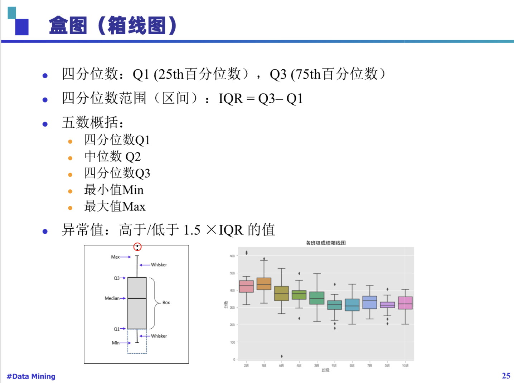
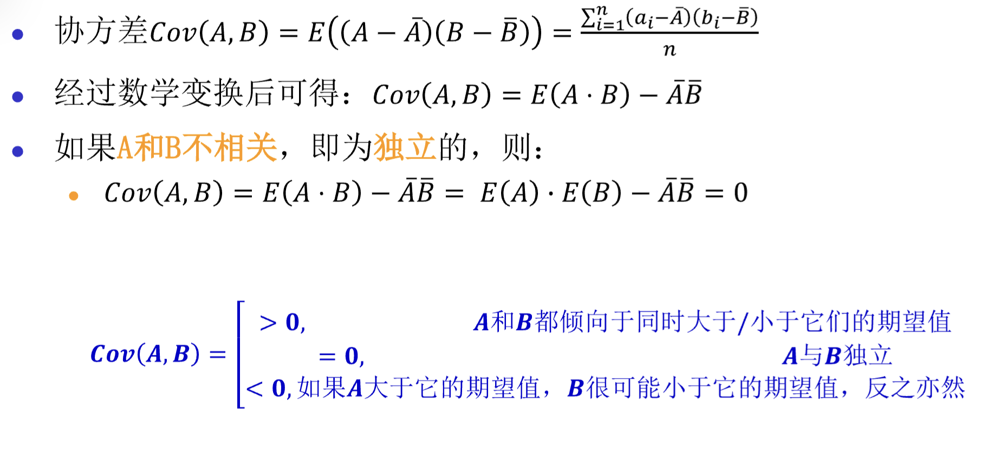
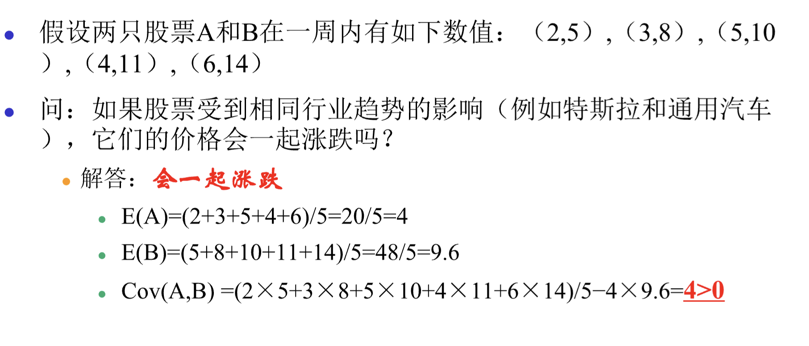
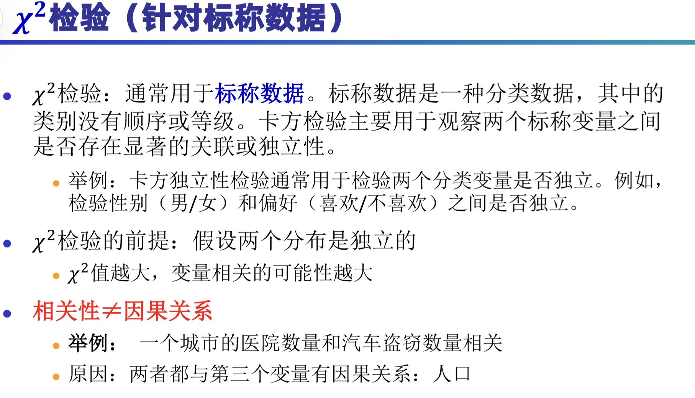
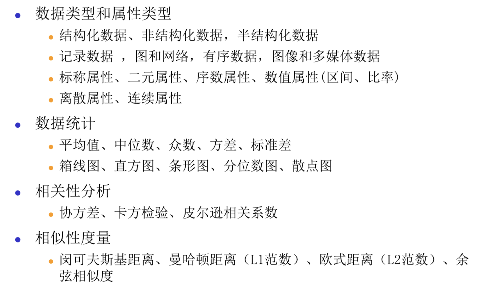
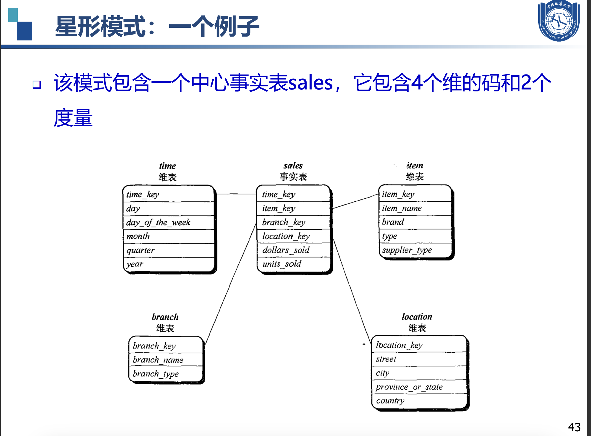
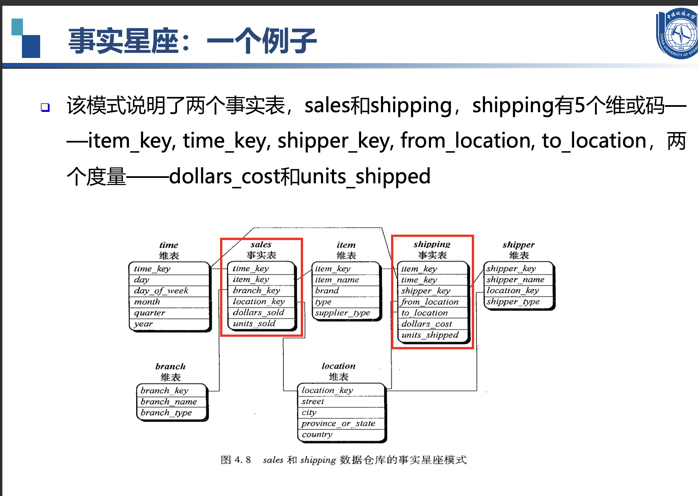
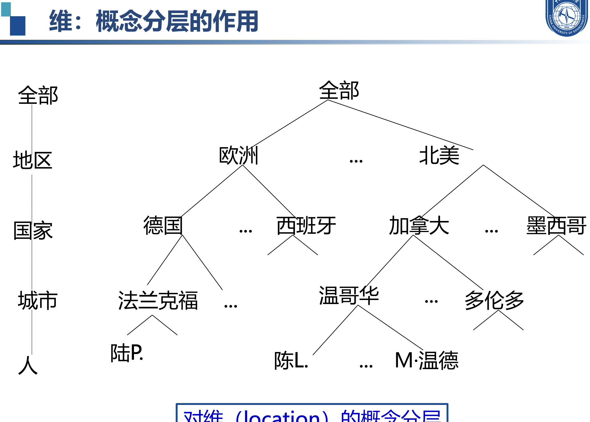
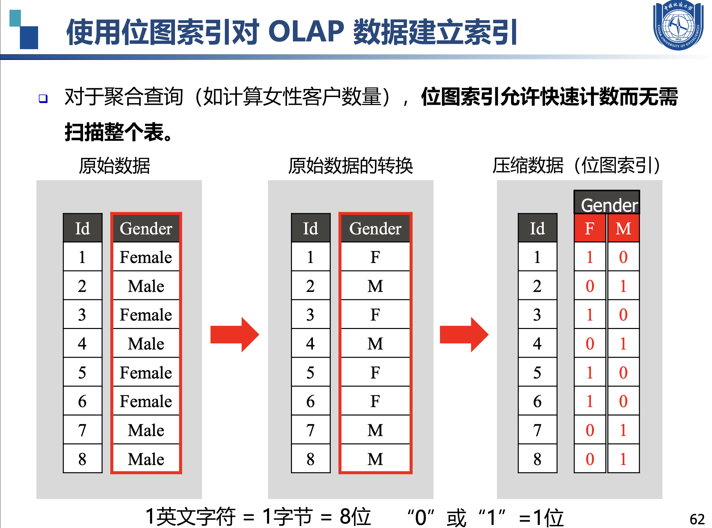

# 第一章
### 1. 数据对象与属性类型
- 数据集是由数据对象的集合构成，每个数据对象通过一组属性来描述。
- 属性可以是变量、特性、字段、特征、维度等。
- 数据对象可以是记录、点、向量、模式、事件、案例、样本、观测、实体等。

### 2. 属性的不同类型
- **分类属性（定性）**：标称属性（如员工ID、性别）、二元属性（如是否吸烟）、序数属性（如矿石硬度）。
- **数值属性（定量）**：区间标度属性（如日期、摄氏温度）、比率标度属性（如绝对温度、货币量、年龄）。

### 3. 数据集的类型
- **记录数据**：关系记录、关系表、数据矩阵、交易数据、文档数据。
- **图和网络**：交通网络、全球资讯网、分子结构、社交或信息网络。
- **有序数据**：视频数据、时间数据、顺序数据、基因序列数据。
- **空间、图像和多媒体数据**。

### 4. 数据统计的基本描述
- **集中趋势**：均值、中位数、众数。
- **分散度**：==极差、四分位数、方差、标准差、分位数极差。==
- **相关分析**：协方差、卡方检验、皮尔逊相关系数。
- **图形显示**：箱线图、直方图、条形图、分位数图、散点图。
#### 箱线图 
Q1 (25th百分位数），Q3 (75th百分位数）

#### 协方差 判断A与B是否相关

#### 卡方分布
+ 实际观测值与理论推断值之间的偏离程度

### 5. 度量数据的相似性与相异性

- **数据矩阵与相异矩阵**：数据矩阵是双模矩阵，相异矩阵是单模矩阵。
- **标称属性的邻近性度量**：简单匹配、使用大量二元属性。
- **二元属性的邻近性度量**：对称二元属性、非对称二元属性。
- **数值数据的相异性**：闵可夫斯基距离（包括曼哈顿距离和欧式距离）。
- **余弦相似性**：用于衡量文档或特征向量之间的相似度。

### 6. 数据预处理
- **数据清理**：处理缺失数据、平滑噪声数据、识别或删除异常值。
- **数据集成**：合并多个来源的数据，处理实体识别问题。
- **数据变换**：规范化、离散化、数据压缩、采样、概念层次生成。
- **数据降维**：特征选择、特征提取、主成分分析（PCA）。

### 7. 数据变换和降维的具体方法
- **规范化**：Min-Max 归一化、Z-score 归一化。
- **离散化**：分箱、直方图分析、聚类分析、决策树分析。
- **数据压缩**：无损压缩、有损压缩。
- **采样**：聚集、尺度变换、调整类别分布。
- **概念层次生成**：基于用户或专家指定的层次结构。

### 8. 特征选择和提取
- **特征选择**：选择最有信息增益的特征，减少特征数量。
- **特征提取**：在原有特征基础上创造新的特征，如PCA。

### 9. 特殊数据处理
- **不平衡数据**：处理类别分布不均的数据集，如通过采样方法改善数据分布。

这个PPT涵盖了数据挖掘中的数据预处理和特征工程的多个方面，是数据挖掘流程中非常重要的一部分。

# 第二章
### OLTP（联机事务处理）
特点：

面向事务：OLTP系统主要用于处理日常的业务操作，如订单处理、库存管理、银行交易等。
数据更新频繁：数据经常被插入、更新和删除。
实时性：需要快速响应，以支持实时交易。
操作复杂度低：通常涉及简单的CRUD（创建、读取、更新、删除）操作。
数据量相对较小：通常只包含当前和近期的数据。
数据存储格式：通常以行式存储，便于单条记录的快速读写。

---
例子：假设你在一个电子商务网站上购买商品。

你浏览商品（读取操作）。
你选择商品并添加到购物车（创建操作）。
你更新购物车中商品的数量（更新操作）。
你结账并完成购买（删除操作，从购物车中移除商品；创建操作，生成订单记录）。

### OLAP（联机分析处理）
特点：

面向分析：OLAP系统主要用于复杂的数据分析和决策支持，如销售分析、财务分析、市场趋势预测等。
数据更新不频繁：数据通常是静态的，只偶尔更新。
批量处理：OLAP操作通常涉及大量数据的聚合和汇总。
操作复杂度高：包括复杂的查询，如多维分析、数据挖掘等。
数据量通常很大：包含历史数据，用于趋势分析。
数据存储格式：通常以列式存储，便于进行聚合和分析。

---
例子：一个公司想要分析过去一年内不同地区的销售情况。

分析师可能会创建一个数据立方体，包含时间、产品和地区的维度。
他们可能会执行一个查询，以获取每个季度每个地区所有产品的总销售额。
分析师可能会使用钻取操作，从年度销售数据深入到月度数据，再深入到具体的产品类别。
他们可能会使用切片和切块操作，以比较不同地区或不同时间段的销售数据。

### 总结
OLTP 系统是为了支持日常业务操作而设计的，强调的是数据的实时更新和快速响应。
OLAP 系统是为了支持复杂的数据分析和决策制定而设计的，强调的是数据的聚合和多维分析。

### 数据库5个特征

1. **主题导向（Subject Oriented）**：
   - **例子**：一个零售公司的数据仓库可能会有“销售”、“客户”、“库存”和“财务”等主题区域。在“销售”主题下，所有与销售相关的数据，如销售额、销售渠道、销售地区等，都会被组织在一起，便于进行销售分析。

2. **集成性（Integrated）**：
   - **例子**：假设一个制造企业有多个部门，如生产、销售和客户服务，每个部门都有自己的数据库。数据仓库会从这些不同的数据库中提取数据，整合成一个统一的视图。例如，将销售数据库中的客户购买记录与生产数据库中的库存信息结合起来，以分析产品的销售情况和库存水平。

3. **时间变化（Time Variant）**：
   - **例子**：在分析销售趋势时，数据仓库能够提供不同时间点的销售数据，比如每月、每季度或每年。通过比较这些数据，分析师可以观察到产品销售随时间的变化情况，比如季节性波动或长期趋势。

4. **非易失性（Non-Volatile）**：
   - **例子**：一旦销售数据被加载到数据仓库中，它通常不会因日常操作而改变。例如，即使在原始的销售数据库中对某个订单进行了修改或取消，这些更改也不会反映在数据仓库中。数据仓库中的数据是稳定的，用于长期分析。

5. **汇总性（Summarized）**：
   - **例子**：数据仓库通常不存储每一笔单独的销售交易记录，而是存储按地区、产品类别或时间段汇总的销售总额。例如，数据仓库可能包含每个地区每月的总销售额，而不是每一笔单独交易的详细信息。这种汇总有助于快速进行高级分析，如市场趋势分析或年度财务报告。

让我们以一个零售公司的销售数据为例，来解释数据仓库建模中的一些关键概念。

### 基本方体
==基本方体是一个人，维度是人的一个方面。==

基本方体通常包含以下元素：

- **维度**：数据的不同属性，如时间、地点、产品等。
- **度量**：与维度相关联的数值数据，如销售额、利润等。
- **单元格**：维度的特定组合对应的度量值。

#### 例子

以零售公司的销售数据为例，我们可以构建一个基本方体，其中包含以下维度和度量：

- **维度**：
  - **时间**：年、季度、月、日。
  - **产品**：产品类别、产品名称。
  - **地区**：国家、省份、城市。

- **度量**：
  - **销售额**：每笔交易的总金额。
  - **销售数量**：销售的产品数量。

### 基本方体的结构

在星型模式的数据仓库中，基本方体通常与以下表格结构对应：

- **事实表**：包含度量和与维度表关联的外键。
- **维度表**：包含维度的描述性信息。

#### 基本方体的示例

假设我们有一个销售事实表，它记录了每笔交易的以下信息：

- 交易ID
- 日期（与时间维度表关联）
- 产品ID（与产品维度表关联）
- 地区ID（与地区维度表关联）
- 销售额
- 销售数量

这个事实表与三个维度表关联，形成了一个基本方体。分析师可以通过这个基本方体来执行多维分析，例如：

- **总销售额**：分析所有产品在所有地区在一年中的总销售额。
- **月度销售趋势**：分析每个月的销售额变化。
- **产品类别销售**：分析不同产品类别在特定地区的销售情况。

### 多维数据模型的模式

1. **星型模式（Star Schema）**：

   - **定义**：星型模式是一种数据仓库的模式，其中包含一个中心的事实表，周围是多个维度表。事实表与维度表通过外键关联。

   - **例子**：假设我们有一个销售事实表，它记录了每笔交易的销售额、时间戳和产品ID。维度表可能包括“产品”（产品ID、产品名称、类别）、“时间”（时间戳、年、季度、月、日）和“地区”（地区ID、地区名称、省份、城市）。这些维度表通过外键与销售事实表关联。

2. **雪花模式（Snowflake Schema）**：

   - **定义**：雪花模式是星型模式的一种变体，其中一个或多个维度表被进一步规范化为更小的维度表。

   - **例子**：在地区维度表中，我们可以将“省份”和“城市”进一步分离成两个独立的维度表，并通过外键与“地区”维度表关联。这样，“地区”维度表就会像雪花一样展开。

3. **事实星座模式（Fact Constellation Schema）**：

   - **定义**：事实星座模式包含多个事实表共享一个或多个维度表。这种模式适用于有多个业务过程需要分析的情况。

   - **例子**：除了销售事实表，零售公司可能还有一个客户服务事实表，记录客户反馈和投诉。这两个事实表可能共享“产品”和“地区”维度表，因为销售和客户服务都与这些维度有关。

### 概念层次结构

**定义**：概念层次结构是指在维度模型中，维度的属性可以有不同级别的汇总，形成一个层次结构。

**例子**：在“时间”维度表中，可以有一个时间层次结构，如“年”包含“季度”，“季度”包含“月”，“月”包含“日”。这种层次结构允许分析师在不同的时间粒度上进行分析。

### 度量

1. **度量分类**：
   - **定义**：度量是数据仓库中用于分析的数值数据。它们可以是可加的（如销售额）或不可加的（如客户数量）。

   - **例子**：在销售事实表中，销售额和销售数量是可加度量，因为它们可以在不同的维度上进行汇总（如总销售额）。而每笔交易的利润率则是一个不可加度量，因为它通常是基于单个交易计算的。

2. **度量计算**：
   - **定义**：度量的计算是指根据业务规则对度量进行计算或派生。

   - **例子**：在销售事实表中，我们可能有基本的度量如销售额和销售成本。但分析师可能想要计算毛利润，这就需要从销售额中减去销售成本。这个计算出的毛利润就是一个派生的度量。

通过这些例子，我们可以看到数据仓库建模是如何通过组织数据来支持复杂的数据分析和决策制定的。

### 位图
==把具体的数据变为二进制存储运算。在查询时可以更高效的检索，减少计算机的I/O，使得位运算更快。减少存贮所需空间。==

# 关联模式挖掘
在数据挖掘中，**支持度**和**置信度**是关联规则挖掘中两个非常重要的概念，常用于衡量两个或多个项目之间的关联性。

### 1. 支持度 (Support)
**支持度**衡量的是某个事件在所有数据中的出现频率，简单来说，就是某个组合在数据中出现的比例。它反映的是这些项目同时出现的普遍性。支持度越高，说明这个组合在数据集中越常见。

**通俗解释**：假设我们分析超市的购物数据，想知道有多少顾客同时买了牛奶和面包。如果超市100个顾客中有40个顾客买了这两样商品，那么“牛奶和面包”这一组合的支持度就是40/100 = 0.4 或 40%。

### 2. 置信度 (Confidence)
**置信度**表示在某些条件下发生一个事件的可能性，具体来说，置信度衡量的是在已经发生了一个事件的前提下，另一个事件发生的概率。它通常用于判断条件之间的因果关系。

**通俗解释**：还是以超市购物为例，如果有50个人买了牛奶，其中有40个人同时买了面包，那么“买了牛奶的顾客会买面包”的置信度就是 40/50 = 0.8 或 80%。这说明买了牛奶的顾客中有80%的人会买面包。

### 简单例子
假设我们有一组超市交易数据：

| 交易编号 | 购买的商品 |
| ------- | -------- |
| 1       | 牛奶, 面包 |
| 2       | 牛奶, 面包, 黄油 |
| 3       | 面包 |
| 4       | 牛奶, 黄油 |
| 5       | 面包, 黄油 |

我们要挖掘“牛奶 -> 面包”这个关联规则。

- **支持度**：共有5次交易，其中有2次（交易1和交易2）同时购买了牛奶和面包。所以支持度 = 2/5 = 0.4（40%）。
- **置信度**：有3次交易（交易1、交易2和交易4）中买了牛奶，其中2次同时也买了面包。所以置信度 = 2/3 ≈ 0.67（67%）。

**总结**：支持度反映的是某个组合在整体数据中出现的频率，置信度反映的是在某个条件下另一个事件发生的可能性。

# 决策树

### 信息熵
信息熵（Information Entropy）是信息论中的一个基本概念，用于衡量信息的随机性或不确定性，也就是信息的混乱程度或无序度。在这个例子中，信息熵衡量的是顾客是否会点甜点这一行为的不确定性。如果大部分顾客都会点甜点，或者大部分顾客都不会点甜点，那么信息熵就比较低，因为结果比较确定。但如果点甜点和不点甜点的顾客数量差不多，那么信息熵就比较高，因为结果比较不确定。
### 条件熵
条件熵（Conditional Entropy）表示在已知某个条件下，随机变量的不确定性。在这个例子中，条件熵可以衡量在已知顾客是否有小孩或是否点了主菜这些条件下，顾客是否会点甜点的不确定性。比如，如果已知顾客有小孩，那么他们点甜点的条件熵可能会降低，因为有小孩的顾客可能更倾向于点甜点。同样地，如果已知顾客点了主菜，那么他们点甜点的条件熵也可能会发生变化。
### 信息增益
信息增益（Information Gain）用于度量某个特征或属性对于分类任务的信息量提升程度。在这个例子中，信息增益可以衡量“是否有小孩”和“是否点了主菜”这两个特征对于预测顾客是否会点甜点这一行为的信息量提升程度。通过计算信息增益，可以选择出对预测结果最有影响力的特征。比如，如果“是否有小孩”这一特征的信息增益最大，那么就可以选择它作为划分节点，将顾客分为有小孩和无小孩两组，然后分别计算这两组顾客点甜点的概率。
综上所述，信息熵、条件熵和信息增益是信息论中的基本概念，它们在分类任务中起着重要的作用。通过计算这些指标，可以选择出对分类结果最有影响力的特征或属性，从而提高分类的准确性和效率。

##### 例子
好的，我们来详细解释一下信息增益，并结合刚才野餐的例子来计算它。

### 信息增益的定义

信息增益（Information Gain）是决策树算法中用来选择特征的一个指标，它衡量了特征对于样本分类结果的不确定性减少的程度。信息增益越大，说明该特征对于分类结果的影响越大。

### 信息增益的计算步骤

1. **计算数据集的初始信息熵**（Entropy）。
2. **计算每个特征划分后的信息熵**。
3. **计算每个特征的信息增益**，即初始信息熵减去特征划分后的信息熵的加权平均。

### 信息熵的计算

信息熵的计算公式为：
\[ Entropy(S) = -\sum_{i=1}^{n} p_i \log_2 p_i \]
其中，\( p_i \) 是数据集中第 \( i \) 类样本所占的比例。

### 信息增益的计算

信息增益的计算公式为：
\[ InfoGain(S, A) = Entropy(S) - \sum_{v \in Values(A)} \frac{|S_v|}{|S|} Entropy(S_v) \]
其中，\( S \) 是数据集，\( A \) 是特征，\( Values(A) \) 是特征 \( A \) 的所有可能值，\( S_v \) 是特征 \( A \) 取值为 \( v \) 时的数据子集，\( |S| \) 是数据集 \( S \) 的样本数量，\( |S_v| \) 是子集 \( S_v \) 的样本数量。

### ID3算法

决策树是一种常用的机器学习算法，用于分类和回归任务。ID3算法是构建决策树的经典算法之一，由Ross Quinlan在1986年提出。它的核心思想是使用信息增益（Information Gain）作为选择特征的标准，以递归的方式构建决策树。

##### ID3算法的主要步骤：

1. **计算信息熵**：首先计算数据集的信息熵，信息熵是衡量数据集随机性或无序程度的指标。信息熵越高，数据集的不确定性越大。

2. **计算信息增益**：对于数据集中的每个特征，计算该特征对数据集的信息增益。信息增益是特征划分前后信息熵的差值，信息增益越大，说明该特征对分类的贡献越大。
                                                                                                                                        
3. **选择最佳特征**：选择信息增益最大的特征作为节点，对数据集进行划分。

4. **递归构建子树**：对每个划分后的数据子集，重复上述步骤，直到满足停止条件（如所有样本属于同一类别，或没有更多特征，或达到预设的树深度）。

5. **构建决策树**：将上述过程的结果组合起来，形成完整的决策树。

#### 例子：野餐数据集

假设我们有以下简单的数据集，用于判断是否应该去野餐：

| 外出 | 天气 | 温度 | 湿度 | 风 | 是否去野餐 |
|------|------|------|------|----|----------|
| 是   | 晴朗 | 热   | 高   | 弱 | 否       |
| 是   | 晴朗 | 热   | 正常 | 强 | 是       |
| 否   | 雨   | 暖  | 高   | 强 | 否       |
| 是   | 雨   | 暖  | 正常 | 弱 | 是       |
| 是   | 晴朗 | 暖  | 正常 | 弱 | 是       |

1. **计算初始信息熵**：
   - 是否去野餐的类别有“是”和“否”，假设各占一半，信息熵为 \( -\frac{1}{2} \log_2 \frac{1}{2} - \frac{1}{2} \log_2 \frac{1}{2} = 1 \)。

2. **计算每个特征的信息增益**：
   - 对于“外出”特征，信息增益计算后为0.49。
   - 对于“天气”特征，信息增益计算后为0.44。
   - 对于“温度”特征，信息增益计算后为0.49。
   - 对于“湿度”特征，信息增益计算后为0.5。
   - 对于“风”特征，信息增益计算后为0.24。

3. **选择最佳特征**：“湿度”特征的信息增益最大，为0.5，因此选择“湿度”作为根节点。

4. **递归构建子树**：对“湿度=高”和“湿度=正常”的数据子集重复上述步骤。

5. **构建决策树**：最终构建的决策树将根据“湿度”、“温度”等特征进行分类，直到每个叶子节点的样本都属于同一类别。

通过这个例子，我们可以看到ID3算法是如何根据信息增益来选择特征，并递归地构建决策树的。

我们用野餐的例子来计算“天气”特征的信息增益。

#### 初始信息熵

首先，我们计算整个数据集的初始信息熵。假设“是”和“否”去野餐的样本数量相同，都是50%。

\[ Entropy(S) = -\left(\frac{1}{2} \log_2 \frac{1}{2} + \frac{1}{2} \log_2 \frac{1}{2}\right) = 1 \]

#### 计算“天气”特征划分后的信息熵

“天气”特征有两个可能的值：“晴朗”和“雨”。我们需要计算每个子集的信息熵，然后计算加权平均。

- **晴朗**：有3个样本，其中2个“是”，1个“否”。
  \[ Entropy(S_{晴朗}) = -\left(\frac{2}{3} \log_2 \frac{2}{3} + \frac{1}{3} \log_2 \frac{1}{3}\right) \approx 0.918 \]

- **雨**：有2个样本，其中1个“是”，1个“否”。
  \[ Entropy(S_{雨}) = -\left(\frac{1}{2} \log_2 \frac{1}{2} + \frac{1}{2} \log_2 \frac{1}{2}\right) = 1 \]

加权平均信息熵：
\[ \frac{3}{5} \times 0.918 + \frac{2}{5} \times 1 = 0.918 \times 0.6 + 1 \times 0.4 = 0.5508 + 0.4 = 0.9508 \]

#### 计算信息增益

\[ InfoGain(S, 天气) = Entropy(S) - \frac{3}{5} \times 0.918 + \frac{2}{5} \times 1 = 1 - 0.9508 = 0.0492 \]

这个值表示，使用“天气”特征可以减少约4.92%的不确定性。

### 过拟合
==过拟合就是模型在训练数据上学得太好了，以至于它失去了对新数据的预测能力==

过拟合（Overfitting）是机器学习和数据挖掘中一个常见的概念，它指的是模型在训练数据上表现得太好，以至于它记住了训练数据中的噪声和异常值，而没有从数据中学习到泛化的模式。这样的模型在新的、未见过的数据上表现不佳，因为它无法很好地进行预测或分类。
### 例子

假设我们正在使用数据挖掘技术来预测房价。我们收集了一组房屋的特征（如面积、卧室数量、位置等）和它们的价格。我们的目标是建立一个模型，能够根据房屋的特征来预测价格。

如果我们的模型过于复杂，它可能会在训练数据中的每一个小波动中寻找模式。比如，它可能发现在训练数据中，某个特定街区的所有房屋价格都比邻近街区高出5%，于是模型就学到了这个规律。然而，这个规律可能只是数据中的一个偶然现象，并不适用于所有房屋。

当我们用这个模型来预测新房屋的价格时，它可能在那些与训练数据相似的房屋上表现得不错，但是在其他类型的房屋上就会表现得很差。因为它学到了训练数据中的“噪声”，而不是房价的一般决定因素。

### 如何避免过拟合

1. **简化模型**：选择更简单的模型，减少模型复杂度。
2. **获取更多数据**：更多的训练数据可以帮助模型学习到更一般的模式。
3. **剪枝**：在决策树等模型中，通过剪枝来减少模型复杂度。
4. **交叉验证**：使用交叉验证来评估模型的泛化能力。
5. **正则化**：通过正则化技术（如L1或L2正则化）来限制模型的复杂度。

# KNN算法
KNN（K-Nearest Neighbors）算法是一种基于实例的学习方法，它的核心思想是：在一个有标签的数据集中，对于一个新的数据点，我们可以通过查找与这个新数据点最近的K个已知标签的数据点（即“邻居”），然后根据这些邻居的信息来预测新数据点的标签。

### 通俗解释

想象一下，你是一个房产中介，需要给一个新房子估价。你手头上有一堆过去卖出的房子的数据，包括它们的位置、大小、装修情况等信息，以及它们的售价。现在，你拿到一个新房子，你不知道它值多少钱，但你可以通过以下步骤来估计它的价格：

1. **确定距离度量**：首先，你需要决定用什么标准来衡量两套房子之间的“距离”。这可以是它们之间的实际距离，也可以是它们特征（如面积、房间数等）的差异。

2. **寻找邻居**：然后，你在已有的数据中找到与这个新房子在特征上最相似的几套房子（比如最近的5套，这就是K=5）。

3. **投票决定**：最后，你看看这些最相似的房子都卖多少钱，然后取一个平均值或者根据某种规则（比如中位数、众数）来决定新房子的价格。

### 实例说明

假设我们有一个简单的数据集，包含三个特征：房子的大小（平方米）、房间数和价格（万元）。我们的数据集如下：

| 大小（平方米） | 房间数 | 价格（万元） |
|--------------|------|----------|
| 100          | 3    | 500      |
| 120          | 3    | 600      |
| 80           | 2    | 400      |
| 150          | 4    | 700      |
| 90           | 2    | 450      |

现在，我们有一个新的房子，大小为110平方米，有3个房间，我们想知道它的价格。我们选择K=3，即我们要找3个最相似的房子。

1. **计算距离**：我们计算新房子与数据集中每个房子的距离。这里我们可以用欧氏距离，即 \(\sqrt{(大小差)^2 + (房间数差)^2}\)。

2. **选择K个最近邻居**：假设计算后，我们发现与新房子最相似的三套房子是大小100平方米、3个房间、价格500万元的房子，大小120平方米、3个房间、价格600万元的房子，以及大小90平方米、2个房间、价格450万元的房子。

3. **预测价格**：我们取这三套房子价格的平均值，即 \((500 + 600 + 450) / 3 = 513.33\) 万元。

因此，根据KNN算法，我们可以估计这个新房子的价格大约是513.33万元。

这就是KNN算法的基本逻辑，它简单直观，不需要训练过程，但计算量可能较大，且对于特征的尺度敏感，因此在实际应用中可能需要进行一些预处理，比如特征归一化。

# 线性分类器
线性分类器是一种机器学习算法，它的目标是找到一个线性决策边界，将数据集中的不同类别分开。这个决策边界通常是一个线性函数，它在特征空间中定义了一个超平面，数据点位于这个超平面的两侧，分别属于不同的类别。

### 通俗解释

想象一下，你有一个果园，里面种了苹果树和梨树。苹果树和梨树在某些特征上有所不同，比如树高、树冠大小等。现在，你想通过这些特征来区分哪些是苹果树，哪些是梨树。

1. **收集数据**：首先，你测量了一些苹果树和梨树的树高和树冠大小，并将这些数据记录下来。

2. **画一条线**：然后，你尝试在这些数据点之间画一条线，使得苹果树和梨树尽可能地分布在这条线的两侧。

3. **分类新树**：以后，每当你看到一棵新树，你只需要测量它的树高和树冠大小，然后看它落在这条线的哪一侧，就可以判断它是苹果树还是梨树。

### 实例说明

假设我们有一个简单的数据集，包含两个特征：树高（米）和树冠大小（平方米），以及每棵树的类别（苹果树或梨树）。我们的数据集如下：

| 树高（米） | 树冠大小（平方米） | 类别  |
|----------|----------------|-----|
| 5        | 10             | 苹果树 |
| 6        | 15             | 苹果树 |
| 4        | 8              | 梨树  |
| 3        | 6              | 梨树  |

现在，我们想用一个线性分类器来区分苹果树和梨树。

1. **选择模型**：我们选择一个线性模型，比如 \(y = mx + b\)，其中 \(y\) 是类别（1代表苹果树，0代表梨树），\(x\) 是特征（树高和树冠大小），\(m\) 是斜率，\(b\) 是截距。

2. **训练模型**：我们使用这些数据点来训练模型，找到最佳的 \(m\) 和 \(b\)，使得苹果树和梨树尽可能地分布在这条线的两侧。

3. **画出决策边界**：假设我们找到了一个模型，\(y = 0.5x_1 + 0.2x_2 - 10\)，其中 \(x_1\) 是树高，\(x_2\) 是树冠大小。

4. **分类新树**：现在，如果有一棵新树，树高5.5米，树冠大小12平方米，我们可以将这些值代入模型：\(y = 0.5 \times 5.5 + 0.2 \times 12 - 10 = 0.5\)。因为 \(y > 0.5\)，我们预测这棵树是苹果树。

这就是线性分类器的基本逻辑。它通过找到一个线性决策边界来区分不同的类别。这种方法在特征空间是线性可分的情况下效果很好，但在面对非线性可分的数据时，可能需要更复杂的模型，如支持向量机（SVM）或神经网络。
ß