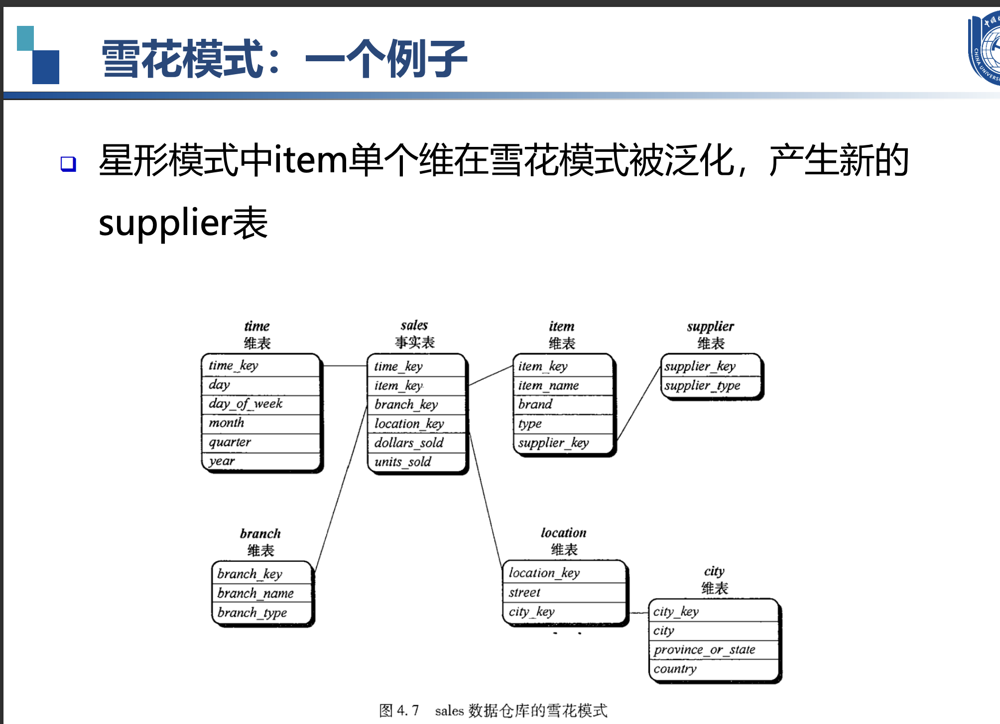

# 第一章
### 1. 数据对象与属性类型
- 数据集是由数据对象的集合构成，每个数据对象通过一组属性来描述。
- 属性可以是变量、特性、字段、特征、维度等。
- 数据对象可以是记录、点、向量、模式、事件、案例、样本、观测、实体等。

### 2. 属性的不同类型
- **分类属性（定性）**：标称属性（如员工ID、性别）、二元属性（如是否吸烟）、序数属性（如矿石硬度）。
- **数值属性（定量）**：区间标度属性（如日期、摄氏温度）、比率标度属性（如绝对温度、货币量、年龄）。

### 3. 数据集的类型
- **记录数据**：关系记录、关系表、数据矩阵、交易数据、文档数据。
- **图和网络**：交通网络、全球资讯网、分子结构、社交或信息网络。
- **有序数据**：视频数据、时间数据、顺序数据、基因序列数据。
- **空间、图像和多媒体数据**。

### 4. 数据统计的基本描述
- **集中趋势**：均值、中位数、众数。
- **分散度**：==极差、四分位数、方差、标准差、分位数极差。==
- **相关分析**：协方差、卡方检验、皮尔逊相关系数。
- **图形显示**：箱线图、直方图、条形图、分位数图、散点图。
#### 箱线图 
Q1 (25th百分位数），Q3 (75th百分位数）

#### 协方差 判断A与B是否相关

#### 卡方分布
+ 实际观测值与理论推断值之间的偏离程度

### 5. 度量数据的相似性与相异性

- **数据矩阵与相异矩阵**：数据矩阵是双模矩阵，相异矩阵是单模矩阵。
- **标称属性的邻近性度量**：简单匹配、使用大量二元属性。
- **二元属性的邻近性度量**：对称二元属性、非对称二元属性。
- **数值数据的相异性**：闵可夫斯基距离（包括曼哈顿距离和欧式距离）。
- **余弦相似性**：用于衡量文档或特征向量之间的相似度。

### 6. 数据预处理
- **数据清理**：处理缺失数据、平滑噪声数据、识别或删除异常值。
- **数据集成**：合并多个来源的数据，处理实体识别问题。
- **数据变换**：规范化、离散化、数据压缩、采样、概念层次生成。
- **数据降维**：特征选择、特征提取、主成分分析（PCA）。

### 7. 数据变换和降维的具体方法
- **规范化**：Min-Max 归一化、Z-score 归一化。
- **离散化**：分箱、直方图分析、聚类分析、决策树分析。
- **数据压缩**：无损压缩、有损压缩。
- **采样**：聚集、尺度变换、调整类别分布。
- **概念层次生成**：基于用户或专家指定的层次结构。

### 8. 特征选择和提取
- **特征选择**：选择最有信息增益的特征，减少特征数量。
- **特征提取**：在原有特征基础上创造新的特征，如PCA。

### 9. 特殊数据处理
- **不平衡数据**：处理类别分布不均的数据集，如通过采样方法改善数据分布。

这个PPT涵盖了数据挖掘中的数据预处理和特征工程的多个方面，是数据挖掘流程中非常重要的一部分。

# 第二章
### OLTP（联机事务处理）
特点：

面向事务：OLTP系统主要用于处理日常的业务操作，如订单处理、库存管理、银行交易等。
数据更新频繁：数据经常被插入、更新和删除。
实时性：需要快速响应，以支持实时交易。
操作复杂度低：通常涉及简单的CRUD（创建、读取、更新、删除）操作。
数据量相对较小：通常只包含当前和近期的数据。
数据存储格式：通常以行式存储，便于单条记录的快速读写。

---
例子：假设你在一个电子商务网站上购买商品。

你浏览商品（读取操作）。
你选择商品并添加到购物车（创建操作）。
你更新购物车中商品的数量（更新操作）。
你结账并完成购买（删除操作，从购物车中移除商品；创建操作，生成订单记录）。

### OLAP（联机分析处理）
特点：

面向分析：OLAP系统主要用于复杂的数据分析和决策支持，如销售分析、财务分析、市场趋势预测等。
数据更新不频繁：数据通常是静态的，只偶尔更新。
批量处理：OLAP操作通常涉及大量数据的聚合和汇总。
操作复杂度高：包括复杂的查询，如多维分析、数据挖掘等。
数据量通常很大：包含历史数据，用于趋势分析。
数据存储格式：通常以列式存储，便于进行聚合和分析。

---
例子：一个公司想要分析过去一年内不同地区的销售情况。

分析师可能会创建一个数据立方体，包含时间、产品和地区的维度。
他们可能会执行一个查询，以获取每个季度每个地区所有产品的总销售额。
分析师可能会使用钻取操作，从年度销售数据深入到月度数据，再深入到具体的产品类别。
他们可能会使用切片和切块操作，以比较不同地区或不同时间段的销售数据。

### 总结
OLTP 系统是为了支持日常业务操作而设计的，强调的是数据的实时更新和快速响应。
OLAP 系统是为了支持复杂的数据分析和决策制定而设计的，强调的是数据的聚合和多维分析。

### 数据库5个特征

1. **主题导向（Subject Oriented）**：
   - **例子**：一个零售公司的数据仓库可能会有“销售”、“客户”、“库存”和“财务”等主题区域。在“销售”主题下，所有与销售相关的数据，如销售额、销售渠道、销售地区等，都会被组织在一起，便于进行销售分析。

2. **集成性（Integrated）**：
   - **例子**：假设一个制造企业有多个部门，如生产、销售和客户服务，每个部门都有自己的数据库。数据仓库会从这些不同的数据库中提取数据，整合成一个统一的视图。例如，将销售数据库中的客户购买记录与生产数据库中的库存信息结合起来，以分析产品的销售情况和库存水平。

3. **时间变化（Time Variant）**：
   - **例子**：在分析销售趋势时，数据仓库能够提供不同时间点的销售数据，比如每月、每季度或每年。通过比较这些数据，分析师可以观察到产品销售随时间的变化情况，比如季节性波动或长期趋势。

4. **非易失性（Non-Volatile）**：
   - **例子**：一旦销售数据被加载到数据仓库中，它通常不会因日常操作而改变。例如，即使在原始的销售数据库中对某个订单进行了修改或取消，这些更改也不会反映在数据仓库中。数据仓库中的数据是稳定的，用于长期分析。

5. **汇总性（Summarized）**：
   - **例子**：数据仓库通常不存储每一笔单独的销售交易记录，而是存储按地区、产品类别或时间段汇总的销售总额。例如，数据仓库可能包含每个地区每月的总销售额，而不是每一笔单独交易的详细信息。这种汇总有助于快速进行高级分析，如市场趋势分析或年度财务报告。

让我们以一个零售公司的销售数据为例，来解释数据仓库建模中的一些关键概念。

### 基本方体
==基本方体是一个人，维度是人的一个方面。==

基本方体通常包含以下元素：

- **维度**：数据的不同属性，如时间、地点、产品等。
- **度量**：与维度相关联的数值数据，如销售额、利润等。
- **单元格**：维度的特定组合对应的度量值。

#### 例子

以零售公司的销售数据为例，我们可以构建一个基本方体，其中包含以下维度和度量：

- **维度**：
  - **时间**：年、季度、月、日。
  - **产品**：产品类别、产品名称。
  - **地区**：国家、省份、城市。

- **度量**：
  - **销售额**：每笔交易的总金额。
  - **销售数量**：销售的产品数量。

### 基本方体的结构

在星型模式的数据仓库中，基本方体通常与以下表格结构对应：

- **事实表**：包含度量和与维度表关联的外键。
- **维度表**：包含维度的描述性信息。

#### 基本方体的示例

假设我们有一个销售事实表，它记录了每笔交易的以下信息：

- 交易ID
- 日期（与时间维度表关联）
- 产品ID（与产品维度表关联）
- 地区ID（与地区维度表关联）
- 销售额
- 销售数量

这个事实表与三个维度表关联，形成了一个基本方体。分析师可以通过这个基本方体来执行多维分析，例如：

- **总销售额**：分析所有产品在所有地区在一年中的总销售额。
- **月度销售趋势**：分析每个月的销售额变化。
- **产品类别销售**：分析不同产品类别在特定地区的销售情况。

### 多维数据模型的模式

1. **星型模式（Star Schema）**：

   - **定义**：星型模式是一种数据仓库的模式，其中包含一个中心的事实表，周围是多个维度表。事实表与维度表通过外键关联。

   - **例子**：假设我们有一个销售事实表，它记录了每笔交易的销售额、时间戳和产品ID。维度表可能包括“产品”（产品ID、产品名称、类别）、“时间”（时间戳、年、季度、月、日）和“地区”（地区ID、地区名称、省份、城市）。这些维度表通过外键与销售事实表关联。

2. **雪花模式（Snowflake Schema）**：

   - **定义**：雪花模式是星型模式的一种变体，其中一个或多个维度表被进一步规范化为更小的维度表。

   - **例子**：在地区维度表中，我们可以将“省份”和“城市”进一步分离成两个独立的维度表，并通过外键与“地区”维度表关联。这样，“地区”维度表就会像雪花一样展开。

3. **事实星座模式（Fact Constellation Schema）**：

   - **定义**：事实星座模式包含多个事实表共享一个或多个维度表。这种模式适用于有多个业务过程需要分析的情况。

   - **例子**：除了销售事实表，零售公司可能还有一个客户服务事实表，记录客户反馈和投诉。这两个事实表可能共享“产品”和“地区”维度表，因为销售和客户服务都与这些维度有关。

### 概念层次结构

**定义**：概念层次结构是指在维度模型中，维度的属性可以有不同级别的汇总，形成一个层次结构。

**例子**：在“时间”维度表中，可以有一个时间层次结构，如“年”包含“季度”，“季度”包含“月”，“月”包含“日”。这种层次结构允许分析师在不同的时间粒度上进行分析。

### 度量

1. **度量分类**：
   - **定义**：度量是数据仓库中用于分析的数值数据。它们可以是可加的（如销售额）或不可加的（如客户数量）。

   - **例子**：在销售事实表中，销售额和销售数量是可加度量，因为它们可以在不同的维度上进行汇总（如总销售额）。而每笔交易的利润率则是一个不可加度量，因为它通常是基于单个交易计算的。

2. **度量计算**：
   - **定义**：度量的计算是指根据业务规则对度量进行计算或派生。

   - **例子**：在销售事实表中，我们可能有基本的度量如销售额和销售成本。但分析师可能想要计算毛利润，这就需要从销售额中减去销售成本。这个计算出的毛利润就是一个派生的度量。

通过这些例子，我们可以看到数据仓库建模是如何通过组织数据来支持复杂的数据分析和决策制定的。

### 位图
==把具体的数据变为二进制存储运算。在查询时可以更高效的检索，减少计算机的I/O，使得位运算更快。减少存贮所需空间。==

