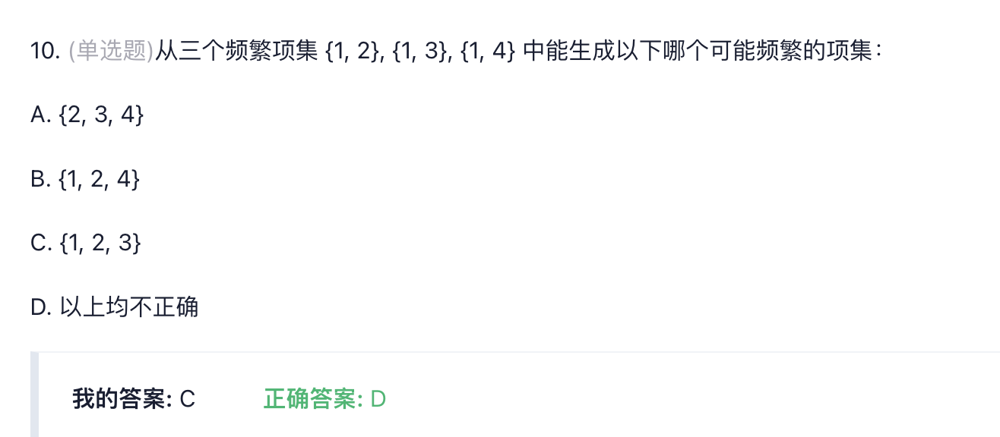
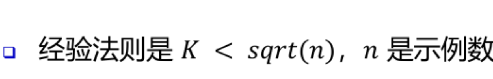
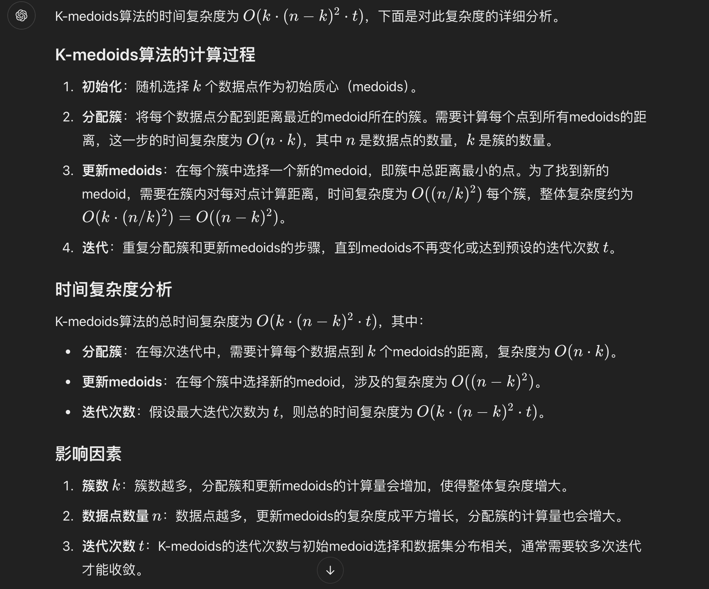

# 第二章
### 1. 数据对象与属性类型
- 数据集是由数据对象的集合构成，每个数据对象通过一组属性来描述。
- 属性可以是变量、特性、字段、特征、维度等。
- 数据对象可以是记录、点、向量、模式、事件、案例、样本、观测、实体等。

### 2. 属性的不同类型
- **分类属性（定性）**：标称属性（如员工ID、性别）、二元属性（如是否吸烟）、序数属性（如矿石硬度）。
- **数值属性（定量）**：区间标度属性（如日期、摄氏温度）、比率标度属性（如绝对温度、货币量、年龄）。

### 3. 数据集的类型
- **记录数据**：关系记录、关系表、数据矩阵、交易数据、文档数据。
- **图和网络**：交通网络、全球资讯网、分子结构、社交或信息网络。
- **有序数据**：视频数据、时间数据、顺序数据、基因序列数据。
- **空间、图像和多媒体数据**。

### ==4. 数据统计的基本描述==
- **集中趋势**：均值、中位数、众数。
- **分散度**：==极差、四分位数、方差、标准差、分位数极差。==
- **相关分析**：协方差、卡方检验、皮尔逊相关系数。
- **图形显示**：箱线图、直方图、条形图、分位数图、散点图。
#### 箱线图 
Q1 (25th百分位数），Q3 (75th百分位数）

#### 协方差 判断A与B是否相关

#### 卡方分布
+ 实际观测值与理论推断值之间的偏离程度

#### 皮尔逊相关系数

##### 举例

### 5. 度量数据的相似性与相异性

- **数据矩阵与相异矩阵**：数据矩阵是双模矩阵，相异矩阵是单模矩阵。
- **标称属性的邻近性度量**：简单匹配、使用大量二元属性。
- **二元属性的邻近性度量**：对称二元属性、非对称二元属性。
- **数值数据的相异性**：闵可夫斯基距离（包括曼哈顿距离和欧式距离）。
- **余弦相似性**：用于衡量文档或特征向量之间的相似度。

### ==6. 数据预处理==
- **数据清理**：处理缺失数据、平滑噪声数据、识别或删除异常值。
- **数据集成**：合并多个来源的数据，处理实体识别问题。
- **数据变换**：规范化、离散化、数据压缩、采样、概念层次生成。
- **数据降维**：特征选择、特征提取、主成分分析（PCA）。

### 7. 数据变换和降维的具体方法
- **规范化**：Min-Max 归一化、Z-score 归一化。
- **离散化**：分箱、直方图分析、聚类分析、决策树分析。
- **数据压缩**：无损压缩、有损压缩。
- **采样**：聚集、尺度变换、调整类别分布。
- **概念层次生成**：基于用户或专家指定的层次结构。

### 8. ==特征选择和提取==

- **特征选择**：选择最有信息增益的特征，减少特征数量。
- **特征提取**：在原有特征基础上创造新的特征，如PCA。

### 9. 特殊数据处理
- **不平衡数据**：处理类别分布不均的数据集，如通过采样方法改善数据分布。

这个PPT涵盖了数据挖掘中的数据预处理和特征工程的多个方面，是数据挖掘流程中非常重要的一部分。

### ==10.混淆矩阵==
以下是一个简单的混淆矩阵例子，帮助解释精确率、召回率、准确率和F1得分的概念。

假设我们有一个模型，用于预测是否会发生某种事件（例如邮件是否为垃圾邮件）。我们用以下数据构造一个混淆矩阵：

|              | 实际为正 (Positive) | 实际为负 (Negative) |
|--------------|---------------------|----------------------|
| 预测为正     | 50 (TP)             | 10 (FP)             |
| 预测为负     | 5 (FN)              | 100 (TN)            |

### 1. 精确率（Precision）

精确率是模型预测为正的样本中，实际为正的比例。

\[
\text{精确率} = \frac{TP}{TP + FP} = \frac{50}{50 + 10} = \frac{50}{60} \approx 0.833
\]

**解释**：精确率为0.833，表示模型预测的所有正样本中，有83.3%是真正的正样本。精确率越高，说明误报（即FP）越少。

### 2. 召回率（Recall）

召回率是所有实际为正的样本中，被正确预测为正的比例。

\[
\text{召回率} = \frac{TP}{TP + FN} = \frac{50}{50 + 5} = \frac{50}{55} \approx 0.909
\]

**解释**：召回率为0.909，说明所有实际正样本中，90.9%被模型成功识别为正样本。召回率越高，说明漏报（即FN）越少。

### 3. 准确率（Accuracy）

准确率是所有预测正确的样本在总样本中的比例。

\[
\text{准确率} = \frac{TP + TN}{TP + TN + FP + FN} = \frac{50 + 100}{50 + 100 + 10 + 5} = \frac{150}{165} \approx 0.909
\]

**解释**：准确率为0.909，表示总体上有90.9%的预测是正确的。然而，准确率可能在样本不平衡时导致误导，比如正负样本比例差异很大时，单看准确率不足以全面评估模型。

### 4. F1得分（F1 Score）

F1得分综合了精确率和召回率，用于衡量模型在平衡精确率和召回率上的表现。

\[
\text{F1得分} = \frac{2 \times \text{精确率} \times \text{召回率}}{\text{精确率} + \text{召回率}} = \frac{2 \times 0.833 \times 0.909}{0.833 + 0.909} \approx 0.87
\]

**解释**：F1得分为0.87，它作为精确率和召回率的平衡指标，表示模型在精确性和覆盖性之间的综合表现。

# 第三章
### OLTP（联机事务处理）
特点：

面向事务：OLTP系统主要用于处理日常的业务操作，如订单处理、库存管理、银行交易等。
数据更新频繁：数据经常被插入、更新和删除。
实时性：需要快速响应，以支持实时交易。
操作复杂度低：通常涉及简单的CRUD（创建、读取、更新、删除）操作。
数据量相对较小：通常只包含当前和近期的数据。
数据存储格式：通常以行式存储，便于单条记录的快速读写。

---
例子：假设你在一个电子商务网站上购买商品。

你浏览商品（读取操作）。
你选择商品并添加到购物车（创建操作）。
你更新购物车中商品的数量（更新操作）。
你结账并完成购买（删除操作，从购物车中移除商品；创建操作，生成订单记录）。

### OLAP（联机分析处理）
特点：

面向分析：OLAP系统主要用于复杂的数据分析和决策支持，如销售分析、财务分析、市场趋势预测等。
数据更新不频繁：数据通常是静态的，只偶尔更新。
批量处理：OLAP操作通常涉及大量数据的聚合和汇总。
操作复杂度高：包括复杂的查询，如多维分析、数据挖掘等。
数据量通常很大：包含历史数据，用于趋势分析。
数据存储格式：通常以列式存储，便于进行聚合和分析。

---
例子：一个公司想要分析过去一年内不同地区的销售情况。

分析师可能会创建一个数据立方体，包含时间、产品和地区的维度。
他们可能会执行一个查询，以获取每个季度每个地区所有产品的总销售额。
分析师可能会使用钻取操作，从年度销售数据深入到月度数据，再深入到具体的产品类别。
他们可能会使用切片和切块操作，以比较不同地区或不同时间段的销售数据。

### 总结
OLTP 系统是为了支持日常业务操作而设计的，强调的是数据的实时更新和快速响应。
OLAP 系统是为了支持复杂的数据分析和决策制定而设计的，强调的是数据的聚合和多维分析。

### 数据库5个特征

1. **主题导向（Subject Oriented）**：
   - **例子**：一个零售公司的数据仓库可能会有“销售”、“客户”、“库存”和“财务”等主题区域。在“销售”主题下，所有与销售相关的数据，如销售额、销售渠道、销售地区等，都会被组织在一起，便于进行销售分析。

2. **集成性（Integrated）**：
   - **例子**：假设一个制造企业有多个部门，如生产、销售和客户服务，每个部门都有自己的数据库。数据仓库会从这些不同的数据库中提取数据，整合成一个统一的视图。例如，将销售数据库中的客户购买记录与生产数据库中的库存信息结合起来，以分析产品的销售情况和库存水平。

3. **时间变化（Time Variant）**：
   - **例子**：在分析销售趋势时，数据仓库能够提供不同时间点的销售数据，比如每月、每季度或每年。通过比较这些数据，分析师可以观察到产品销售随时间的变化情况，比如季节性波动或长期趋势。

4. **非易失性（Non-Volatile）**：
   - **例子**：一旦销售数据被加载到数据仓库中，它通常不会因日常操作而改变。例如，即使在原始的销售数据库中对某个订单进行了修改或取消，这些更改也不会反映在数据仓库中。数据仓库中的数据是稳定的，用于长期分析。

5. **汇总性（Summarized）**：
   - **例子**：数据仓库通常不存储每一笔单独的销售交易记录，而是存储按地区、产品类别或时间段汇总的销售总额。例如，数据仓库可能包含每个地区每月的总销售额，而不是每一笔单独交易的详细信息。这种汇总有助于快速进行高级分析，如市场趋势分析或年度财务报告。

让我们以一个零售公司的销售数据为例，来解释数据仓库建模中的一些关键概念。

### 基本方体
==基本方体是一个人，维度是人的一个方面。==

基本方体通常包含以下元素：

- **维度**：数据的不同属性，如时间、地点、产品等。
- **度量**：与维度相关联的数值数据，如销售额、利润等。
- **单元格**：维度的特定组合对应的度量值。

#### 例子

以零售公司的销售数据为例，我们可以构建一个基本方体，其中包含以下维度和度量：

- **维度**：
  - **时间**：年、季度、月、日。
  - **产品**：产品类别、产品名称。
  - **地区**：国家、省份、城市。

- **度量**：
  - **销售额**：每笔交易的总金额。
  - **销售数量**：销售的产品数量。

### 基本方体的结构

在星型模式的数据仓库中，基本方体通常与以下表格结构对应：

- **事实表**：包含度量和与维度表关联的外键。
- **维度表**：包含维度的描述性信息。

#### 基本方体的示例

假设我们有一个销售事实表，它记录了每笔交易的以下信息：

- 交易ID
- 日期（与时间维度表关联）
- 产品ID（与产品维度表关联）
- 地区ID（与地区维度表关联）
- 销售额
- 销售数量

这个事实表与三个维度表关联，形成了一个基本方体。分析师可以通过这个基本方体来执行多维分析，例如：

- **总销售额**：分析所有产品在所有地区在一年中的总销售额。
- **月度销售趋势**：分析每个月的销售额变化。
- **产品类别销售**：分析不同产品类别在特定地区的销售情况。

## 冰山立方体和完全立方体

在数据仓库和 OLAP（联机分析处理）系统中，“立方体”是一种多维数据模型，用于快速、灵活地分析数据。**完全立方体**和**冰山立方体**是两种不同的立方体结构，在数据的存储和计算上各有优势。

---

#### 1. 完全立方体（Full Cube）

##### 概念
完全立方体是一种包含所有维度组合的立方体，也就是说，所有可能的维度和度量组合都预先计算并存储下来。这提供了最大的灵活性，因为每个维度组合的汇总数据都可以快速访问。

##### 通俗解释
可以把完全立方体想象成一本百科全书，每一页是不同维度（比如年、地区、产品）的组合汇总。查询任何维度的组合，都能在百科中直接找到。

##### 举例
假设有一个销售数据立方体，包含以下三个维度：**时间**、**地区**和**产品**，用来计算销售额。
- 如果是完全立方体，系统会提前计算所有组合，比如：
  - 全国所有产品在每一年中的总销售额
  - 北京地区每种产品在每季度的销售额
  - 每种产品在全国各地每个月的销售额

**优点**：可以快速地查询任意组合的数据。  
**缺点**：需要大量的存储空间，尤其是维度多、数据量大的时候，存储和计算成本非常高。

---

#### 2. 冰山立方体（Iceberg Cube）

##### 概念
冰山立方体是一种“按需计算”的立方体。它只计算和存储满足一定条件（如销售额高于某个阈值）的数据组合，不保存所有组合。这样大幅减少了存储空间和计算资源，但依然可以提供较为灵活的查询。

##### 通俗解释
冰山立方体类似于一本“精选的百科”，只保留重要的信息和常用的组合。数据量较小，却能满足大部分查询需求。

##### 举例
还是以销售数据为例，假设我们设置了一个阈值：只保留销售额超过 10 万的组合。
- 冰山立方体会只计算和存储那些销售额高于 10 万的维度组合，比如：
  - 全国每年中销售额超过 10 万的产品组合
  - 北京地区季度销售额超过 10 万的产品组合

**优点**：大幅减少了存储空间和计算时间。  
**缺点**：无法查询低于阈值的组合数据，不适合频繁需要全部组合数据的查询。

---

#### 总结对比

| 立方体类型      | 特点                                          | 适用场景                           |
|-----------------|-----------------------------------------------|------------------------------------|
| 完全立方体      | 包含所有维度组合，查询灵活但存储成本高        | 需要频繁查询所有组合的大型系统      |
| 冰山立方体      | 只存储符合条件的组合，存储成本低但查询有限    | 数据规模大，但只需关注特定组合的场景 |

完全立方体适合所有组合都重要的数据分析，而冰山立方体适合只关心高频或重要组合的查询需求。

### 数据仓库的模式

1. **星型模式（Star Schema）**：

   - **定义**：星型模式是一种数据仓库的模式，其中包含一个中心的事实表，周围是多个维度表。事实表与维度表通过外键关联。

   - **例子**：假设我们有一个销售事实表，它记录了每笔交易的销售额、时间戳和产品ID。维度表可能包括“产品”（产品ID、产品名称、类别）、“时间”（时间戳、年、季度、月、日）和“地区”（地区ID、地区名称、省份、城市）。这些维度表通过外键与销售事实表关联。

2. **雪花模式（Snowflake Schema）**：

   - **定义**：雪花模式是星型模式的一种变体，其中一个或多个维度表被进一步规范化为更小的维度表。

   - **例子**：在地区维度表中，我们可以将“省份”和“城市”进一步分离成两个独立的维度表，并通过外键与“地区”维度表关联。这样，“地区”维度表就会像雪花一样展开。

3. **事实星座模式（Fact Constellation Schema）**：

   - **定义**：事实星座模式包含多个事实表共享一个或多个维度表。这种模式适用于有多个业务过程需要分析的情况。

   - **例子**：除了销售事实表，零售公司可能还有一个客户服务事实表，记录客户反馈和投诉。这两个事实表可能共享“产品”和“地区”维度表，因为销售和客户服务都与这些维度有关。

   

### 概念层次结构

**定义**：概念层次结构是指在维度模型中，维度的属性可以有不同级别的汇总，形成一个层次结构。

**例子**：在“时间”维度表中，可以有一个时间层次结构，如“年”包含“季度”，“季度”包含“月”，“月”包含“日”。这种层次结构允许分析师在不同的时间粒度上进行分析。

### 度量

1. **度量分类**：
   - **定义**：度量是数据仓库中用于分析的数值数据。它们可以是可加的（如销售额）或不可加的（如客户数量）。

   - **例子**：在销售事实表中，销售额和销售数量是可加度量，因为它们可以在不同的维度上进行汇总（如总销售额）。而每笔交易的利润率则是一个不可加度量，因为它通常是基于单个交易计算的。

2. **度量计算**：
   - **定义**：度量的计算是指根据业务规则对度量进行计算或派生。

   - **例子**：在销售事实表中，我们可能有基本的度量如销售额和销售成本。但分析师可能想要计算毛利润，这就需要从销售额中减去销售成本。这个计算出的毛利润就是一个派生的度量。

通过这些例子，我们可以看到数据仓库建模是如何通过组织数据来支持复杂的数据分析和决策制定的。

### 位图
==把具体的数据变为二进制存储运算。在查询时可以更高效的检索，减少计算机的I/O，使得位运算更快。减少存贮所需空间。==

# 第四章

## OLTP 与 OLAP 概念与区别

#### 一、OLTP（Online Transaction Processing，在线事务处理）

##### 1. 定义
OLTP 是一种以**事务处理**为核心的数据库系统，专注于高效处理日常的简单操作，如插入、更新、删除等。它广泛应用于金融、电商、ERP 等系统中。

##### 2. 特点
- **高并发**：需要同时处理大量用户请求，响应速度快。
- **小型事务**：通常涉及少量的数据行，操作频率高。
- **数据一致性**：使用 ACID（原子性、一致性、隔离性、持久性）模型保障数据一致性。
- **快速响应**：响应速度通常在毫秒级，适合实时操作。

##### 3. 适用场景
适用于银行转账、订单处理、库存管理等需要频繁更新的场景。

---

#### 二、OLAP（Online Analytical Processing，在线分析处理）

##### 1. 定义
OLAP 是一种以**分析处理**为核心的数据库系统，专注于复杂的数据查询和分析，用于支持商业决策。它通常基于数据仓库，适合多维度的数据分析和复杂计算。

##### 2. 特点
- **低并发**：用户数量少，主要针对业务分析人员。
- **大规模数据查询**：常涉及大量数据行的聚合和过滤，适合批量分析。
- **数据集成与历史数据**：数据来自多个来源，并包含大量历史数据，用于趋势分析。
- **多维分析**：支持按时间、地域、产品等维度进行分析，常用数据立方体和数据透视表等技术。

##### 3. 适用场景
适用于市场分析、销售趋势、财务报告等场景，帮助企业在海量数据中提取信息，用于商业决策。

---

#### 三、OLTP 和 OLAP 的区别

| 特性         | OLTP                                        | OLAP                                         |
|--------------|---------------------------------------------|----------------------------------------------|
| **核心任务** | 在线事务处理，面向操作和实时数据更新        | 在线分析处理，面向数据分析和决策支持        |
| **用户**     | 操作人员、客户等需要实时交互的用户          | 数据分析人员、决策者                        |
| **数据量**   | 数据量小，单次操作影响有限                   | 数据量大，多来源数据和历史数据             |
| **操作类型** | 简单查询、插入、更新、删除等日常事务操作    | 复杂查询和聚合操作，主要是只读操作         |
| **响应速度** | 响应速度快，通常在毫秒级                    | 响应速度较慢，通常在秒级或更长             |
| **数据结构** | 基于标准化的关系型数据库，结构化存储         | 基于多维数据模型，可能是非标准化的         |
| **数据一致性**| 强调实时一致性，满足ACID要求                 | 相对弱一致性，数据更新周期长               |
| **示例场景** | 银行系统中的账户操作、订单管理系统           | 销售数据的月度统计、市场分析报告          |

##### 四、总结
- **OLTP** 注重事务的处理和实时响应，主要用于日常操作。
- **OLAP** 注重分析和决策支持，主要用于数据的深层次分析。

OLTP 和 OLAP 各自的设计和优化目标不同，因此在技术实现上存在显著差异。通常，企业将OLTP作为数据输入，OLAP作为分析系统的输出，通过数据仓库实现二者的数据流通与衔接。

## 支持度&置信度
在数据挖掘中，**支持度**和**置信度**是关联规则挖掘中两个非常重要的概念，常用于衡量两个或多个项目之间的关联性。

#### 1. 支持度 (Support)
**支持度**衡量的是某个事件在所有数据中的出现频率，简单来说，就是某个组合在数据中出现的比例。它反映的是这些项目同时出现的普遍性。支持度越高，说明这个组合在数据集中越常见。

**通俗解释**：假设我们分析超市的购物数据，想知道有多少顾客同时买了牛奶和面包。如果超市100个顾客中有40个顾客买了这两样商品，那么“牛奶和面包”这一组合的支持度就是40/100 = 0.4 或 40%。

#### 2. 置信度 (Confidence)
**置信度**表示在某些条件下发生一个事件的可能性，具体来说，置信度衡量的是在已经发生了一个事件的前提下，另一个事件发生的概率。它通常用于判断条件之间的因果关系。

**通俗解释**：还是以超市购物为例，如果有50个人买了牛奶，其中有40个人同时买了面包，那么“买了牛奶的顾客会买面包”的置信度就是 40/50 = 0.8 或 80%。这说明买了牛奶的顾客中有80%的人会买面包。

#### 简单例子
假设我们有一组超市交易数据：

| 交易编号 | 购买的商品 |
| ------- | -------- |
| 1       | 牛奶, 面包 |
| 2       | 牛奶, 面包, 黄油 |
| 3       | 面包 |
| 4       | 牛奶, 黄油 |
| 5       | 面包, 黄油 |

我们要挖掘“牛奶 -> 面包”这个关联规则。

- **支持度**：共有5次交易，其中有2次（交易1和交易2）同时购买了牛奶和面包。所以支持度 = 2/5 = 0.4（40%）。
- **置信度**：有3次交易（交易1、交易2和交易4）中买了牛奶，其中2次同时也买了面包。所以置信度 = 2/3 ≈ 0.67（67%）。

**总结**：支持度反映的是某个组合在整体数据中出现的频率，置信度反映的是在某个条件下另一个事件发生的可能性。

---
## OLAP操作
#### 1. 上卷（Roll-Up）

##### 定义
上卷是指对数据进行聚合操作，将数据从更细的粒度**汇总**到更粗的粒度。通常是在维度层级上**向上**聚合，比如从“天”汇总到“月”或者从“城市”汇总到“省”。

##### 举例
假设我们有一个销售数据立方体，包括“日期”、“地区”和“产品”三个维度。原始数据按天记录：
- **上卷操作**：将“日期”维度从“天”汇总到“月”，这样我们可以看到每个月的总销售量，而不是每天的具体销售量。

---

#### 2. 下钻（Drill-Down）

##### 定义
下钻是与上卷相反的操作，是在维度层级上**向下**展开数据，使数据粒度更加细化。这可以让用户查看更详细的数据。

##### 举例
继续以上的销售数据立方体，现在我们在“地区”维度上按“省”查看数据：
- **下钻操作**：将“省”细分到“城市”级别，这样我们可以看到每个城市的具体销售数据，而不是只看到省级别的总和。

---

#### 3. 切片（Slicing）

##### 定义
切片是指**固定一个维度的特定值**，从而获取数据立方体的一个子集，类似于选择一个平面。这使得我们可以专注于某一特定维度的具体值，分析该层面的数据情况。

##### 举例
假设我们希望分析特定月份的销售数据：
- **切片操作**：将“日期”维度固定在“2023年1月”，这样得到的数据子集仅包含2023年1月的销售情况，其他月份的数据将被过滤掉。

---

#### 4. 转轴（Pivoting）

##### 定义
转轴是指通过**重新排列维度**来改变数据视角。通过调整数据立方体的展示方式，使数据分析更直观。通常指将维度切换到行或列上。

##### 举例
在销售数据中，假设我们将“地区”维度放在行上，“产品”维度放在列上：
- **转轴操作**：交换“地区”和“产品”的位置，将“产品”移到行上，“地区”移到列上，这样可以更方便地比较不同产品在各地区的销售情况。

---

#### 总结

| 操作    | 定义                             | 举例                                                        |
|---------|----------------------------------|-------------------------------------------------------------|
| 上卷    | 从细粒度汇总到粗粒度             | 从“天”汇总到“月”查看总销售量                              |
| 下钻    | 从粗粒度展开到细粒度             | 从“省”下钻到“城市”查看详细销售数据                        |
| 切片    | 固定一个维度的特定值查看子集     | 选择“2023年1月”查看该月的销售数据                          |
| 转轴    | 重新排列维度，改变数据视角       | 将“产品”转到行，“地区”转到列，便于不同维度的比较          |

这些 OLAP 操作帮助用户从不同角度查看和分析数据，提升决策效率。

## OLAP 中的链接索引

#### 1. 定义
链接索引（Join Index）是一种优化 OLAP 查询性能的技术，特别是在数据仓库中用于多表关联的场景。链接索引预先存储了关联表之间的连接结果，使查询时可以更快速地从不同维度表中检索数据，减少数据扫描量，从而提升查询效率。

#### 2. 原理
在多维数据库或数据仓库的查询中，经常需要将事实表与维度表进行连接。链接索引提前生成并存储了这些连接的结果，避免了查询时的实时连接操作。查询时，系统可以直接使用链接索引的结果，快速定位目标数据。

#### 3. 应用场景
链接索引适用于需要频繁进行多表关联的大规模数据集，尤其是在维度表和事实表之间进行复杂关联操作的场景中。这些场景通常包括：

- **数据仓库中的星型和雪花型模型**：这些模型中，事实表与多个维度表关联，链接索引可以加速分析查询。
- **需要频繁连接操作的 OLAP 查询**：例如，需要不断切片或转轴分析的报表生成。

#### 4. 举例说明

假设一个零售数据仓库中有以下表：
- **事实表 Sales**：包含销售记录（订单 ID、客户 ID、产品 ID、销售金额、时间等）。
- **维度表 Customer**：包含客户信息（客户 ID、姓名、年龄、地区等）。
- **维度表 Product**：包含产品信息（产品 ID、名称、类别、品牌等）。

在不使用链接索引的情况下，如果要查询“特定地区的客户购买特定类别产品的总销售金额”，系统需要在查询时将 `Sales` 表与 `Customer` 和 `Product` 表进行连接。

- **使用链接索引的优化**：可以提前生成 `Sales` 与 `Customer` 表的连接索引，并生成 `Sales` 与 `Product` 表的连接索引。当查询执行时，系统可以直接从索引中查找数据，避免实时连接，提升查询效率。

#### 5. 优点与缺点

**优点**：
- 加速查询性能，特别是在多表连接查询的场景。
- 减少数据扫描量，提高数据分析的响应速度。

**缺点**：
- 链接索引需要占用额外的存储空间。
- 随着数据更新，链接索引也需要同步更新，带来一定的维护开销。

#### 6. 总结

链接索引是一种有效的 OLAP 查询优化手段，尤其适合多维数据模型中需要频繁进行连接操作的分析场景。通过预存连接结果，链接索引显著提升了查询速度，广泛应用于数据仓库和 OLAP 系统中。

## 数据仓库中的水平存储和垂直存储

在数据仓库中，数据的存储方式会影响查询的效率和性能。常用的存储方式有**水平存储**和**垂直存储**，两者在数据组织和访问上有不同的特点。

---

#### 1. 水平存储（Row-Oriented Storage）

##### 概念
水平存储，也叫**行存储**，是将每条记录按行存储的方式。每一行代表一条完整的记录，每一列是该记录的一个字段。关系型数据库通常使用这种存储方式。

##### 通俗解释
可以把水平存储想象成一个表格，每行是一个“人的信息卡片”，包含该人所有的属性，如姓名、年龄、性别、地址等。每次查询时，会读取整行的数据。

##### 举例
假设有一个顾客信息表，包含以下字段：
- **行 1**：张三，30岁，男，上海
- **行 2**：李四，25岁，女，北京

在水平存储中，整行数据一起存储在一处，读取时会一次性提取完整记录。  
**适用场景**：适用于需要频繁读取整条记录的操作，比如在交易型数据库（OLTP）中，通常需要操作单条记录（如修改某个客户的地址）。

##### 优缺点
- **优点**：写入和读取单条记录时效率较高，尤其适合增删改查操作。
- **缺点**：不适合只查询某些字段的操作，因为需要读取整条记录，会导致不必要的数据读取，影响效率。

---

#### 2. 垂直存储（Column-Oriented Storage）

##### 概念
垂直存储，也叫**列存储**，是将每一个字段（列）按列独立存储的方式。每列是一个字段的所有数据，所有列组合成完整的表。

##### 通俗解释
垂直存储可以理解为一本书，其中每一页只包含某一个属性。例如，一页是所有人的年龄，另一页是所有人的性别等。这样，当查询某个属性时，只需找到对应的页（列）即可，不用翻阅整行数据。

##### 举例
使用相同的顾客信息表：
- **列 1（姓名）**：张三，李四，王五
- **列 2（年龄）**：30，25，22
- **列 3（性别）**：男，女，男
- **列 4（城市）**：上海，北京，广州

在垂直存储中，每列数据独立存储。当查询年龄或性别时，只需读取对应的列，减少了不必要的读取。  
**适用场景**：适用于分析型数据库（OLAP），因为分析查询通常只涉及部分字段（如年龄、性别的分布），垂直存储更高效。

##### 优缺点
- **优点**：查询某一列或某些列时效率高，适合大规模分析性查询。
- **缺点**：写入时效率较低，因为每次插入数据需要分别写入多列。

---

#### 总结对比

| 存储方式    | 特点                                          | 适用场景          |
|-------------|-----------------------------------------------|-------------------|
| 水平存储    | 每条记录按行存储，适合操作整条记录的数据       | OLTP 系统         |
| 垂直存储    | 每个字段按列存储，适合分析只需部分字段的数据   | OLAP 系统         |

水平存储和垂直存储各自适用于不同的场景，在设计数据仓库时，应根据实际应用的需求来选择最合适的存储方式。

## 提升度（Lift）在数据挖掘中的概念和应用

**提升度（Lift**是数据挖掘中常用的一个衡量指标，主要用于评估两个事件之间的关联强度。它可以帮助我们判断关联规则是否有实际意义，或者是否只是由于事件发生的频率高而产生的偶然关系。

#### 提升度的定义

提升度的公式如下：

\[
\text{提升度} = \frac{P(A \cap B)}{P(A) \times P(B)}
\]

其中：
- \( P(A \cap B) \) 是事件 \( A \) 和 \( B \) 同时发生的概率。
- \( P(A) \times P(B) \) 是在事件 \( A \) 和 \( B \) 独立的情况下，它们同时发生的期望概率。

根据提升度的值可以得出以下结论：
- **提升度 > 1**：表示 \( A \) 和 \( B \) 之间存在正关联，即同时出现的概率高于独立情况下的期望。
- **提升度 = 1**：表示 \( A \) 和 \( B \) 是相互独立的。
- **提升度 < 1**：表示 \( A \) 和 \( B \) 之间可能存在负关联。

#### 举例说明

假设在一个超市的商品交易记录中，有如下频率：
- 购买面包的概率 \( P(\text{面包}) = 0.4 \)
- 购买牛奶的概率 \( P(\text{牛奶}) = 0.3 \)
- 同时购买面包和牛奶的概率 \( P(\text{面包} \cap \text{牛奶}) = 0.2 \)

#### 计算提升度

我们可以计算面包和牛奶同时购买的提升度：

\[
\text{提升度} = \frac{P(\text{面包} \cap \text{牛奶})}{P(\text{面包}) \times P(\text{牛奶})} = \frac{0.2}{0.4 \times 0.3} = \frac{0.2}{0.12} = 1.67
\]

**解释**：提升度为 1.67，表示面包和牛奶的联合购买率高于它们各自独立发生的期望频率。即购买面包的顾客购买牛奶的概率较高，说明二者有一定的关联性。

#### 提升度的应用

提升度在市场分析、推荐系统、零售业等多个领域有广泛应用。通过提升度，零售商可以识别出商品组合之间的强关联性，并优化商品陈列和促销策略。例如，超市可以将面包和牛奶放置在较近的位置，方便顾客一次性购买，从而提升销售额。

提升度的作用在于帮助决策者了解关联关系的强度，为优化资源分配和提高销售业绩提供依据。

# 决策树

### 信息熵
信息熵（Information Entropy）是信息论中的一个基本概念，用于衡量信息的随机性或不确定性，也就是信息的混乱程度或无序度。在这个例子中，信息熵衡量的是顾客是否会点甜点这一行为的不确定性。如果大部分顾客都会点甜点，或者大部分顾客都不会点甜点，那么信息熵就比较低，因为结果比较确定。但如果点甜点和不点甜点的顾客数量差不多，那么信息熵就比较高，因为结果比较不确定。
### 条件熵
条件熵（Conditional Entropy）表示在已知某个条件下，随机变量的不确定性。在这个例子中，条件熵可以衡量在已知顾客是否有小孩或是否点了主菜这些条件下，顾客是否会点甜点的不确定性。比如，如果已知顾客有小孩，那么他们点甜点的条件熵可能会降低，因为有小孩的顾客可能更倾向于点甜点。同样地，如果已知顾客点了主菜，那么他们点甜点的条件熵也可能会发生变化。
### 信息增益
信息增益（Information Gain）用于度量某个特征或属性对于分类任务的信息量提升程度。在这个例子中，信息增益可以衡量“是否有小孩”和“是否点了主菜”这两个特征对于预测顾客是否会点甜点这一行为的信息量提升程度。通过计算信息增益，可以选择出对预测结果最有影响力的特征。比如，如果“是否有小孩”这一特征的信息增益最大，那么就可以选择它作为划分节点，将顾客分为有小孩和无小孩两组，然后分别计算这两组顾客点甜点的概率。
综上所述，信息熵、条件熵和信息增益是信息论中的基本概念，它们在分类任务中起着重要的作用。通过计算这些指标，可以选择出对分类结果最有影响力的特征或属性，从而提高分类的准确性和效率。

##### 例子
好的，我们来详细解释一下信息增益，并结合刚才野餐的例子来计算它。

### 信息增益的定义

信息增益（Information Gain）是决策树算法中用来选择特征的一个指标，它衡量了特征对于样本分类结果的不确定性减少的程度。信息增益越大，说明该特征对于分类结果的影响越大。

### 信息增益的计算步骤

1. **计算数据集的初始信息熵**（Entropy）。
2. **计算每个特征划分后的信息熵**。
3. **计算每个特征的信息增益**，即初始信息熵减去特征划分后的信息熵的加权平均。

### 信息熵的计算

信息熵的计算公式为：
\[ Entropy(S) = -\sum_{i=1}^{n} p_i \log_2 p_i \]
其中，\( p_i \) 是数据集中第 \( i \) 类样本所占的比例。

### 信息增益的计算

信息增益的计算公式为：
\[ InfoGain(S, A) = Entropy(S) - \sum_{v \in Values(A)} \frac{|S_v|}{|S|} Entropy(S_v) \]
其中，\( S \) 是数据集，\( A \) 是特征，\( Values(A) \) 是特征 \( A \) 的所有可能值，\( S_v \) 是特征 \( A \) 取值为 \( v \) 时的数据子集，\( |S| \) 是数据集 \( S \) 的样本数量，\( |S_v| \) 是子集 \( S_v \) 的样本数量。

## ID3算法

决策树是一种常用的机器学习算法，用于分类和回归任务。ID3算法是构建决策树的经典算法之一，由Ross Quinlan在1986年提出。它的核心思想是使用信息增益（Information Gain）作为选择特征的标准，以递归的方式构建决策树。

##### ID3算法的主要步骤：

1. **计算信息熵**：首先计算数据集的信息熵，信息熵是衡量数据集随机性或无序程度的指标。信息熵越高，数据集的不确定性越大。

2. **计算信息增益**：对于数据集中的每个特征，计算该特征对数据集的信息增益。信息增益是特征划分前后信息熵的差值，信息增益越大，说明该特征对分类的贡献越大。
                                                                                                                                        
3. **选择最佳特征**：选择信息增益最大的特征作为节点，对数据集进行划分。

4. **递归构建子树**：对每个划分后的数据子集，重复上述步骤，直到满足停止条件（如所有样本属于同一类别，或没有更多特征，或达到预设的树深度）。

5. **构建决策树**：将上述过程的结果组合起来，形成完整的决策树。

#### 例子：野餐数据集

假设我们有以下简单的数据集，用于判断是否应该去野餐：

| 外出 | 天气 | 温度 | 湿度 | 风 | 是否去野餐 |
|------|------|------|------|----|----------|
| 是   | 晴朗 | 热   | 高   | 弱 | 否       |
| 是   | 晴朗 | 热   | 正常 | 强 | 是       |
| 否   | 雨   | 暖  | 高   | 强 | 否       |
| 是   | 雨   | 暖  | 正常 | 弱 | 是       |
| 是   | 晴朗 | 暖  | 正常 | 弱 | 是       |

1. **计算初始信息熵**：
   - 是否去野餐的类别有“是”和“否”，假设各占一半，信息熵为 \( -\frac{1}{2} \log_2 \frac{1}{2} - \frac{1}{2} \log_2 \frac{1}{2} = 1 \)。

2. **计算每个特征的信息增益**：
   - 对于“外出”特征，信息增益计算后为0.49。
   - 对于“天气”特征，信息增益计算后为0.44。
   - 对于“温度”特征，信息增益计算后为0.49。
   - 对于“湿度”特征，信息增益计算后为0.5。
   - 对于“风”特征，信息增益计算后为0.24。

3. **选择最佳特征**：“湿度”特征的信息增益最大，为0.5，因此选择“湿度”作为根节点。

4. **递归构建子树**：对“湿度=高”和“湿度=正常”的数据子集重复上述步骤。

5. **构建决策树**：最终构建的决策树将根据“湿度”、“温度”等特征进行分类，直到每个叶子节点的样本都属于同一类别。

通过这个例子，我们可以看到ID3算法是如何根据信息增益来选择特征，并递归地构建决策树的。

我们用野餐的例子来计算“天气”特征的信息增益。

#### 初始信息熵

首先，我们计算整个数据集的初始信息熵。假设“是”和“否”去野餐的样本数量相同，都是50%。

\[ Entropy(S) = -\left(\frac{1}{2} \log_2 \frac{1}{2} + \frac{1}{2} \log_2 \frac{1}{2}\right) = 1 \]

#### 计算“天气”特征划分后的信息熵

“天气”特征有两个可能的值：“晴朗”和“雨”。我们需要计算每个子集的信息熵，然后计算加权平均。

- **晴朗**：有3个样本，其中2个“是”，1个“否”。
  \[ Entropy(S_{晴朗}) = -\left(\frac{2}{3} \log_2 \frac{2}{3} + \frac{1}{3} \log_2 \frac{1}{3}\right) \approx 0.918 \]

- **雨**：有2个样本，其中1个“是”，1个“否”。
  \[ Entropy(S_{雨}) = -\left(\frac{1}{2} \log_2 \frac{1}{2} + \frac{1}{2} \log_2 \frac{1}{2}\right) = 1 \]

加权平均信息熵：
\[ \frac{3}{5} \times 0.918 + \frac{2}{5} \times 1 = 0.918 \times 0.6 + 1 \times 0.4 = 0.5508 + 0.4 = 0.9508 \]

#### 计算信息增益

\[ InfoGain(S, 天气) = Entropy(S) - \frac{3}{5} \times 0.918 + \frac{2}{5} \times 1 = 1 - 0.9508 = 0.0492 \]

这个值表示，使用“天气”特征可以减少约4.92%的不确定性。

## ID3、C4.5 和 CART

在数据挖掘中，ID3、C4.5 和 CART 是三种常见的决策树算法，它们可以帮助我们自动分类和预测数据。决策树算法通过一系列问题的回答，来分割数据集，最终达到分类或回归的目的。下面分别介绍这三种算法的作用、原理，并举例辅助解释。

1. ID3算法

作用：ID3算法用于构建决策树，用于分类问题。
原理：ID3使用信息增益来选择分割特征。信息增益表示一个特征在分割数据时减少不确定性的程度，增益越大，特征越适合用来分割数据。

举例：
假设我们想判断一个天气条件是否适合打球，我们有几个特征：天气情况（晴天、阴天、雨天）、温度（高、中、低）、湿度（高、低）、风速（强、弱）。ID3算法会计算每个特征的信息增益，选取信息增益最大的特征（比如天气情况），作为根节点来分割数据。然后对每个分支再递归选择下一个信息增益最大的特征，直到数据被分好类（适合或不适合打球）。

2. C4.5算法

作用：C4.5是ID3算法的改进版本，用于处理分类问题。
原理：C4.5使用信息增益比来选择分割特征，能够更好地避免特征选择偏向问题。同时，C4.5支持连续值特征（如温度：22.5度）和处理缺失值，并且允许对数据进行剪枝来简化决策树。

举例：
还是以打球的天气数据为例，如果温度是一个连续的数值（如25度、30度），ID3处理连续值会比较困难。C4.5会对温度特征设置多个阈值，比如分为“高于25度”和“低于25度”两类。这样能更灵活地处理连续数据。同时，C4.5会自动剪枝，移除不必要的分支，生成更简洁的树。

3. CART算法

作用：CART算法（Classification and Regression Trees，分类和回归树）不仅可以处理分类问题，也可以处理回归问题。
原理：CART使用基尼指数来选择分割特征，并构建二叉树（每次分割数据只有两个分支）。基尼指数衡量样本中任意两个样本的相似性。与ID3和C4.5不同，CART不使用信息增益，而是用基尼指数，生成的树结构更简单。

举例：
例如，我们有顾客购买意向的数据（购买/不购买），以及顾客的收入、年龄等特征。CART会基于基尼指数选择最适合的特征来分割数据，生成简单的二叉树。若处理的是分类问题，树叶节点为类别标签；若是回归问题，节点就是一个具体的数值预测值。

总结三者区别

	1.	算法基础：
	•	ID3基于信息增益；
	•	C4.5基于信息增益比（适合处理多值特征）；
	•	CART基于基尼指数。
	2.	分割方式：
	•	ID3和C4.5生成多叉树；
	•	CART生成二叉树。
	3.	数据类型：
	•	ID3不适合处理连续值；
	•	C4.5和CART支持连续值特征，其中C4.5通过阈值划分，CART可以处理分类和回归任务。

这三种算法都用于构建决策树，主要区别在于特征选择的策略和处理不同类型数据的能力。

## 过拟合
==过拟合就是模型在训练数据上学得太好了，以至于它失去了对新数据的预测能力==

过拟合（Overfitting）是机器学习和数据挖掘中一个常见的概念，它指的是模型在训练数据上表现得太好，以至于它记住了训练数据中的噪声和异常值，而没有从数据中学习到泛化的模式。这样的模型在新的、未见过的数据上表现不佳，因为它无法很好地进行预测或分类。
#### 例子

假设我们正在使用数据挖掘技术来预测房价。我们收集了一组房屋的特征（如面积、卧室数量、位置等）和它们的价格。我们的目标是建立一个模型，能够根据房屋的特征来预测价格。

如果我们的模型过于复杂，它可能会在训练数据中的每一个小波动中寻找模式。比如，它可能发现在训练数据中，某个特定街区的所有房屋价格都比邻近街区高出5%，于是模型就学到了这个规律。然而，这个规律可能只是数据中的一个偶然现象，并不适用于所有房屋。

当我们用这个模型来预测新房屋的价格时，它可能在那些与训练数据相似的房屋上表现得不错，但是在其他类型的房屋上就会表现得很差。因为它学到了训练数据中的“噪声”，而不是房价的一般决定因素。

#### 如何避免过拟合

1. **简化模型**：选择更简单的模型，减少模型复杂度。
2. **获取更多数据**：更多的训练数据可以帮助模型学习到更一般的模式。
3. **剪枝**：在决策树等模型中，通过剪枝来减少模型复杂度。
4. **交叉验证**：使用交叉验证来评估模型的泛化能力。
5. **正则化**：通过正则化技术（如L1或L2正则化）来限制模型的复杂度。

## 简答题

# 第五章
## 计算后验概率

我们要计算的后验概率是在下雨的情况下发生交通拥堵的概率，即 \( P(\text{Traffic}|\text{Rain}) \)。根据贝叶斯公式：

\[
P(\text{Traffic}|\text{Rain}) = \frac{P(\text{Rain}|\text{Traffic}) \cdot P(\text{Traffic})}{P(\text{Rain})}
\]

==堵车概率在下雨时 = （下雨概率在堵车时 * 堵车概率） / 下雨概率==

## 推导

#### 已知信息
1. 先验概率 \( P(\text{Traffic}) = 0.4 \)：交通拥堵的概率为 0.4。
2. 条件概率 \( P(\text{Rain}|\text{Traffic}) = 0.7 \)：在交通拥堵的情况下，下雨的概率是 0.7。
3. 无条件概率 \( P(\text{Rain}) = 0.5 \)：下雨的总体概率是 0.5。

#### 代入计算

\[
P(\text{Traffic}|\text{Rain}) = \frac{0.7 \times 0.4}{0.5}
\]

\[
P(\text{Traffic}|\text{Rain}) = \frac{0.28}{0.5} = 0.56
\]

#### 结果解释

在下雨的情况下，发生交通拥堵的后验概率为 **0.56**，即 56%。这一结果比先验概率 40% 高，表明下雨增加了交通拥堵的可能性。

## KNN算法（K近邻）
KNN（K-Nearest Neighbors）算法是一种基于实例的学习方法，它的核心思想是：在一个有标签的数据集中，对于一个新的数据点，我们可以通过查找与这个新数据点最近的K个已知标签的数据点（即“邻居”），然后根据这些邻居的信息来预测新数据点的标签。

#### 通俗解释

想象一下，你是一个房产中介，需要给一个新房子估价。你手头上有一堆过去卖出的房子的数据，包括它们的位置、大小、装修情况等信息，以及它们的售价。现在，你拿到一个新房子，你不知道它值多少钱，但你可以通过以下步骤来估计它的价格：

1. **确定距离度量**：首先，你需要决定用什么标准来衡量两套房子之间的“距离”。这可以是它们之间的实际距离，也可以是它们特征（如面积、房间数等）的差异。

2. **寻找邻居**：然后，你在已有的数据中找到与这个新房子在特征上最相似的几套房子（比如最近的5套，这就是K=5）。

3. **投票决定**：最后，你看看这些最相似的房子都卖多少钱，然后取一个平均值或者根据某种规则（比如中位数、众数）来决定新房子的价格。

#### 实例说明

假设我们有一个简单的数据集，包含三个特征：房子的大小（平方米）、房间数和价格（万元）。我们的数据集如下：

| 大小（平方米） | 房间数 | 价格（万元） |
|--------------|------|----------|
| 100          | 3    | 500      |
| 120          | 3    | 600      |
| 80           | 2    | 400      |
| 150          | 4    | 700      |
| 90           | 2    | 450      |

现在，我们有一个新的房子，大小为110平方米，有3个房间，我们想知道它的价格。我们选择K=3，即我们要找3个最相似的房子。

1. **计算距离**：我们计算新房子与数据集中每个房子的距离。这里我们可以用欧氏距离，即 \(\sqrt{(大小差)^2 + (房间数差)^2}\)。

2. **选择K个最近邻居**：假设计算后，我们发现与新房子最相似的三套房子是大小100平方米、3个房间、价格500万元的房子，大小120平方米、3个房间、价格600万元的房子，以及大小90平方米、2个房间、价格450万元的房子。

3. **预测价格**：我们取这三套房子价格的平均值，即 \((500 + 600 + 450) / 3 = 513.33\) 万元。

因此，根据KNN算法，我们可以估计这个新房子的价格大约是513.33万元。

这就是KNN算法的基本逻辑，它简单直观，不需要训练过程，但计算量可能较大，且对于特征的尺度敏感，因此在实际应用中可能需要进行一些预处理，比如特征归一化。

## 线性分类器
线性分类器是一种机器学习算法，它的目标是找到一个线性决策边界，将数据集中的不同类别分开。这个决策边界通常是一个线性函数，它在特征空间中定义了一个超平面，数据点位于这个超平面的两侧，分别属于不同的类别。

#### 通俗解释

想象一下，你有一个果园，里面种了苹果树和梨树。苹果树和梨树在某些特征上有所不同，比如树高、树冠大小等。现在，你想通过这些特征来区分哪些是苹果树，哪些是梨树。

1. **收集数据**：首先，你测量了一些苹果树和梨树的树高和树冠大小，并将这些数据记录下来。

2. **画一条线**：然后，你尝试在这些数据点之间画一条线，使得苹果树和梨树尽可能地分布在这条线的两侧。

3. **分类新树**：以后，每当你看到一棵新树，你只需要测量它的树高和树冠大小，然后看它落在这条线的哪一侧，就可以判断它是苹果树还是梨树。

#### 实例说明

假设我们有一个简单的数据集，包含两个特征：树高（米）和树冠大小（平方米），以及每棵树的类别（苹果树或梨树）。我们的数据集如下：

| 树高（米） | 树冠大小（平方米） | 类别  |
|----------|----------------|-----|
| 5        | 10             | 苹果树 |
| 6        | 15             | 苹果树 |
| 4        | 8              | 梨树  |
| 3        | 6              | 梨树  |

现在，我们想用一个线性分类器来区分苹果树和梨树。

1. **选择模型**：我们选择一个线性模型，比如 \(y = mx + b\)，其中 \(y\) 是类别（1代表苹果树，0代表梨树），\(x\) 是特征（树高和树冠大小），\(m\) 是斜率，\(b\) 是截距。

2. **训练模型**：我们使用这些数据点来训练模型，找到最佳的 \(m\) 和 \(b\)，使得苹果树和梨树尽可能地分布在这条线的两侧。

3. **画出决策边界**：假设我们找到了一个模型，\(y = 0.5x_1 + 0.2x_2 - 10\)，其中 \(x_1\) 是树高，\(x_2\) 是树冠大小。

4. **分类新树**：现在，如果有一棵新树，树高5.5米，树冠大小12平方米，我们可以将这些值代入模型：\(y = 0.5 \times 5.5 + 0.2 \times 12 - 10 = 0.5\)。因为 \(y > 0.5\)，我们预测这棵树是苹果树。

这就是线性分类器的基本逻辑。它通过找到一个线性决策边界来区分不同的类别。这种方法在特征空间是线性可分的情况下效果很好，但在面对非线性可分的数据时，可能需要更复杂的模型，如支持向量机（SVM）或神经网络。
ß

## 混淆矩阵
-----------实际患病----实际健康
预测患病	TP = 80	----FP = 20
预测健康	FN = 20	----TN = 80

在这个例子中，我们有：

真正例（TP）：80人，模型正确预测为患病的人数。
假正例（FP）：20人，模型错误预测为患病的人数（实际未患病）。
真负例（TN）：80人，模型正确预测为健康的人数。
假负例（FN）：20人，模型错误预测为健康的人数（实际患病）。
精准率和召回率的计算公式如下：

精准率（Precision）= TP / (TP + FP)
召回率（Recall）= TP / (TP + FN)
根据混淆矩阵中的数据，我们可以计算出：

精准率 = 80 / (80 + 20) = 0.8 或 80%
召回率 = 80 / (80 + 20) = 0.8 或 80%

因此，在这个例子中，模型的精准率和召回率都达到了80%，说明模型的预测能力很好。

## SVM和kernal函数
支持向量机（SVM，Support Vector Machine）是一种**用于分类和回归**的机器学习算法。它的工作原理有点像找一条最佳分割线，将数据分成不同的类别。下面是一个通俗的解释：

#### 想象一个二分类问题
假设我们有一堆红色的点和蓝色的点，想要找到一条线，把这两种颜色的点分开。SVM 的目标就是找到这条线，但不仅仅是“能分开”这么简单。它要找到一条“最优的分割线”，这条线让两种颜色的点之间的距离**最大化**。

#### 核心概念：最大间隔分割
SVM 之所以强大，是因为它不仅仅关心能把点分开，还关心如何“分得好”。“分得好”指的是让不同类别之间的“安全距离”最大化，这样即使将来有新的点加入进来，它们也能更有可能被正确分类。

具体来说，SVM 会寻找两类数据点之间的一条线（在二维情况下就是线，在高维情况下是超平面），使得这条线和离它最近的点的距离尽可能大。离分割线最近的这些点叫做“支持向量”，SVM 就是用这些支持向量来决定这条分割线的位置。

#### 当数据不能线性分割时：核技巧
有时，数据可能无法用一条直线分开，比如一些复杂的形状，红色和蓝色点可能是“环状”分布。SVM 引入了一个叫**核函数（Kernel Function）**的工具，它通过把数据映射到更高维度，把原本复杂的分布转换成一个可以线性分割的分布。核函数帮助 SVM 处理这种“非线性”分类问题。

#### SVM 的优缺点
- **优点**：
  - **分类效果好**，尤其是在数据分布有明显间隔时。
  - **抗过拟合能力强**，在样本量较小、特征较多的情况下表现尤佳。
- **缺点**：
  - 对于大数据集，SVM 的训练时间较长。
  - 不易直接处理多分类问题（通常要借助一些技巧），且对噪声数据敏感。

#### 举例
假设我们要开发一个垃圾邮件过滤系统，SVM 可以通过找到一条分割线，将“垃圾邮件”和“非垃圾邮件”分开。通过不断学习哪些特征（如“免费”“点击”等）出现在垃圾邮件中，SVM 会找到“最优分割线”来做分类。这样，每当新的邮件进来时，SVM 就可以根据分割线来判断它是垃圾邮件还是正常邮件。

#### 总结
简单来说，SVM 就是一个**找分割线**的分类算法，它的目标是找到一条“最大化安全距离”的分割线，以便更准确地进行分类。

# 集成学习
集成学习是数据挖掘和机器学习中的一种技术，它通过组合多个模型的预测结果来提高整体的预测准确率。通俗地说，集成学习就像是让一群专家共同解决一个问题，而不是依赖于单一的专家。

+ 想象一下，你有一个复杂的任务，比如预测一部电影是否会大卖。这个问题很难，因为涉及到很多因素，比如导演、演员、剧本、预算、市场趋势等等。单一的预测模型可能只能考虑到其中的一部分因素，因此它的预测可能不够准确。

集成学习的做法是，我们训练多个不同的模型，每个模型可能对不同的因素更敏感。例如，一个模型可能专注于分析导演过去的作品表现，另一个模型可能专注于分析演员的粉丝基础，还有一个模型可能使用复杂的算法来分析市场趋势。然后，我们将这些模型的预测结果综合起来，形成一个最终的预测。

+ 集成学习有几种常见的方法：

**Bagging（Bootstrap Aggregating**）：这种方法通过对数据集进行多次随机抽样（有放回），训练多个模型，然后取它们的平均预测值作为最终结果。这种方法的一个著名应用是随机森林（Random Forest）。

**Boosting**：这种方法通过按顺序依次训练多个模型，每个模型都试图修正前一个模型的错误。这种方法的一个著名应用是AdaBoost。

**Stacking**：这种方法首先训练多个不同的模型，然后将它们的预测结果作为新的特征，训练一个新的模型来进行最终的预测。

集成学习通过组合多个模型来提高预测性能，以下是三种常见集成学习方法的例子：

## 3个模型

##### 1. Bagging（Bootstrap Aggregating）

**例子**：假设我们有一组气象数据，我们想预测明天是否会下雨。我们决定使用决策树作为我们的模型。在Bagging中，我们会从原始数据集中通过放回抽样创建多个子集。对每个子集，我们训练一个决策树模型。然后，我们让所有这些决策树模型独立地对明天的天气进行预测。最后，我们取所有树的“多数投票”结果作为最终预测。例如，如果5个树中有3个预测会下雨，2个预测不会，那么最终预测就是会下雨。

#### 2. Boosting

**例子**：继续使用天气预测的例子，Boosting会按顺序依次训练多个模型。我们首先训练一个决策树模型，它可能表现一般。然后，我们训练第二个决策树，专注于第一个树预测错误的数据点。我们继续这个过程，每个后续的模型都试图修正前面模型的错误。最终，我们结合所有树的预测结果，通常通过加权平均，权重基于每个模型的准确性。

#### 3. Stacking

**例子**：假设我们想预测一个病人是否会发展某种疾病。我们有三种不同的模型：一个基于规则的专家系统，一个支持向量机，和一个神经网络。在Stacking中，我们首先独立地训练这三个模型。然后，我们使用这些模型的预测结果作为新的特征，训练第四个模型，比如一个线性回归模型。最终，当需要预测一个新病人是否会发展疾病时，我们先使用前三个模型得到预测，然后将这些预测作为输入，用第四个模型来得到最终预测。

通过这些方法，集成学习可以减少单一模型可能出现的过拟合或欠拟合问题，并且通过综合多个模型的优势，提高整体的预测准确率。每种方法都有其适用的场景和优缺点，选择哪一种取决于具体问题的性质和需求。

# 第六章-聚类

## K-means算法
K-means算法是一种常用的聚类算法，主要用于将数据集划分为多个相似的组或簇。以下是K-means算法的原理和作用，以及结合生活中的例子进行通俗解释。

#### 原理

1. **选择K值**：首先，你需要确定要将数据分成多少个簇，K就是这个簇的数量。
  
2. **随机初始化质心**：随机选择K个数据点作为初始的“质心”（每个簇的中心点）。

3. **分配数据点**：将数据集中每个数据点分配到距离最近的质心所代表的簇中。

4. **更新质心**：计算每个簇中所有点的均值，并将质心更新为这个均值。

5. **重复步骤3和4**：不断重复分配和更新质心的步骤，直到质心不再变化或变化非常小，意味着聚类过程收敛。

#### 作用

K-means算法的主要作用是通过聚类将数据分组，从而使得相似的数据点被放置在同一组中。这可以用于数据分析、模式识别、市场细分等领域。

#### 生活例子

想象一下你在一个大型水果市场，市场里有许多不同种类的水果，比如苹果、香蕉、橙子、葡萄等。现在，你想把这些水果分类，方便顾客挑选。

1. **选择K值**：你决定将水果分成3类：苹果类、香蕉类和其他水果类。

2. **随机初始化质心**：你随机选择几种水果，比如选择一个苹果、一个香蕉和一个橙子作为初始质心。

3. **分配水果**：你开始将所有水果根据与这三个质心的相似性进行分配。比如，所有的苹果被分配到苹果类，所有的香蕉被分配到香蕉类，其他水果（比如橙子和葡萄）被分配到其他水果类。

4. **更新质心**：你再计算每个类的水果的“中心”，比如所有苹果的大小和颜色的平均值，然后更新每个类的质心。

5. **重复过程**：你不断重复这个过程，直到水果的分类不再发生变化，即每种水果都被准确地放到了合适的类中。

通过这个例子，可以看到K-means算法帮助你将相似的水果聚集在一起，使得顾客可以轻松找到他们想要的水果。这种算法在市场营销、客户分群、社交网络分析等许多领域都有广泛应用。

# K-means和K-medoids
K-means是计算所有点得到质心，一个虚的点
K-medoids选实在点数据点作为中心

### 1. K-means算法
K-means算法的时间复杂度主要取决于以下因素：

如果不考虑数据的维度 \(d\)，那么K-means算法的时间复杂度可以简化为以下几个方面：

### 1. **每次迭代的计算量**  
在每次迭代中，K-means需要对每个数据点计算到每个簇中心的距离，并将数据点分配到距离最近的簇中心。假设数据集有 \(n\) 个数据点，簇的数量为 \(k\)。对于每个数据点，需要计算与所有 \(k\) 个簇中心的距离，这需要 \(O(k)\) 的时间。因此，分配所有数据点的时间复杂度是 \(O(n \cdot k)\)。

接下来，每个簇的中心需要根据当前簇中的数据点重新计算，更新操作的时间复杂度是 \(O(n)\)，因为需要遍历所有 \(n\) 个数据点来计算每个簇的均值。

### 2. **迭代次数**  
K-means算法的迭代次数通常与数据的分布、初始化的簇中心位置以及数据的复杂性有关。最坏情况下，迭代次数是 \(O(T)\)，其中 \(T\) 是最大迭代次数。

### 3. **总时间复杂度**  
因此，K-means算法的总体时间复杂度为：
\[
O(T \cdot n \cdot k)
\]
其中：
- \(T\) 是最大迭代次数（通常为常数），
- \(n\) 是数据点的数量，
- \(k\) 是簇的数量。

如果 \(T\) 被视为常数，K-means算法的时间复杂度可以简化为 \(O(n \cdot k)\)。
### 2. K-medoids算法
==k*(n-k)是用(n-k)个奇遇点替换k个中心点，(n-k)是计算计算其余点替换的代价==

### 比较
- **K-means**的时间复杂度通常较低，适用于大规模数据，但对离群值敏感。
- **K-medoids**计算较慢，但对离群值较为稳健，适合处理含噪声的数据集。

## 聚类层次方法中的AGNES法和DIANA法

在数据挖掘中的聚类层次方法中，**AGNES**（Agglomerative Nesting）和**DIANA**（Divisive Analysis）是两种经典的层次聚类方法。AGNES是自底向上的方法，而DIANA是自顶向下的方法。以下是对这两种方法的通俗解释、举例说明，以及它们的对比。

#### 1. AGNES（自底向上的层次聚类）

**AGNES**法是一种**聚合式（凝聚式**的聚类方法，即从个体出发，将每个数据点视为一个单独的簇，然后逐步合并簇，直到所有数据点都聚成一个大簇或达到指定的簇数。

**操作流程**：
- 开始时，每个数据点单独成簇。
- 计算簇与簇之间的距离，将距离最近的两个簇合并成一个新的簇。
- 不断重复上一步，逐步合并距离最近的簇，直到只剩下一个大簇或达到预定的簇数量。

**举例**：
假设我们有五个点，分别是A、B、C、D和E。最开始，每个点都是一个独立的簇。

1. 首先，计算每两个点之间的距离，假设A和B距离最小，所以先将A和B合并成一个簇。
2. 接着，重新计算簇间的距离，比如发现簇AB和C的距离最小，则合并成新的簇ABC。
3. 不断重复该过程，直到所有点合并成一个簇或达到指定的簇数。

**优缺点**：
- **优点**：结构清晰，结果可以直观地表示成一个树状图（树状图也称为**树形图**或**树状图**），适合展示层次关系。
- **缺点**：由于从个体逐步合并，无法后悔之前的合并决定（即没有回溯），所以对噪声和异常值敏感。

时间复杂度：O(n^3)

#### 2. DIANA（自顶向下的层次聚类）

**DIANA**法是一种**分裂式（拆分式）**的聚类方法，与AGNES相反，它是从一个大簇开始，将数据点逐步分裂成更小的簇，直到每个簇只有一个数据点或达到指定的簇数量。

**操作流程**：
- 最初，把所有数据点视为一个大簇。
- 找到在簇中彼此最不相似的数据点，将这个簇分裂成两个子簇。
- 重复以上步骤，逐步将簇分裂成更小的簇，直到每个数据点都成为一个簇或达到预定的簇数量。

**举例**：
仍以五个点A、B、C、D、E为例：

1. 首先，将所有点作为一个大簇。
2. 计算簇内数据点之间的距离，找出其中最不相似的点（比如，点A和E最不相似），将它们分别放入两个子簇。
3. 接着，在子簇内继续找不相似的点进行分裂。
4. 不断重复，直到所有点分裂成独立的簇或达到设定的簇数。

**优缺点**：
- **优点**：由于自顶向下拆分，可以避免合并后不佳的局面，对异常值的敏感性较低。
- **缺点**：计算复杂度较高，因为每次分裂都需要计算簇内的距离，适合小规模数据集。

#### 3. AGNES和DIANA的对比

| 方面            | AGNES（自底向上）         | DIANA（自顶向下）            |
|-----------------|--------------------------|-----------------------------|
| 聚类方式        | 聚合式（从个体到整体）    | 分裂式（从整体到个体）      |
| 操作流程        | 每次合并距离最近的簇      | 每次分裂最不相似的点        |
| 开始时的结构    | 每个点单独成簇            | 所有点构成一个大簇          |
| 对噪声的敏感性  | 较敏感                   | 较为稳健                    |
| 适合的数据规模  | 适合中小规模数据          | 适合小规模数据              |
| 计算复杂度      | 较低                     | 较高                        |
| 回溯能力        | 无                       | 无                          |

#### 总结
- **AGNES**方法适用于数据量适中且对聚类结果稳定性要求较高的场景。其树状图能很好地展示数据的聚类层次结构，但对噪声较敏感。
- **DIANA**方法在分裂过程中能更好地处理噪声，聚类结果更稳健，但计算量较大，适合较小的数据集。

选择AGNES或DIANA通常取决于数据的规模、噪声的情况以及聚类的需求。

# 复习
## 绪论
+ 数据类型：结构化数据，，半结构化数据，非结构化数据
+ KDD过程：（问题定义），数据清理，数据集成，数据选择，数据转换，数据挖掘，模式评估，知识表示
   + 数据转换：将数据转换成适合挖掘的格式，这包括数据的降维、离散化、标准化、归一化等操作。
   + 数据集成 ：
+ 大数据5V特征：数量，速度，真实性，价值，种类（同一份数据挖掘不同模式）

+ 可以挖掘什么模式
   + 描述性数据挖掘
   + 预测性数据挖掘

+ 应用
   + 数据多维汇总
   + 分类
   + 回归 ： 预测未知数据
   + 模式发现
   + 聚类 ： 最大类内相似度和最小类间相似度
   + 关联分析： 发现数据之间的关系
   + 异常检测（离群值分析）： 发现异常数据
   + 深度学习

# 数据立方体C有d个维，并且基本方体包含k个不同的元组
这句话描述了一个 **数据立方体**（Data Cube）及其相关概念。让我们逐一解释其中的每个名词：

1. **数据立方体 (Data Cube)**：
   - 数据立方体是一种多维数据模型，通常用于数据仓库中，帮助对多维数据进行分析。在这种模型中，数据按照多个维度组织和存储，可以非常高效地进行聚合和分析。
   - 它的名字来源于它在概念上类似于立方体的结构，其中的每一维度都像立方体的一个边。

   **举例**：假设我们有一个数据立方体，用来分析公司销售数据。维度可以是 **时间**、**地区**和**产品**。数据立方体的每个“单元”将表示某一特定时间、地区和产品的销售数据。

2. **d个维**（d dimensions）：
   - 这里的"d"指的是数据立方体的维度数。每个维度代表数据的一个属性，比如时间、地区、产品等。数据立方体的维度数决定了数据可以从多少个角度来分析。
   
   **举例**：如果我们在销售数据立方体中有 **时间**、**地区**和**产品**这三个维度，那么这个数据立方体就有3个维度（d=3）。

3. **基本方体 (Cuboid)**：
   - 数据立方体中的基本方体是指数据立方体中的某一个小单元。在多维数据模型中，基本方体通常表示的是所有维度上特定的组合。
   
   **举例**：在一个销售数据立方体中，一个基本方体可能对应 **2019年3月**，**上海**，**手机**，其数据可以表示该时期在上海地区销售的手机数量或销售额。

4. **k个不同的元组 (k distinct tuples)**：
   - 这意味着在数据立方体的每个基本方体中，包含了k个不同的**元组**。一个元组通常代表一个数据记录或者数据点，包含了所有维度上的值。
   
   **举例**：如果在一个销售数据立方体的基本方体中，我们有 **2019年3月**，**上海**，**手机**，这个方体中可能有多个元组，每个元组记录了在这个特定的时间、地点和产品上，针对不同客户或销售人员的销售记录。因此，k个不同的元组可能是指多条销售记录。

### 综合举例
假设我们有一个包含 **3个维度**（时间、地区、产品）的销售数据立方体，且每个基本方体中包含 **2个不同的元组**，其中元组表示具体的销售记录。

- **时间维度**：2019年1月、2019年2月、2019年3月
- **地区维度**：北京、上海、广州
- **产品维度**：手机、电视、电脑

假设我们选择基本方体为 **2019年3月，上海，手机**，在这个基本方体中，可能有以下两个元组：
- 元组1：2019年3月，上海，手机，销售额10000元
- 元组2：2019年3月，上海，手机，销售额20000元

这个基本方体包含了2个不同的元组，即该维度组合下有2条不同的销售记录。
