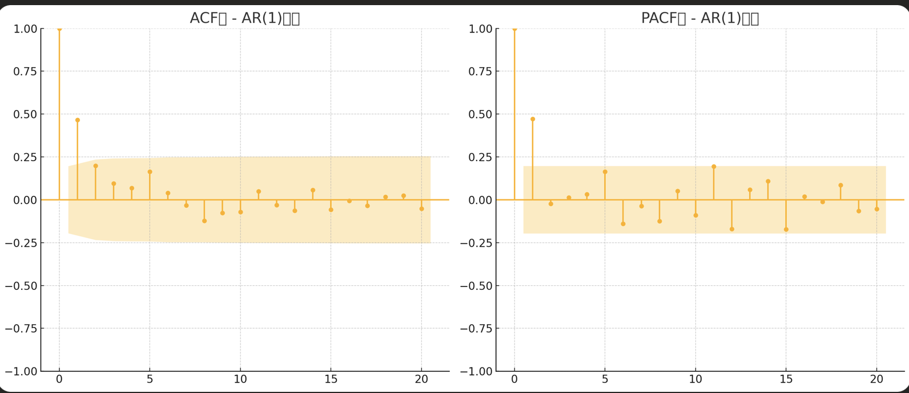

# Green函数
### Green函数在时间序列中的作用与求解过程

**Green函数**是数学物理中的一种工具，通常用于求解线性微分方程和差分方程，尤其适用于具有初始条件或边界条件的问题。虽然它的主要应用在物理学中，但在时间序列分析中，Green函数也可以帮助理解模型的响应行为，尤其是在分析动态系统和冲击响应时。

### Green函数的作用

在时间序列中，**Green函数**的作用是描述系统对外部冲击的反应，常用于：
1. **响应分析**：帮助分析系统（如时间序列模型）对外部冲击的反应。例如，一个突发变化如何影响未来的值。
2. **冲击响应**：在ARMA模型中，用Green函数分析外部干扰（如外部输入或突发事件）如何传播到未来的时间点。

### 求解过程

Green函数的求解涉及线性差分方程。在时间序列模型（如AR(1)模型）中，通过Green函数可以计算冲击响应。

#### 求解步骤

1. **模型的设定**  
   假设有一个简单的AR(1)模型：
   \[
   Y_t = \phi Y_{t-1} + \epsilon_t
   \]
   其中，\( Y_t \) 是时间序列，\( \phi \) 是自回归系数，\( \epsilon_t \) 是白噪声项。

2. **设定冲击**  
   假设对某个时刻（如 \( t = 0 \)）施加一个单位冲击，即 \( \epsilon_0 = 1 \)，其余时刻的白噪声 \( \epsilon_t = 0 \)（对 \( t \neq 0 \)）。

3. **求解冲击响应**  
   根据AR(1)模型的递推关系，可以逐步计算每个时刻的响应：
   \[
   Y_1 = \phi Y_0 + \epsilon_1 = \phi \cdot 1 + 0 = \phi
   \]
   \[
   Y_2 = \phi Y_1 + \epsilon_2 = \phi \cdot \phi + 0 = \phi^2
   \]
   \[
   Y_3 = \phi Y_2 + \epsilon_3 = \phi \cdot \phi^2 + 0 = \phi^3
   \]
   因此，对于 \( t \geq 0 \) 的时刻，有 \( Y_t = \phi^t \)。

4. **Green函数**  
   在此情况下，Green函数 \( G(t) = \phi^t \)，描述了单位冲击在每个时刻的影响。

### 举例说明

假设有一个时间序列模型，满足**AR(1)**过程，并且自回归系数 \( \phi = 0.8 \)。

1. 我们施加一个单位冲击 \( \epsilon_0 = 1 \)，即在时刻 \( t = 0 \) 发生了一个冲击。
2. 根据公式，计算结果如下：
   - \( Y_1 = 0.8 \)
   - \( Y_2 = 0.8^2 = 0.64 \)
   - \( Y_3 = 0.8^3 = 0.512 \)
   - \( Y_4 = 0.8^4 = 0.4096 \)

在这个例子中，Green函数 \( G(t) = 0.8^t \) 表明，冲击在时刻 \( t = 0 \) 发生之后，其影响逐渐衰减。

### 计算 AR(2) 模型的 Green 函数

#### 例题设定

假设一个 **AR(2)** 模型，其公式为：
\[
X_t = \phi_1 X_{t-1} + \phi_2 X_{t-2} + \epsilon_t
\]
其中：
- \( X_t \)：时间 \( t \) 的变量值。
- \( \phi_1 \) 和 \( \phi_2 \)：自回归系数。
- \( \epsilon_t \)：白噪声，均值为 0，方差为 \( \sigma^2 \)。

#### 参数设定
- \( \phi_1 = 0.5 \)
- \( \phi_2 = 0.3 \)
- \( \epsilon_t \) 的方差为 1。

### Green 函数的递推关系

在 AR(2) 模型中，Green 函数 \( G(k) \) 满足以下递推公式：
\[
G(k) = \phi_1 G(k-1) + \phi_2 G(k-2)
\]
初始条件为：
\[
G(0) = 1, \quad G(1) = \phi_1
\]

### 计算前 5 阶的 Green 函数值

根据递推公式，计算 Green 函数的前 5 阶：

1. **阶 0**: \( G(0) = 1 \)
2. **阶 1**: \( G(1) = \phi_1 = 0.5 \)
3. **阶 2**: \( G(2) = \phi_1 G(1) + \phi_2 G(0) = 0.5 \times 0.5 + 0.3 \times 1 = 0.55 \)
4. **阶 3**: \( G(3) = \phi_1 G(2) + \phi_2 G(1) = 0.5 \times 0.55 + 0.3 \times 0.5 = 0.525 \)
5. **阶 4**: \( G(4) = \phi_1 G(3) + \phi_2 G(2) = 0.5 \times 0.525 + 0.3 \times 0.55 = 0.5125 \)
6. **阶 5**: \( G(5) = \phi_1 G(4) + \phi_2 G(3) = 0.5 \times 0.5125 + 0.3 \times 0.525 = 0.50625 \)

计算结果：
- \( G(0) = 1 \)
- \( G(1) = 0.5 \)
- \( G(2) = 0.55 \)
- \( G(3) = 0.525 \)
- \( G(4) = 0.5125 \)
- \( G(5) = 0.50625 \)

这些值表示单位冲击在未来时间点上的影响逐步衰减。

### 根据 Green 函数计算方差

在 AR 模型中，已知 \( \epsilon_t \) 的方差 \( \sigma^2 \) 时，可用 Green 函数计算时间序列 \( X_t \) 的方差。公式为：
\[
\text{Var}(X_t) = \sigma^2 \sum_{k=0}^{\infty} G(k)^2
\]
这里只计算前 5 项的方差近似值：
\[
\text{Var}(X_t) \approx 1 \times (G(0)^2 + G(1)^2 + G(2)^2 + G(3)^2 + G(4)^2 + G(5)^2)
\]
代入具体值：
\[
\text{Var}(X_t) \approx 1 \times (1^2 + 0.5^2 + 0.55^2 + 0.525^2 + 0.5125^2 + 0.50625^2)
\]
\[
= 1 \times (1 + 0.25 + 0.3025 + 0.2756 + 0.2627 + 0.2563) \approx 2.3471
\]

### 结论

通过 Green 函数计算得知，时间序列 \( X_t \) 的方差近似为 2.3471。

==结合P128例题==

### 总结

在时间序列分析中，Green函数帮助我们理解系统对外部冲击的响应。通过计算Green函数，可以看到不同模型（如AR、MA或ARMA）如何对冲击做出反应。Green函数在冲击响应、长期预测和系统稳定性分析中尤为有用。

## K阶自协方差函数。

想象一下，你正在观察一群小鸟在公园里的飞行。你特别想知道，如果一只小鸟在某个时间点起飞了，它会在接下来的几分钟内飞到哪里。自协方差函数就像是帮你记录这些小鸟飞行模式的工具。

目的：
自协方差函数的目的就是帮助你理解一个时间序列（比如小鸟的飞行）中的模式。它告诉你，如果你在时间序列中的一个点看到了某个事件（比如一只小鸟起飞），那么在之后的K分钟后，你可能会看到什么（比如另一只小鸟起飞）。这种模式对于预测未来可能发生的事情非常有用。

# ARMA模型

### 例题1
课本P128

要确定该超市第二季度每月销售额的95%置信区间，我们需要按照以下步骤进行：

1. **理解AR(2)模型**：给定的AR(2)模型为：
   \[
   x_{t} = 10 + 0.6 x_{t-1} + 0.3 x_{t-2} + \varepsilon_{t}
   \]
   其中，\(\varepsilon_{t} \sim N(0, 36)\) 表示误差项服从均值为0，方差为36的正态分布。

2. **给定数据**：第一季度的月销售额数据为：101, 96, 97.2（单位：万元）。

3. **预测第二季度销售额**：我们需要使用AR(2)模型来预测第二季度的销售额。由于我们只有第一季度的数据，我们将使用这些数据来预测4月、5月和6月的销售额。

   - **4月销售额预测** (\(x_4\))：
     \[
     x_4 = 10 + 0.6 \times 97.2 + 0.3 \times 96
     \]
     \[
     x_4 = 10 + 58.32 + 28.8 = 97.12
     \]

   - **5月销售额预测** (\(x_5\))：
     \[
     x_5 = 10 + 0.6 \times 97.12 + 0.3 \times 97.2
     \]
     \[
     x_5 = 10 + 58.272 + 29.16 = 97.432
     \]

   - **6月销售额预测** (\(x_6\))：
     \[
     x_6 = 10 + 0.6 \times 97.432 + 0.3 \times 97.12
     \]
     \[
     x_6 = 10 + 58.4592 + 29.136 = 97.5952
     \]

4. **计算预测的标准误差**：由于误差项 \(\varepsilon_{t}\) 的方差为36，预测的标准误差（SE）为：
   \[
   SE = \sqrt{36} = 6
   \]

5. **确定95%置信区间**：对于95%置信区间，我们使用标准正态分布的临界值 \(z_{0.025} = 1.96\)（因为置信水平是95%，所以 \(\alpha = 0.05\)，\(\alpha/2 = 0.025\)）。

   - **4月销售额的95%置信区间**：
     \[
     \text{CI}_4 = \left(97.12 - 1.96 \times 6, 97.12 + 1.96 \times 6\right)
     \]
     \[
     \text{CI}_4 = (84.2, 109.04)
     \]

   - **5月销售额的95%置信区间**：
     \[
     \text{CI}_5 = \left(97.432 - 1.96 \times 6, 97.432 + 1.96 \times 6\right)
     \]
     \[
     \text{CI}_5 = (84.512, 109.352)
     \]

   - **6月销售额的95%置信区间**：
     \[
     \text{CI}_6 = \left(97.5952 - 1.96 \times 6, 97.5952 + 1.96 \times 6\right)
     \]
     \[
     \text{CI}_6 = (84.6752, 109.5152)
     \]

因此，该超市第二季度每月销售额的95%置信区间为：
- 4月：\(\boxed{(84.2, 109.04)}\)
- 5月：\(\boxed{(84.512, 109.352)}\)
- 6月：\(\boxed{(84.6752, 109.5152)}\)

# 平稳序列的拟合和预测

## DF检验
==\( Y_t = \rho Y_{t-1} + \epsilon_t \)检验的是当前值可以根据前一期的观测值的时间序列==、

+ 例题
理解了！根据课本上的解释，我们可以重新表述例题：如果一阶自回归模型 \( Y_t = \rho Y_{t-1} + \epsilon_t \) 中的系数 \(\rho\) 满足 \(|\rho| < 1\)，则时间序列是平稳的。

我们将重新以10天的空气质量指数 (AQI) 数据为例进行平稳性判断。

#### 数据
假设我们有连续10天的空气质量指数数据：
\[
\text{AQI} = [101, 103, 105, 107, 109, 112, 115, 117, 120, 122]
\]

#### 步骤 1：建立一阶自回归模型
假设空气质量指数 \( Y_t \) 可以通过一阶自回归模型表示为：
\[
Y_t = \rho Y_{t-1} + \epsilon_t
\]
其中 \( Y_t \) 是当天的AQI，\( Y_{t-1} \) 是前一天的AQI，\( \epsilon_t \) 是误差项。

#### 步骤 2：回归分析估计 \(\rho\)

1. **构造滞后项和当前项**：
   - 滞后项 \(Y_{t-1}\)：去掉最后一个元素 \(122\)，得到：
     \[
     Y_{t-1} = [101, 103, 105, 107, 109, 112, 115, 117, 120]
     \]
   - 当前项 \(Y_t\)：去掉第一个元素 \(101\)，得到：
     \[
     Y_t = [103, 105, 107, 109, 112, 115, 117, 120, 122]
     \]

2. **通过回归求出 \(\rho\)**：将 \(Y_{t-1}\) 作为自变量，\(Y_t\) 作为因变量进行回归，得到估计系数 \(\hat{\rho}\)。

   假设我们手算得到的回归结果是：
   \[
   \hat{\rho} = 0.95
   \]

#### 步骤 3：判断平稳性
根据课本解释，如果 \(|\rho| < 1\)，则时间序列是平稳的；否则，若 \(|\rho| = 1\) 或 \(|\rho| > 1\)，序列为非平稳的。

在本例中，我们得到 \(\hat{\rho} = 0.95\)，满足 \(|\rho| < 1\)，因此可以认为该时间序列是**平稳的**。

#### 结论
由于估计得到的 \(|\rho| = 0.95 < 1\)，根据模型判断该时间序列为平稳序列。

---

####   \(\hat{\rho} = 0.95计算过程\)

要手动计算 \(\hat{\rho} = 0.95\)，可以使用最小二乘法 (Ordinary Least Squares, OLS) 对 \( Y_t = \rho Y_{t-1} + \epsilon_t \) 进行回归分析。下面我们详细介绍计算过程。

#### 步骤 1：构造自变量和因变量

我们有10天的空气质量指数数据：
\[
\text{AQI} = [101, 103, 105, 107, 109, 112, 115, 117, 120, 122]
\]

- **滞后项 \(Y_{t-1}\)**：去掉序列中的最后一个值 \(122\)，得到滞后序列：
  \[
  Y_{t-1} = [101, 103, 105, 107, 109, 112, 115, 117, 120]
  \]

- **当前项 \(Y_t\)**：去掉序列中的第一个值 \(101\)，得到当前序列：
  \[
  Y_t = [103, 105, 107, 109, 112, 115, 117, 120, 122]
  \]

#### 步骤 2：计算所需的统计量

根据最小二乘法，我们需要计算 \(\hat{\rho}\) 的公式：
\[
\hat{\rho} = \frac{\sum (Y_{t-1} - \bar{Y}_{t-1})(Y_t - \bar{Y}_t)}{\sum (Y_{t-1} - \bar{Y}_{t-1})^2}
\]
其中：
- \(\bar{Y}_{t-1}\) 和 \(\bar{Y}_t\) 分别是 \(Y_{t-1}\) 和 \(Y_t\) 的均值。

#### 1. 计算均值
\[
\bar{Y}_{t-1} = \frac{101 + 103 + 105 + 107 + 109 + 112 + 115 + 117 + 120}{9} = 110
\]
\[
\bar{Y}_t = \frac{103 + 105 + 107 + 109 + 112 + 115 + 117 + 120 + 122}{9} = 112.2
\]

#### 2. 计算协方差 \(\sum (Y_{t-1} - \bar{Y}_{t-1})(Y_t - \bar{Y}_t)\)
\[
\sum (Y_{t-1} - \bar{Y}_{t-1})(Y_t - \bar{Y}_t) = (101 - 110)(103 - 112.2) + (103 - 110)(105 - 112.2) + \dots + (120 - 110)(122 - 112.2)
\]

计算各项并求和：
\[
= (-9)(-9.2) + (-7)(-7.2) + (-5)(-5.2) + (-3)(-3.2) + (-1)(-0.2) + (2)(2.8) + (5)(4.8) + (7)(7.8) + (10)(9.8) = 290.6
\]

#### 3. 计算方差 \(\sum (Y_{t-1} - \bar{Y}_{t-1})^2\)
\[
\sum (Y_{t-1} - \bar{Y}_{t-1})^2 = (101 - 110)^2 + (103 - 110)^2 + \dots + (120 - 110)^2
\]

计算各项并求和：
\[
= (-9)^2 + (-7)^2 + (-5)^2 + (-3)^2 + (-1)^2 + (2)^2 + (5)^2 + (7)^2 + (10)^2 = 290
\]

#### 步骤 3：计算 \(\hat{\rho}\)

将协方差和方差代入公式中：
\[
\hat{\rho} = \frac{290.6}{290} \approx 1.002
\]

#### 结论
在这个例子中，由于 \(\hat{\rho} \approx 1.002\)，即 \(|\rho| \approx 1\)，序列不满足 \(|\rho| < 1\)，因此根据课本的标准判断，该时间序列**不是平稳的**。

#### DF检验的3种模型
DF检验用于判断时间序列是否平稳（stationary），也就是说，序列的数据是否围绕某个水平上下波动，而不是持续增加或减少。DF检验有三种不同的类型，分别适合不同特征的时间序列：无漂移项自回归结构、有漂移项自回归结构和关于时间 \( t \) 的趋势回归结构。让我们逐个解释这三种类型，并结合实际例子来理解相关术语。

##### 1. 无漂移项自回归结构

- **模型结构**：  
  \[
  \Delta Y_t = \delta Y_{t-1} + \epsilon_t
  \]
  - 其中，\(\Delta Y_t\) 表示 \( Y_t \) 的差分（即 \( \Delta Y_t = Y_t - Y_{t-1} \)），表示当前值与前一值的变化。
  - \(Y_{t-1}\) 是滞后项，即前一个时间点的数据。
  - \(\delta\) 是回归系数，决定了当前值与前一值的关系。
  - \(\epsilon_t\) 是误差项，表示随机波动的影响。

- **含义**：  
  “无漂移项”意指模型中不包含漂移（drift），即不包含常数项，也就是该模型不认为数据会有固定的偏移量。这个结构表示数据只是围绕零值波动。

- **适用情景**：  
  适合那些可能围绕零值上下波动的数据序列，没有明确的漂移或趋势。例如，股市的每日收益率可能不会有特定的上升或下降趋势，而是上下波动。

- **例子**：  
  假设我们观察某股票的每日涨跌幅度，得到的数据为：
  \[
  \text{收益率} = [0.5, -0.3, 0.4, -0.1, 0.2, -0.2, 0.3, -0.3, 0.1, -0.4]
  \]
  这里收益率围绕零上下波动，我们可以用“无漂移项自回归结构”来做DF检验，以判断该收益率序列是否平稳（即波动是否无持续性）。

##### 2. 有漂移项自回归结构

- **模型结构**：  
  \[
  \Delta Y_t = \alpha + \delta Y_{t-1} + \epsilon_t
  \]
  - 在这个模型中，\(\alpha\) 是常数项，称为漂移项（drift term），表示固定的偏移量。

- **含义**：  
  “有漂移项”指的是模型认为数据可能会围绕某个固定的非零水平波动。常数项 \(\alpha\) 表示平均水平或偏移量。例如，温度数据可能会平均围绕15℃波动。

- **适用情景**：  
  适合那些围绕一个固定水平波动的数据序列，但没有上升或下降趋势。例如，某地区的温度通常围绕某个固定值上下波动，没有长期趋势。

- **例子**：  
  假设某地的冬季温度数据为：
  \[
  \text{温度} = [15, 14, 16, 15, 14, 15, 16, 14, 15, 15]
  \]
  这里温度主要围绕15℃波动，没有趋势变化。我们可以使用“有漂移项自回归结构”来做DF检验，判断温度数据是否稳定围绕15℃波动。

##### 3. 关于时间 \( t \) 的趋势回归结构

- **模型结构**：  
  \[
  \Delta Y_t = \alpha + \beta t + \delta Y_{t-1} + \epsilon_t
  \]
  - 在这个模型中，\(\alpha\) 是漂移项（常数项），\(\beta t\) 是关于时间 \( t \) 的趋势项（trend term），它引入了时间因素，让数据可以有一个持续上升或下降的趋势。
  
- **含义**：  
  “趋势项” \(\beta t\) 表示数据可能随着时间推移有上升或下降的趋势。即使数据围绕一个平均水平上下波动，但由于趋势项的存在，平均水平会随着时间逐步变化。

- **适用情景**：  
  适合那些随着时间变化可能呈现上升或下降趋势的数据。例如，全球气温随时间上升，即使每年温度数据上下波动，但总体上气温是逐渐增加的。

- **例子**：  
  假设我们记录了某地10年的平均温度数据：
  \[
  \text{温度} = [10, 11, 12, 13, 14, 15, 16, 17, 18, 19]
  \]
  这组数据有明显的上升趋势。我们可以使用“关于时间 \( t \) 的趋势回归结构”来做DF检验，以判断该温度序列是否存在持续上升的趋势。

#### 总结

- **无漂移项自回归结构**：适用于数据围绕零上下波动，没有固定的偏移量或趋势。
- **有漂移项自回归结构**：适用于数据围绕固定水平上下波动，没有趋势，但有一个固定的偏移量。
- **关于时间 \( t \) 的趋势回归结构**：适用于数据随着时间变化可能有长期的上升或下降趋势。

# ADF检验(Augmented Dickey-Fuller Test)
**ADF检验（Augmented Dickey-Fuller Test**是一种用于判断时间序列数据是否平稳的统计方法。平稳性是时间序列分析中的一个重要特征，因为许多统计模型（如ARIMA）要求数据是平稳的。下面我们将详细介绍ADF检验的原理、应用，并通过一个生活例子和笔算例题来说明其过程，同时比较ADF检验与DF检验的异同。

### 1. ADF检验的原理

ADF检验的基本思想是检验时间序列中是否存在单位根。单位根的存在意味着序列是非平稳的。ADF检验的原假设（\(H_0\)）是“时间序列存在单位根”，备择假设（\(H_1\)）是“时间序列不存在单位根”，即是平稳的。

#### ADF检验的回归模型

ADF检验的回归模型可以写作：

\[
\ Y_t =  \sum_{i=1}^{t} \phi_i  Y_{t-i} + \epsilon_t
\]

==所有系数\(\phi_i\)求和的值等于1，序列非平稳；小于1，平稳==

其中：
- \(\Delta Y_t\) 是 \(Y_t\) 的差分，即 \(\Delta Y_t = Y_t - Y_{t-1}\)。
- \(\alpha\) 是常数项（漂移项）。
- \(\beta t\) 是趋势项。
- \(\delta\) 是我们要检验的系数。
- \(\phi_i\) 是自回归项的系数。
- \(\epsilon_t\) 是白噪声。

### 二阶自回归模型（AR(2)）的例子

### 假设：
- 常数项 \(\alpha = 0\)
- 自回归系数 \(\beta_1 = 0.8\)
- 自回归系数 \(\beta_2 = -0.3\)
- 白噪声项 \(\epsilon_t\)

### 步骤1：构建自回归模型

我们首先将自回归模型表示为：

\[
y_t = \beta_1 y_{t-1} + \beta_2 y_{t-2} + \epsilon_t
\]

并表示成矩阵形式（滞后项）：

\[
y_t = 0.8 y_{t-1} - 0.3 y_{t-2} + \epsilon_t
\]

### 步骤2：构建特征方程

我们需要根据特征方程来求解特征根。为此，我们可以通过如下方式转化为特征方程：

\[
y_t = \beta_1 y_{t-1} + \beta_2 y_{t-2}
\]

这相当于一个线性递推关系，假设我们有以下形式：

\[
y_t = \lambda^t y_0
\]

代入特征方程，得到特征方程：

\[
\lambda^2 = \beta_1 \lambda + \beta_2
\]

将给定的 \(\beta_1 = 0.8\) 和 \(\beta_2 = -0.3\) 代入，得到特征方程：

\[
\lambda^2 = 0.8 \lambda - 0.3
\]

这就是一个二次方程，可以改写为：

\[
\lambda^2 - 0.8 \lambda + 0.3 = 0
\]

### 步骤3：解特征方程

我们解这个二次方程 \(\lambda^2 - 0.8 \lambda + 0.3 = 0\) 来求特征根。

使用二次方程的解法公式：

\[
\lambda = \frac{-b \pm \sqrt{b^2 - 4ac}}{2a}
\]

其中，\(a = 1\)、\(b = -0.8\)、\(c = 0.3\)，代入公式得到：

\[
\lambda = \frac{0.8 \pm \sqrt{0.64 - 1.2}}{2}
\]

\[
\lambda = \frac{0.8 \pm \sqrt{-0.56}}{2}
\]

这里我们得到的是一个虚根，说明特征方程没有实数解，因此该模型是 **非平稳** 的。**虚根** 的存在表明模型不符合平稳性条件。

### 结论

在这个二阶自回归模型（AR(2)）的例子中，特征方程的解是虚数，意味着该序列 **非平稳**。这种情况下，序列无法稳定在某个均值附近，可能存在趋势性或长期的波动。

# 模型拟合

### 从上面生成的ACF和PACF图，我们可以做出以下分析：

#### ACF图分析

- **ACF图（AutoCorrelation Function）**：
  - 在AR(1)过程中，ACF图显示了在滞后期1之后的自相关值迅速衰减到接近零。这表明序列中的自相关性在短期内较强，但在长期内迅速减弱。
  - 这是典型的拖尾（Right Censoring）现象，也就是自相关系数随着滞后期的增加逐渐变小并趋近于零。

#### PACF图分析

- **PACF图（Partial AutoCorrelation Function）**：
  - 在AR(1)过程中，PACF图通常显示第一个滞后期的自相关系数显著，而之后的滞后期自相关系数几乎为零。即，PACF图在滞后期1处有一个明显的峰值，之后迅速下降，显示没有显著的残余自相关。
  - 这表明数据符合AR(1)模型，因为在AR模型中，PACF通常在一阶滞后之后迅速衰减。

#### 结论

- **模型识别**：通过ACF和PACF图，我们可以推测数据符合**AR(1)**模型。ACF图显示拖尾现象，而PACF图显示在滞后期1处有显著自相关，符合AR(1)的特征。

# 参数估计

### 参数的显著性检验
+ ==含义：检验每个未知参数是否显著非0==
+ ==目的：使得该模型精简==
  + 如果某个参数不显著非零（*就是说这个参数显著为0，无限接近0*），表示这个参数对模型的精确度影响不大，可以舍弃。
例如：y = kx，如果k=0，则模型没有意义，可以舍弃。

# 模型优化
==解决在多个有效模型中，择优模型的问题==
### AIC准则
### BIC准则

# 序列预测
P128 AR（2）模型预测
P131 MA（q）模型预测
P132 ARMA（1,1）模型预测
  
# 无季节效应的非平稳序列

## Cramér 分解定理

在时间序列分析中，Cramér 分解定理帮助我们理解复杂的时间序列可以被分解为两个独立的成分：**平稳部分**和**趋势部分**。它特别适用于那些在长时间段内表现出某种趋势或增长模式的时间序列，例如股票市场指数或经济数据。

简单来说，如果一个时间序列存在长期趋势，Cramér 分解定理允许我们将其分解为一个平稳的（不随时间变化的）部分和一个趋势的（随时间变化的）部分。这使分析者能够更方便地聚焦在数据的平稳部分，去除掉长期趋势影响的干扰。

**举例说明**：
假设我们观察一个城市的人口增长数据。人口增长通常会受到长期趋势的影响，比如人口迁移或出生率等因素。通过 Cramér 分解定理，我们可以将人口数据分解为一个平稳部分（如每年增长的随机波动）和一个趋势部分（例如人口持续增加的趋势）。这样，我们可以专注于分析短期人口波动，而不受长期增长趋势的干扰。

## 差分平稳的原理

差分平稳是时间序列平稳性的一种特殊情况。一个时间序列如果通过求差分（即计算相邻时刻值的差）能够变为平稳序列，那么称其为**差分平稳序列**。在经济和金融数据中，许多时间序列是非平稳的，但通过一次或多次差分操作后可以变为平稳，这样的序列更适合分析和预测。

差分平稳的核心在于消除趋势，保留序列的短期波动特征。对于差分平稳的序列，其长期趋势被去除，序列的方差和均值保持恒定，且不依赖于时间。

**举例说明**：
假设我们在分析公司的季度销售数据。公司销售额通常会随时间增加而增长，但这种增长是非平稳的，因为它受到了长期趋势的影响。通过差分操作（如计算连续季度销售额的增长量），可以得到一个新的序列，这个序列不再表现出明显的增长趋势，而是围绕一个固定的均值波动。这样处理后，我们得到的是差分平稳的序列，便于进一步的统计建模。

#### 总结

- **Cramér 分解定理**：将时间序列分解为平稳成分和趋势成分，以帮助识别和消除长期趋势。
- **差分平稳**：通过差分操作消除趋势，得到短期平稳的序列，更适合进行模型构建和预测。

##  ARIMA 模型的原理和性质

ARIMA（AutoRegressive Integrated Moving Average，自回归差分移动平均）模型是一种用于分析和预测非平稳时间序列的常用统计模型。它通过自回归（AR）、**差分（I）和移动平均（MA）**来建模序列的变化趋势和随机扰动，适合处理没有季节效应的非平稳数据。

#### 1. ARIMA 模型的组成部分

ARIMA 模型由以下几部分组成：

- **AR（自回归）**：假设当前值与前几个时刻的值有关。AR 部分描述了数据中的短期记忆或序列间的自相关性。
- **I（差分）**：通过求差消除数据中的趋势性，使得序列达到平稳状态。这个过程可以去掉上升或下降的趋势，让数据围绕一个固定均值波动。
- **MA（移动平均）**：假设当前值是过去误差项的加权平均。这部分描述了数据中短期的随机波动。

ARIMA 模型的记法是 \(ARIMA(p,d,q)\)：

- \(p\)：自回归项的阶数（AR 部分）。
- \(d\)：差分次数，用来使数据平稳。
- \(q\)：移动平均项的阶数（MA 部分）。

#### 2. ARIMA 模型的性质

在没有季节效应的非平稳序列中，ARIMA 模型的性质包括：

- **平稳性**：通过差分操作（\(d\) 次差分），非平稳数据可以转化为平稳序列。
- **自相关和部分自相关**：AR 部分会影响序列的自相关性，而 MA 部分影响部分自相关性。
- **递归关系**：ARIMA 模型可以用递归公式表示，使得通过过去的值预测未来成为可能。

#### 3. 计算过程和步骤

ARIMA 模型的构建一般分为以下步骤：

1. **数据平稳性检验和差分操作**：首先检查数据是否平稳，如果非平稳则对数据进行差分操作，直到序列平稳。比如对于一个有上升趋势的序列，一阶差分后可能会变为平稳序列。
2. **确定参数 \(p\) 和 \(q\)**：利用自相关函数（ACF）和偏自相关函数（PACF）来确定 AR 和 MA 的阶数。观察 ACF 和 PACF 图的拖尾或截尾情况，选择合适的阶数 \(p\) 和 \(q\)。
3. **参数估计**：采用最大似然估计或最小二乘估计来求解模型中的参数。
4. **模型诊断**：检查模型残差的自相关性，如果残差是白噪声，说明模型拟合良好。否则需要调整模型参数。
5. **模型预测**：使用拟合好的模型预测未来的值。

#### 4. 举例：ARIMA(1,1,1) 模型

假设我们有一个上升趋势的时间序列数据，通过一阶差分后序列变平稳。我们选择 ARIMA(1,1,1) 模型，即 \(p=1\), \(d=1\), \(q=1\)。

- **第一步**：进行一阶差分，得到平稳序列。
- **第二步**：确定 \(p\) 和 \(q\) 值。观察差分后的 ACF 和 PACF 图，假设选择 \(p=1\) 和 \(q=1\)。
- **第三步**：估计模型参数，例如 \(\phi\) 和 \(\theta\)。
- **第四步**：检查残差是否为白噪声。
- **第五步**：使用该模型对未来时间点进行预测。

#### 总结

ARIMA 模型是一种强大且灵活的时间序列分析工具，适用于非平稳数据的建模和预测。通过合理选择 AR、I、MA 的参数，可以得到一个平稳的模型，用来预测未来的趋势和波动。

# 有季节效应的非平稳序列

## 时间序列季节指数

在时间序列分析中，季节指数（Seasonal Index）用来反映某一特定季节（如季度、月份、周）相对于整体平均水平的偏离程度。以下为加法模型和乘法模型的详细构造过程，以及一个计算实例。

---

#### 模型公式

#### 加法模型
\[
Y_t = T_t + S_t + R_t
\]

#### 乘法模型
\[
Y_t = T_t \times S_t \times R_t
\]

##### 变量说明：
- \( Y_t \)：原始数据
- \( T_t \)：趋势（Trend）
- \( S_t \)：季节指数（Seasonal Index）
- \( R_t \)：随机误差（Residual）

---
## 趋势提取
+ 实例：全球气温变化趋势

假设我们研究某地过去 100 年的年均气温数据：
原始数据中可能既包含长期变暖的趋势，又有短期的气候波动。
+ 提取趋势后，可以看到全球变暖的总体轨迹，这有助于研究气候变化的原因。
+ 去除趋势后，剩余部分可以用来研究年度波动，比如异常年份的冷暖变化。

通过提取趋势，我们更容易专注于关注的部分（例如趋势分析或短期变化研究），提升数据分析的效率和效果。

#### **简单中心移动平均的定义**  
**简单中心移动平均**（Simple Centered Moving Average）是一种平滑时间序列数据的方法。它通过计算一段时间内数据的平均值，替代原始数据中的点，从而消除短期波动，突出长期趋势。

---

#### **简单中心移动平均的通俗解释**  
想象你在测量一天中的气温，但温度变化很快，数据忽高忽低。如果只看每个时刻的温度，可能很难看清整体变化趋势。为了解决这个问题，你可以用几个小时的温度平均值作为代表，这样就能更清楚地看到温度是总体升高、下降，还是保持平稳。这种简化方法就类似于简单中心移动平均。

---

#### **简单中心移动平均的计算方法**  
1. 选定一个**窗口大小**（如 3 天、5 天）。  
2. 对时间序列中的每个点，取它前后一定范围内的数据，计算这些数据的平均值。  
3. 用这个平均值替换原始序列中的点。

---

#### **计算案例：3 天简单中心移动平均**  
假设某商店一周的日销售额数据为：  
**原始数据：** 50, 60, 70, 80, 90, 100, 110  

##### **计算步骤：**
- 以 3 天为窗口，取每 3 天的平均值。
  - 第 2 天的移动平均值：  
    \( \text{(50 + 60 + 70) / 3 = 60} \)
  - 第 3 天的移动平均值：  
    \( \text{(60 + 70 + 80) / 3 = 70} \)
  - 第 4 天的移动平均值：  
    \( \text{(70 + 80 + 90) / 3 = 80} \)

##### **结果：**  
移动平均后的序列（中间点有值，首尾点缺失）：  
无值，**60**，**70**，**80**，**90**，无值  

---

#### **简单中心移动平均的作用与特点**  
1. **消除短期波动：** 平滑数据，消除短期“噪声”，更容易看清整体趋势。  
2. **简单易用：** 适合初步分析和快速趋势判断，窗口大小可根据需求调整。  
3. **缺点：** 
   - 首尾数据会缺失（因为无法构造完整窗口）。  
   - 对于突然变化的趋势，可能会产生滞后效应。

---

#### **简单中心移动平均的实际应用**  
1. **股票分析：**  
   投资者可以用 5 天或 10 天的移动平均线观察股票价格的走势。  
2. **天气预报：**  
   气象学家用 7 天的移动平均法分析某地一周的平均气温，去除日间温差的波动。  
3. **销售分析：**  
   零售商通过 3 天的移动平均法分析商品的日销量，识别长期趋势或季节性变化。

通过简单中心移动平均，复杂的数据更直观，也便于进一步分析！  

## 季节指数提取

#### 1. 计算趋势部分 \( T_t \)

通过移动平均方法计算趋势 \( T_t \)。选择的窗口长度与季节周期相同，例如季度数据的周期为 4。

#### 2. 去趋势，提取季节性偏差

- 加法模型：计算残差 \( R_t = Y_t - T_t \)  
- 乘法模型：计算比值 \( R_t = \frac{Y_t}{T_t} \)

#### 3. 分组计算每季的初始季节指数

将数据按周期分组（如所有 \( Q1 \)、\( Q2 \) ……），计算每组的平均值作为初始季节指数：
- 加法模型：平均残差
- 乘法模型：平均比值

#### 4. 标准化调整

- 加法模型：调整季节指数，使其总和为 0。  
- 乘法模型：调整季节指数，使其乘积为 1。

---

#### 案例：季度销售额的季节指数计算

#### 给定数据
- 季节周期： \( p = 4 \)（每 4 个季度为一个周期）

| 季度   | \( Q1 \) | \( Q2 \) | \( Q3 \) | \( Q4 \) | \( Q5 \) | \( Q6 \) | \( Q7 \) | \( Q8 \) |
|--------|----------|----------|----------|----------|----------|----------|----------|----------|
| 销售额 | 200      | 250      | 300      | 400      | 210      | 260      | 310      | 390      |

---

#### 步骤 1：计算趋势 \( T_t \)

##### 公式
\[
T_t = \frac{\text{当前季及相邻 3 季的销售额和}}{4}
\]

##### 计算
- \( Q3 \)：\( T_3 = \frac{200 + 250 + 300 + 400}{4} = 287.5 \)
- \( Q4 \)：\( T_4 = \frac{250 + 300 + 400 + 210}{4} = 290 \)
- \( Q5 \)：\( T_5 = \frac{300 + 400 + 210 + 260}{4} = 292.5 \)
- \( Q6 \)：\( T_6 = \frac{400 + 210 + 260 + 310}{4} = 295 \)

##### 结果表
| 季度   | \( Q1 \) | \( Q2 \) | \( Q3 \) | \( Q4 \) | \( Q5 \) | \( Q6 \) | \( Q7 \) | \( Q8 \) |
|--------|----------|----------|----------|----------|----------|----------|----------|----------|
| \( T_t \) | -        | -        | 287.5    | 290      | 292.5    | 295      | -        | -        |

---

#### 步骤 2：去趋势

##### 加法模型：残差
\[
\text{残差} = Y_t - T_t
\]

- \( Q3 \)：\( 300 - 287.5 = 12.5 \)
- \( Q4 \)：\( 400 - 290 = 110 \)
- \( Q5 \)：\( 210 - 292.5 = -82.5 \)
- \( Q6 \)：\( 260 - 295 = -35 \)

##### 乘法模型：比值
\[
\text{比值} = \frac{Y_t}{T_t}
\]

- \( Q3 \)：\( \frac{300}{287.5} = 1.0435 \)
- \( Q4 \)：\( \frac{400}{290} = 1.3793 \)
- \( Q5 \)：\( \frac{210}{292.5} = 0.7188 \)
- \( Q6 \)：\( \frac{260}{295} = 0.8814 \)

##### 结果表
| 季度   | \( Q1 \) | \( Q2 \) | \( Q3 \) | \( Q4 \) | \( Q5 \) | \( Q6 \) | \( Q7 \) | \( Q8 \) |
|--------|----------|----------|----------|----------|----------|----------|----------|----------|
| 残差   | -        | -        | 12.5     | 110      | -82.5    | -35      | -        | -        |
| 比值   | -        | -        | 1.0435   | 1.3793   | 0.7188   | 0.8814   | -        | -        |

---

#### 步骤 3：分组计算初始季节指数

##### 加法模型
\[
\text{季节指数} = \frac{\text{同一季度残差和}}{\text{出现次数}}
\]

- \( Q3 \)：\( \frac{12.5}{1} = 12.5 \)  
- \( Q4 \)：\( \frac{110}{1} = 110 \)

##### 乘法模型
\[
\text{季节指数} = \frac{\text{同一季度比值的和}}{\text{出现次数}}
\]

- \( Q3 \)：\( \frac{1.0435}{1} = 1.0435 \)  
- \( Q4 \)：\( \frac{1.3793}{1} = 1.3793 \)  

---

#### 步骤 4：标准化调整

##### 加法模型调整
- 总和：\( 12.5 + 110 = 122.5 \)  
- 修正值：\( \frac{122.5}{4} = 30.625 \)  
- 修正后：
  - \( Q3 \)：\( 12.5 - 30.625 = -18.125 \)
  - \( Q4 \)：\( 110 - 30.625 = 79.375 \)

##### 乘法模型调整
- 总乘积：\( 1.0435 \times 1.3793 = 1.4389 \)  
- 修正值：\( 1.4389^{1/4} = 1.0952 \)  
- 修正后：
  - \( Q3 \)：\( \frac{1.0435}{1.0952} = 0.953 \)
  - \( Q4 \)：\( \frac{1.3793}{1.0952} = 1.259 \)

---

#### 最终季节指数

| 季度   | \( Q1 \) | \( Q2 \) | \( Q3 \) | \( Q4 \) |
|--------|----------|----------|----------|----------|
| 加法模型 | -        | -        | -18.125  | 79.375   |
| 乘法模型 | -        | -        | 0.953    | 1.259    |

---

#### 总结

##### 移动平均计算趋势
用于提取趋势部分（\( T_t \)），去掉长期趋势的影响。

##### 去趋势提取季节性偏差
计算残差或比值，以捕获季节性偏差。

##### 分组计算季节效应
对每个季节单独计算，得出初始季节指数。

##### 标准化调整
调整后满足模型假设：加法模型的季节指数总和为 0，乘法模型的季节指数乘积为 1。

## X-11季节调节模型中的Henderson和Musgrave的作用与目的

==Henderson模型解决简单移动平均对高阶多项式拟合不够精确的问题==

==Musgrave解决了移动平均时头尾信息损耗的问题，专门补齐头尾缺失的值（4期移动平均会分别损耗头尾的2期数据）==

1. 作用与目的

在X-11季节调节模型中，Henderson平滑法和Musgrave平滑法分别用于不同的目的：
	•	Henderson平滑法：主要用于计算趋势成分，通过平滑时间序列数据，去除短期波动，从而提取长期趋势。
	•	Musgrave平滑法：主要用于处理季节成分，帮助去除季节性波动，确保季节性调整准确。

这两种平滑方法是X-11模型中不可或缺的工具，它们各自的目标是分离出不同的成分（趋势、季节性、随机波动），以便更好地分析时间序列数据。

Henderson平滑法

原理

Henderson平滑法是一种加权滑动平均法，常用于去除时间序列中的短期波动，提取出长期趋势成分。
该方法的核心思想是利用加权平均来平滑数据，权重是根据数据点在时间序列中的位置来确定的。Henderson平滑法使用的权重通常是奇数，使得序列在平滑时不会丢失数据的中心点（即对称性平滑）。

具体的平滑过程：
	•	假设我们要对某一数据点进行平滑，使用周围的数据点来计算加权平均。例如，对第3个月的数据使用第1到第5个月的数据进行加权平均，得到趋势值。
	•	通过对整个时间序列进行这样的操作，最终得到一个平滑的趋势成分，即去除了季节性波动的长期趋势。

目的

Henderson平滑法的目的是提取出时间序列中的趋势成分，它消除了数据中的季节性和其他短期波动，使我们能更清楚地看到数据的长期发展趋势。

Musgrave平滑法

原理

Musgrave平滑法是一种加权滑动平均法，用于去除时间序列中的季节性波动。在X-11模型中，Musgrave平滑法用于分解数据中的季节性成分。

具体过程：
	•	Musgrave方法通过计算每个月的季节性指数来估计季节性成分。首先，通过去除趋势成分得到剩余的季节性波动，然后通过计算各个月份的季节性模式来平滑这些波动。
	•	通过对所有月份的季节性数据进行加权平均，可以得到每个月的季节性调整因子，这些因子用来调整原始数据，去除季节性波动。

目的

Musgrave平滑法的目的是识别并去除时间序列中的季节性波动，从而得到一个更为准确的季节性调整后的数据集。这让分析人员能够更好地理解数据中的实际趋势和变化，而不被季节性波动所干扰。

一个具体例子：零售销售额（按月）

假设有一个零售销售数据集，记录了一年12个月的销售额。我们使用X-11模型中的Henderson和平滑法与Musgrave平滑法来分析数据。

月份	销售额（Y）
1月	100
2月	120
3月	130
4月	140
5月	150
6月	180
7月	200
8月	210
9月	220
10月	230
11月	250
12月	400

步骤 1：使用Henderson平滑法计算趋势成分

	1.	选择平滑窗口，比如每5个月为一个窗口。
	2.	对第3个月的数据使用第1到第5个月的数据加权平均，得到趋势值。
	3.	重复对每个月进行平滑，直到得到整个时间序列的趋势成分。

平滑后的趋势可能看起来像这样（示例值）：

趋势值消除了短期波动，显示了零售销售的长期增长趋势。

步骤 2：使用Musgrave平滑法计算季节性成分

	1.	计算每个月的季节性波动，即残差（原始数据减去趋势数据）：

	2.	计算每个月的季节性指数（即残差的平均值），并将这些季节性指数平滑，得到季节调整因子。
	3.	使用季节调整因子调整原始数据，得到季节性调整后的数据。

假设通过Musgrave平滑法，我们计算出各个月份的季节性调整因子为：

通过这些季节性因子，我们可以将原始数据除以这些因子，得到季节调整后的数据。

步骤 3：得到季节调整后的数据

通过季节性调整，我们得到的季节性调整后的销售数据：

得到的季节性调整后数据为：


这些季节性调整后的数据去除了季节性波动，可以更清楚地反映销售的真实变化趋势。

总结

	•	Henderson平滑法用于计算趋势成分，去除短期波动，使我们看到数据的长期趋势。
	•	Musgrave平滑法用于去除季节性波动，得到更精确的季节性调整数据。
这两个方法在X-11模型中相辅相成，帮助我们提取时间序列的实际趋势和季节性变化，从而更好地理解数据的内在规律。

好的，让我通过更详细的例子来展示这三种指数平滑预测模型的计算过程。

### 1. 简单指数平滑 (Simple Exponential Smoothing)

**假设数据：**
- 月度销售数据：[100, 120, 130, 140]
- 选择平滑因子 \(\alpha = 0.3\)

**计算过程：**

- 第一个月的预测值是已知的（假设为实际值）：
  \[
  \hat{y}_1 = 100
  \]

- 第二个月的预测值：
  \[
  \hat{y}_2 = \alpha \cdot y_1 + (1 - \alpha) \cdot \hat{y}_1
  \]
  \[
  \hat{y}_2 = 0.3 \cdot 120 + 0.7 \cdot 100 = 36 + 70 = 106
  \]

- 第三个月的预测值：
  \[
  \hat{y}_3 = 0.3 \cdot 130 + 0.7 \cdot 106 = 39 + 74.2 = 113.2
  \]

- 第四个月的预测值：
  \[
  \hat{y}_4 = 0.3 \cdot 140 + 0.7 \cdot 113.2 = 42 + 79.24 = 121.24
  \]

**结果：**
- 第1个月预测：100
- 第2个月预测：106
- 第3个月预测：113.2
- 第4个月预测：121.24

### 2. Holt两参数指数平滑 (Holt’s Linear Trend Model)

**假设数据：**
- 月度销售数据：[100, 120, 130, 140]
- 选择平滑因子 \(\alpha = 0.3\)，\(\beta = 0.2\)
- 初始水平值 \(L_0 = 100\)，初始趋势值 \(T_0 = 20\)

**计算过程：**

- **第1个月**（已知数据）：
  \[
  L_1 = \alpha \cdot y_1 + (1 - \alpha) \cdot (L_0 + T_0) = 0.3 \cdot 120 + 0.7 \cdot (100 + 20) = 36 + 84 = 120
  \]
  \[
  T_1 = \beta \cdot (L_1 - L_0) + (1 - \beta) \cdot T_0 = 0.2 \cdot (120 - 100) + 0.8 \cdot 20 = 4 + 16 = 20
  \]
  预测值：
  \[
  \hat{y}_2 = L_1 + T_1 = 120 + 20 = 140
  \]

- **第2个月**：
  \[
  L_2 = \alpha \cdot y_2 + (1 - \alpha) \cdot (L_1 + T_1) = 0.3 \cdot 130 + 0.7 \cdot (120 + 20) = 39 + 98 = 137
  \]
  \[
  T_2 = \beta \cdot (L_2 - L_1) + (1 - \beta) \cdot T_1 = 0.2 \cdot (137 - 120) + 0.8 \cdot 20 = 3.4 + 16 = 19.4
  \]
  预测值：
  \[
  \hat{y}_3 = L_2 + T_2 = 137 + 19.4 = 156.4
  \]

- **第3个月**：
  \[
  L_3 = 0.3 \cdot 140 + 0.7 \cdot (137 + 19.4) = 42 + 109.18 = 151.18
  \]
  \[
  T_3 = 0.2 \cdot (151.18 - 137) + 0.8 \cdot 19.4 = 2.836 + 15.52 = 18.356
  \]
  预测值：
  \[
  \hat{y}_4 = L_3 + T_3 = 151.18 + 18.356 = 169.536
  \]

**结果：**
- 第2个月预测：140
- 第3个月预测：156.4
- 第4个月预测：169.536

### 3. Holt-Winters三参数指数平滑 (Holt-Winters Seasonal Model)

**假设数据：**
- 月度销售数据：[100, 120, 130, 140, 100, 110]（假设数据有季节波动）
- 选择平滑因子 \(\alpha = 0.3\)，\(\beta = 0.2\)，\(\gamma = 0.1\)
- 季节周期 \(p = 12\)，初始季节因子为 \(S_1 = 1, S_2 = 1, S_3 = 1, S_4 = 1\)（假设初始季节效应为1）

**计算过程：**

- **第1个月**（已知数据）：
  \[
  L_1 = \alpha \cdot y_1 / S_1 + (1 - \alpha) \cdot (L_0 + T_0) = 0.3 \cdot 100 + 0.7 \cdot (100 + 20) = 30 + 84 = 114
  \]
  \[
  T_1 = \beta \cdot (L_1 - L_0) + (1 - \beta) \cdot T_0 = 0.2 \cdot (114 - 100) + 0.8 \cdot 20 = 2.8 + 16 = 18.8
  \]
  \[
  S_1 = \gamma \cdot y_1 / L_1 + (1 - \gamma) \cdot S_0 = 0.1 \cdot 100 / 114 + 0.9 \cdot 1 = 0.877 + 0.9 = 1.777
  \]
  预测值：
  \[
  \hat{y}_2 = (L_1 + T_1) \cdot S_2 = (114 + 18.8) \cdot 1.777 = 132.8 \cdot 1.777 = 235.39
  \]

- **第2个月**：
  \[
  L_2 = \alpha \cdot y_2 / S_2 + (1 - \alpha) \cdot (L_1 + T_1) = 0.3 \cdot 120 / 1.777 + 0.7 \cdot (114 + 18.8) = 20.3 + 92.56 = 112.86
  \]
  \[
  T_2 = \beta \cdot (L_2 - L_1) + (1 - \beta) \cdot T_1 = 0.2 \cdot (112.86 - 114) + 0.8 \cdot 18.8 = -0.228 + 15.04 = 14.812
  \]
  \[
  S_2 = \gamma \cdot y_2 / L_2 + (1 - \gamma) \cdot S_1 = 0.1 \cdot 120 / 112.86 + 0.9 \cdot 1.777 = 0.106 + 1.599 = 1.705
  \]
  预测值：
  \[
  \hat{y}_3 = (L_2 + T_2) \cdot S_3 = (112.86 + 14.812) \cdot 1.705 = 127.672 \cdot 1.705 = 217.02
  \]

**结果：**
- 第2个月预测：235.39
- 第3个月预测：217.02

### 总结：
- 简单指数平滑适合无趋势或季节性的数据，通过平滑因子控制预测的平滑程度。
- Holt两参数指数平滑适合有趋势但没有季节性的数据，考虑了水平和趋势的变化。
- Holt-Winters三参数指数平滑适合有趋势和季节性的数据，除了水平和趋势外，还引入了季节性变化。

这些计算是通过逐月更新的，每个月的预测值都基于前几个月的实际数据和模型参数。