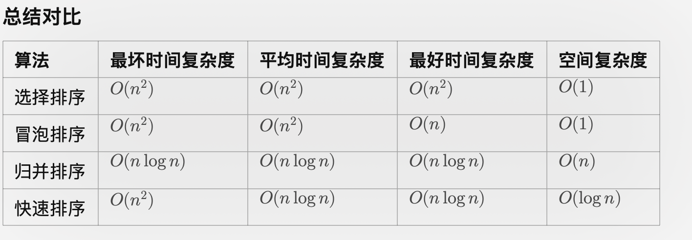
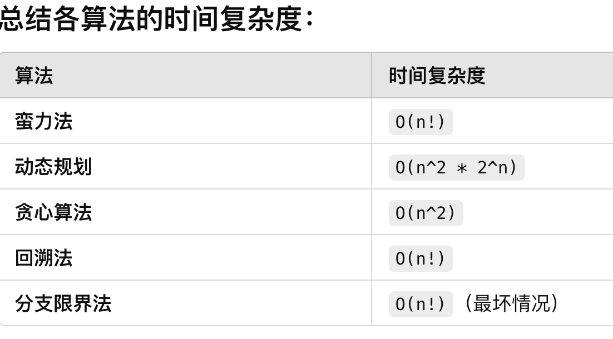

# 动态规划
01背包
最长公共子序列
多段图最短路径
TSP问题

# 分治法
选择、冒泡、归并、快速排序4种算法

+ 归并的空间复杂度nlog(2)n,递归的深度是log(2)n,每次分割都会把序列长度减半，因此分割的层数等于序列的对数（以 2 为底）。每一层处理的数据量都是n
+ 快速排序。平均时间复杂度O(nlogn),最坏时间复杂度O(n^2)（此时每轮选择的都是最大的或者最小的pivot）,空间复杂度O(logn)

+ 最大子段和
    时间复杂度nlog(2)n
    + 分治法思路
    划分问题：将数组分为两部分，分别求解左半部分和右半部分的最大子段和。
    解决子问题：
    最大子段和可能出现在左半部分；
    最大子段和可能出现在右半部分；
    最大子段和可能跨越左右两部分。
    合并结果：返回左半部分、右半部分和跨越部分三者中的最大值。

# 减治法
折半查找、堆排序？

# 贪心算法
背包问题，图着色问题，最小生成树prim,kruskral算法，活动安排问题

# 回溯法，深度搜索
+ 画解空间树
图着色，素数环，哈密顿回路（所有城市到一次），批处理作业调度
n皇后问题： 
if (x[k]= =x[i] | | abs(k-i)= =abs(x[k]-x[i])) 
//检查是否在对角线代码
//这里的 x[k] 和 x[i] 分别表示第 k 行和第 i 行的皇后所在的列位置。k 和 i 是行号，x[k] 和 x[i] 是皇后在对应行上的列位置。
//它们的行差（k - i）和列差（x[k] - x[i]）的绝对值是相等的。这意味着如果两个皇后在同一对角线上，它们的行和列的差的绝对值将相等。

# TSP问题

