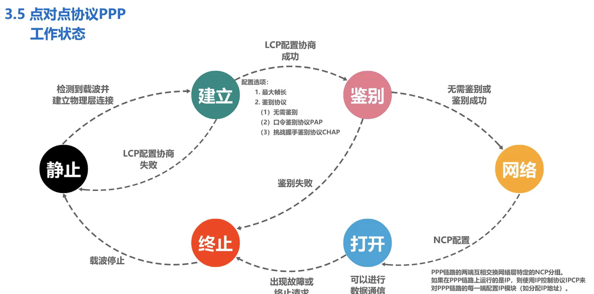
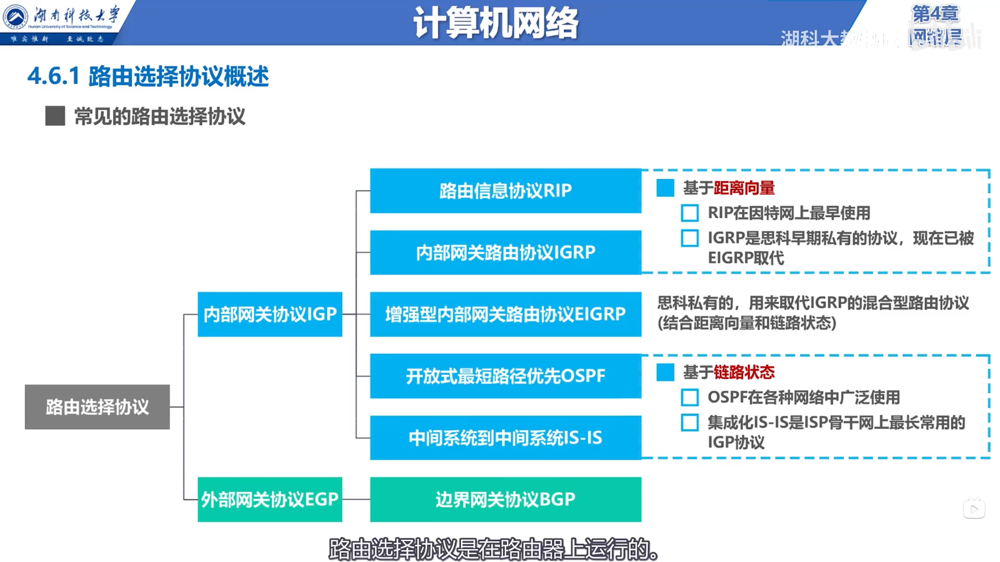
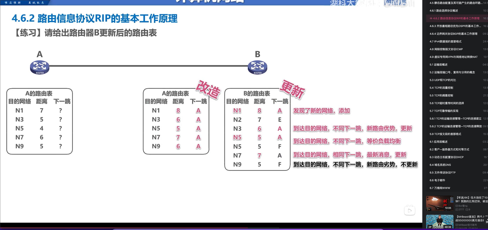
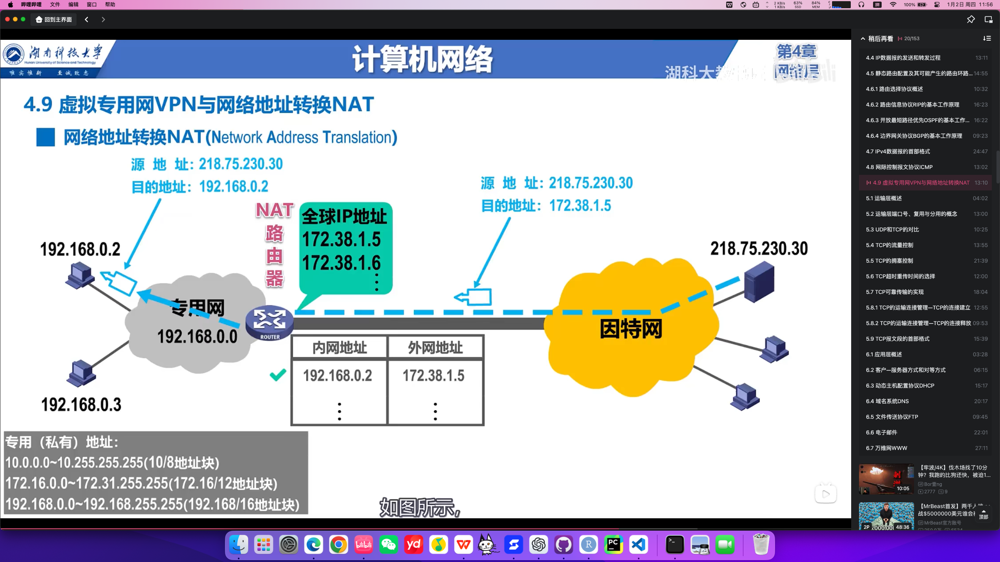
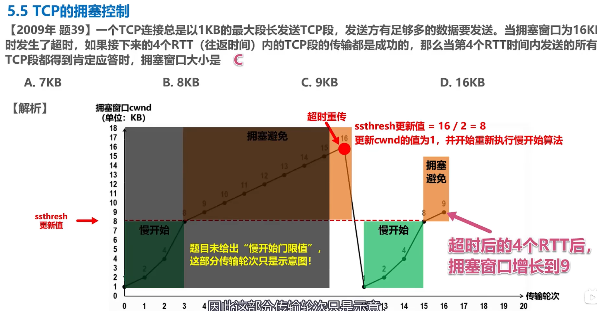
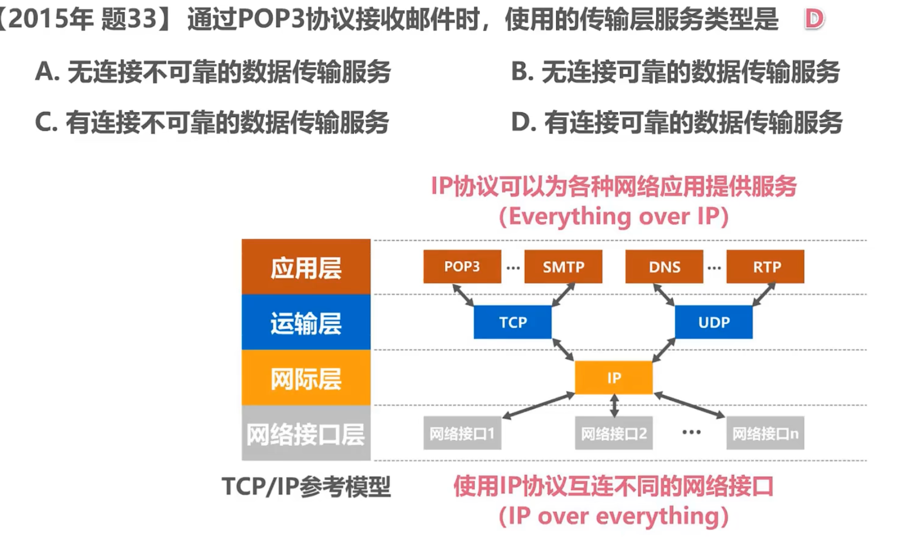

# 第一章 概述

## WAN,MAN,LAN,PAN

## 网络性能指标
单位：课本P21

## TCP/IP协议
### 运输层&网络层
当我们传输一个文件时，运输层和网络层会协同工作，确保文件能够从发送方安全、可靠地到达接收方。下面我将通过一个例子来解释它们是如何协同工作的。

##### 例子：发送一封电子邮件

假设你想通过电子邮件发送一个附件（比如一个PDF文件）给你的朋友。

1. **运输层的作用**：
   - **端到端通信**：首先，你的邮件客户端（比如Outlook）会使用运输层协议（通常是TCP，传输控制协议）来建立一个稳定的连接到邮件服务器。这个连接确保了数据可以在你的电脑和邮件服务器之间可靠地传输。
   - **数据分段**：邮件客户端会将PDF文件分割成多个小的数据块，每个数据块都包含文件的一部分内容。这些数据块会通过运输层发送。
   - **确认和重传**：如果某个数据块在传输过程中丢失，运输层会要求发送方重新发送这个数据块，确保所有数据都能被接收方收到。

2. **网络层的作用**：
   - **路由选择**：当你的邮件客户端通过运输层发送数据块时，网络层会负责将这些数据块从你的电脑路由到邮件服务器。网络层使用IP协议（互联网协议）来确定数据的最佳路径。
   - **数据封装**：每个数据块（在网络层称为数据包）都会被封装在IP数据包中，这些数据包包含了源IP地址（你的电脑）和目标IP地址（邮件服务器）。
   - **分片和重组**：如果数据块太大，无法通过网络中的某个链路传输，网络层会将数据块进一步分割成更小的片段，并在目的地重新组装它们。

##### 协同工作：
- **封装**：运输层将文件分割成数据块，并将这些数据块交给网络层。网络层将这些数据块封装成IP数据包。
- **传输**：网络层负责将IP数据包从发送方传输到接收方，通过路由器和交换机等网络设备，选择合适的路径。
- **重组**：当所有的IP数据包到达邮件服务器后，网络层会将它们传递给运输层。运输层会识别这些数据块，并按照正确的顺序将它们重新组合成原始的PDF文件。
- **确认**：运输层还会确认邮件服务器是否成功接收了所有数据块。如果邮件服务器确认收到，你的邮件客户端会显示邮件已发送成功。

通过这样的协同工作，运输层确保了数据的可靠传输和端到端的通信，而网络层则负责数据在网络中的路由和传输。这样，即使在复杂的网络环境中，你的文件也能被安全、可靠地传输到目的地。

### 文件在TCP/IP协议中传输的过程
PPT 1—2 56～76页

## 区分协议&服务

# 第二章 物理层
## 物理层的任务
机械特性，电气特性，功能特性，过程特性

## 编码（基带调制）
==数字型号->另一种数字信号==
不归零制，归零制，曼彻斯特编码，差分曼彻斯特编码

## 调制（带通）
==数字信号->模拟信号==
AM，FM，PM

## 信道的极限容量
奈式准则
香农公式

+ 区别：奈式准则专注于理想通信环境下的最大传输速率，而香浓公式则考虑了现实环境中噪声对通信的影响，提供了一个更为实际的最大传输速率的理论指导。

## 物理层下的传输媒体
#### 导引型
双绞线
光纤
同轴电缆

#### 非导引型
微波
红外线
可见光

## 信道复用技术
频分复用，时分复用
波分复用
码分复用

## 串形传输/并行传输

## 同步/异步传输

• 静态划分信道：
1. 频分复用
2. 时分复用
3. 波分复用
4. 码分复用
• 动态媒体接入控制（多点接入）：
1. 随机接入：所有的用户可随机地发送信息。
2. 受控接入：用户必须服从一定的控制。如轮询（polling）。

## 习题
   

# 第三章 数据链路层

## 链路&数据链路

## 数据链路层三个基本任务
+ 封装成帧
+ 透明传输（正确找到帧的边界：SOH，EOT）
+ 差错检测
  + CRC（循环冗余校验）
      + FCS（帧检验序列）

## 在广播信道中CSMA/CD协议
==该协议下，是半双工通信，一个站不可能同时发送和接受，但边发送边监听==
+ 载波接听多点接入
+ 碰撞检测
   + 争用期

## 集线器（Hub）和交换机（Switch）的作用与区别

---
==使用集线器的以太网在逻辑上是一个总线网，使用的还是CSMA/CD协议，而使用交换机的以太网则是点对点的通信，使用的则是MAC协议==
#### 一、作用

##### 1. 集线器（Hub）
- **作用**：
  - **连接多台设备**：集线器是一个简单的网络设备，用于将多台计算机或网络设备连接到同一个网络。
  - **信号广播**：集线器会将接收到的数据包广播到所有端口，所有连接的设备都会接收到这个数据包。
- **使用场景**：
  - 小型、简单的网络环境，例如早期的局域网。

##### 2. 交换机（Switch）
- **作用**：
  - **数据转发**：交换机可以根据设备的 MAC 地址（物理地址）智能地将数据包发送到目标设备的端口，而不是广播到所有端口。
  - **提高网络效率**：通过点对点通信，交换机避免了不必要的数据包冲突和广播风暴。
  - **支持更多功能**：现代交换机支持 VLAN（虚拟局域网）、链路聚合、端口镜像等高级功能。
- **使用场景**：
  - 中型和大型网络，例如企业局域网、校园网。

---

#### 二、区别

| 特性                | 集线器（Hub）                     | 交换机（Switch）                |
|---------------------|----------------------------------|----------------------------------|
| **工作层次**        | 数据链路层以下（物理层）          | 数据链路层（第二层）             |
| **数据转发方式**    | 广播：所有设备都接收数据包        | 单播：只发送到目标设备           |
| **效率**            | 低：所有设备共享带宽，容易冲突    | 高：每个设备独占带宽             |
| **智能性**          | 无：不识别设备地址                | 有：通过 MAC 地址表识别设备      |
| **带宽利用率**      | 低：所有端口共享总带宽            | 高：每个端口有独立带宽           |
| **网络冲突**        | 高：容易产生冲突和广播风暴        | 低：通过分隔冲突域减少冲突       |
| **成本**            | 低                                | 较高                            |
| **功能**            | 基本数据传输功能                  | 支持高级网络功能                 |

---

#### 三、使用建议

1. **集线器**：
   - 由于技术简单且效率低下，集线器已基本被淘汰。
   - 仅适合非常小型的网络环境，或用于学习物理层通信。

2. **交换机**：
   - 交换机是现代网络的主流设备，适用于几乎所有场景。
   - 家庭网络、企业局域网、大型数据中心都使用交换机来提高网络性能和可靠性。

---

#### 四、总结

- **集线器**是一个简单的广播设备，不具备智能转发功能，容易造成网络拥堵。
- **交换机**是一个智能设备，可以高效地管理和转发数据包，是现代网络的核心设备。
- 如果需要组建一个高效、稳定的网络，优先选择交换机。

## 以太网交换机的自学习功能

 !
## 交换机STP生成树协议
生成逻辑上最小二叉树，切断回路

## 习题
      

# 第四层 网络层
## 任务
网络层向运输层提供怎样的服务（“可靠传输”还是“不可靠传输”）
网络层寻址问题
路由选择问题

## IP地址
IP 地址及其表示方法
分类的 IP 地址
无分类编址 CIDR
   (1) 网络前缀
   (2) 地址块
   (3) 地址掩码

IP 地址的特点

==路由器接口在网络中也需要分配一个地址==

---

---

## IP数据报发送和转发

## MAC与IP地址区别

## 地址解析协议（ARP，Address Resolution Protocolsa
在网络中，设备通过 IP 地址互相通信，但在实际传输数据时，网络设备需要知道对方的 MAC 地址（物理地址），因为局域网的数据帧是基于 MAC 地址传输的。
	•	问题：IP 地址好比设备的“名字”，MAC 地址好比设备的“门牌号”。知道名字还不够，你需要知道门牌号才能把东西送到家。
	•	解决办法：ARP 就是用来把 IP 地址翻译成 MAC 地址的工具。

## IP数据包的格式

## IP层转发分组的过程
### 基于终点的转发
基于终点的转发 是 IP 层转发分组的核心思想，它的原因、原理和作用可以用通俗的方式来理解如下：

1. 原因：为什么要基于终点的转发？

在网络中，每个设备都有一个唯一的 IP 地址，表示它的“家”（网络位置）。当数据包从源设备发往目标设备时，中间可能经过多个路由器。为了让数据包顺利到达目标，需要一种方法指导路由器把数据包“送往正确的方向”。

问题：
	•	网络中设备众多，不可能让每个路由器都记住每一个设备的位置。
	•	数据包需要根据目标地址一步步找到目标设备，而不是“盲目乱跑”。

解决办法：
	•	基于终点的转发：每个路由器只需看数据包的目标 IP 地址，并根据路由表决定数据包的下一跳方向。

2. 原理：基于终点的转发是如何工作的？
	1.	目标地址驱动：
	•	每个数据包的 IP 首部中都包含目标 IP 地址。
	•	路由器通过读取目标 IP 地址，决定下一步将数据包转发到哪里。
	2.	路由表：
	•	每个路由器维护一张 路由表，记录了目标网络与下一跳路由器的对应关系。
	•	当数据包到达路由器时，路由器查阅路由表，找到目标 IP 地址所属的网络，然后将数据包转发给下一跳。
	3.	逐跳转发：
	•	数据包从一个路由器转发到下一个路由器，直到到达目标网络中的设备。

举例：
	•	你（源设备）想寄一封信给朋友小明（目标设备）。
	•	每个路由器（邮局）会看信封上的地址（目标 IP 地址），然后根据邮政系统的规则（路由表）决定把信转发到哪个下一级邮局，直到信到达小明所在的邮局。

3. 作用：基于终点的转发的好处是什么？
	1.	简化网络管理：
	•	每个路由器只需要维护一张路由表，而不需要知道网络中每个具体设备的位置。
	•	路由表按网络范围记录目标，而不是逐一记录每个设备。
	2.	动态适应网络变化：
	•	如果某条路径不可用，路由器可以根据新的路由表选择其他路径，而不需要重新配置整个网络。
	3.	提高效率：
	•	数据包只需携带目标 IP 地址，路由器逐跳查表转发，避免了复杂的全网广播。
	4.	支持大规模网络：
	•	基于终点的转发让互联网这种全球性网络成为可能，因为它能高效处理数十亿个设备的通信需求。

通俗类比：邮政系统的分发机制
	1.	目标 IP 地址 = 收信人地址：
	•	数据包中的目标 IP 地址就像信封上的收信人地址。
	2.	路由器 = 邮局：
	•	路由器就像邮局，它根据收信人的地址决定信件应该送到哪个下一级邮局。
	3.	路由表 = 邮政路线图：
	•	路由表是邮局的路线图，记录了哪个地区的信应该送到哪个下一级邮局。
	4.	逐跳转发 = 邮件中转：
	•	信件从一个邮局转到下一个邮局，直到到达目标地区的小明。

4. 总结

部分	解释
原因	数据包需要找到目标设备，但路由器不能记住所有设备的位置。
原理	根据目标 IP 地址查路由表，逐跳转发数据包直到到达目标网络。
作用	简化管理、动态适应网络变化、提高效率、支持大规模网络。
类比	像邮政系统逐级转发信件，根据地址找到收信人。

基于终点的转发是 IP 网络通信的核心思想，它让复杂的互联网通信变得简单、高效且可扩展！

### 最长匹配前缀
==保证数据包目标IP地址与路由表目的IP地址的最大匹配==

举例
	•	路由表中有以下条目：
	1.	192.168.0.0/16
	2.	192.168.0.0/24
	3.	192.168.0.0/26
	•	目标 IP 地址是 192.168.0.65。
	•	192.168.0.65 匹配所有三个前缀。
	•	最长前缀是 /26，因此选择 192.168.0.0/26 作为转发路径。

### 二叉树线索查找转发表
举例

假设我们有一个简单的路由表，其中包含以下路由信息：
	•	192.168.0.0/24 -> 路由 A
	•	192.168.0.0/16 -> 路由 B
	•	192.168.1.0/24 -> 路由 C

如果将这些路由信息组织成二叉树结构，路由器可以根据目标 IP 地址 192.168.0.1 快速查找到匹配的路由（例如 192.168.0.0/24）。

## IPv6
1. IPv6的基本首部

定义

IPv6（Internet Protocol version 6）是继IPv4之后的下一代互联网协议。IPv6的基本首部是数据包中用于标识和路由的部分，包含了目标地址、源地址、数据包长度等关键信息。

IPv6基本首部的结构

IPv6的基本首部相比IPv4更加简洁，去掉了一些IPv4中的可选字段，主要包含以下几个部分：
	•	版本（Version）：占4位，表示IP协议的版本号，IPv6的版本号为6。
	•	流量类（Traffic Class）：占8位，用于区分不同类型的流量，类似于IPv4中的服务类型。
	•	流量标签（Flow Label）：占20位，用于标识同一流的数据包，帮助路由器优化数据传输。
	•	有效载荷长度（Payload Length）：占16位，表示数据包中除了首部外的有效数据长度。
	•	下一个头部（Next Header）：占8位，指示首部后面的数据类型（如TCP、UDP、ICMP等）。
	•	跳数限制（Hop Limit）：占8位，表示数据包可以经过的最大路由器数，类似IPv4中的生存时间（TTL）。
	•	源地址（Source Address）：占128位，表示发送方的IPv6地址。
	•	目标地址（Destination Address）：占128位，表示接收方的IPv6地址。

IPv6的首部结构简洁明了，减少了不必要的字段，便于路由器高效处理。

2. IPv6地址

定义

IPv6地址是用于标识网络中设备的唯一地址。IPv6地址长度为128位，远大于IPv4的32位，提供了几乎无限的地址空间。

IPv6地址的分类
	•	单播地址（Unicast）：表示一个唯一的设备。数据包只发送给一个目标。
	•	多播地址（Multicast）：表示一组设备。数据包发送给多个设备。
	•	任播地址（Anycast）：表示一组设备中的任意一个。数据包发送给最近的设备。
	•	广播地址（Broadcast）：IPv6不再使用广播地址，取而代之的是多播地址。

**IPv6地址通常以8组4个十六进制数表示，格式为 xxxx:xxxx:xxxx:xxxx:xxxx:xxxx:xxxx:xxxx**，例如 2001:0db8:85a3:0000:0000:8a2e:0370:7334。

3. 从IPv4向IPv6过渡

原因

IPv4地址已经接近耗尽，而IPv6提供了更大的地址空间，能够支持更多的设备。为了确保网络的持续发展，IPv6成为了必要的选择。然而，IPv6的部署需要一个过渡期，因为许多网络仍然使用IPv4。

过渡方法
	•	双栈（Dual Stack）：同时运行IPv4和IPv6协议，允许设备同时支持IPv4和IPv6通信。
	•	隧道技术（Tunneling）：通过隧道技术将IPv6数据包封装在IPv4数据包中，以便通过IPv4网络传输。
	•	地址转换（NAT64）：通过地址转换将IPv6地址转换为IPv4地址，使IPv6设备能够与IPv4设备通信。

这些过渡方法帮助网络在IPv4和IPv6之间平滑过渡，确保不同协议的设备能够互通。

4. ICMPv6的定义、原因、原理和作用

定义

ICMPv6（Internet Control Message Protocol for IPv6）是IPv6的控制消息协议，类似于IPv4中的ICMP。它用于传输网络设备之间的控制消息，如错误报告、网络诊断等。

原因

随着IPv6的引入，原有的ICMP协议需要适应IPv6的特点，ICMPv6应运而生。它不仅保留了IPv4中用于错误报告的功能，还增加了IPv6特有的功能。

原理

ICMPv6与IPv6协同工作，主要用于：
	•	错误报告：如目标不可达、时间超时等。
	•	网络诊断：如通过 ping 命令检查设备的可达性。
	•	邻居发现（Neighbor Discovery）：类似于IPv4中的ARP，ICMPv6用于发现邻居设备的MAC地址，确保IPv6设备能够正确通信。
	•	路由器广告（Router Advertisement）：路由器使用ICMPv6发送广告消息，告知网络中其他设备当前网络的状态。

作用

ICMPv6在IPv6网络中发挥着重要作用，主要包括：
	•	网络故障报告：当网络出现问题时，ICMPv6会通知源设备。
	•	设备发现：ICMPv6帮助设备发现网络中其他设备的存在和状态。
	•	地址自动配置：ICMPv6支持IPv6设备的自动地址配置，使得设备可以在没有DHCP服务器的情况下自动获取IP地址。

总结

部分	解释
IPv6基本首部	包含版本、源地址、目标地址等字段，比IPv4更简洁高效。
IPv6地址	128位的地址空间，支持单播、多播、任播等多种类型。
IPv4到IPv6过渡	由于IPv4地址枯竭，IPv6提供更大的地址空间，过渡方法包括双栈、隧道、NAT64等。
ICMPv6的定义、原因、原理和作用	ICMPv6用于IPv6网络中的控制消息传递，支持错误报告、网络诊断、设备发现等功能。

IPv6的引入和ICMPv6的使用，使得网络更加高效、灵活和可扩展，确保了网络在未来的持续发展。

## 路由选择协议

### 分层次的路由选择协议
### 内部路由（网关）RIP协议
==和相邻路由器定期交换路由表，以确定最短路由==

+ 举例：
假设有3个路由器A、B、C，连接关系如下：
A ↔ B ↔ C
	•	A知道自己到B是1跳，B知道自己到C是1跳。
	•	A从B那里得知，B到C是1跳，那么A就知道自己到C是2跳。

---

答案： 

+ 等价负载均衡 ：把要发送的数据均分到多个举例相同的路由路径
+ N7更新的原因是： B原先到达N7需要通过A走举例为6的路径，即A到N7的路径为5，现在A发送的新RIP报文显示A到N7需要6（6>5），证明原先到达N7的路径不可用了，A现在选用了一个新的路径。**即N7路由器的链路状态信息过期，需要重新计算最短路径。**

---

### 内部路由（网关）OSPF协议

+ 通俗解释

OSPF使用一种叫“链路状态”的方法，类似于每个路由器都有一张网络地图。
	1.	路由器绘制地图：
每个路由器定期广播自己的“链路状态”，告诉其他路由器自己与谁相连、带宽是多少。
	2.	全网共享地图：
所有路由器将这些信息汇总，形成整个网络的完整地图。
	3.	计算最短路径：
每个路由器根据地图，用Dijkstra算法计算出到其他路由器的最短路径。

+ 举例
	•	假设A、B、C三个路由器连接如下：
A ↔ B（带宽10Mbps）
B ↔ C（带宽5Mbps）
A ↔ C（带宽1Mbps）
	•	A会广播“我和B、C相连，带宽分别是10和1”。
	•	B和C也广播类似信息。
	•	所有路由器根据信息得知，从A到C经过B（总带宽5Mbps）比直接连接更优。
### 外部路由（网关）BGP协议
==BGP是互联网的“骨干协议”，通过灵活、稳定的路由选择，确保全球网络能够高效运转。==

场景1：政策控制路径选择

假设有三个AS：
	•	AS1是你的公司网络。
	•	AS2是一个价格低廉但延迟较高的运营商。
	•	AS3是一个价格较高但性能更好的运营商。

需求：
	•	对于视频流量，你希望选择AS3，因为性能更好。
	•	对于普通文件传输，你希望选择AS2，因为价格便宜。

BGP解决方案：
	•	通过BGP的路径选择规则，你可以为不同类型的流量设置优先级，让路由器自动选择最合适的路径。

场景2：路径冗余提高可靠性

假设AS1（你的公司）和AS3（合作伙伴）之间有两条路径：
	•	路径1：AS1 → AS2 → AS3
	•	路径2：AS1 → AS4 → AS3

需求：
	•	优先使用路径1，但如果路径1中断，自动切换到路径2。

BGP解决方案：
	•	BGP会优先选择路径1，但在路径1失效时，快速切换到路径2，确保通信不中断。

## 路由器的构成
•	路由选择：
路由器决定“下一跳”的过程，也就是根据目标地址，选择数据包应该往哪个方向走。

通俗比喻：就像开车时用导航软件选择哪条路最合适。
•	分组转发：
路由器把接收到的数据包按照路由选择的结果发送到正确的接口上。
通俗比喻：导航告诉你走哪条路后，你实际把车开上了指定的路。

## IP多播

#### 什么是IP多播？

IP多播是一种网络通信方式，允许一个设备同时向多个设备发送数据，而不需要为每个设备单独发送。
通俗比喻：就像电视台广播节目，所有打开相同频道的人都能同时接收到内容。

IP多播的原因
	1.	节省带宽
如果每个接收者都需要单独发送数据，网络资源会被大量占用。多播通过一次发送给多个设备，减少了带宽消耗。
	2.	提高效率
多播可以让数据只在需要的地方传输，避免浪费网络资源。
	3.	支持特定应用场景
适合需要实时同步给多个设备的应用，如视频直播、股票行情推送、在线游戏等。

#### IP多播的原理
	1.	多播组
**IP多播使用一个特殊的IP地址范围（224.0.0.0 - 239.255.255.255）**，代表一个“多播组”。
	•	想接收数据的设备必须加入这个组。
举例：多播地址 224.0.0.1 可能代表一个视频直播组，所有想看直播的设备都加入这个组。
	2.	数据传输
数据从发送者发出后，路由器会根据多播组成员的分布，把数据复制并分发到正确的网络。
	3.	动态加入和退出
设备可以随时加入或退出多播组，路由器会动态调整数据的分发路径。

#### IP多播的作用
	1.	节省网络资源
数据只需要发送一次，路由器会负责复制和分发。
	2.	支持实时应用
适合需要同步传输给多个设备的应用场景。
	3.	灵活性高
设备可以动态加入或退出，不影响其他设备的接收。

---

#### IP多播需要的两种协议

1. **网际组管理协议（IGMP）**
	•	定义
IGMP是用于管理多播组成员的协议，帮助路由器知道哪些设备需要接收多播数据。
	•	原因
路由器需要知道谁想接收数据，才能正确分发。
	•	原理
	•	设备通过IGMP向路由器发送加入或退出多播组的请求。
	•	路由器记录这些请求，并把数据发送给组内的所有成员。
	•	作用
管理多播组的成员动态变化，确保数据只发送给需要的设备。

举例
设备A发送IGMP消息：“我要加入多播组224.0.0.1”。路由器记录设备A的请求，并确保直播数据能到达设备A。

2. **多播路由选择协议**
	•	定义
这是负责决定多播数据如何在网络中传输的协议，如PIM（Protocol Independent Multicast）。
	•	原因
数据需要高效传输，不能随意复制和分发，否则会浪费网络资源。
	•	原理
	•	路由器根据多播组成员的分布，建立一棵“分发树”，确保数据只在需要的路径上传输。
	•	避免数据在不需要的网络中传播。
	•	作用
确保多播数据在网络中高效传输，减少带宽浪费。

举例
	•	路由器R1收到多播数据，发现设备A和设备B都在不同的网络中。
	•	R1把数据发送给R2和R3，R2负责分发到设备A，R3负责分发到设备B。

#### 三种技术

| **方法**                  | **通俗解释**                                                                 | **优点**                              | **缺点**                              | **举例**                                                                 |
|---------------------------|-----------------------------------------------------------------------------|---------------------------------------|---------------------------------------|--------------------------------------------------------------------------|
| **洪泛与剪除**            | 先广播到所有网络，再剪掉不需要的分支。                                         | 简单易实现，覆盖全面                  | 初始阶段浪费资源                     | 学校广播通知到每个教室，再剪除不需要的教室。                              |
| **隧道技术**              | 把多播数据封装成单播，穿越不支持多播的网络。                                   | 解决多播网络不连通的问题              | 需要额外的封装和解封装步骤           | 用信封寄送“多播邀请函”，穿越不支持多播的区域。                           |
| **基于核心发现的技术**     | 通过核心节点集中管理数据分发路径。                                             | 高效、避免浪费资源                    | 核心节点故障可能影响服务             | 学校广播站集中管理通知的发送，只发给有需求的教室。                        |

#### 举例辅助解释

场景：直播课堂
	1.	需求
老师需要给100个学生同时直播视频内容。
	2.	传统单播方式
老师的设备需要给每个学生单独发送一份视频数据，总共发送100次，浪费大量带宽。
	3.	多播方式
老师的设备只发送一次视频数据到多播组，路由器根据IGMP和多播路由协议，把数据分发给所有学生。

	•	IGMP
学生通过IGMP加入多播组，告诉路由器他们需要接收数据。
	•	多播路由协议
路由器根据多播组成员的分布，建立高效的分发路径，把数据发送到所有学生所在的网络。

总结表格

概念	通俗解释	举例
IP多播	一种通信方式，允许一个设备同时向多个设备发送数据。	老师通过多播给100个学生直播视频内容。
IGMP	管理多播组成员的协议，让路由器知道哪些设备需要接收数据。	学生发送IGMP消息加入多播组224.0.0.1，路由器记录这些请求。
多播路由选择协议	确定多播数据的转发路径，确保数据高效传输。	路由器根据成员分布，把数据从老师的设备分发到100个学生的设备。

通过IP多播、IGMP和多播路由协议的配合，网络能够高效支持像直播课堂这样的场景，节省资源、提升性能。

## VPN虚拟网络

## NAT网络地址转换

| **概念**        | **通俗解释**                                                                 | **作用**                                    | **举例**                                        |
|-----------------|-----------------------------------------------------------------------------|---------------------------------------------|------------------------------------------------|
| **VPN**         | 通过公共网络建立加密的安全连接，模拟私有网络。                               | 保护隐私、安全访问远程资源、绕过地理限制。  | 在公共Wi-Fi下使用VPN保护数据安全，远程访问公司资源。 |
| **NAT**         | 网络地址转换技术，允许多个设备共享一个公共IP地址访问互联网。               | 节省IP地址、提高安全性。                    | 家庭网络多个设备通过一个公共IP地址访问互联网。     |

# 第五章 运输层
==为应用进程之间提供端到端的逻辑通信==
## 流量控制

## 拥塞控制

+ ssthresh慢开始门限值：小于这个值用慢开始算法，大于用拥塞避免算法。
+ cwnd拥塞窗口：是可以发送的报文数。

总结四个

---

## TCP实现可靠传输

## TCP报文的首部格式

# 第六章 应用层
## 文件传输协议FTP

==数据连接是服务器发起的叫主动连接，这个时候服务器用端口20。是客户发起的叫被动连接，这个时候数据连接端口是临时约定的==

==控制连接服务器都是用端口21==

## 电子邮件协议SMTP
==SMTP只能发送ASCII码，即英文。其他语言需要使用MINE协议转换成ASCII，再用SMTP发送==
==用户代理从邮件服务器下载邮件用POP3协议==

---

## 万维网www

---

## DNS域名系统

---

# 
