# 1
#include <stdio.h>
#include "mpi.h"
#define N 100000

int main(int argc, char *argv[]) {
    double local = 0.0, pi, w, temp = 0.0;
    int i, taskid, numtask;

    // 定义每个小矩形的宽度，1.0 / N 其实是区间长度
    w = 1.0 / N;

    // 初始化 MPI 环境
    MPI_Init(&argc, &argv);

    // 获取当前进程的 ID（taskid）
    MPI_Comm_rank(MPI_COMM_WORLD, &taskid);

    // 获取总进程数
    MPI_Comm_size(MPI_COMM_WORLD, &numtask);

    // 每个进程负责计算一部分积分的和
    for (i = taskid; i < N; i = i + numtask) {
        // 计算当前小矩形的中心点
        temp = (i + 0.5) * w;

        // 累加局部积分值
        local = 4.0 / (1.0 + temp * temp) + local;
    }

    // 汇总所有进程的局部积分值到主进程
    MPI_Reduce(&local, &pi, 1, MPI_DOUBLE, MPI_SUM, 0, MPI_COMM_WORLD);

    // 主进程输出最终结果
    if (taskid == 0) {
        printf("pi is %.20f \n", pi * w);
    }

    // 结束 MPI 环境
    MPI_Finalize();
    return 0;
}

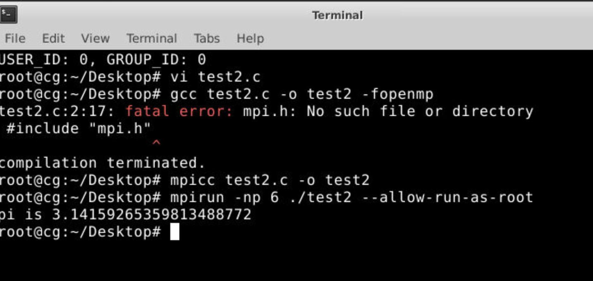｝

# 2
## 1
#include <stdio.h>
#include <omp.h>
static long num_steps = 100000;
double step;
#define NUM_THREADS 2
int main() {
    int i;
    double x, pi, sum[NUM_THREADS];
    step = 1.0 / (double)num_steps;
    omp_set_num_threads(NUM_THREADS);
    #pragma omp parallel private(i)
    {
        double x;
        int id;
        id = omp_get_thread_num();
        for (i = id, sum[id] = 0.0; i < num_steps; i = i + NUM_THREADS) {
            x = (i + 0.5) * step;
            sum[id] += 4.0 / (1.0 + x * x);
        }
    }
    for (i = 0, pi = 0.0; i < NUM_THREADS; i++) pi += sum[i] * step;
    printf("%lf\n", pi);
    return 0;
}

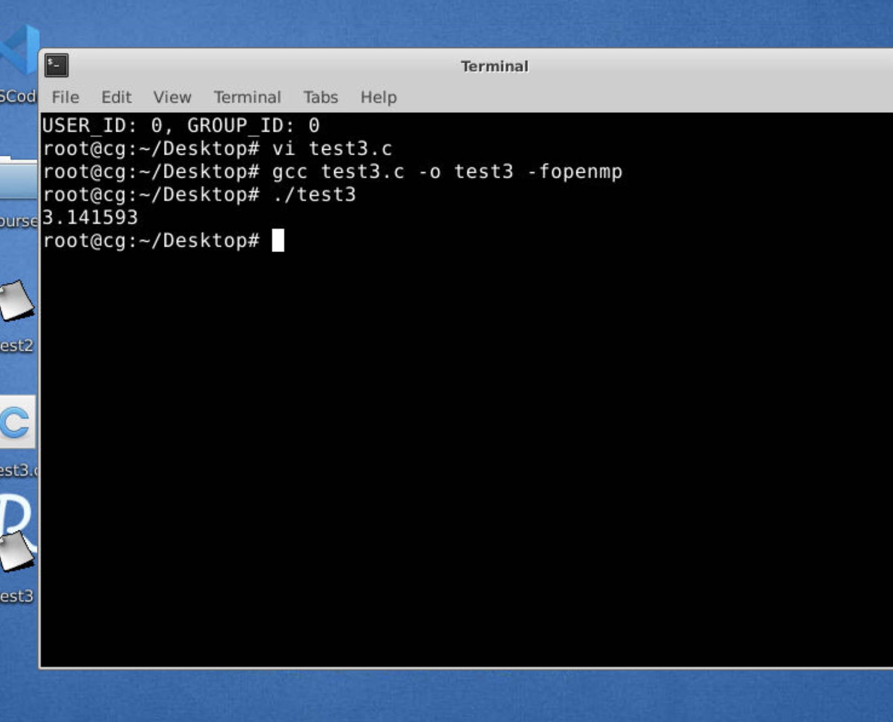

## 2
#include <stdio.h>
#include <omp.h>

static long num_steps = 100000;
double step;

int main() {
    int i;
    double x, pi, sum = 0.0;
    step = 1.0 / (double)num_steps;

    #pragma omp parallel private(x)
    {
        #pragma omp for reduction(+:sum)
        for (i = 0; i < num_steps; i++) {
            x = (i + 0.5) * step;
            sum += 4.0 / (1.0 + x * x);
        }
    }

    pi = sum * step;
    printf("Calculated value of pi: %.15f\n", pi);

    return 0;
}

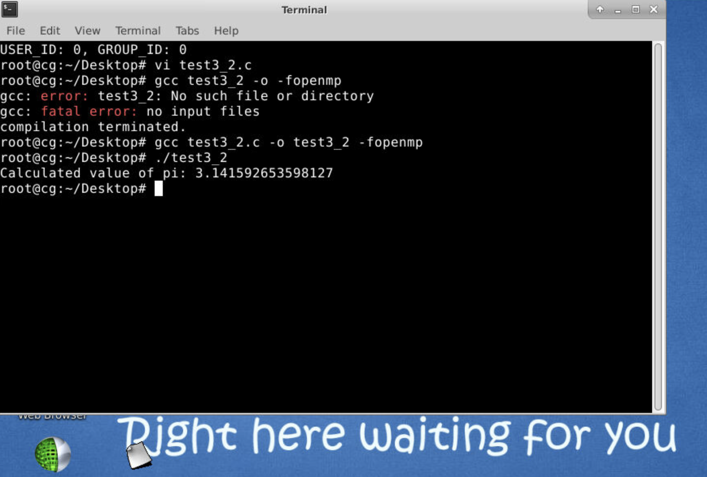

## 3
#include <stdio.h>
#include <omp.h>
static long num_steps = 100000;
double step;
#define NUM_THREADS 2
void main ()
{
    int i;
    double pi=0.0;
    double sum=0.0;
    double x=0.0;
    step = 1.0/(double) num_steps;
    omp_set_num_threads(NUM_THREADS);
    #pragma omp parallel for reduction(+:sum) private(x)
    for(i=1;i<= num_steps; i++){
        x = (i-0.5)*step;
        sum += 4.0/(1.0+x*x);
    }
    pi = sum * step;
    printf("%lf\n",pi);
}

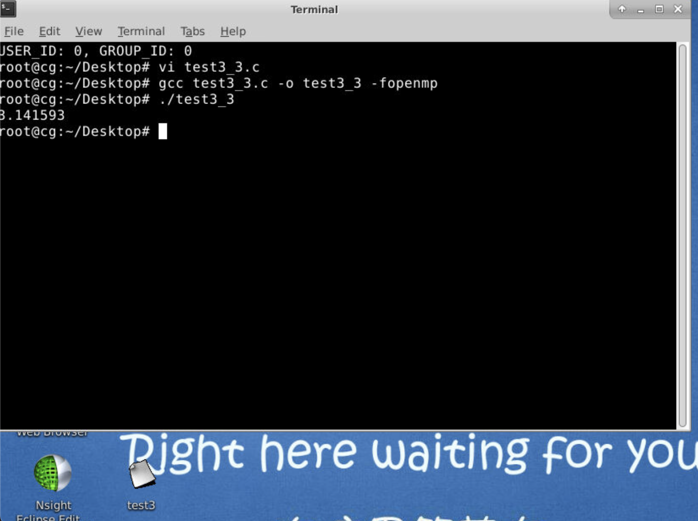

## 4
#include <stdio.h>
#include <omp.h>

static long num_steps = 100000;
double step;
#define NUM_THREADS 2

int main() {
    int i, id;
    double x, pi = 0.0, sum = 0.0;
    step = 1.0 / (double) num_steps;
    omp_set_num_threads(NUM_THREADS);

    #pragma omp parallel private(id, i, x, sum)
    {
        id = omp_get_thread_num();
        for (i = id, sum = 0.0; i < num_steps; i = i + NUM_THREADS) {
            x = (i + 0.5) * step;
            sum += 4.0 / (1.0 + x * x);
        }

        #pragma omp critical
        pi += sum;
    }

    pi *= step;
    printf("%lf\n", pi);

    return 0;
}

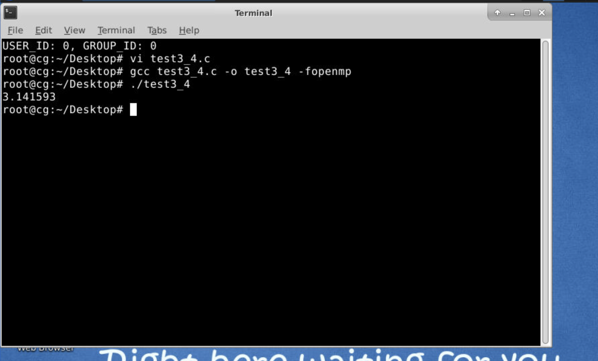

## 3
#include <stdio.h>
#include <stdlib.h>
#include <mpi.h>

#define N 4

void init_matrix(double A[N][N]) {
    int i, j;
    for (i = 0; i < N; i++) {
        for (j = 0; j < N; j++) {
            A[i][j] = i * N + j + 1;
        }
    }
}

int main(int argc, char *argv[]) {
    int rank, size;
    MPI_Init(&argc, &argv);
    MPI_Comm_rank(MPI_COMM_WORLD, &rank);
    MPI_Comm_size(MPI_COMM_WORLD, &size);

    double A[N][N];
    init_matrix(A);

    MPI_Datatype lower_triangle_type;
    int block_lengths[N];
    MPI_Aint displacements[N];
    MPI_Datatype types[N];
    
    int i, j, count = 0;
    for (i = 0; i < N; i++) {
        block_lengths[i] = i + 1;
        displacements[i] = (i * (i + 1)) / 2;
        types[i] = MPI_DOUBLE;
        count += block_lengths[i];
    }

    MPI_Type_create_struct(N, block_lengths, displacements, types, &lower_triangle_type);
    MPI_Type_commit(&lower_triangle_type);

    if (rank == 1) {
        MPI_Send(&A[0][0], 1, lower_triangle_type, 0, 0, MPI_COMM_WORLD);
    }

    if (rank == 0) {
        double received_data[count];
        MPI_Recv(received_data, count, lower_triangle_type, 1, 0, MPI_COMM_WORLD, MPI_STATUS_IGNORE);

        printf("Received lower triangle:\n");
        int index = 0;
        for (i = 0; i < N; i++) {
            for (j = 0; j <= i; j++) {
                printf("%lf ", received_data[index]);
                index++;
            }
            printf("\n");
        }
    }

    MPI_Type_free(&lower_triangle_type);

    MPI_Finalize();
    return 0;
}

# 3
#include "mpi.h"
#include <stdio.h>
#include <stdlib.h>
#include <string.h>

#define N 4

int main(int argc, char** argv) {
    int rank, size;
    MPI_Init(&argc, &argv);
    MPI_Comm_rank(MPI_COMM_WORLD, &rank);
    MPI_Comm_size(MPI_COMM_WORLD, &size);

    if (size != 2) {
        MPI_Abort(MPI_COMM_WORLD, 1);
    }

    int lengths[N], displacements[N];
    for (int i = 0; i < N; i++) {
        lengths[i] = i + 1;
        displacements[i] = i * N;
    }

    MPI_Datatype lower_triangle;
    MPI_Type_indexed(N, lengths, displacements, MPI_INT, &lower_triangle);
    MPI_Type_commit(&lower_triangle);

    if (rank == 0) {
        int matrix[N][N] = {0};
        int buffer[N * N] = {0};

        MPI_Recv(buffer, 1, lower_triangle, 1, 0, MPI_COMM_WORLD, MPI_STATUS_IGNORE);

        for (int i = 0; i < N; i++) {
            for (int j = 0; j <= i; j++) {
                matrix[i][j] = buffer[i * N + j];
            }
        }

        printf("Processed Matrix:\n");
        for (int i = 0; i < N; i++) {
            for (int j = 0; j < N; j++) {
                printf("%d%c", matrix[i][j], j == N - 1 ? '\n' : '\t');
            }
        }
    } else if (rank == 1) {
        int matrix[N][N];
        for (int i = 0; i < N; i++) {
            for (int j = 0; j < N; j++) {
                matrix[i][j] = i + j + 1;
            }
        }

        int buffer[N * N];
        for (int i = 0; i < N; i++) {
            for (int j = 0; j < N; j++) {
                buffer[i * N + j] = matrix[i][j];
            }
        }

        printf("Original Matrix:\n");
        for (int i = 0; i < N; i++) {
            for (int j = 0; j < N; j++) {
                printf("%d%c", matrix[i][j], j == N - 1 ? '\n' : '\t');
            }
        }

        MPI_Send(buffer, 1, lower_triangle, 0, 0, MPI_COMM_WORLD);
    }

    MPI_Type_free(&lower_triangle);
    MPI_Finalize();
    return 0;
}

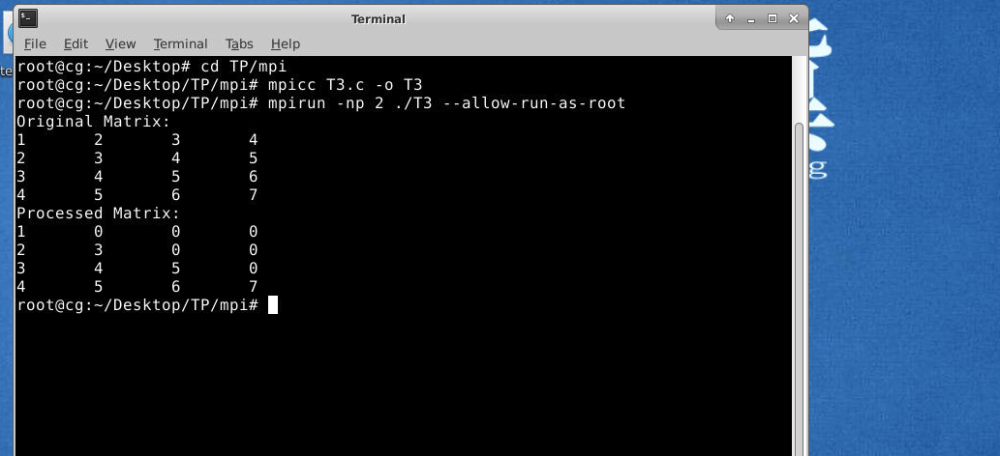

# 4
## 1
/*
这段代码使用 MPI（Message Passing Interface） 实现了一个并行矩阵乘法程序。它通过将矩阵 A 按行划分到多个进程中，利用每个进程并行计算矩阵乘法的部分结果，最后将结果收集到主进程中完成计算。整个过程包括矩阵的生成、广播、分发、并行计算和结果收集，目的是加速大规模矩阵乘法运算
*/
#include <mpi.h>
#include <stdio.h>
#include <stdlib.h>
#include <time.h>

// 随机生成矩阵的函数
void generate_matrix(double *matrix, int rows, int cols) {
    for (int i = 0; i < rows; i++) {
        for (int j = 0; j < cols; j++) {
            matrix[i * cols + j] = rand() % 10 + 1; // 随机值范围 [1, 10]
        }
    }
}

// 打印矩阵的函数
void print_matrix(const char *name, double *matrix, int rows, int cols) {
    printf("Matrix %s:\n", name);
    for (int i = 0; i < rows; i++) {
        for (int j = 0; j < cols; j++) {
            printf("%6.2f ", matrix[i * cols + j]);
        }
        printf("\n");
    }
}

int main(int argc, char *argv[]) {
    int rank, size;
    int M, N, K;
    double *A = NULL, *B = NULL, *C = NULL;
    double *local_A = NULL, *local_C = NULL;
    double start_time, end_time;

    MPI_Init(&argc, &argv);
    MPI_Comm_rank(MPI_COMM_WORLD, &rank);
    MPI_Comm_size(MPI_COMM_WORLD, &size);

    if (rank == 0) {
        // 输入矩阵规模
        printf("Enter M, N, K (128 ~ 1024): ");
        scanf("%d %d %d", &M, &N, &K);

        // 分配内存并生成矩阵
        A = (double *)malloc(M * N * sizeof(double));
        B = (double *)malloc(N * K * sizeof(double));
        C = (double *)malloc(M * K * sizeof(double));

        srand(time(NULL));
        generate_matrix(A, M, N);
        generate_matrix(B, N, K);
    }

    // 广播矩阵规模
    MPI_Bcast(&M, 1, MPI_INT, 0, MPI_COMM_WORLD);
    MPI_Bcast(&N, 1, MPI_INT, 0, MPI_COMM_WORLD);
    MPI_Bcast(&K, 1, MPI_INT, 0, MPI_COMM_WORLD);

    // 分配局部矩阵内存
    int local_rows = M / size;
    local_A = (double *)malloc(local_rows * N * sizeof(double));
    local_C = (double *)malloc(local_rows * K * sizeof(double));
    if (rank == 0) {
        // 广播矩阵 B
        MPI_Bcast(B, N * K, MPI_DOUBLE, 0, MPI_COMM_WORLD);
    } else {
        B = (double *)malloc(N * K * sizeof(double));
        MPI_Bcast(B, N * K, MPI_DOUBLE, 0, MPI_COMM_WORLD);
    }

    // 分发矩阵 A
    MPI_Scatter(A, local_rows * N, MPI_DOUBLE, local_A, local_rows * N, MPI_DOUBLE, 0, MPI_COMM_WORLD);

    // 矩阵乘法
    start_time = MPI_Wtime();
    for (int i = 0; i < local_rows; i++) {
        for (int j = 0; j < K; j++) {
            local_C[i * K + j] = 0.0;
            for (int k = 0; k < N; k++) {
                local_C[i * K + j] += local_A[i * N + k] * B[k * K + j];
            }
        }
    }
    end_time = MPI_Wtime();

    // 收集结果矩阵 C
    MPI_Gather(local_C, local_rows * K, MPI_DOUBLE, C, local_rows * K, MPI_DOUBLE, 0, MPI_COMM_WORLD);

    if (rank == 0) {
        printf("Time taken for matrix multiplication: %f seconds\n", end_time - start_time);

        // 打印矩阵
        print_matrix("A", A, M, N);
        print_matrix("B", B, N, K);
        print_matrix("C", C, M, K);

        // 输出总运行时间
        printf("Total runtime of the program: %f seconds\n", MPI_Wtime() - start_time);

        // 释放内存
        free(A);
        free(B);
        free(C);
    }

    free(local_A);
    free(local_C);
    if (rank != 0) {
        free(B);
    }

    MPI_Finalize();
    return 0;
}

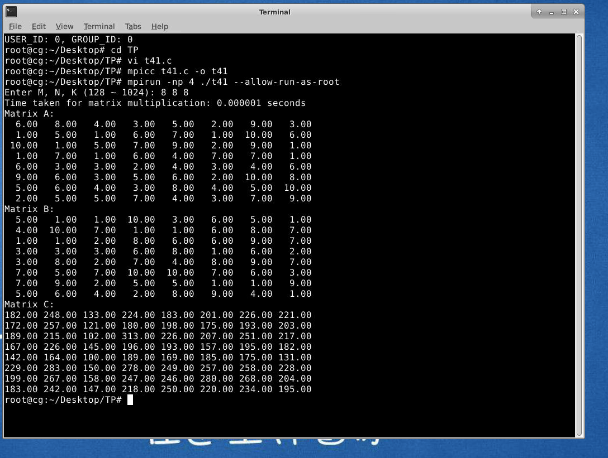

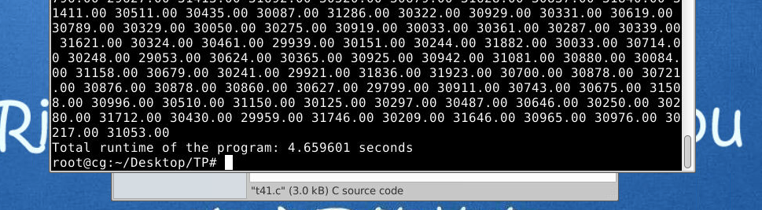

## 2
/*
在上一种方法里，虽然用 MPI 把任务分给了多个进程，但每个进程内部的计算还是串行的，效率不够高。于是我们再加一层优化，在每个 MPI 进程里使用 OpenMP 多线程技术，把进程内部的循环也并行化。简单来说，就是“进程间分工 + 线程内合作”。MPI 负责把矩阵 分块，OpenMP 负责加速每块的计算。在代码中，我们只需要加上一行 #pragma omp parallel for 指令，就能让循环跑得更快。
*/
#include <mpi.h>
#include <omp.h>
#include <stdio.h>
#include <stdlib.h>
#include <time.h>

// 随机生成矩阵的函数
void generate_matrix(double *matrix, int rows, int cols) {
    for (int i = 0; i < rows; i++) {
        for (int j = 0; j < cols; j++) {
            matrix[i * cols + j] = rand() % 10 + 1; // 随机值范围 [1, 10]
        }
    }
}

// 打印矩阵的函数
void print_matrix(const char *name, double *matrix, int rows, int cols) {
    printf("Matrix %s:\n", name);
    for (int i = 0; i < rows; i++) {
        for (int j = 0; j < cols; j++) {
            printf("%6.2f ", matrix[i * cols + j]);
        }
        printf("\n");
    }
}

int main(int argc, char *argv[]) {
    int rank, size;
    int M, N, K;
    double *A = NULL, *B = NULL, *C = NULL;
    double *local_A = NULL, *local_C = NULL;
    double start_time, end_time;

    MPI_Init(&argc, &argv);
    MPI_Comm_rank(MPI_COMM_WORLD, &rank);
    MPI_Comm_size(MPI_COMM_WORLD, &size);

    if (rank == 0) {
        // 输入矩阵规模
        printf("Enter M, N, K (128 ~ 1024): ");
        scanf("%d %d %d", &M, &N, &K);

        // 分配内存并生成矩阵
        A = (double *)malloc(M * N * sizeof(double));
        B = (double *)malloc(N * K * sizeof(double));
        C = (double *)malloc(M * K * sizeof(double));

        srand(time(NULL));
        generate_matrix(A, M, N);
        generate_matrix(B, N, K);
    }

    // 广播矩阵规模
    MPI_Bcast(&M, 1, MPI_INT, 0, MPI_COMM_WORLD);
    MPI_Bcast(&N, 1, MPI_INT, 0, MPI_COMM_WORLD);
    MPI_Bcast(&K, 1, MPI_INT, 0, MPI_COMM_WORLD);

    // 分配局部矩阵内存
    int local_rows = M / size;
    local_A = (double *)malloc(local_rows * N * sizeof(double));
    local_C = (double *)malloc(local_rows * K * sizeof(double));
    if (rank == 0) {
        // 广播矩阵 B
        MPI_Bcast(B, N * K, MPI_DOUBLE, 0, MPI_COMM_WORLD);
    } else {
        B = (double *)malloc(N * K * sizeof(double));
        MPI_Bcast(B, N * K, MPI_DOUBLE, 0, MPI_COMM_WORLD);
    }

    // 分发矩阵 A
    MPI_Scatter(A, local_rows * N, MPI_DOUBLE, local_A, local_rows * N, MPI_DOUBLE, 0, MPI_COMM_WORLD);

    // 矩阵乘法
    start_time = MPI_Wtime();
    #pragma omp parallel for collapse(2)
    for (int i = 0; i < local_rows; i++) {
        for (int j = 0; j < K; j++) {
            local_C[i * K + j] = 0.0;
            for (int k = 0; k < N; k++) {
                local_C[i * K + j] += local_A[i * N + k] * B[k * K + j];
            }
        }
    }
    end_time = MPI_Wtime();

    // 收集结果矩阵 C
    MPI_Gather(local_C, local_rows * K, MPI_DOUBLE, C, local_rows * K, MPI_DOUBLE, 0, MPI_COMM_WORLD);

    if (rank == 0) {
        printf("Time taken for matrix multiplication: %f seconds\n", end_time - start_time);

        // 打印矩阵
        print_matrix("A", A, M, N);
        print_matrix("B", B, N, K);
        print_matrix("C", C, M, K);

        // 输出总运行时间
        printf("Total runtime of the program: %f seconds\n", MPI_Wtime() - start_time);

        // 释放内存
        free(A);
        free(B);
        free(C);
    }

    free(local_A);
    free(local_C);
    if (rank != 0) {
        free(B);
    }

    MPI_Finalize();
    return 0;
}

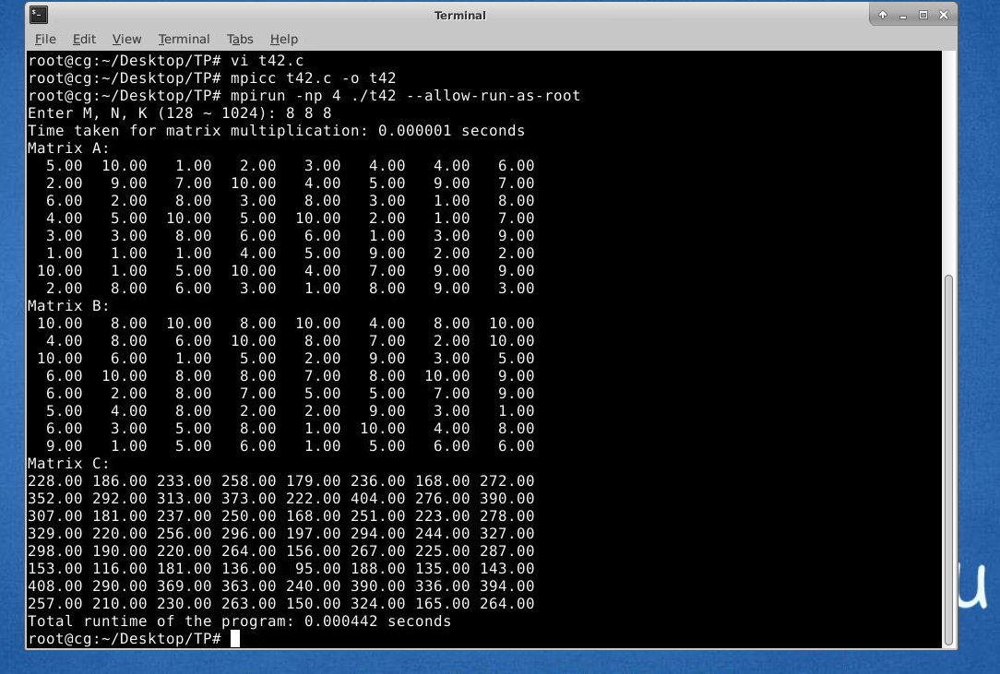

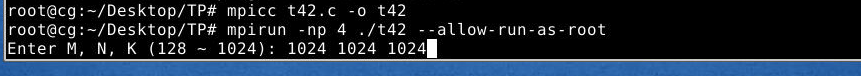

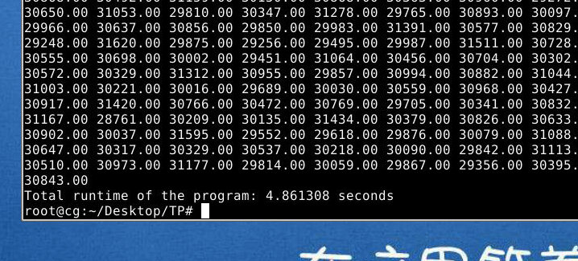

## 3
/*
CUDA 是专门用来让 GPU 加速计算的工具，算矩阵乘法的时候，它的速度比 CPU 快得多。实现的思路是这样的：我们把矩阵乘法的每个元素都分配给一个 GPU 线程来计算，每个线程只管一个小任务。通过设置线程块（dimBlock）和线程网格（dimGrid），我们可以让 GPU 上的线程分工明确，快速完成所有计算。为了进一步提升效率，我们还可以用共享内存存储部分矩阵，减少访问全局内存的次数。这样一来，计算速度会更快，资源利用也更高效。
*/
#include <cuda_runtime.h>  
#include <stdio.h>  
#include <stdlib.h>  
#include <time.h>  
  
// 随机生成矩阵的函数  
void generate_matrix(float *matrix, int rows, int cols) {  
    for (int i = 0; i < rows; i++) {  
        for (int j = 0; j < cols; j++) {  
            matrix[i * cols + j] = rand() % 10 + 1;  // 矩阵元素随机生成在 [1, 10] 范围内
        }  
    }  
}  
  
// 打印矩阵的函数  
void print_matrix(const char *name, float *matrix, int rows, int cols) {  
    printf("Matrix %s:\n", name);  // 输出矩阵名字
    for (int i = 0; i < rows; i++) {  
        for (int j = 0; j < cols; j++) {  
            printf("%6.2f ", matrix[i * cols + j]);  // 格式化打印矩阵元素
        }  
        printf("\n");  
    }  
}  
  
// CUDA 核函数：执行矩阵乘法
__global__ void matrix_multiply(const float *A, const float *B, float *C, int M, int N, int K) {  
    int row = blockIdx.y * blockDim.y + threadIdx.y;  // 当前线程负责的行索引
    int col = blockIdx.x * blockDim.x + threadIdx.x;  // 当前线程负责的列索引
  
    if (row < M && col < K) {  // 确保线程索引在矩阵范围内
        float sum = 0.0f;  
        for (int i = 0; i < N; i++) {  // 遍历 A 的列和 B 的行，计算矩阵元素
            sum += A[row * N + i] * B[i * K + col];  
        }  
        C[row * K + col] = sum;  // 结果写入 C 矩阵
    }  
}  
  
int main() {  
    int M, N, K;  // 矩阵 A 是 MxN，B 是 NxK，C 是 MxK
  
    printf("Enter M, N, K (128 ~ 1024): ");  
    scanf("%d %d %d", &M, &N, &K);  // 用户输入矩阵维度
  
    // 在主机端分配内存
    float *h_A = (float *)malloc(M * N * sizeof(float));  
    float *h_B = (float *)malloc(N * K * sizeof(float));  
    float *h_C = (float *)malloc(M * K * sizeof(float));  
  
    srand(time(NULL));  // 随机数种子
    generate_matrix(h_A, M, N);  // 随机生成 A 矩阵
    generate_matrix(h_B, N, K);  // 随机生成 B 矩阵
  
    // 在设备端分配内存
    float *d_A, *d_B, *d_C;  
    cudaMalloc((void **)&d_A, M * N * sizeof(float));  
    cudaMalloc((void **)&d_B, N * K * sizeof(float));  
    cudaMalloc((void **)&d_C, M * K * sizeof(float));  
  
    // 把主机上的 A 和 B 矩阵数据拷贝到设备端
    cudaMemcpy(d_A, h_A, M * N * sizeof(float), cudaMemcpyHostToDevice);  
    cudaMemcpy(d_B, h_B, N * K * sizeof(float), cudaMemcpyHostToDevice);  
  
    // 定义线程块和网格的大小
    dim3 blockDim(16, 16);  // 每个线程块有 16x16 个线程
    dim3 gridDim((K + blockDim.x - 1) / blockDim.x, (M + blockDim.y - 1) / blockDim.y);  // 根据矩阵维度计算网格大小
  
    // 创建 CUDA 事件用于计时
    cudaEvent_t start, stop;  
    cudaEventCreate(&start);  
    cudaEventCreate(&stop);  
    cudaEventRecord(start);  // 记录开始时间
  
    // 调用 CUDA 核函数执行矩阵乘法
    matrix_multiply<<<gridDim, blockDim>>>(d_A, d_B, d_C, M, N, K);  
    cudaDeviceSynchronize();  // 确保计算完成
  
    cudaEventRecord(stop);  // 记录结束时间
    cudaEventSynchronize(stop);  
  
    float milliseconds = 0;  
    cudaEventElapsedTime(&milliseconds, start, stop);  // 计算耗时
  
    // 把结果矩阵从设备端拷贝回主机端
    cudaMemcpy(h_C, d_C, M * K * sizeof(float), cudaMemcpyDeviceToHost);  
  
    printf("Time taken for matrix multiplication: %f ms\n", milliseconds);  // 输出耗时
    print_matrix("A", h_A, M, N);  // 打印 A 矩阵
    print_matrix("B", h_B, N, K);  // 打印 B 矩阵
    print_matrix("C", h_C, M, K);  // 打印 C 矩阵
  
    // 释放主机和设备的内存
    free(h_A);  
    free(h_B);  
    free(h_C);  
    cudaFree(d_A);  
    cudaFree(d_B);  
    cudaFree(d_C);  
  
    return 0;  
}